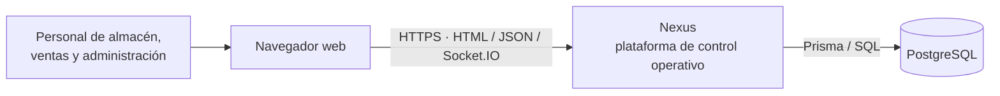
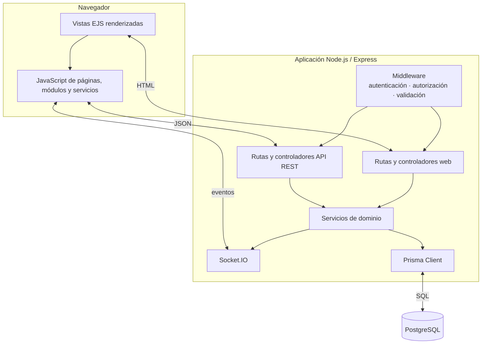
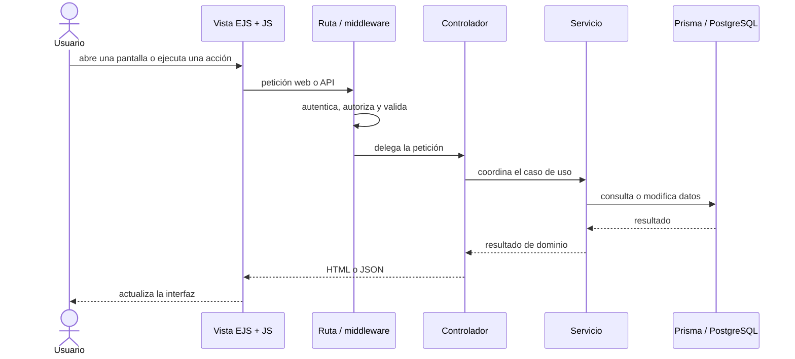
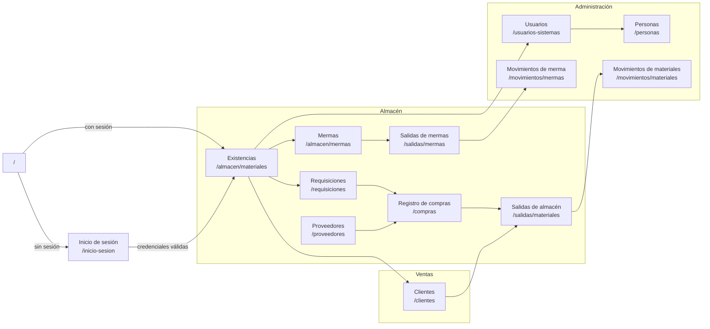
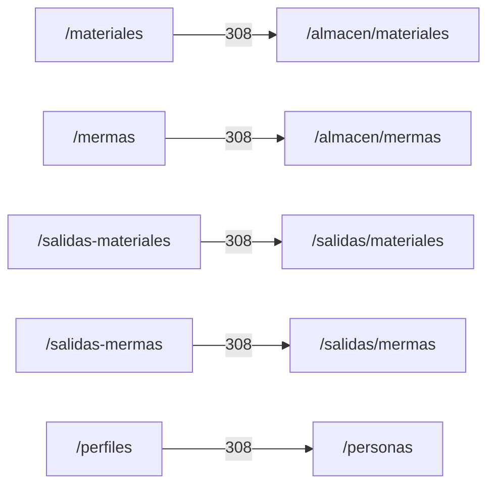

# Arquitectura y catálogo visual de vistas web

Este documento es el mapa visual, versionado junto con el código, para comprender el
sistema y localizar sus pantallas. Los diagramas usan **Mermaid**, por lo que GitHub los
renderiza directamente sin guardar imágenes que puedan quedar desactualizadas.

La documentación se divide deliberadamente en dos niveles:

- este documento **curado** explica contexto, decisiones, responsabilidades y flujos;
- el [mapa generado del código](generated/code-map.md) inventaría endpoints y
  dependencias reales entre áreas, y puede verificarse con `npm run docs:check`.

Así, un generador no intenta adivinar el porqué del diseño y los inventarios mecánicos
no dependen de que alguien recuerde actualizar una tabla a mano.

### ¿Qué se actualiza automáticamente?

| Artefacto | Fuente | Actualización |
| --- | --- | --- |
| `docs/generated/code-map.md` | Routers e imports de `src` | Se regenera con `npm run docs:architecture`; CI ejecuta `npm run docs:check` automáticamente y bloquea cambios desactualizados. |
| Diagramas de contexto, contenedores, secuencia y navegación de este documento | Decisiones de arquitectura y experiencia de usuario | Son curados: deben actualizarse cuando cambia el diseño y revisarse en el pull request. |
| Catálogo de pantallas | Rutas, permisos, controladores, EJS y comportamiento visible | Es curado porque el código por sí solo no puede inferir correctamente propósito, navegación ni estado funcional. |

La separación es intencional: generar relaciones mecánicas evita trabajo repetitivo,
pero no se presenta como «automática» una explicación que requiere criterio humano. CI
no escribe commits ni modifica el branch; informa la diferencia para que el mapa
regenerado se revise y se versione junto con el código que la produjo.

## 1. Arquitectura del sistema

### Contexto

### Contenedores y capas

### Recorrido de una interacción

## 2. Mapa visual de navegación

Las líneas continuas representan navegación vigente. Las rutas entre paréntesis son
las URL visibles; el acceso efectivo depende de los permisos calculados para la sesión.

## 3. Catálogo de pantallas

| Área | Pantalla y ruta | Propósito visible | Interacciones principales | Implementación EJS |
| --- | --- | --- | --- | --- |
| Acceso | Inicio de sesión (`/inicio-sesion`) | Autenticar una cuenta. | Capturar credenciales e iniciar sesión. | `src/views/pages/home/loginPage.ejs` |
| Almacén | Existencias (`/almacen/materiales`) | Consultar materiales y stock. | Filtrar, paginar y abrir el alta/edición de material. | `src/views/pages/warehouse/materials/materialsPage.ejs` |
| Almacén | Mermas (`/almacen/mermas`) | Consultar y administrar existencias de merma. | Filtrar, registrar/editar y ajustar stock. | `src/views/pages/warehouse/wastes/wastesPage.ejs` |
| Almacén | Requisiciones (`/requisiciones`) | Consultar y capturar requisiciones de compra. | Registrar requisición y sus detalles. | `src/views/pages/warehouse/purchaseRequisitions/purchaseRequisitionsPage.ejs` |
| Almacén | Registro de compras (`/compras`) | Consultar y registrar entradas de compra. | Filtrar, registrar compra, materiales/proveedores y corregir detalles. | `src/views/pages/warehouse/goodsReceipts/goodsReceiptsPage.ejs` |
| Almacén | Salidas de almacén (`/salidas/materiales`) | Consultar y registrar entregas de materiales. | Filtrar, registrar salida, seleccionar cliente y devolver detalles. | `src/views/pages/warehouse/goodsIssues/goodsIssuesPage.ejs` |
| Almacén | Salidas de mermas (`/salidas/mermas`) | Presentar el punto de acceso a salidas de merma. | La pantalla actual es informativa; el flujo aún no expone formulario ni tabla. | `src/views/pages/warehouse/wasteIssues/wasteIssuesPage.ejs` |
| Almacén | Proveedores (`/proveedores`) | Consultar y administrar proveedores. | Crear/editar desde modal. | `src/views/pages/warehouse/suppliers/suppliersPage.ejs` |
| Ventas | Clientes (`/clientes`) | Consultar y administrar clientes. | Crear/editar desde modal. | `src/views/pages/sales/clients/clientsPage.ejs` |
| Administración | Usuarios (`/usuarios-sistemas`) | Administrar cuentas y asignaciones. | Crear/editar usuario, roles y departamentos. | `src/views/pages/admin/users/usersPage.ejs` |
| Administración | Personas (`/personas`) | Administrar personas participantes del negocio. | Filtrar y crear/editar datos y asignaciones. | `src/views/pages/admin/persons/personsPage.ejs` |
| Administración | Movimientos de materiales (`/movimientos/materiales`) | Auditar movimientos del inventario de materiales. | Filtrar, consultar y exportar el historial. | `src/views/pages/admin/movements/movementsPage.ejs` |
| Administración | Movimientos de merma (`/movimientos/mermas`) | Auditar movimientos del inventario de merma. | Filtrar, consultar y exportar el historial. | `src/views/pages/admin/movements/movementsPage.ejs` |
| Sistema | No encontrada (`/error/404`) | Recuperar al usuario de una URL inexistente. | Volver al inicio apropiado según la sesión. | `src/views/pages/error/404.ejs` |

### Redirecciones de compatibilidad

## 4. Cómo mantener la documentación visual

Al agregar, renombrar o retirar una vista web:

1. Actualizar el mapa de navegación y el catálogo de este documento.
2. Regenerar el catálogo de rutas; no copiarlo al `README.md`.
3. Verificar que ruta, permiso, controlador, plantilla y JavaScript de página conserven
   nombres coherentes.
4. Si cambia un límite del sistema o una dependencia externa, actualizar también los
   diagramas de contexto y contenedores.
5. Revisar los diagramas en la vista previa de Markdown de GitHub antes de fusionar.
6. Ejecutar `npm run docs:architecture` cuando cambien routers o imports entre áreas y
   confirmar con `npm run docs:check` antes de enviar el cambio. La misma verificación
   se ejecuta automáticamente en CI para pull requests y pushes a la rama principal.

Los diagramas describen el diseño a nivel de sistema; el código sigue siendo la fuente
de verdad para los detalles de endpoints, payloads y reglas de autorización.

## 5. Organización consistente de front y back

La unidad de organización es el **dominio funcional** (`admin`, `sales`, `warehouse`),
no el tipo de operación CRUD. Una funcionalidad debe conservar el mismo dominio y el
mismo nombre de recurso al recorrer sus capas. Por ejemplo, `warehouse/wastes` enlaza
la ruta API, el controlador, el servicio del navegador y la página de mermas sin crear
un flujo paralelo para registrar o editar.

| Responsabilidad | Backend | Frontend |
| --- | --- | --- |
| Composición | `src/routes/{api,web}/index.js` registra prefijos y routers | La plantilla de página incluye el único entry point de la pantalla |
| Transporte | `routes` declara método, permiso y validadores; `controllers` traduce HTTP/DTO | `public/js/services` encapsula HTTP; `application` traduce la respuesta al caso de uso |
| Negocio | `services/<dominio>` contiene reglas y transacciones reutilizables | `application/<dominio>` coordina casos de uso sin depender de elementos visuales |
| Presentación | El controlador web entrega el contexto de la vista | `pages/<dominio>/<recurso>` conserva entry point, formulario y modal del contexto; `ui`, `plugins` y `views/shared` reúnen piezas independientes del recurso |

Reglas para extender un CRUD:

1. Añadir el router al registro central correspondiente, manteniendo el dominio tanto
   en la ruta como en los directorios de sus capas.
2. Reutilizar DTOs, servicios de dominio, formularios, modales, tablas y selectores
   existentes antes de crear otro proceso; parametrizar el contexto cuando dos flujos
   sólo difieran en material/merma u otro recurso.
3. Mantener autorización y reglas de negocio en el servidor. El cliente únicamente
   adapta transporte, interacción y presentación.
4. Reservar `application` para casos de uso y `pages` para composición. Una llamada
   HTTP no debe implementarse directamente desde una página.
5. Ordenar las operaciones públicas de cada recurso de forma predecible en todas sus
   capas: **lectura/listado, creación, actualización general, actualizaciones
   especializadas y eliminación o acciones terminales**. Los imports se ordenan por
   dominio y nombre; no se reordena según el momento en que se añadió una función.
6. Ubicar las pruebas unitarias de controllers en
   `tests/unit/controllers/<tipo>/<dominio>` y las CRUD con persistencia en
   `tests/integration/controllers`, siguiendo las estrategias de
   `docs/service-test-coverage.md`.
7. Al editar EJS, preservar el cierre final de `contentFor` en su posición; no
   eliminarlo y volverlo a agregar como efecto secundario de una refactorización.

### Reutilización aplicada en flujos de salidas

Las salidas de material y de merma conservan servicios HTTP separados porque sus
endpoints y respuestas pertenecen a contextos distintos. En cambio, su capa
`application` reutiliza `createIssueApplication`, que compone `createCrudApplication`
para listado, registro y edición, y sólo agrega las mutaciones de encabezado, detalles
y devolución. La adaptación común de `formData`, identificadores y respuestas exitosas
vive en `createApplicationMutation`; no hay dos implementaciones del mismo proceso.
Cada contexto sólo inyecta sus requests y las claves de datos de su respuesta. Las
páginas y datatables siguen consumiendo nombres de
dominio (`registerGoodsIssue`, `registerWasteIssue`, etc.), por lo que el componente
compartido no filtra abstracciones genéricas hacia la UI.

El mismo criterio se aplica a clientes, personas, proveedores y mermas mediante
`createCrudApplication`: listado, registro y edición comparten la adaptación de
transporte, mientras cada módulo conserva sus opciones de select y operaciones
especializadas. No se fuerza esta fábrica sobre materiales, usuarios o compras porque
sus payloads y mutaciones adicionales requieren coordinación propia.

`application/warehouse/wasteIssues/wasteIssues.js` permanece dentro de una carpeta de
recurso, en paralelo con `goodsIssues/goodsIssues.js`, porque ambos flujos tienen varias
mutaciones relacionadas. `wasteForm`, `wasteModal` y `wasteFields` permanecen en
`pages/warehouse/wastes` porque conocen selectores, validaciones, modos y operaciones
propias de ese recurso; que el datatable abra ese modal no convierte al modal en un
componente independiente del contexto. Sólo una abstracción sin conocimiento de merma
debe moverse a `ui` o a una carpeta compartida. En las salidas, la coordinación
específica permanece en su archivo de página y las operaciones realmente comunes del
formulario están en `ui/issues/issueFormUI.js`.

Los formularios y modales de clientes, materiales y proveedores se consumen desde
varias pantallas, pero siguen perteneciendo a su recurso. Por ello viven en
`pages/sales/clients`, `pages/warehouse/materials` y `pages/warehouse/suppliers`; los
flujos externos los importan desde el contexto propietario en vez de crear una carpeta
intermedia basada sólo en que hay más de un consumidor. `ui` queda reservado para
comportamiento que recibe su contexto por parámetros y no importa aplicaciones de un
recurso concreto.

## 6. Herramientas

- **Ahora:** Mermaid para diagramas curados y el generador local para rutas e imports.
- **Si crece la arquitectura:** Structurizr DSL/C4 para mantener múltiples vistas desde
  un modelo central.
- **Si se necesitan reglas de dependencias:** dependency-cruiser o Madge para ciclos y
  límites entre módulos.
- **Para la API:** OpenAPI describe el contrato y Swagger UI puede visualizarlo; no
  reemplazan estos diagramas. Consulta la [decisión sobre el contrato](api-contract.md).

No se añade otra herramienta hasta que exista esa necesidad. Esto mantiene el flujo
actual simple y evita diagramas duplicados.
