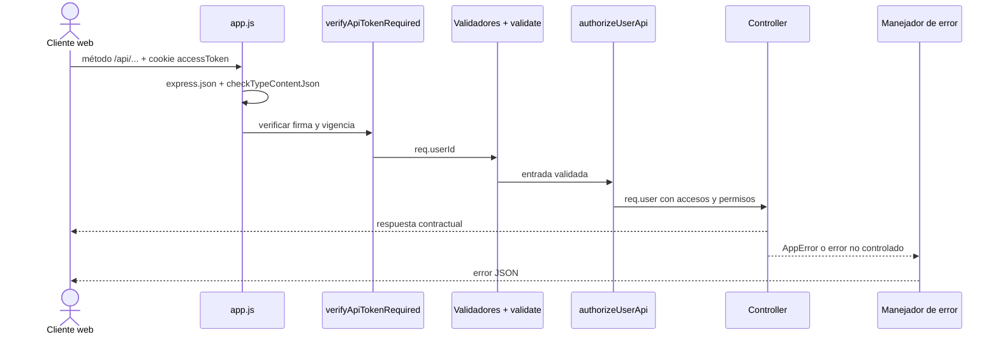

# Contrato de la API

Este documento es propietario del contrato HTTP y no de las reglas de negocio ni del
esquema persistente. La relación con requisitos, diseño y evidencia se consulta en el
[mapa de datos, persistencia y acceso](../data/index.md).

## Cómo documentar una ruta API

La documentación de una ruta combina información de varias capas, pero conserva una
sola ficha contractual en esta familia. El [mapa generado](../generated/code-map.md)
mantiene el inventario de métodos, URLs y archivos; una ficha se agrega aquí sólo cuando
necesita explicar cómo consumir la operación. La explicación interna de nombres y
colaboraciones se mantiene en la
[documentación técnica del código](technical-code-documentation.md), sin
copiar el contrato HTTP.

### Alcance y nivel de cobertura

Este artefacto es una referencia curada del comportamiento implementado. La
[especificación OpenAPI 3.1](openapi/openapi.json) complementaria describe de forma procesable
los esquemas de solicitud y respuesta de todas las operaciones registradas; no es un
mecanismo de validación en tiempo de ejecución.
El [mapa generado](../generated/code-map.md) es el inventario exhaustivo de
métodos y rutas registradas. Este documento añade las reglas transversales y las fichas
que necesitan contexto; por tanto, que una ruta
aparezca sólo en el mapa no significa que tenga documentados aquí todos sus parámetros,
respuestas y errores.

Cuando exista una diferencia, se comprueba primero el router registrado y después sus
validadores, DTO, controller y pruebas de integración. La documentación se corrige para
reflejar ese comportamiento o se cambia la implementación mediante una decisión aparte;
el ejemplo de este documento nunca amplía por sí solo los campos que acepta el servidor.

No se adopta una norma ISO como sustituto de una especificación de interfaz HTTP para
Express. [ISO/IEC/IEEE 1016:2009](https://www.iso.org/standard/45144.html) puede orientar
la descripción de interfaces dentro del diseño, pero **OpenAPI 3.1** es la referencia
procesable prevista para métodos, parámetros, cuerpos, respuestas y seguridad. Esta
distinción y el alcance adoptado se conservan en las
[normas documentales](../governance/documentation-standards.md#decisión-para-documentación-técnica-y-rutas-api).

Cada ficha de ruta debe indicar, cuando aplique:

| Campo | Contenido verificable | Fuente que se revisa |
| --- | --- | --- |
| Identidad | Método HTTP, ruta completa y propósito observable. | `src/routes/api/index.js` y router del dominio. |
| Acceso | Cookie de sesión, permiso requerido y respuestas `401` o `403`. | `authMiddleware.js`, `permissions.js` y router. |
| Entrada | Parámetros de ruta, query, tipo de contenido y cuerpo aceptado. | Router, validadores y DTO. |
| Salida correcta | Código HTTP, forma JSON o archivo y código estable de éxito. | Controller y prueba HTTP. |
| Errores | Código HTTP, `code`, `message`, `meta` o `errors` que el consumidor puede interpretar. | Middleware, errores de dominio y manejador final. |
| Efectos | Persistencia, movimiento, auditoría o evento que sea relevante para el consumidor. | Servicio y requisitos; no se infiere sólo desde el verbo HTTP. |
| Evidencia | Prueba de integración que comprueba el contrato o brecha explícita del plan. | `tests/integration` y plan de pruebas. |

No se documenta una respuesta supuesta a partir de convenciones generales. Por ejemplo,
las creaciones vigentes no usan todas el mismo código HTTP: la ficha debe registrar el
`status` real del controller hasta que una decisión funcional cambie y pruebe el
contrato.

### Alcance de exportación de inventarios

`GET /api/warehouse/reports/inventory/excel` y
`GET /api/warehouse/reports/wastes/excel` aceptan el parámetro query opcional
`inventoryScope`. Sus valores contractuales son:

| Valor | Registros incluidos |
| --- | --- |
| `activeOrStock` | Activos o con existencia distinta de cero; es el valor predeterminado. |
| `active` | Sólo registros activos. |
| `inStock` | Sólo registros con existencia distinta de cero. |

El alcance se combina con la búsqueda, proveedor y orden aplicables al listado. Un valor ausente o
desconocido conserva `activeOrStock` para no excluir existencias que ya formaban parte del reporte.
La respuesta correcta sigue siendo el archivo Excel del endpoint; el modal es interfaz cliente y
no cambia el método HTTP.

### Prefijo, montaje y orden de middleware

`registerApiRoutes` monta los routers declarados en `API_ROUTES` bajo `/api`. Por ello,
la URL contractual se obtiene uniendo `/api`, el prefijo del dominio y el path local del
router. Un `router.patch('/:id/stock', ...)` montado en `/warehouse/materials` se publica
como `PATCH /api/warehouse/materials/:id/stock`.

Para rutas privadas con cuerpo JSON se conserva este recorrido:



El orden concreto se lee de izquierda a derecha en cada declaración del router. La
autenticación suele preceder la validación y la autorización; las excepciones públicas,
como inicio o renovación de sesión, se documentan expresamente y no se fuerzan a usar
middleware que contradiga su propósito. Un cambio de orden puede modificar qué error
observa el consumidor, por lo que se revisa como parte del contrato.

### Reglas transversales vigentes

#### Tipo de contenido

- `express.json()` analiza las peticiones bajo `/api`.
- `checkTypeContentJson` permite `GET`, peticiones sin cuerpo y cuerpos vacíos; cuando
  existe un cuerpo exige que `Content-Type` incluya `application/json`.
- Un tipo incompatible responde `415` con
  `{ "code": "INVALID_CONTENT_TYPE", "contentType": "application/json" }`.
- Las rutas `/upload` y `/text` tienen validadores separados para
  `multipart/form-data` y `text/plain`; no se asume que pertenecen al contrato JSON.

#### JSON como medio de transporte

JSON (*JavaScript Object Notation*) es un formato textual para representar objetos,
arreglos, strings, números, booleanos y `null`. Un archivo con extensión `.json` puede
guardar o intercambiar esos datos entre programas; en una API HTTP, la misma estructura
se transporta normalmente en el cuerpo de la petición o de la respuesta y no requiere
que exista un archivo físico. JSON define la representación de los datos, mientras que
la API define las rutas, métodos, permisos y efectos disponibles para intercambiarlos.

En Nexus, el consumidor serializa el objeto como JSON, envía
`Content-Type: application/json` y conserva los nombres de campo indicados por el
contrato. Los comentarios, las comas finales y los valores JavaScript `undefined`,
`NaN` o `Infinity` no forman parte de JSON válido. Los parámetros de ruta, como `:id`,
y los parámetros query viajan en la URL, no se repiten dentro del cuerpo salvo que la
ficha de la operación lo indique.

Las respuestas ordinarias usan JSON, excepto las descargas, que devuelven un archivo, y
la renovación correcta de sesión, que actualmente responde `200` con el texto `OK` por
medio de `sendStatus(200)`. Las credenciales no se colocan en la URL: el inicio de
sesión recibe la contraseña en el cuerpo y los tokens posteriores viajan en cookies
`httpOnly`. El consumidor web actual opera en el mismo origen; una integración desde
otro origen no debe asumir CORS ni autenticación Bearer mientras la configuración del
servidor no los declare.

### Solicitudes y respuestas JSON

Los cuerpos de solicitud y respuesta **se mantienen en OpenAPI y no se replican como
otra tabla exhaustiva en este documento**. La especificación ya relaciona cada método y
ruta con `requestBody`, código de estado, tipo de medio y esquema; duplicar aquí sólo
las solicitudes obligaría a sincronizar dos inventarios y dejaría las respuestas con un
nivel de detalle desigual. Replicar también todas las respuestas duplicaría aún más el
contrato sin aportar otra fuente de verdad.

Esta guía curada conserva únicamente las reglas transversales, las excepciones y las
fichas que explican efectos o decisiones que un esquema no comunica por sí solo. Para
consultar una operación se sigue la misma lectura en ambos sentidos:

| Pregunta | Solicitud | Respuesta | Fuente propietaria |
| --- | --- | --- | --- |
| ¿Qué medio se transporta? | `requestBody.content` | `responses.<status>.content` | Operación bajo `openapi/paths/*.json` |
| ¿Qué propiedades existen y cuáles son obligatorias? | `schema`, `required` y `additionalProperties` | `schema`, `required` y `additionalProperties` | Componente reutilizable bajo `openapi/components/*-schemas.json` |
| ¿Qué variante aplica? | `oneOf`, propiedades condicionales o esquema específico de la operación | Código HTTP y esquema asociado a ese código | Operación y componente referenciado |
| ¿Qué ocurre en errores comunes? | La validación aplicable se explica en esta guía | `401`, `403` y `500`, más errores propios de la operación | `openapi/components/responses.json` y operación |
| ¿Qué ejemplo se debe copiar? | Sólo un bloque `json` explícito o un ejemplo OpenAPI; nunca la notación abreviada de una tabla | Sólo un ejemplo vinculado al esquema y código HTTP | OpenAPI o ficha curada excepcional |

La ausencia de `requestBody` significa que la operación no recibe un cuerpo contractual;
parámetros de ruta y query se consultan en `parameters`. La ausencia de
`application/json` en una respuesta también es significativa: por ejemplo, una descarga
usa su tipo de archivo y la renovación correcta de sesión devuelve `text/plain`. El
[ejemplo aplicado de ajuste de existencias](#ejemplo-aplicado-ajuste-de-existencias-de-material)
muestra una ficha humana completa sin convertirla en un segundo catálogo de payloads.

#### Autenticación y autorización

- La API actual recibe el token en la cookie `accessToken`; no documenta un encabezado
  `Authorization: Bearer` porque `verifyApiTokenRequired` no lo consume.
- La renovación recibe `refreshToken` desde su cookie y responde `200` con `OK`; no se
  envía el token dentro de un objeto JSON ni se devuelve en la respuesta.
- Una cookie ausente, inválida o vencida responde `401` con
  `{ "code": "INVALID_AUTH" }` y elimina la cookie de acceso cuando corresponde.
- `authorizeUserApi(permission)` vuelve a cargar el usuario y sólo continúa si
  `User.isActive = true`, la persona asociada está activa (cuando existe) y hay al menos
  una asignación. Después resuelve la política del permiso y expone el usuario validado
  como `req.user`; un JWT vigente por sí solo no satisface este middleware.
- Un usuario autenticado sin el rol y departamento exigidos responde `403` con
  `{ "code": "FORBIDDEN" }`; si el usuario ya no existe, está inactivo, su persona está
  inactiva o perdió todas sus asignaciones responde `401 INVALID_AUTH`.

#### Validación

- Los arreglos de `express-validator` se ejecutan antes de `validate`.
- Una entrada inválida responde `400` con
  `{ "errors": { "campo": { "code": "..." } }, "code": "VALIDATION_ERROR" }`.
- Los errores de `details` pueden contener errores anidados por índice; la ficha de una
  operación con detalles debe mostrar esa estructura y no reducirla a un string.
- `validateLogin` es una excepción deliberada: una entrada de acceso inválida responde
  `401` con `{ "code": "LOGIN_ERROR" }` para no usar el contrato de formularios CRUD.

##### Brechas de validación observadas

La presencia de un arreglo de `express-validator` no basta para rechazar una petición:
el router también debe ejecutar el middleware que lee `validationResult`. Actualmente,
las rutas de personas declaran `personValidation`, pero no registran `validate`; por
ello sus errores de `fullName` y `accesses` no se traducen al `400 VALIDATION_ERROR`
descrito arriba. Las rutas de clientes tampoco registran un arreglo de validación antes
del controller. Son brechas de implementación pendientes, no excepciones contractuales
que un consumidor deba aprovechar. Hasta corregirlas y cubrirlas con pruebas HTTP, no
se atribuye a esos endpoints la respuesta uniforme de validación.

##### Matriz de validaciones por campo

La siguiente matriz permite consultar las reglas transversales sin reconstruirlas a
partir de cada formulario. **No sustituye la composición de validadores de una ruta**:
un campo sólo se exige cuando el arreglo registrado por esa operación incluye la regla,
y las variantes condicionales se evalúan con el resto del cuerpo. Los límites indicados
corresponden al servidor; el navegador puede repetirlos para dar retroalimentación
inmediata, pero no es la fuente de aceptación del payload. Esta matriz describe campos
del cuerpo; un `:id` incluido en el path conserva el manejo que implemente la ruta y no
queda validado automáticamente por compartir nombre con un UUID del cuerpo.

| Campo o familia | Presencia | Formato y límite aceptado | Código de error principal |
| --- | --- | --- | --- |
| `name` de merma y `fullName` | Obligatoria en el validador que lo declara; se aplica `trim`. La ruta de personas conserva la brecha indicada arriba | Texto con letras o números y separadores admitidos. Máximo: merma `200`, persona `255` | `NAME_REQUIRED`, `NAME_INVALID_TYPE`, `NAME_INVALID_FORMAT`, `NAME_TOO_LONG` |
| `name` de material, `legalName` y `tradeName` | Obligatoria; se aplica `trim` | Texto sin `<`, `>`, `\\`, llaves ni corchetes. Máximo: material/razón social `200`, nombre comercial `100` | `NAME_REQUIRED`, `NAME_INVALID_TYPE`, `NAME_INVALID_FORMAT`, `NAME_TOO_LONG` |
| `name` de cliente | El DTO espera el campo y aplica `trim`, pero la ruta no registra validación de formulario | No existe todavía una regla HTTP uniforme documentable; el modelo persistente limita el valor a `255` caracteres | No existe todavía un código de validación de campo garantizado por la ruta |
| `name` de usuario | Obligatoria | Texto sin espacios, compuesto por letras ASCII, números o `_`; máximo `50` | `USERNAME_REQUIRED`, `USERNAME_INVALID_TYPE`, `USERNAME_NO_SPACES`, `USERNAME_INVALID_FORMAT`, `USERNAME_TOO_LONG` |
| `password` | Obligatoria en alta, cambio de contraseña e inicio de sesión; no pertenece a la edición general del usuario | Entre `6` y `50` caracteres, al menos una mayúscula y un número; caracteres admitidos por la regla de contraseña | `PASSWORD_REQUIRED`, `PASSWORD_INVALID_TYPE`, `PASSWORD_TOO_SHORT`, `PASSWORD_TOO_LONG`, `PASSWORD_NEEDS_UPPERCASE`, `PASSWORD_NEEDS_NUMBER`, `PASSWORD_INVALID_FORMAT` |
| `supplierId`, `materialId`, `presentationId`, `unitMeasureId`, `reasonId`, `receivedById`, `advisorId`, `clientId`, `departmentId`, `requesterId` y `roleId` | Obligatoria cuando la operación incluye el campo; `reasonId` de material puede depender del contexto | UUID versión 4 | Código `<CAMPO>_REQUIRED` o `<CAMPO>_INVALID_UUID` definido para el identificador |
| `isActive`, `isInvoiced` | Obligatoria cuando la operación incluye el campo | Booleano reconocido por `express-validator`; se normaliza a booleano | Código requerido o booleano inválido propio del campo |
| `isSupplied` | Obligatoria en la edición de surtido | Booleano o representación textual procesada por el validador de detalles | `SUPPLIED_REQUIRED`, `SUPPLIED_INVALID_BOOLEAN` |
| `quantity`, `returnQuantity`, `costPerUnitType` y cantidades de detalle | Según la operación; las cantidades operativas son obligatorias | Número con hasta `8` enteros y `6` decimales. El mínimo es contextual: normalmente mayor que cero; una corrección de cantidad admite cero y la cantidad surtida admite el límite declarado por su flujo | Código requerido, número inválido o longitud propio del campo; los detalles usan códigos `DETAILS_*` |
| `newStock`, `minStock`, `maxUnitCost`, `base`, `height` | Obligatoria, opcional o condicional según alta, edición, ajuste y contexto de entrada | Número con hasta `8` enteros y `6` decimales. Merma exige existencia/costo no negativos y dimensiones positivas; material permite dimensiones opcionales emparejadas; `minStock` es opcional | Código requerido, número inválido o longitud propio del campo |
| `projectNumber` | Obligatoria en encabezados de salida | Texto, después de `trim`, de máximo `10` caracteres | `PROJECT_NUMBER_REQUIRED`, `PROJECT_NUMBER_INVALID_TYPE`, `PROJECT_NUMBER_TOO_LONG` |
| `requestDate`, `receptionDate` | Obligatoria en el encabezado correspondiente | Fecha ISO 8601 que produzca una fecha válida | Código requerido o formato inválido propio del campo |
| `invoice` | Obligatoria sólo cuando `isInvoiced` es `true` | Texto alfanumérico con guion, máximo `50` | `INVOICE_REQUIRED`, `INVOICE_INVALID_TYPE`, `INVOICE_INVALID_FORMAT`, `INVOICE_TOO_LONG` |
| `observations` | Opcional | Texto sin `<`, `>`, `\\`, llaves ni corchetes; después de `trim`, máximo `500` | `OBSERVATIONS_INVALID_TYPE`, `OBSERVATIONS_INVALID_FORMAT`, `OBSERVATIONS_TOO_LONG` |
| `details` | Obligatoria y con al menos un elemento en altas de documentos; una edición de entrada admite que no se envíe | Arreglo; cada elemento valida identificadores y valores numéricos del tipo de documento. En ediciones de surtido, los errores se organizan por `detail.id` y campo | `DETAILS_REQUIRED` o el código `DETAILS_INVALID_FORMAT_*` aplicable |
| `accesses` | Declarada como obligatoria en `personValidation`, con al menos un elemento; la ruta conserva la brecha indicada arriba | Arreglo sin áreas repetidas; cada `departmentId` y `roleId` debe ser UUID v4 | Mensaje específico de selección, duplicado, área o rol inválido; todavía no se garantiza como respuesta HTTP |

En errores simples la clave coincide con el nombre del campo. Para una matriz editable
de detalles, la forma observable conserva dos dimensiones —identificador de fila y
campo—, por ejemplo:

```json
{
  "errors": {
    "550e8400-e29b-41d4-a716-446655440000": {
      "projectConvertedQuantity": { "code": "REQUIRED_QUANTITY" },
      "isSupplied": { "code": "SUPPLIED_REQUIRED" }
    }
  },
  "code": "VALIDATION_ERROR"
}
```

Las reglas reutilizables se mantienen en `src/validators/fields/fieldsValidator.js`,
los arreglos aplicados a cada operación en `src/validators/forms/` y los códigos
estables en `src/messages/codeMessages.js`. Al cambiar cualquiera de esas fuentes se
revisa esta matriz junto con la ficha contractual de la ruta afectada.

#### Respuestas y errores de dominio

- Los listados para DataTables responden `200` con `data`, `recordsTotal` y
  `recordsFiltered`.
- Las escrituras responden con el recurso o resultado y un `code` estable de éxito; el
  código HTTP exacto se documenta por operación.
- Un `AppError` conserva su `statusCode` y responde con `code`, `message` y `meta`.
- Una ruta API inexistente responde `404` con
  `{ "message": "Ruta no encontrada." }`.
- Un error no controlado responde `500` con `code: "SERVER_ERROR"` y se registra con el
  contexto de la petición; ningún contrato debe depender del stack interno.

### Query de listados compatibles con DataTables

Los controladores que reutilizan `requestQueryUtils.js` aceptan estas variantes. Cada
recurso declara por separado sus filtros adicionales y columnas ordenables.
Las salidas de material y merma componen esas utilidades mediante
`src/utils/issueQueryUtils.js`: comparten la normalización de filtros de salida, pero
cada controller proporciona su arreglo seguro de columnas y conserva sus reglas de
acceso y servicio de dominio.

| Concepto | Parámetros aceptados | Normalización |
| --- | --- | --- |
| Inicio | `start` | Entero no negativo; fallback `0`. |
| Tamaño | `length` | Entero no negativo; fallback `10`. |
| Búsqueda | `search`, `search.value` o `search[value]` | String; fallback vacío. |
| Columna | `order[0].column` o `order[0][column]` | Índice hacia la lista segura declarada por el controller. |
| Dirección | `order[0].dir` o `order[0][dir]` | Sólo `asc` o `desc`; cualquier otro valor usa la dirección predeterminada. |

El cliente no envía un nombre de columna arbitrario directamente a Prisma. El
controller traduce el índice usando su arreglo `columns`, lo que forma parte de la
especificación particular del listado.

### Ejemplo aplicado: ajuste de existencias de material

Esta ficha muestra el nivel de detalle esperado; no reemplaza los validadores ni las
reglas de negocio.

| Campo | Contrato vigente |
| --- | --- |
| Identidad | `PATCH /api/warehouse/materials/:id/stock`; registra un ajuste protegido sobre las existencias de un material. |
| Acceso | Cookie `accessToken` válida y permiso `MATERIALS_ADJUST_STOCK`. Respuestas transversales `401` y `403`. |
| Parámetro | `id`: identificador del material leído desde `req.params.id`. |
| Cuerpo JSON | `supplierId`, `newStock`, `reasonId` y `observations`, sujetos a `materialStockValidation`; el DTO sólo conserva esos campos. |
| Validación | `supplierId` y `reasonId` deben ser UUID válidos; `newStock` usa la validación numérica del contexto; `observations` usa la regla compartida de inventario. |
| Respuesta correcta | `200` con `{ "material": { ... }, "code": "UPDATED_MATERIAL" }`. |
| Efectos posteriores | El servicio registra el ajuste y, después de completarlo, el controller emite `inventory-updated` con contexto `material`. |
| Implementación | Router `materialApiRoute.js` → `editMaterialStock` → `createMaterialDtoForStockUpdate` → `updateMaterialStock`. |

Los conflictos y errores de dominio concretos de esta operación deben añadirse a la
ficha cuando estén respaldados por pruebas HTTP. El flujo técnico de una operación
transaccional más compleja se encuentra en la
[actividad de surtimiento de materiales](backend-technical-documentation.md#actividad-de-decisión-y-surtimiento-de-materiales).

## Exportación mensual de reportes

Los endpoints de exportación de compras, salidas y movimientos aceptan
`monthlyReport=true`. En ese modo ignoran los filtros aplicados al listado y consultan
el mes actual de México de forma predeterminada. El parámetro opcional `reportMonth`,
con formato `AAAA-MM`, permite consultar un mes calendario específico; un valor
ausente o inválido conserva el comportamiento seguro del mes actual.

La interfaz conserva **Mes actual** como opción explícita porque es el caso de uso
principal y evita una selección innecesaria. **Otro mes** habilita un selector mensual
Flatpickr —con valor contractual `AAAA-MM`— y **Personalizado** reutiliza los filtros
aplicados al listado; así no se mezclan un periodo calendario completo y un reporte
filtrado. El selector reutiliza los mismos tokens visuales y estados habilitado, enfocado
y deshabilitado de los campos de formulario; así el periodo permanece legible dentro
del modal sin introducir una variante de estilo exclusiva para la exportación.

## Decisión

**Nexus adopta OpenAPI, pero Swagger no sustituye la documentación de arquitectura.**
La [especificación versionada](openapi/openapi.json) documenta el contrato HTTP —rutas,
parámetros, payloads, respuestas, errores y autenticación—; Swagger UI sería sólo una
interfaz opcional para consultar y probar ese contrato.

El contrato OpenAPI publica las 61 operaciones actuales y sus esquemas de entrada y
salida. `npm run docs:check` compara sus operaciones con el
[mapa generado](../generated/code-map.md), de modo que una ruta nueva, eliminada o
renombrada exige actualizar ambos artefactos. La comprobación no infiere la semántica de
`express-validator`, DTO, controllers y servicios: sus cambios deben reflejarse
deliberadamente en los componentes afectados del contrato.

### Organización y exportación del contrato procesable

Las fuentes se dividen por responsabilidad bajo `docs/architecture/openapi/`:

- `openapi.json` es el punto de entrada y conserva metadatos, seguridad y referencias;
- `paths/auth.json`, `paths/admin.json`, `paths/sales.json` y `paths/warehouse.json`
  agrupan las operaciones conforme a los routers existentes;
- `components/common-schemas.json` contiene los contratos transversales y los archivos
  `*-schemas.json` de autenticación, administración, ventas y almacén conservan los
  contratos reutilizables de entrada y salida de cada dominio;
- `components/responses.json` concentra las respuestas transversales.

Esta división reduce conflictos de edición, permite revisar cada dominio por separado y
mantiene juntos los esquemas compartidos. No se divide según si una ruta devuelve JSON o
exporta Excel: el tipo de medio se declara en la respuesta de la propia operación.

La fuente modular y el artefacto publicado cumplen propósitos diferentes. Las referencias
relativas son válidas al consultar `docs/architecture/openapi/openapi.json` dentro del
repositorio; al exportar `arquitectura` —también mediante `todos`— el flujo las resuelve y
genera un único contrato autocontenido en `build/docs/openapi/openapi.json`. Ese archivo
se puede importar directamente en validadores, generadores de clientes y visualizadores
sin distribuir el árbol de fuentes.

El contrato procesable no se incrusta como miles de líneas dentro del DOCX o PDF. El
documento humano explica las reglas y el JSON resuelto se entrega por separado para
herramientas. Tanto `npm run docs:check` como la exportación recorren el mismo punto de
entrada modular, evitando mantener manualmente una segunda especificación consolidada.

## Mantenimiento incremental

1. Reutilizar componentes de esquema para paginación, errores, identificadores y
   respuestas comunes. No copiar el mismo payload entre operaciones o dominios.
2. Validar el contrato con `npm run docs:check` y agregar pruebas de integración
   relacionadas con el CRUD documentado, siguiendo
   [la estrategia de pruebas](../testing/service-test-coverage.md).
3. Publicar Swagger UI sólo como visualizador del contrato. En producción debe quedar
   deshabilitado o protegido si revela operaciones internas.
4. Actualizar en una misma modificación la operación, sus componentes reutilizables y
   las pruebas cuando cambie el contrato HTTP.

## Fuente de verdad actual

El contrato se consulta en este orden:

1. [OpenAPI 3.1](openapi/openapi.json) para parámetros y esquemas de solicitud y respuesta;
2. [mapa generado](../generated/code-map.md) para el inventario de métodos y rutas;
3. `src/routes/api/` para middleware, permisos y validadores;
4. `src/validators/`, `src/dtos/` y controllers para contrastar entradas y respuestas;
5. pruebas de integración para comportamiento observable y persistencia.

## Precisión de valores decimales

Los payloads de creación y edición aceptan hasta **8 dígitos enteros y 6 decimales**
para precios, existencias, cantidades y medidas. La API conserva esos seis decimales y
la persistencia usa `DECIMAL(18,6)`; no debe interpretarse una representación visual de
dos decimales como el valor contractual almacenado.

El navegador mantiene hasta seis decimales durante captura, cálculos y envío. Las
tablas, resúmenes y cantidades de sólo lectura reutilizan `formatDecimal` o
`formatCurrency` para mostrar dos decimales. Por tanto, el redondeo es una decisión de
presentación y nunca debe aplicarse al payload antes de crear o actualizar un recurso.

## Relaciones de inventario en el cliente web

Los datos de inventario consumidos por los formularios y listados CRUD conservan las
relaciones `presentation` y `unitMeasure` como objetos. Cuando Select2 las transporta
en atributos HTML, el cliente debe deserializarlas antes de leer `name`, `symbol` o
`id`; una cadena con el nombre de la presentación no forma parte de este contrato.

## Presentación de conflictos en el cliente web

Las respuestas HTTP `409` conservan un código de error estable en `code` y una
descripción legible en `message`. El cliente muestra ambos valores en el modal de
advertencia: el código identifica el conflicto en el título y el mensaje explica la
causa en el texto normal. Si la respuesta no incluye `code`, el título usa
**Conflicto**; si no incluye `message`, el texto reutiliza el mensaje asociado al
código o el fallback general del manejador de errores.
