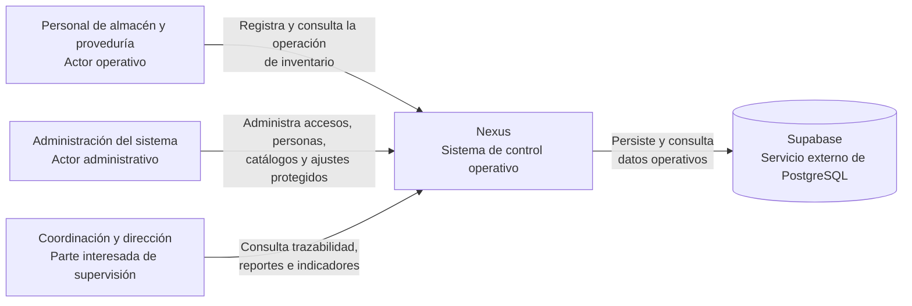
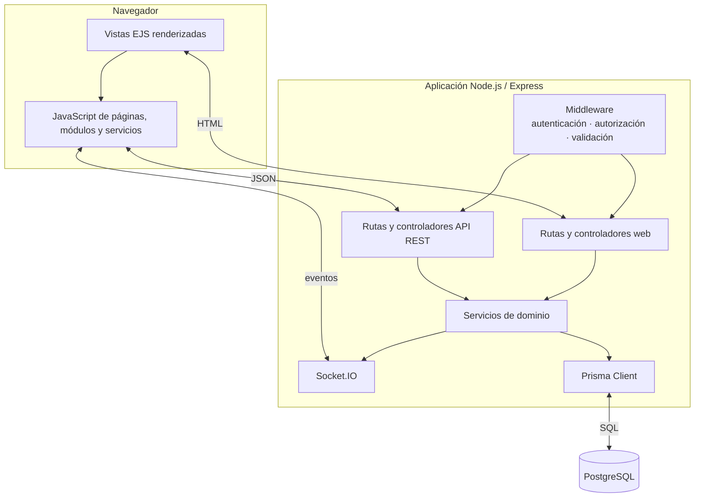
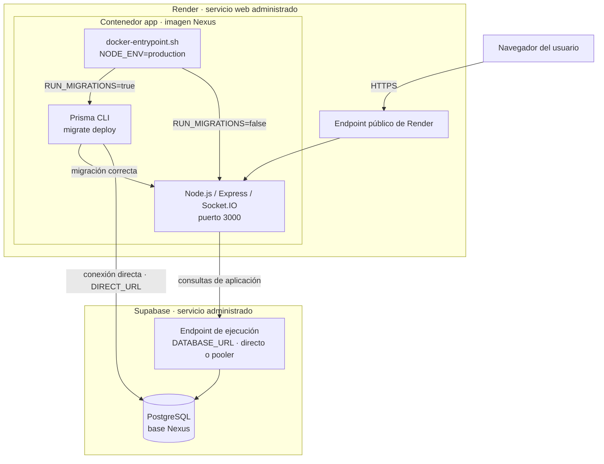
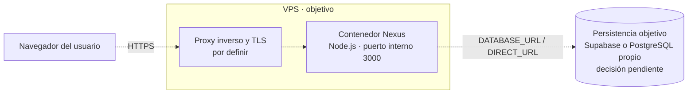
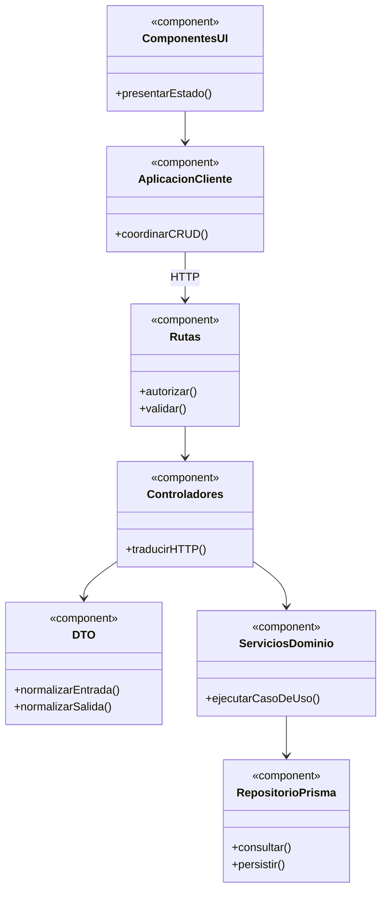
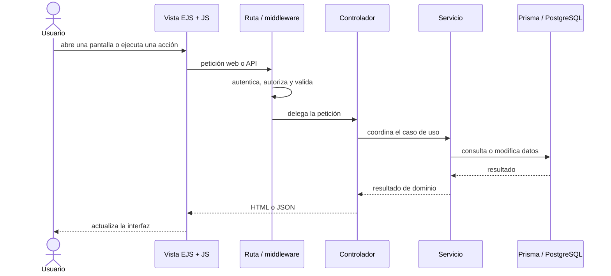

# Descripción de arquitectura y construcción

Este documento describe las vistas arquitectónicas del sistema y las decisiones de
organización del código. Los diagramas usan **Mermaid**, por lo que GitHub los
renderiza directamente sin guardar imágenes que puedan quedar desactualizadas.

Dentro de la familia, esta descripción se relaciona con tres niveles de detalle:

- este documento **curado** explica contexto, decisiones, responsabilidades y flujos;
- los [diagramas vigentes del código](code-diagrams.md) profundizan de forma ordenada en
  superficie HTTP, dominios, dinámica y reutilización sin repetir contexto ni
  contenedores;
- el [mapa generado del código](../generated/code-map.md), que pertenece a la familia de
  arquitectura, mantiene un inventario de rutas y dependencias reales entre áreas.

Los otros dos artefactos generados no son anexos de este documento: el
[esquema de base de datos](../generated/database-schema.md) y el
[diccionario técnico](../generated/data-dictionary.md) pertenecen a la familia de datos y
se derivan de Prisma. El [índice documental](../README.md#organización-de-los-artefactos)
expone la jerarquía completa. Los tres se verifican con `npm run docs:check`.

Así, un generador no intenta adivinar el porqué del diseño y los inventarios mecánicos
no dependen de que alguien recuerde actualizar una tabla a mano.

La navegación entre vistas sigue **Viewpoint/View con revelado progresivo**: este
documento conserva contexto y contenedores; los diagramas del código continúan con
estructura, dinámica y reutilización; el mapa generado aporta el inventario mecánico.
Cada pregunta arquitectónica tiene una vista canónica y los demás documentos la enlazan
en lugar de redibujarla.

## Mantenimiento y fuentes

### ¿Qué se actualiza automáticamente?

| Artefacto | Pertenece a | Fuente | Actualización |
| --- | --- | --- | --- |
| `docs/generated/code-map.md` | Arquitectura y construcción | Routers e importaciones de `src` | Se regenera con `npm run docs:architecture`; CI ejecuta `npm run docs:check` y bloquea cambios desactualizados. |
| `docs/generated/database-schema.md` | Datos, acceso y operación | Modelos y relaciones de `prisma/schema.prisma` | Se regenera con el mismo comando; se valida en cada solicitud de cambio. |
| `docs/generated/data-dictionary.md` | Datos, acceso y operación | Campos, claves, tipos y relaciones propietarias de `prisma/schema.prisma` | Se regenera con el mismo comando; complementa el esquema sin duplicarlo manualmente. |
| Diagramas de contexto, contenedores, despliegue y secuencia de este documento | Arquitectura y construcción | Decisiones de arquitectura, configuración versionada y experiencia de usuario | Son curados y se revisan cuando cambia el diseño o la configuración de ejecución. |
| `docs/architecture/code-diagrams.md` | Arquitectura y construcción | Routers, capas, servicios y componentes reutilizables | Es curado; se revisa manualmente al cambiar estructura, colaboración, flujo o patrón aplicado. |
| `docs/architecture/web-navigation-and-screen-catalog.md` | Arquitectura y construcción | Rutas, permisos, controladores, EJS y comportamiento visible | Es curado porque el código no puede inferir propósito, navegación ni estado funcional. |

La separación es intencional: generar relaciones mecánicas evita trabajo repetitivo,
pero no se presenta como «automática» una explicación que requiere criterio humano. En
las solicitudes de cambio, CI no modifica la rama: exige revisar los artefactos derivados
junto con el código que los produjo. Como red de seguridad, un envío a
`main` regenera los tres artefactos (`code-map.md`, `database-schema.md` y
`data-dictionary.md`) y crea una confirmación únicamente si detecta diferencias.

## 1. Arquitectura del sistema

### Diagrama de contexto del sistema

Esta vista responde **quién utiliza Nexus y para qué se relaciona con él**. Su límite
es el sistema completo: las personas se muestran fuera y Nexus como una única caja;
el navegador, Express y Prisma son detalles internos y, por tanto, no forman parte de
este nivel. Supabase sí aparece porque es un sistema externo administrado del que
Nexus depende para persistir sus datos. Las flechas expresan interacción, no permisos
individuales ni una secuencia técnica.

Supabase es una dependencia de infraestructura, no una integración funcional pública
como ERP, CRM o transportistas, que permanecen fuera del alcance. Render se muestra en
la vista de despliegue y no aquí porque aloja Nexus sin ser un sistema con el que los
actores intercambien información de negocio.

### Contenedores y capas

### Despliegue actual: Render y Supabase

La instancia vigente aloja la aplicación en Render y utiliza PostgreSQL administrado
por Supabase. Esa asignación es una decisión operativa curada; el contenido del
contenedor y su arranque sí se verifican en `Dockerfile` y `docker-entrypoint.sh`. Los
rectángulos anidados son nodos o entornos de ejecución; el cilindro representa la base
de datos y las flechas indican comunicación o secuencia de arranque. Las credenciales
se inyectan como variables de entorno en Render y no forman parte de la imagen.

La aplicación usa `DATABASE_URL` durante la ejecución y Prisma CLI usa `DIRECT_URL`
durante las migraciones. Si las migraciones están activadas, un fallo o la ausencia de
la URL directa detiene el contenedor antes de iniciar Node.js. `docker-compose.yml`
conserva el mismo contenedor como alternativa reproducible para ejecución en un host,
pero no describe el entorno de producción actual ni levanta PostgreSQL localmente.

### Despliegue objetivo: aplicación en un VPS

La dirección prevista es trasladar el contenedor de la aplicación desde Render a un
VPS. Esta es una vista objetivo, no implementada: las líneas discontinuas distinguen
la intención de la topología actual. Antes de considerarla vigente deben versionarse
la terminación TLS, el proxy inverso, la automatización del despliegue, respaldos y
monitoreo. También queda por decidir si la persistencia continuará en Supabase o se
operará PostgreSQL en infraestructura propia.

### Componentes de aplicación

Esta vista UML de componentes complementa los contenedores: muestra contratos y
dependencias de diseño, no cada import concreto. El detalle mecánico permanece en el
[mapa generado](../generated/code-map.md).

### Recorrido de una interacción

## 2. Vistas web relacionadas

Los estados de acceso, el mapa de navegación, el catálogo de pantallas y las
redirecciones se mantienen en [Navegación y catálogo de pantallas web](web-navigation-and-screen-catalog.md).
La separación evita mezclar decisiones de arquitectura del sistema con el inventario de
la experiencia web.

## 3. Organización consistente de front y back

La clasificación completa de factories, composición, pipeline, transacciones, eventos
y test harness se mantiene en [patrones de diseño y construcción](design-and-construction-patterns.md).
Esta sección aplica esas decisiones a la organización de capas y recursos.

La unidad de organización es el **dominio funcional** (`admin`, `sales`, `warehouse`),
no el tipo de operación CRUD. Una funcionalidad debe conservar el mismo dominio y el
mismo nombre de recurso al recorrer sus capas. Por ejemplo, `warehouse/wastes` enlaza
la ruta API, el controlador, el servicio del navegador y la página de mermas sin crear
un flujo paralelo para registrar o editar.

| Responsabilidad | Backend | Frontend |
| --- | --- | --- |
| Composición | `src/routes/{api,web}/index.js` registra prefijos y routers | La plantilla de página incluye el único entry point de la pantalla |
| Transporte | `routes` declara método, permiso y validadores; `controllers` traduce HTTP/DTO | `public/js/services` encapsula HTTP; `application` traduce la respuesta al caso de uso |
| Negocio | `services/<dominio>` contiene reglas y transacciones reutilizables | `application/<dominio>` coordina casos de uso sin depender de elementos visuales |
| Presentación | El controlador web entrega el contexto de la vista | `pages/<dominio>/<recurso>` conserva siempre el entry point y, cuando existen, el formulario y modal del contexto; incluso acceso, shell y consultas de movimientos siguen esa jerarquía. `ui`, `plugins` y `views/shared` reúnen piezas independientes del recurso |

Las exportaciones de reportes conservan sus contratos de transporte por dominio, pero
reutilizan `application/createReportApplication.js` para traducir de forma uniforme la
respuesta HTTP al archivo consumido por cada DataTable. Los módulos de `application/<dominio>/report.js`
sólo configuran esa factory con el request propietario y mantienen los nombres públicos
del contexto.

Reglas para extender un CRUD:

1. Añadir el router al registro central correspondiente, manteniendo el dominio tanto
   en la ruta como en los directorios de sus capas.
   Los routers web sólo exponen la navegación que renderiza cada pantalla; el CRUD y
   sus acciones especializadas se conservan en el router API del mismo dominio. Por
   ejemplo, `GET /salidas/mermas` renderiza la pantalla mediante
   `wasteIssueWebRoute.js`, mientras que listado, registro, ediciones y devoluciones
   se exponen bajo `/api/warehouse/waste-issues` mediante `wasteIssueApiRoute.js`.
2. Reutilizar DTOs, servicios de dominio, formularios, modales, tablas y selectores
   existentes antes de crear otro proceso; parametrizar el contexto cuando dos flujos
   sólo difieran en material/merma u otro recurso.
3. Mantener autorización y reglas de negocio en el servidor. El cliente únicamente
   adapta transporte, interacción y presentación.
4. Reservar `application` para casos de uso y `pages` para composición. Una llamada
   HTTP no debe implementarse directamente desde una página.
5. Aplicar el [estándar de codificación](coding-standards.md), que concentra el
   orden de operaciones, nombres e importaciones de controladores, sincronización de
   consumidores, ubicación de pruebas y preservación del cierre final de EJS.

### Reutilización aplicada en flujos de salidas

Las salidas de material y de merma conservan servicios HTTP separados porque sus
endpoints y respuestas pertenecen a contextos distintos. En cambio, su capa
`application` reutiliza `createIssueApplication`, que compone `createCrudApplication`
para listado, registro y edición, y sólo agrega las mutaciones de encabezado, detalles
y devolución. La adaptación común de `formData`, identificadores y respuestas exitosas
vive en `createApplicationMutation`; no hay dos implementaciones del mismo proceso.
Cada contexto sólo inyecta sus requests y las claves de datos de su respuesta. Las
páginas y datatables siguen consumiendo nombres de
dominio (`registerGoodsIssue`, `registerWasteIssue`, etc.), por lo que el componente
compartido no filtra abstracciones genéricas hacia la UI.

El modal compartido de devolución tampoco mantiene un actualizador propio para sus
cantidades: reutiliza `setSummaryValue` de `totalsSummaryUI`, el mismo helper que
sincroniza el valor numérico de `data-value` y su representación formateada en los
resúmenes de formularios.

`createIssueApplication` sí es un export porque es una función de construcción usada
por ambos módulos de salida; no es la instancia de ninguno de ellos. Cada invocación
produce un objeto inmutable independiente, que queda privado como
`goodsIssueApplication` o `wasteIssueApplication`. Esta separación permite reutilizar
la configuración del proceso sin mezclar requests, claves de respuesta o estado entre
contextos.

Las instancias `personApplication`, `userApplication`, `clientApplication` y sus
equivalentes de almacén son detalles privados de cada módulo. Exportar directamente
esas instancias obligaría a páginas, formularios, datatables y selects a conocer
operaciones genéricas como `getAll` o `edit`, y haría que un cambio en la factory se
convirtiera en un cambio transversal de la UI. Por ello cada contexto mantiene exports
nombrados de dominio; éstos son referencias a los métodos construidos y no duplican su
ejecución.

El mismo criterio se aplica a clientes, personas, usuarios, proveedores, materiales,
mermas y entradas mediante `createCrudApplication`: listado, registro y edición
comparten la adaptación de transporte. `additionalMutations` mantiene también ese
contrato para cambio de contraseña, stock, eliminación, corrección, cancelación y
operaciones de detalle, pero cada módulo exporta nombres de dominio y claves de
respuesta propios. En materiales, el contexto de creación atraviesa la adaptación
común sólo para omitir `maxUnitCost` durante una entrada de compra; el resto del objeto
ya seleccionado por `materialForm` pasa sin un segundo mapeo y el DTO del servidor
mantiene la normalización. En entradas y salidas, los identificadores de documento y
detalle se propagan por el mismo adaptador. De este modo una diferencia de contexto se
configura y no abre otra ejecución de aplicación.

Los módulos de aplicación tampoco convierten listados a opciones cuando el plugin de
Select2 ya declara el `mapOption` del dominio. Los filtros de proveedor y material
inicializan el mismo select remoto sin una consulta o transformación paralela; sólo los
filtros con selección predeterminada conservan una función de precarga. Asimismo,
`deleteMaterial` recibe `{ id }`, igual que las mutaciones construidas por la factory,
y el datatable adapta el identificador de su fila al invocarlo.

Los selects de oferta de material y de plantilla para merma reutilizan
`parseInventorySelectJson` para reconstruir datos serializados antes de actualizar la
interfaz. Permanecen en módulos de dominio distintos: `material.js` coordina la oferta
proveedor-material y la creación contextual, mientras `wasteMaterialTemplate.js`
consulta únicamente materiales de referencia del alta de merma. El enlace privado del
evento de plantilla pertenece por ello a este último módulo y entrega al formulario una
opción con presentación y unidad ya normalizadas.

`application/warehouse/wasteIssues/wasteIssues.js` permanece dentro de una carpeta de
recurso, en paralelo con `goodsIssues/goodsIssues.js`, porque ambos flujos tienen varias
mutaciones relacionadas. `wasteForm`, `wasteModal` y `wasteFields` permanecen en
`pages/warehouse/wastes` porque conocen selectores, validaciones, modos y operaciones
propias de ese recurso. `wasteFields` existe porque formulario y modal comparten los
grupos por modo, igual que `materialFields`; no implica que cada recurso deba replicar
un archivo `Fields` sin dos consumidores del mismo contrato. Que el datatable abra ese
modal no convierte al modal en un componente independiente del contexto. Sólo una abstracción sin conocimiento de merma
debe moverse a `ui` o a una carpeta compartida. El modal reutiliza los getters de
inventario para leer la presentación tanto del contrato plano como de la relación
`supplierMaterial.material` devuelta por Prisma; así no presupone relaciones opcionales
al alternar los campos dimensionales durante altas, ediciones o ajustes. En las salidas,
la coordinación específica permanece en los módulos hermanos de formulario y modal; el
archivo `Page` sólo los compone con el DataTable. Las operaciones realmente comunes del
formulario están en `ui/issues/issueFormUI.js`.
La presentación de sus modos se resuelve mediante una configuración única por modo;
la inicialización calcula una sola vez el estado deshabilitado del formulario y delega
una sola vez el estado del encabezado. Así, salidas de material y de merma comparten las
mismas transiciones sin cadenas de ramas ni sincronizaciones visuales repetidas.
Las decisiones privadas que sólo tenían un consumidor se mantienen en ese flujo: la
selección de la mutación vive en `useIssueForm`, la resolución del modo en las acciones
de tabla y la sincronización de cantidad en su evento. Se extrae una función únicamente
cuando existe reutilización entre consumidores o cuando constituye un adaptador común.

Los formularios y modales de clientes, materiales y proveedores se consumen desde
varias pantallas, pero siguen perteneciendo a su recurso. Por ello viven en
`pages/admin/persons`, `pages/admin/users`, `pages/sales/clients`,
`pages/warehouse/materials` y `pages/warehouse/suppliers`. Las pantallas sin CRUD también
respetan la jerarquía completa, por ejemplo `pages/admin/movements`,
`pages/home/login` y `pages/home/index`; no quedan puntos de entrada sueltos en la raíz
de un dominio. Las vistas EJS replican `views/pages/<dominio>/<recurso>`; sus plantillas
parciales propias permanecen junto al recurso y las reutilizadas por varios recursos se
ubican en `views/shared`, como los formularios comunes de salidas. El punto de entrada de
cada CRUD sólo inicializa la tabla y carga su formulario.
En particular, compras, salidas de material y salidas de merma mantienen
`goodsReceiptsPage.js`, `goodsIssuesPage.js` y `wasteIssuesPage.js` como puntos de entrada
que delegan el comportamiento de cada operación. Sus módulos `goodsReceiptForm.js`,
`goodsIssueForm.js` y `wasteIssueForm.js` coordinan el envío, la validación y la captura
de detalles
(`addGoodsReceiptMaterial`, `addGoodsIssueMaterial` y `addWaste`), mientras sus módulos
`goodsReceiptModal.js`, `goodsIssueModal.js` y `wasteIssueModal.js` preparan el modal y
sus detalles. Formulario y modal conservan así responsabilidades distintas en módulos
hermanos. Los flujos externos los importan desde el contexto propietario en vez de crear
una carpeta intermedia basada sólo en que hay más de un consumidor. `ui` queda reservado
para comportamiento que recibe su contexto por parámetros y no importa aplicaciones de
un recurso concreto.

Los comportamientos compartidos de formulario se importan desde módulos enfocados:
errores (`ui/forms/formErrorsUI.js`), estado y campos (`ui/forms/formStateUI.js`), detalle
(`ui/forms/detailFormUI.js`) y totales (`ui/forms/totalsSummaryUI.js`). Las operaciones que sólo tienen
un consumidor no forman parte de esa API: se mantienen privadas dentro del CRUD que
las necesita.

El listado de materiales conserva el contrato anidado proveedor-material que también
consumen la tabla y Select2. Sus acciones de edición y ajuste adaptan la fila mediante
`plugins/datatable/warehouse/materials/materialRow.js` antes de abrir el modal. El
adaptador permanece dentro del plugin propietario del listado y no se presenta como UI
compartida con merma. El modal recibe así el contrato plano de sus inputs y el
identificador del material, no el de la relación con el proveedor, y aplica directamente
sus campos porque esa preparación sólo pertenece a su apertura. El alta normal y el alta
iniciada desde compras ya entregan ese contrato plano y no atraviesan el adaptador del
listado. Este flujo pertenece sólo a material: merma mantiene su propio formulario,
contrato de plantilla y apertura de modal. Ambos recursos reutilizan únicamente los
controles genéricos de formulario, Select2 y modal que sí coinciden.

En compras, las filas de detalle reutilizan la identidad visible de inventario
(`material + medidas + proveedor`) que ya muestran salidas y almacén. Los modales
principales de compras y salidas se componen mediante `views/shared/inventory/inventoryCrudModal.ejs`;
cada CRUD declara sus campos y el componente transversal adapta ese contrato al layout
común. El wrapper de salidas permanece en `shared/issues` porque agrega exclusivamente
la configuración compartida por salidas de material y merma. La coordinación específica
de las devoluciones se separa en la subcarpeta `returns` de cada página de salida, en
paralelo con `corrections` de compras; sus servicios de dominio se agrupan en
`detailReturns`, sin duplicar el modal ni la UI compartida. En el cliente,
`ui/inventory/inventoryCrudModalUI.js` prepara el estado CRUD común del formulario antes de
que compras, salidas, materiales o mermas apliquen los datos y acciones propios de su
contexto. Los modales
secundarios de devolución de salida y corrección de compra reutilizan el diálogo
desplazable compartido y el mismo helper de apertura MDB, sin reglas de altura propias
que interfieran con el cálculo responsivo del componente. El layout conserva el backdrop
habilitado de MDB y el diálogo principal a pantalla completa. Devoluciones y correcciones
deben conservar visible ese contexto principal mientras presentan su diálogo `modal-lg`.
El único helper `openModal` mantiene una pila para todos los diálogos abiertos: asigna a
cada modal y a su backdrop el nivel que les corresponde y vuelve inertes todos salvo el
superior. La misma regla admite dos o más niveles sin crear un flujo especial para cada
modal secundario; al cerrar uno se recalcula la pila y se conservan abiertos los demás.
El backdrop no pertenece al formulario ni se instancia en cada CRUD: MDB conserva su
ciclo de vida y `openModal` asocia el elemento que MDB crea antes o durante el evento de
apertura. Así se reutiliza una sola coordinación y se evita que una diferencia de tiempo
en la creación del backdrop deje un nivel de la pila sin su profundidad visual.
Este apilamiento es una extensión de Nexus, no el flujo recomendado por MDB: la guía del
componente muestra alternar entre diálogos. Se conserva la alternativa local porque el
producto requiere mantener visibles varios contextos, y se aísla en `openModal` para no
depender de detalles de MDB desde cada CRUD. La coordinación propietaria
de corrección mantiene sólo el cálculo de totales que comparte entre la apertura y los
eventos del formulario; la preparación usada una sola vez permanece en la apertura. La
identidad visible del material seleccionado se presenta mediante el valor informativo
compartido en las correcciones de compra y devoluciones de salida. No se reutiliza el
`materialSelect` porque estas operaciones nunca permiten sustituir el material del
detalle: un texto evita comunicar una selección futura, no participa en el formulario
enviado y conserva el select para los CRUD donde sí existe esa decisión. Su tarjeta
reutiliza la misma presentación visual de etiqueta y valor que los costos y totales
informativos de los documentos, con espaciado interior compacto para mantener el texto
cerca del borde sin perder legibilidad.

Los filtros compartidos de DataTables separan los valores visibles en el formulario de
los valores que ya fueron aplicados. `tableFilterState` toma una instantánea al enviar
el formulario o limpiarlo; paginación, búsqueda, actualizaciones en tiempo real y
exportación reutilizan esa instantánea y no activan cambios que el usuario todavía no
confirmó con **Buscar / filtrar**. Esta regla se mantiene en el componente compartido
para que listados de personas, inventario, movimientos, compras y salidas sigan el
mismo flujo sin implementaciones específicas por CRUD.

## 4. Modelo de vistas de arquitectura aplicado

Nexus usa un modelo **Viewpoint/View inspirado en ISO/IEC/IEEE 42010**, organizado como
una adaptación práctica de **4+1** y apoyado por los niveles contexto/contenedor de C4.
No declara conformidad formal con esas normas: las combina para responder preguntas sin
duplicar diagramas. La vista de escenarios (`CU-*`) conecta las otras cuatro.

| Vista adaptada | Pregunta | Diagramas canónicos |
| --- | --- | --- |
| Escenarios (+1) | ¿Qué objetivo cumple cada actor? | Casos de uso, flujos y trazabilidad de requisitos. |
| Lógica | ¿Qué dominios, capas, componentes, estados y datos colaboran? | Dominio conceptual, componentes, dependencias y ER generado. |
| Procesos | ¿En qué orden se coordinan y dónde están decisiones/transacciones? | Secuencias, actividades y máquinas de estados. |
| Desarrollo | ¿Cómo se organiza y reutiliza el código de frontend y backend? | Superficie HTTP, fábrica CRUD, componentes y mapa generado. |
| Física | ¿Dónde se ejecuta y despliega? | Contexto, contenedores y despliegues actual/objetivo. |

La combinación mínima recomendada para comprender un cambio es: **caso de uso +
contexto/contenedores + componentes/capas + una vista dinámica sólo si existe
coordinación no trivial + ER cuando cambia persistencia + despliegue cuando cambia
infraestructura**. Frontend y backend comparten el escenario y el contrato API; cada uno
mantiene únicamente el tramo dinámico de su responsabilidad. El
[inventario de diagramas](diagram-inventory.md) permite localizar cada vista y la
[matriz de trazabilidad](traceability-matrix.md) recorre requisito, implementación y
prueba.

## 5. Herramientas

- **Diagramas curados:** Mermaid, representado directamente por GitHub.
- **Inventarios verificables:** el generador local para rutas, importaciones y el
  esquema de datos.
- **Para la API:** OpenAPI describe el contrato y Swagger UI puede visualizarlo; no
  reemplazan estos diagramas. Consulta la [decisión sobre el contrato](../data/api-contract.md).

No se propone otra herramienta sin una necesidad aprobada y verificable. Esto mantiene
el flujo actual simple y evita diagramas duplicados.
