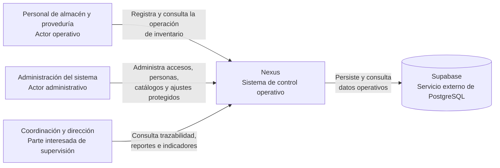
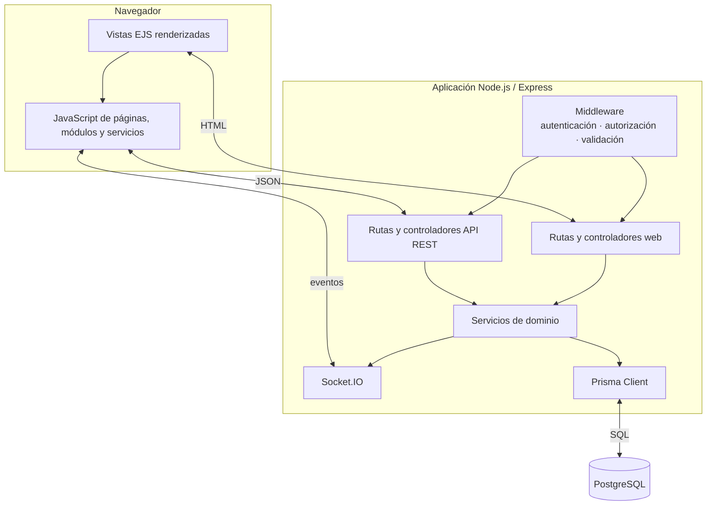
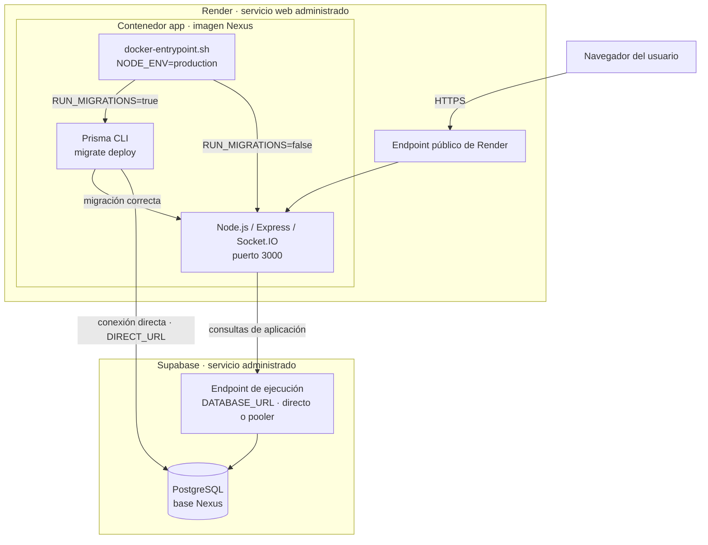
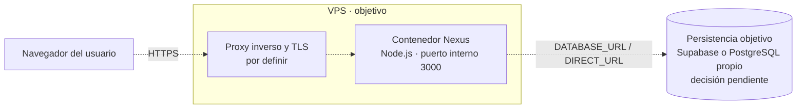
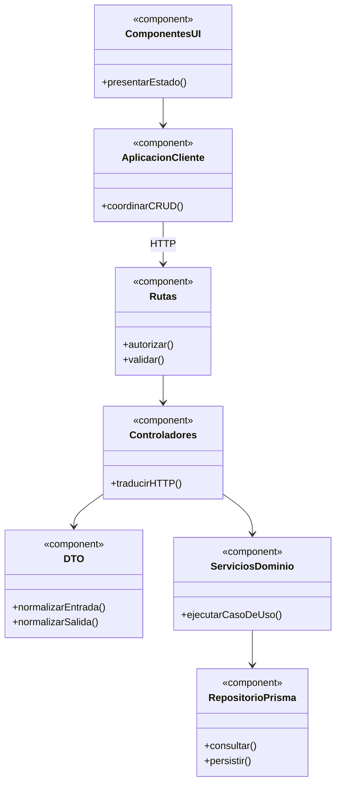
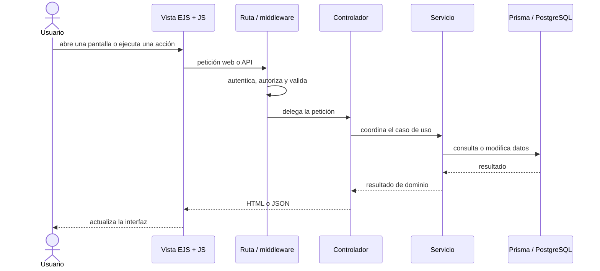

# 2. Arquitectura del sistema

### Diagrama de contexto del sistema

Esta vista responde **quién utiliza Nexus y para qué se relaciona con él**. Su límite
es el sistema completo: las personas se muestran fuera y Nexus como una única caja;
el navegador, Express y Prisma son detalles internos y, por tanto, no forman parte de
este nivel. Supabase sí aparece porque es un sistema externo administrado del que
Nexus depende para persistir sus datos. Las flechas expresan interacción, no permisos
individuales ni una secuencia técnica.

Supabase es una dependencia de infraestructura, no una integración funcional pública
como ERP, CRM o transportistas, que permanecen fuera del alcance. Render se muestra en
la vista de despliegue y no aquí porque aloja Nexus sin ser un sistema con el que los
actores intercambien información de negocio.

### Contenedores y capas

### Despliegue actual: Render y Supabase

La instancia vigente aloja la aplicación en Render y utiliza PostgreSQL administrado
por Supabase. Esa asignación es una decisión operativa curada; el contenido del
contenedor y su arranque sí se verifican en `Dockerfile` y `docker-entrypoint.sh`. Los
rectángulos anidados son nodos o entornos de ejecución; el cilindro representa la base
de datos y las flechas indican comunicación o secuencia de arranque. Las credenciales
se inyectan como variables de entorno en Render y no forman parte de la imagen.

La aplicación usa `DATABASE_URL` durante la ejecución y Prisma CLI usa `DIRECT_URL`
durante las migraciones. Si las migraciones están activadas, un fallo o la ausencia de
la URL directa detiene el contenedor antes de iniciar Node.js. `docker-compose.yml`
conserva el mismo contenedor como alternativa reproducible para ejecución en un host,
pero no describe el entorno de producción actual ni levanta PostgreSQL localmente.

### Despliegue objetivo: aplicación en un VPS

La dirección prevista es trasladar el contenedor de la aplicación desde Render a un
VPS. Esta es una vista objetivo, no implementada: las líneas discontinuas distinguen
la intención de la topología actual. Antes de considerarla vigente deben versionarse
la terminación TLS, el proxy inverso, la automatización del despliegue, respaldos y
monitoreo. También queda por decidir si la persistencia continuará en Supabase o se
operará PostgreSQL en infraestructura propia.

### Componentes de aplicación

Esta vista UML de componentes complementa los contenedores: muestra contratos y
dependencias de diseño, no cada import concreto. El detalle mecánico permanece en el
[mapa generado](../../generated/code-map.md).

### Recorrido de una interacción

