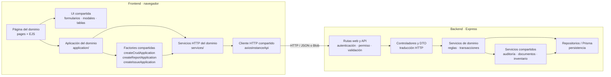
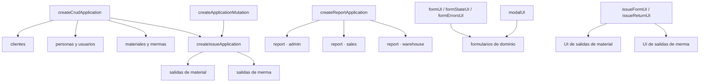

# Componentes y reutilización de frontend y backend

Esta vista sustituye una descripción archivo por archivo por las responsabilidades y
puntos de reutilización que condicionan la solución. La unidad de organización es el
dominio funcional (`admin`, `sales` o `warehouse`); las capas no crean otro flujo de
negocio, sino que colaboran para realizarlo.

## Componentes de la aplicación

**Diagrama:** `DIA-ARQ-CMP-001`. Las flechas indican dependencia; los componentes
compartidos se muestran una sola vez aunque tengan varios consumidores.

La ruta autoriza y valida, el controlador traduce HTTP, el servicio conserva reglas y
transacciones, y el repositorio encapsula consultas reutilizables. En el navegador, la
página compone la interacción, `application` coordina el caso y `services` encapsula el
transporte. Esta frontera impide que una página duplique requests o que el cliente
asuma autorización y reglas definitivas.

## Reutilización comprobada en el frontend

**Diagrama:** `DIA-ARQ-CMP-002`. Esta vista responde específicamente dónde se reutiliza
comportamiento y dónde permanece la configuración del dominio.

Las factories reciben requests, claves de respuesta y mutaciones del contexto; no
exponen una instancia genérica a la UI. Cada módulo mantiene exports con nombres del
dominio, mientras los formularios y páginas reutilizan los helpers visuales sin mover
selectores o reglas específicas a `ui`. Las exportaciones Excel siguen el mismo
criterio: el caso permanece en la pantalla propietaria y sólo la descarga se comparte
mediante `createReportApplication`.

## Criterio para extender un flujo

1. Registrar la ruta bajo el dominio existente y mantener juntos sus nombres a través
   de ruta, controlador, servicio, aplicación y página.
2. Reutilizar una factory o componente compartido cuando el recorrido sea el mismo y
   expresar la diferencia mediante configuración; conservar en el dominio los
   selectores, payloads y reglas que no sean generales.
3. Mantener una sola transacción backend para escrituras compuestas y propagar `tx` a
   cada colaborador.
4. Representar una colaboración nueva en este diagrama sólo si cambia la estructura;
   el detalle de imports y rutas pertenece al [mapa generado](../../generated/code-map.md)
   y las secuencias concretas a las colecciones de
   [frontend](../frontend-code-sequences/index.md) y
   [backend](../backend-code-sequences/index.md).
