# Diagramas de secuencia del código backend

Esta colección **no es un catálogo de diagramas de casos de uso**. Es la lectura técnica
complementaria del catálogo funcional: cada `CU-*` sirve como vínculo de trazabilidad,
pero el bloque Mermaid describe cómo se ejecuta el código mediante endpoint, controller,
servicios, efectos y variables de frontera. Para comprender el objetivo con lenguaje de
negocio se consulta primero el [modelo y los diagramas funcionales de casos de uso](../requirements/domain-and-use-cases.md#casos-de-uso-vigentes).

La [matriz técnica de backend](backend-technical-documentation.md#aplicación-de-todos-los-casos-al-código-backend)
es el índice único de trazabilidad: relaciona caso, entrada HTTP, implementación y
diagrama. Esta colección no vuelve a copiar esa relación en cada sección. Los
participantes identifican ruta de archivo, objeto y símbolo. En el recorrido común se
separan cliente, ruta, controller y objeto de dominio; sólo las coordinaciones atómicas
despliegan objetos colaboradores, persistencia o publicación como participantes
adicionales. De este modo se conservan pocas entidades sin ocultar el controller ni el
objeto responsable. Los mensajes conservan las llamadas en orden y las notas nombran datos que cruzan la
frontera (`req.params`, `req.body`/DTO, parámetros de consulta y `tx`). Las variables
locales mecánicas permanecen en el código para no convertir el diagrama en una
transcripción ilegible. Cada caso mantiene una secuencia específica aunque reutilice un
patrón, porque cambian módulos, firmas, rutas, datos o efectos.

### Regla de identificación y lectura

El encabezado `CU-<grupo>-<número>` enlaza directamente la ficha funcional del mismo
identificador. El diagrama de esa sección se identifica de forma determinista como
`DIA-BE-CU-<grupo>-<número>`; por ejemplo, la sección `CU-ENT-02` contiene
`DIA-BE-CU-ENT-02`. La matriz técnica mantiene el enlace navegable y la evidencia de
código. Aquí se conserva solamente la información propia de la vista: patrones,
participantes, llamadas, datos de frontera, decisiones y efectos. El objetivo, actor y
flujo de negocio no se repiten porque pertenecen a la ficha del caso de uso.

## Índice rápido de patrones por caso

Cada caso conserva una línea **Patrones** con códigos de este índice y enlaza el
[catálogo canónico](design-and-construction-patterns.md#resumen-de-patrones-confirmados).
La referencia identifica las soluciones aplicadas sin repetirlas dentro de Mermaid. La
implementación se reconoce directamente por las rutas `src/...`, símbolos y llamadas
del recorrido concreto.

| Código | Patrón aplicado | Elementos que permiten reconocerlo |
| --- | --- | --- |
| `BE-P01` | Capas, pipeline y DTO funcional | Ruta/middleware → controller/DTO → servicio → Prisma; el DTO sólo aparece cuando hay entrada. |
| `BE-P02` | Factory de catálogo | `createDataTableListController` parametriza consulta, columnas y orden. |
| `BE-P03` | Transaction Script y `tx` explícito | El servicio propietario abre `$transaction` y propaga `tx` a las escrituras relacionadas. |
| `BE-P04` | Composición de servicios | El servicio del caso coordina reglas, referencias, inventario o cumplimiento reutilizados. |
| `BE-P05` | Publicación posterior al commit | El controller llama `emitInventoryUpdated` después del resultado del servicio. |
| `BE-P06` | Query Service | Controller de listado + consulta contextual de sólo lectura. |
| `BE-P07` | Composición de reporte | Consulta de dominio + `sendExcelReport`, sin modificar inventario. |
| `BE-P08` | Sesión web | Autenticación, JWT/cookies, cierre o redirección en la frontera web. |

### Cobertura de casos backend

La comparación con el catálogo y la matriz técnica confirma que cada identificador
aparece una vez, conserva su referencia de patrones y contiene un bloque Mermaid.

| Grupo | Rango cubierto | Diagramas | Estado |
| --- | --- | ---: | --- |
| Autenticación | `CU-AUT-01..02` | 2 | Completo |
| Identidad y acceso | `CU-IDA-01..09` | 9 | Completo |
| Catálogos | `CU-CAT-01..20` | 20 | Completo |
| Entradas | `CU-ENT-01..05` | 5 | Completo |
| Salidas | `CU-SAL-01..12` | 12 | Completo |
| Consultas y reportes | `CU-REP-01..15` | 15 | Completo |
| **Total** | `CU-AUT-01..CU-REP-15` | **63** | **63 de 63** |

## `CU-AUT-01`

**Patrones:** `BE-P01`, `BE-P08`.

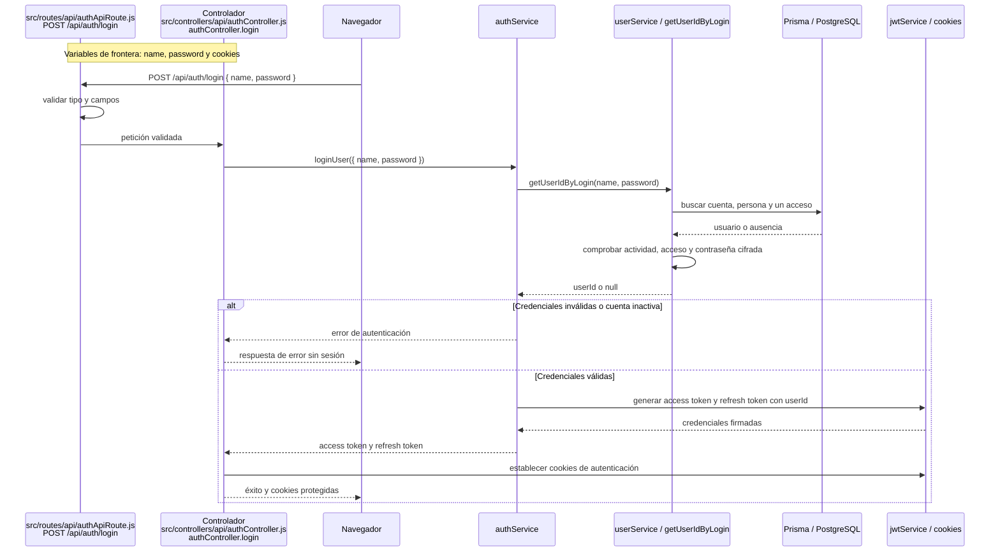

## `CU-AUT-02`

**Patrones:** `BE-P08`.

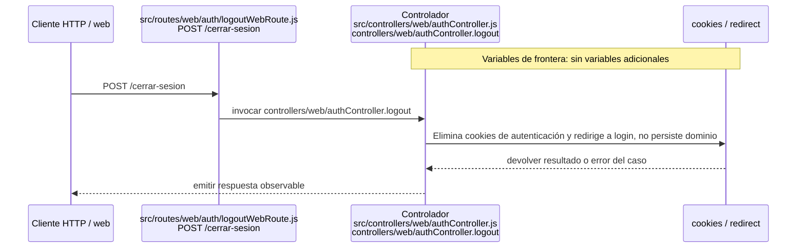

## `CU-IDA-01`

**Patrones:** `BE-P01`.

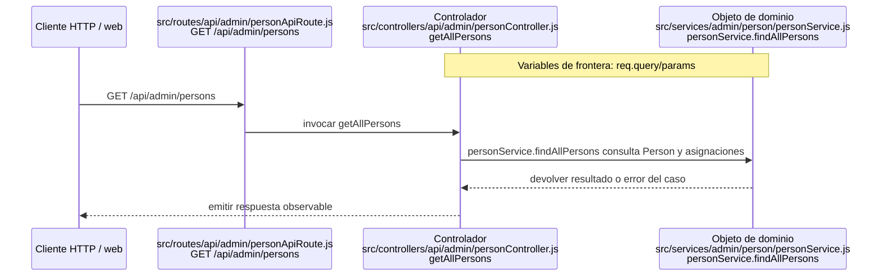

## `CU-IDA-02`

**Patrones:** `BE-P01`, `BE-P03`, `BE-P04`.


## `CU-IDA-03`

**Patrones:** `BE-P01`, `BE-P03`, `BE-P04`.

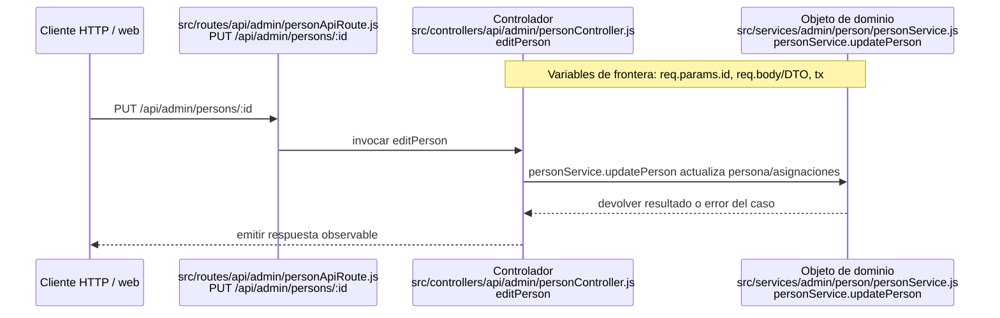

## `CU-IDA-04`

**Patrones:** `BE-P01`.

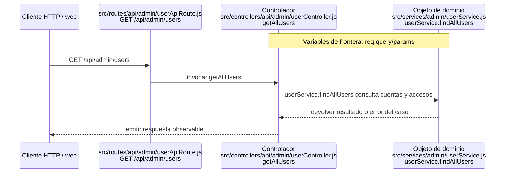

## `CU-IDA-05`

**Patrones:** `BE-P01`, `BE-P03`, `BE-P04`.

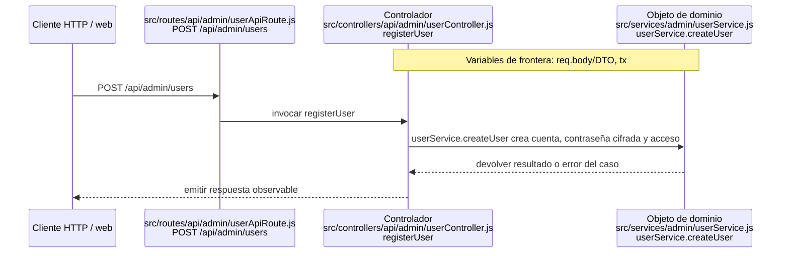

## `CU-IDA-06`

**Patrones:** `BE-P01`, `BE-P03`, `BE-P04`.

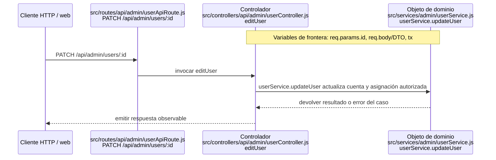

## `CU-IDA-07`

**Patrones:** `BE-P01`.

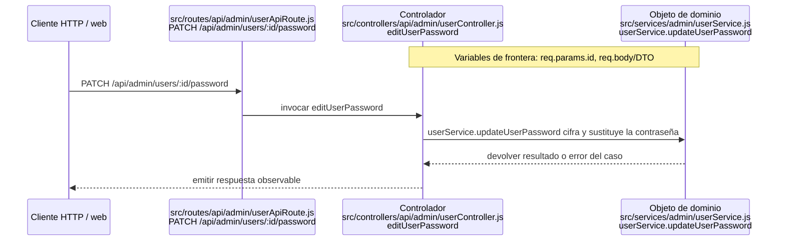

## `CU-IDA-08`

**Patrones:** `BE-P02`.

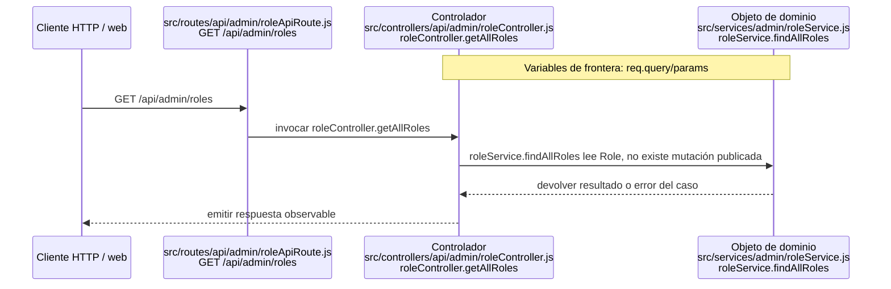

## `CU-IDA-09`

**Patrones:** `BE-P02`.

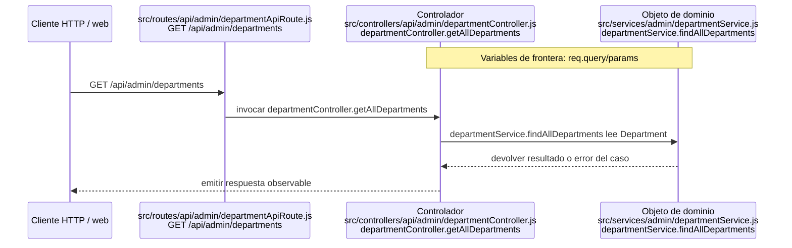

## `CU-CAT-01`

**Patrones:** `BE-P01`.

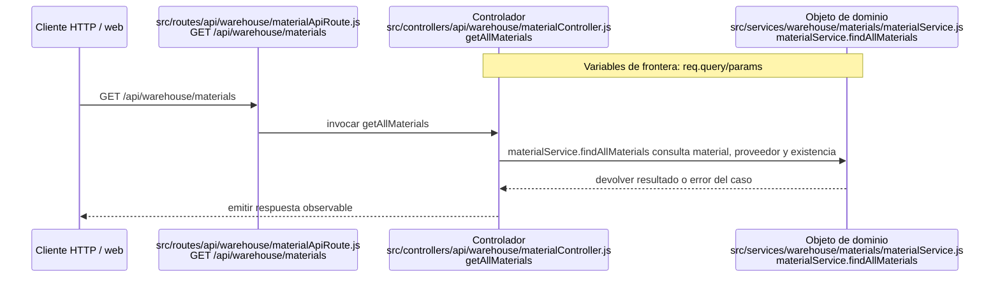

## `CU-CAT-02`

**Patrones:** `BE-P01`, `BE-P03`, `BE-P04`.


## `CU-CAT-03`

**Patrones:** `BE-P01`, `BE-P03`, `BE-P04`.

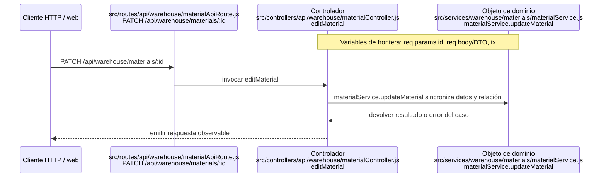

## `CU-CAT-04`

**Patrones:** `BE-P01`, `BE-P03`, `BE-P04`.


## `CU-CAT-05`

**Patrones:** `BE-P01`, `BE-P03`, `BE-P04`, `BE-P05`.

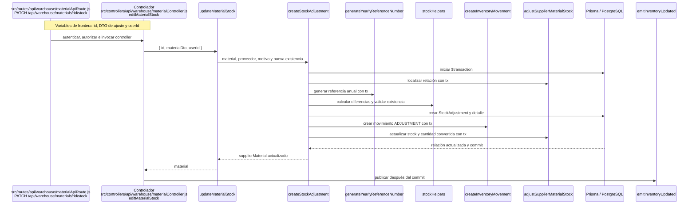

## `CU-CAT-06`

**Patrones:** `BE-P01`.

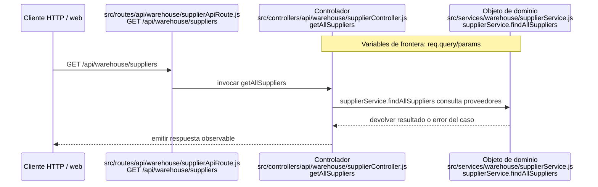

## `CU-CAT-07`

**Patrones:** `BE-P01`.

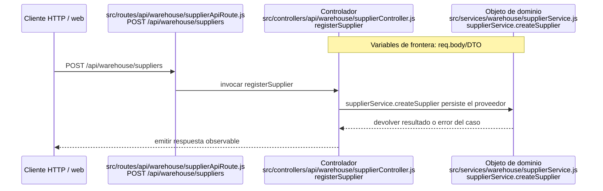

## `CU-CAT-08`

**Patrones:** `BE-P01`.

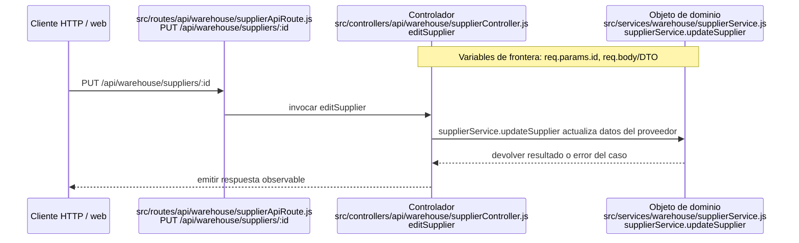

## `CU-CAT-09`

**Patrones:** `BE-P01`.

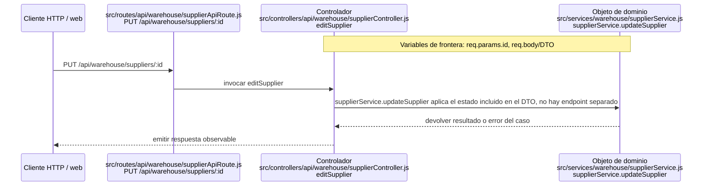

## `CU-CAT-10`

**Patrones:** `BE-P01`.

```mermaid
sequenceDiagram
    participant Client as Cliente HTTP / web
    participant Route as src/routes/api/sales/clientApiRoute.js<br/>GET /api/sales/clients
    participant Controller as Controlador<br/>src/controllers/api/sales/clientController.js<br/>getAllClients
    participant Domain as Objeto de dominio<br/>src/services/sales/clientService.js<br/>clientService.findAllClients
    Note over Controller,Domain: Variables de frontera: req.query/params

    Client->>Route: GET /api/sales/clients
    Route->>Controller: invocar getAllClients
    Controller->>Domain: clientService.findAllClients consulta Client
    Domain-->>Controller: devolver resultado o error del caso
    Controller-->>Client: emitir respuesta observable
```

## `CU-CAT-11`

**Patrones:** `BE-P01`.

```mermaid
sequenceDiagram
    participant Client as Cliente HTTP / web
    participant Route as src/routes/api/sales/clientApiRoute.js<br/>POST /api/sales/clients
    participant Controller as Controlador<br/>src/controllers/api/sales/clientController.js<br/>registerClient
    participant Domain as Objeto de dominio<br/>src/services/sales/clientService.js<br/>clientService.createClient
    Note over Controller,Domain: Variables de frontera: req.body/DTO

    Client->>Route: POST /api/sales/clients
    Route->>Controller: invocar registerClient
    Controller->>Domain: clientService.createClient persiste Client
    Domain-->>Controller: devolver resultado o error del caso
    Controller-->>Client: emitir respuesta observable
```

## `CU-CAT-12`

**Patrones:** `BE-P01`.

```mermaid
sequenceDiagram
    participant Client as Cliente HTTP / web
    participant Route as src/routes/api/sales/clientApiRoute.js<br/>PUT /api/sales/clients/:id
    participant Controller as Controlador<br/>src/controllers/api/sales/clientController.js<br/>editClient
    participant Domain as Objeto de dominio<br/>src/services/sales/clientService.js<br/>clientService.updateClient
    Note over Controller,Domain: Variables de frontera: req.params.id, req.body/DTO

    Client->>Route: PUT /api/sales/clients/:id
    Route->>Controller: invocar editClient
    Controller->>Domain: clientService.updateClient actualiza Client
    Domain-->>Controller: devolver resultado o error del caso
    Controller-->>Client: emitir respuesta observable
```

## `CU-CAT-13`

**Patrones:** `BE-P01`.

```mermaid
sequenceDiagram
    participant Client as Cliente HTTP / web
    participant Route as src/routes/api/warehouse/wasteApiRoute.js<br/>GET /api/warehouse/wastes
    participant Controller as Controlador<br/>src/controllers/api/warehouse/wasteController.js<br/>getAllWastes
    participant Domain as Objeto de dominio<br/>src/services/warehouse/wastes/wasteService.js<br/>wasteService.findAllWastes
    Note over Controller,Domain: Variables de frontera: req.query/params

    Client->>Route: GET /api/warehouse/wastes
    Route->>Controller: invocar getAllWastes
    Controller->>Domain: wasteService.findAllWastes consulta merma e inventario
    Domain-->>Controller: devolver resultado o error del caso
    Controller-->>Client: emitir respuesta observable
```

## `CU-CAT-14`

**Patrones:** `BE-P01`, `BE-P03`, `BE-P04`, `BE-P05`.

```mermaid
sequenceDiagram
    participant Client as Cliente HTTP / web
    participant Route as src/routes/api/warehouse/wasteApiRoute.js<br/>GET material-templates / POST wastes
    participant Controller as Controlador<br/>src/controllers/api/warehouse/wasteController.js<br/>getWasteMaterialTemplates / registerWaste
    participant Domain as Objeto de dominio<br/>src/services/warehouse/wastes/wasteMaterialService.js + src/services/warehouse/wastes/wasteService.js<br/>findWasteMaterialTemplates / createWasteWithInitialStockAdjustment
    Note over Controller,Domain: Variables de frontera: req.body/DTO, req.query/params, tx

    Client->>Route: GET /api/warehouse/wastes/material-templates y POST /api/warehouse/wastes
    Route->>Controller: invocar getWasteMaterialTemplates/registerWaste
    Controller->>Domain: findWasteMaterialTemplates alimenta la selección y createWasteWithInitialStockAdjustment crea merma, ajuste y movimiento inicial
    Domain-->>Controller: devolver resultado o error del caso
    Controller-->>Client: emitir respuesta observable
```

## `CU-CAT-15`

**Patrones:** `BE-P01`.

```mermaid
sequenceDiagram
    participant Client as Cliente HTTP / web
    participant Route as src/routes/api/warehouse/wasteApiRoute.js<br/>PATCH /api/warehouse/wastes/:id
    participant Controller as Controlador<br/>src/controllers/api/warehouse/wasteController.js<br/>editWaste
    participant Domain as Objeto de dominio<br/>src/services/warehouse/wastes/wasteService.js<br/>wasteService.updateWaste
    Note over Controller,Domain: Variables de frontera: req.params.id, req.body/DTO

    Client->>Route: PATCH /api/warehouse/wastes/:id
    Route->>Controller: invocar editWaste
    Controller->>Domain: wasteService.updateWaste actualiza datos sin tratar stock como edición
    Domain-->>Controller: devolver resultado o error del caso
    Controller-->>Client: emitir respuesta observable
```

## `CU-CAT-16`

**Patrones:** `BE-P01`, `BE-P03`, `BE-P04`, `BE-P05`.

```mermaid
sequenceDiagram
    Note over Router,Controller: Variables de frontera: id, DTO de ajuste y userId
    participant Router as src/routes/api/warehouse/wasteApiRoute.js<br/>PATCH /api/warehouse/wastes/:id/stock
    participant Controller as Controlador<br/>src/controllers/api/warehouse/wasteController.js<br/>editWasteStock
    participant Service as updateWasteStock
    participant Adjustment as registerWasteStockAdjustment
    participant Reference as generateYearlyReferenceNumber
    participant Stock as stockHelpers
    participant Movement as createWasteMovement
    participant Prisma as Prisma / PostgreSQL
    participant Socket as emitInventoryUpdated

    Router->>Controller: autenticar, autorizar e invocar controller
    Controller->>Service: { id, wasteStockDto, userId }
    Service->>Prisma: iniciar $transaction
    Service->>Prisma: cargar Waste vigente
    Service->>Adjustment: merma, motivo y nueva existencia con tx
    Adjustment->>Stock: calcular diferencias y validar existencia
    Adjustment->>Reference: generar referencia anual con tx
    Adjustment->>Prisma: crear WasteStockAdjustment y detalle
    Adjustment->>Movement: crear WasteMovement ADJUSTMENT con tx
    Adjustment->>Prisma: enlazar movimiento y actualizar Waste
    Prisma-->>Service: merma actualizada y commit
    Service-->>Controller: waste
    Controller->>Socket: publicar después del commit
```

## `CU-CAT-17`

**Patrones:** `BE-P02`.

```mermaid
sequenceDiagram
    participant Client as Cliente HTTP / web
    participant Route as src/routes/api/warehouse/presentationApiRoute.js<br/>GET /api/warehouse/presentations
    participant Controller as Controlador<br/>src/controllers/api/warehouse/presentationController.js<br/>getAllPresentations
    participant Domain as Objeto de dominio<br/>src/services/warehouse/presentationService.js<br/>presentationService.findAllPresentations
    Note over Controller,Domain: Variables de frontera: req.query/params

    Client->>Route: GET /api/warehouse/presentations
    Route->>Controller: invocar getAllPresentations
    Controller->>Domain: presentationService.findAllPresentations sirve el catálogo de sólo lectura
    Domain-->>Controller: devolver resultado o error del caso
    Controller-->>Client: emitir respuesta observable
```

## `CU-CAT-18`

**Patrones:** `BE-P02`.

```mermaid
sequenceDiagram
    participant Client as Cliente HTTP / web
    participant Route as src/routes/api/warehouse/unitMeasureApiRoute.js<br/>GET /api/warehouse/unit-measures
    participant Controller as Controlador<br/>src/controllers/api/warehouse/unitMeasureController.js<br/>getAllUnitMeasures
    participant Domain as Objeto de dominio<br/>src/services/warehouse/unitMeasureService.js<br/>unitMeasureService.findAllUnitMeasures
    Note over Controller,Domain: Variables de frontera: req.query/params

    Client->>Route: GET /api/warehouse/unit-measures
    Route->>Controller: invocar getAllUnitMeasures
    Controller->>Domain: unitMeasureService.findAllUnitMeasures sirve el catálogo de sólo lectura
    Domain-->>Controller: devolver resultado o error del caso
    Controller-->>Client: emitir respuesta observable
```

## `CU-CAT-19`

**Patrones:** `BE-P02`.

```mermaid
sequenceDiagram
    participant Client as Cliente HTTP / web
    participant Route as src/routes/api/warehouse/reasonApiRoute.js<br/>GET /api/warehouse/reasons
    participant Controller as Controlador<br/>src/controllers/api/warehouse/reasonController.js<br/>getAllReasons
    participant Domain as Objeto de dominio<br/>src/services/warehouse/reasonService.js<br/>reasonService.findAllReasons
    Note over Controller,Domain: Variables de frontera: req.query/params

    Client->>Route: GET /api/warehouse/reasons
    Route->>Controller: invocar getAllReasons
    Controller->>Domain: reasonService.findAllReasons sirve motivos, helpers resuelven motivos internos
    Domain-->>Controller: devolver resultado o error del caso
    Controller-->>Client: emitir respuesta observable
```

## `CU-CAT-20`

**Patrones:** `BE-P02`.

```mermaid
sequenceDiagram
    participant Client as Cliente HTTP / web
    participant Route as src/routes/api/warehouse/fulfillmentStatusApiRoute.js<br/>GET /api/warehouse/fulfillment-statuses
    participant Controller as Controlador<br/>src/controllers/api/warehouse/fulfillmentStatusController.js<br/>getAllFulfillmentStatuses
    participant Domain as Objeto de dominio<br/>src/services/warehouse/fulfillmentStatusService.js<br/>fulfillmentStatusService.findAllFulfillmentStatuses
    Note over Controller,Domain: Variables de frontera: req.query/params

    Client->>Route: GET /api/warehouse/fulfillment-statuses
    Route->>Controller: invocar getAllFulfillmentStatuses
    Controller->>Domain: fulfillmentStatusService.findAllFulfillmentStatuses sirve estados de sólo lectura
    Domain-->>Controller: devolver resultado o error del caso
    Controller-->>Client: emitir respuesta observable
```

## `CU-ENT-01`

**Patrones:** `BE-P01`.

```mermaid
sequenceDiagram
    participant Client as Cliente HTTP / web
    participant Route as src/routes/api/warehouse/goodsReceiptApiRoute.js<br/>GET /api/warehouse/goods-receipts
    participant Controller as Controlador<br/>src/controllers/api/warehouse/goodsReceiptController.js<br/>getAllGoodsReceipts
    participant Domain as Objeto de dominio<br/>src/services/warehouse/goodsReceipts/goodsReceiptService.js<br/>goodsReceiptService.findAllGoodsReceipts
    Note over Controller,Domain: Variables de frontera: req.query/params

    Client->>Route: GET /api/warehouse/goods-receipts
    Route->>Controller: invocar getAllGoodsReceipts
    Controller->>Domain: goodsReceiptService.findAllGoodsReceipts consulta entradas y totales
    Domain-->>Controller: devolver resultado o error del caso
    Controller-->>Client: emitir respuesta observable
```

## `CU-ENT-02`

**Patrones:** `BE-P01`, `BE-P03`, `BE-P04`, `BE-P05`.

```mermaid
sequenceDiagram
    Note over Router,Controller: Variables de frontera: goodsReceiptDto y tx
    participant Browser as Navegador
    participant Router as src/routes/api/warehouse/goodsReceiptApiRoute.js<br/>POST /api/warehouse/goods-receipts
    participant Controller as Controlador<br/>src/controllers/api/warehouse/goodsReceiptController.js<br/>registerGoodsReceipt
    participant DTO as createGoodsReceiptDtoForRegister
    participant Service as createGoodsReceipt
    participant Reference as referenceNumberService
    participant DetailBuilder as buildGoodsReceiptDetails
    participant Inventory as applyInventoryMovement
    participant Prisma as Prisma / PostgreSQL
    participant Socket as emitInventoryUpdated

    Browser->>Router: POST /api/warehouse/goods-receipts
    Router->>Router: autenticar, validar y autorizar
    Router->>Controller: req, res
    Controller->>DTO: req.body
    DTO-->>Controller: goodsReceiptDto
    Controller->>Service: { goodsReceiptDto }
    Service->>Prisma: validar proveedor, factura y persona receptora
    Service->>DetailBuilder: construir detalles y calcular totales
    Service->>Prisma: iniciar $transaction
    Service->>Reference: generar referencia anual con tx
    Service->>Prisma: crear encabezado, detalles y totales
    Service->>Inventory: applyInventoryMovement({ tx, ENTRY, details })
    Inventory->>Prisma: incrementar existencias y crear movimiento
    Prisma-->>Service: entrada confirmada y commit
    Service-->>Controller: goodsReceipt
    Controller->>Socket: emitInventoryUpdated(...)
    Controller-->>Browser: 200 { goodsReceipt, code }
```

## `CU-ENT-03`

**Patrones:** `BE-P01`, `BE-P03`, `BE-P04`, `BE-P05`.

```mermaid
sequenceDiagram
    participant Client as Cliente HTTP / web
    participant Route as src/routes/api/warehouse/goodsReceiptApiRoute.js<br/>PATCH /api/warehouse/goods-receipts/:id
    participant Controller as Controlador<br/>src/controllers/api/warehouse/goodsReceiptController.js<br/>editGoodsReceiptHeader
    participant Domain as Objeto de dominio<br/>src/services/warehouse/goodsReceipts/goodsReceiptService.js<br/>goodsReceiptService.updateGoodsReceipt
    Note over Controller,Domain: Variables de frontera: req.params.id, req.body/DTO, tx

    Client->>Route: PATCH /api/warehouse/goods-receipts/:id
    Route->>Controller: invocar editGoodsReceiptHeader
    Controller->>Domain: goodsReceiptService.updateGoodsReceipt conserva detalles persistidos y actualiza encabezado permitido
    Domain-->>Controller: devolver resultado o error del caso
    Controller-->>Client: emitir respuesta observable
```

## `CU-ENT-04`

**Patrones:** `BE-P01`, `BE-P03`, `BE-P04`, `BE-P05`.

```mermaid
sequenceDiagram
    Note over Router,Controller: Variables de frontera: id, detailId, correctionDto, userId y tx
    participant Router as src/routes/api/warehouse/goodsReceiptApiRoute.js<br/>PATCH /api/warehouse/goods-receipts/:id/details/:detailId/corrections
    participant Controller as Controlador<br/>src/controllers/api/warehouse/goodsReceiptController.js<br/>correctGoodsReceiptDetail
    participant Service as correctGoodsReceiptDetailLine
    participant Change as goodsReceiptDetailChangeService
    participant Reason as reasonService
    participant Inventory as movementService
    participant Prisma as Prisma / PostgreSQL
    participant Socket as emitInventoryUpdated

    Router->>Controller: autenticar, autorizar e invocar controller
    Controller->>Service: { id, detailId, correctionDto, userId }
    Service->>Prisma: iniciar $transaction
    Service->>Change: localizar detalle activo con tx
    Service->>Reason: obtener motivo de corrección con tx
    Service->>Change: calcular diferencia y actualizar detalle/totales
    Change->>Inventory: crear movimiento y actualizar stock con tx
    Service->>Change: guardar historia anterior/corregida y actor
    Prisma-->>Service: entrada corregida y commit
    Service-->>Controller: goodsReceipt y correction
    Controller->>Socket: publicar después del commit
```

## `CU-ENT-05`

**Patrones:** `BE-P01`, `BE-P03`, `BE-P04`, `BE-P05`.

```mermaid
sequenceDiagram
    participant Client as Cliente HTTP / web
    participant Route as src/routes/api/warehouse/goodsReceiptApiRoute.js<br/>PATCH /api/warehouse/goods-receipts/:id/details/:detailId/cancel
    participant Controller as Controlador<br/>src/controllers/api/warehouse/goodsReceiptController.js<br/>cancelGoodsReceiptDetail
    participant Domain as Objeto de dominio<br/>src/services/warehouse/goodsReceipts/detailChanges/goodsReceiptCancellationService.js<br/>cancelGoodsReceiptDetailLine
    Note over Controller,Domain: Variables de frontera: req.params.id, req.params.detailId, req.body/DTO, tx

    Client->>Route: PATCH /api/warehouse/goods-receipts/:id/details/:detailId/cancel
    Route->>Controller: invocar cancelGoodsReceiptDetail
    Controller->>Domain: cancelGoodsReceiptDetailLine revierte stock/movimiento y conserva historial
    Domain-->>Controller: devolver resultado o error del caso
    Controller-->>Client: emitir respuesta observable
```

## `CU-SAL-01`

**Patrones:** `BE-P01`.

```mermaid
sequenceDiagram
    participant Client as Cliente HTTP / web
    participant Route as src/routes/api/warehouse/goodsIssueApiRoute.js<br/>GET /api/warehouse/goods-issues
    participant Controller as Controlador<br/>src/controllers/api/warehouse/goodsIssueController.js<br/>getAllGoodsIssues
    participant Domain as Objeto de dominio<br/>src/services/warehouse/goodsIssues/goodsIssueService.js<br/>goodsIssueService.findAllGoodsIssues
    Note over Controller,Domain: Variables de frontera: req.query/params

    Client->>Route: GET /api/warehouse/goods-issues
    Route->>Controller: invocar getAllGoodsIssues
    Controller->>Domain: goodsIssueService.findAllGoodsIssues consulta documentos y estados
    Domain-->>Controller: devolver resultado o error del caso
    Controller-->>Client: emitir respuesta observable
```

## `CU-SAL-02`

**Patrones:** `BE-P01`, `BE-P03`, `BE-P04`.

```mermaid
sequenceDiagram
    participant Client as Cliente HTTP / web
    participant Route as src/routes/api/warehouse/goodsIssueApiRoute.js<br/>POST /api/warehouse/goods-issues
    participant Controller as Controlador<br/>src/controllers/api/warehouse/goodsIssueController.js<br/>registerGoodsIssue
    participant Domain as Objeto de dominio<br/>src/services/warehouse/goodsIssues/goodsIssueService.js<br/>goodsIssueService.createGoodsIssue
    Note over Controller,Domain: Variables de frontera: req.body/DTO, tx

    Client->>Route: POST /api/warehouse/goods-issues
    Route->>Controller: invocar registerGoodsIssue
    Controller->>Domain: goodsIssueService.createGoodsIssue crea encabezado y detalles solicitados
    Domain-->>Controller: devolver resultado o error del caso
    Controller-->>Client: emitir respuesta observable
```

## `CU-SAL-03`

**Patrones:** `BE-P01`, `BE-P04`.

```mermaid
sequenceDiagram
    participant Client as Cliente HTTP / web
    participant Route as src/routes/api/warehouse/goodsIssueApiRoute.js<br/>PATCH /api/warehouse/goods-issues/:id/header
    participant Controller as Controlador<br/>src/controllers/api/warehouse/goodsIssueController.js<br/>editGoodsIssueHeader
    participant Domain as Objeto de dominio<br/>src/services/warehouse/goodsIssues/goodsIssueService.js<br/>goodsIssueService.updateGoodsIssueHeader
    Note over Controller,Domain: Variables de frontera: req.params.id, req.body/DTO

    Client->>Route: PATCH /api/warehouse/goods-issues/:id/header
    Route->>Controller: invocar editGoodsIssueHeader
    Controller->>Domain: goodsIssueService.updateGoodsIssueHeader aplica reglas del encabezado
    Domain-->>Controller: devolver resultado o error del caso
    Controller-->>Client: emitir respuesta observable
```

## `CU-SAL-04`

**Patrones:** `BE-P01`, `BE-P03`, `BE-P04`, `BE-P05`.

```mermaid
sequenceDiagram
    participant Client as Cliente HTTP / web
    participant Route as src/routes/api/warehouse/goodsIssueApiRoute.js<br/>PATCH /api/warehouse/goods-issues/:id/details
    participant Controller as Controlador<br/>src/controllers/api/warehouse/goodsIssueController.js<br/>editGoodsIssueDetails
    participant Domain as Objeto de dominio<br/>src/services/warehouse/goodsIssues/goodsIssueService.js<br/>goodsIssueService.updateGoodsIssueDetails
    Note over Controller,Domain: Variables de frontera: req.params.id, req.body/DTO, tx

    Client->>Route: PATCH /api/warehouse/goods-issues/:id/details
    Route->>Controller: invocar editGoodsIssueDetails
    Controller->>Domain: goodsIssueService.updateGoodsIssueDetails modifica cantidades todavía editables
    Domain-->>Controller: devolver resultado o error del caso
    Controller-->>Client: emitir respuesta observable
```

## `CU-SAL-05`

**Patrones:** `BE-P01`, `BE-P03`, `BE-P04`, `BE-P05`.

```mermaid
sequenceDiagram
    autonumber
    Note over Router,Controller: Variables de frontera: id, details, goodsIssueDto, userId y tx
    participant Browser as Navegador
    participant Router as src/routes/api/warehouse/goodsIssueApiRoute.js<br/>PATCH /api/warehouse/goods-issues/:id/details
    participant Controller as Controlador<br/>src/controllers/api/warehouse/goodsIssueController.js<br/>editGoodsIssueDetails
    participant DTO as createGoodsIssueDetailsDtoForEdit
    participant Service as updateGoodsIssueDetails
    participant Inventory as applyInventoryMovement
    participant Prisma as Prisma / PostgreSQL
    participant Socket as emitInventoryUpdated

    Browser->>Router: PATCH /:id/details
    Router->>Router: autenticar, validar y autorizar
    Router->>Controller: req, res
    Controller->>DTO: req.body
    DTO-->>Controller: { details }
    Controller->>Service: { id, goodsIssueDto }
    Service->>Prisma: cargar salida y detalles
    Service->>Service: validar estado y calcular pendientes
    Service->>Prisma: iniciar $transaction
    opt Hay detalles por surtir
        Service->>Inventory: applyInventoryMovement({ tx, ISSUE, details })
        Inventory->>Prisma: descontar existencias y registrar movimiento
    end
    Service->>Prisma: actualizar detalles y estado del encabezado
    Prisma-->>Service: salida actualizada y commit
    Service-->>Controller: goodsIssue
    Controller->>Socket: emitInventoryUpdated(...)
    Controller-->>Browser: 200 { goodsIssue, code }
```

## `CU-SAL-06`

**Patrones:** `BE-P01`, `BE-P03`, `BE-P04`, `BE-P05`.

```mermaid
sequenceDiagram
    Note over Router,Controller: Variables de frontera: id, detailId, returnDto, userId y tx
    participant Browser as Navegador
    participant Router as src/routes/api/warehouse/goodsIssueApiRoute.js<br/>PATCH /api/warehouse/goods-issues/:id/details/:detailId/returns
    participant Controller as Controlador<br/>src/controllers/api/warehouse/goodsIssueController.js<br/>registerGoodsIssueDetailReturn
    participant Service as returnGoodsIssueDetail
    participant Rules as Validaciones de returnGoodsIssueDetail
    participant Inventory as applyInventoryMovement / ENTRY
    participant Status as resolveIssueFulfillmentStatus
    participant Prisma as Prisma / PostgreSQL
    participant Socket as emitInventoryUpdated

    Browser->>Router: PATCH /:id/details/:detailId/returns
    Router->>Router: autenticar, validar y autorizar
    Router->>Controller: req, res
    Controller->>Service: { id, detailId, returnDto, userId }
    Service->>Prisma: iniciar $transaction
    Service->>Prisma: cargar salida y detalle surtido
    Service->>Rules: validar estado, cantidad surtida y devoluciones previas
    alt Cantidad no retornable
        Rules-->>Service: error de dominio
        Service-->>Controller: rollback y error
    else Cantidad válida
        Service->>Inventory: incrementar existencia y crear movimiento inverso con tx
        Service->>Prisma: crear GoodsIssueReturn
        Service->>Status: recalcular detalle y encabezado con tx
        Prisma-->>Service: salida actualizada y commit
        Service-->>Controller: salida y devolución
        Controller->>Socket: publicar después del commit
        Controller-->>Browser: 200 { goodsIssueReturn, code }
    end
```

## `CU-SAL-07`

**Patrones:** `BE-P01`.

```mermaid
sequenceDiagram
    participant Client as Cliente HTTP / web
    participant Route as src/routes/api/warehouse/wasteIssueApiRoute.js<br/>GET /api/warehouse/waste-issues
    participant Controller as Controlador<br/>src/controllers/api/warehouse/wasteIssueController.js<br/>getAllWasteIssues
    participant Domain as Objeto de dominio<br/>src/services/warehouse/wasteIssues/wasteIssueService.js<br/>wasteIssueService.findAllWasteIssues
    Note over Controller,Domain: Variables de frontera: req.query/params

    Client->>Route: GET /api/warehouse/waste-issues
    Route->>Controller: invocar getAllWasteIssues
    Controller->>Domain: wasteIssueService.findAllWasteIssues consulta salidas de merma
    Domain-->>Controller: devolver resultado o error del caso
    Controller-->>Client: emitir respuesta observable
```

## `CU-SAL-08`

**Patrones:** `BE-P01`, `BE-P03`, `BE-P04`.

```mermaid
sequenceDiagram
    participant Client as Cliente HTTP / web
    participant Route as src/routes/api/warehouse/wasteIssueApiRoute.js<br/>POST /api/warehouse/waste-issues
    participant Controller as Controlador<br/>src/controllers/api/warehouse/wasteIssueController.js<br/>registerWasteIssue
    participant Domain as Objeto de dominio<br/>src/services/warehouse/wasteIssues/wasteIssueService.js<br/>wasteIssueService.createWasteIssue
    Note over Controller,Domain: Variables de frontera: req.body/DTO, tx

    Client->>Route: POST /api/warehouse/waste-issues
    Route->>Controller: invocar registerWasteIssue
    Controller->>Domain: wasteIssueService.createWasteIssue crea encabezado y detalles de merma
    Domain-->>Controller: devolver resultado o error del caso
    Controller-->>Client: emitir respuesta observable
```

## `CU-SAL-09`

**Patrones:** `BE-P01`, `BE-P04`.

```mermaid
sequenceDiagram
    participant Client as Cliente HTTP / web
    participant Route as src/routes/api/warehouse/wasteIssueApiRoute.js<br/>PATCH /api/warehouse/waste-issues/:id/header
    participant Controller as Controlador<br/>src/controllers/api/warehouse/wasteIssueController.js<br/>editWasteIssueHeader
    participant Domain as Objeto de dominio<br/>src/services/warehouse/wasteIssues/wasteIssueService.js<br/>wasteIssueService.updateWasteIssueHeader
    Note over Controller,Domain: Variables de frontera: req.params.id, req.body/DTO

    Client->>Route: PATCH /api/warehouse/waste-issues/:id/header
    Route->>Controller: invocar editWasteIssueHeader
    Controller->>Domain: wasteIssueService.updateWasteIssueHeader aplica reglas del encabezado
    Domain-->>Controller: devolver resultado o error del caso
    Controller-->>Client: emitir respuesta observable
```

## `CU-SAL-10`

**Patrones:** `BE-P01`, `BE-P03`, `BE-P04`, `BE-P05`.

```mermaid
sequenceDiagram
    participant Client as Cliente HTTP / web
    participant Route as src/routes/api/warehouse/wasteIssueApiRoute.js<br/>PATCH /api/warehouse/waste-issues/:id/details
    participant Controller as Controlador<br/>src/controllers/api/warehouse/wasteIssueController.js<br/>editWasteIssueDetails
    participant Domain as Objeto de dominio<br/>src/services/warehouse/wasteIssues/wasteIssueService.js<br/>wasteIssueService.updateWasteIssueDetails
    Note over Controller,Domain: Variables de frontera: req.params.id, req.body/DTO, tx

    Client->>Route: PATCH /api/warehouse/waste-issues/:id/details
    Route->>Controller: invocar editWasteIssueDetails
    Controller->>Domain: wasteIssueService.updateWasteIssueDetails modifica cantidades editables
    Domain-->>Controller: devolver resultado o error del caso
    Controller-->>Client: emitir respuesta observable
```

## `CU-SAL-11`

**Patrones:** `BE-P01`, `BE-P03`, `BE-P04`, `BE-P05`.

```mermaid
sequenceDiagram
    Note over Router,Controller: Variables de frontera: id, details, isSupplied y tx
    participant Router as src/routes/api/warehouse/wasteIssueApiRoute.js<br/>PATCH /api/warehouse/waste-issues/:id/details
    participant Controller as Controlador<br/>src/controllers/api/warehouse/wasteIssueController.js<br/>editWasteIssueDetails
    participant Service as updateWasteIssueDetails
    participant Rules as issueFulfillmentRules
    participant Movement as applyWasteIssueMovement
    participant Stock as applyWasteStockChange
    participant Status as findWasteIssueFulfillmentStatusIds
    participant Prisma as Prisma / PostgreSQL
    participant Socket as emitInventoryUpdated

    Router->>Controller: autenticar, autorizar e invocar controller
    Controller->>Service: { id, wasteIssueDto.details }
    Service->>Prisma: iniciar $transaction y cargar salida/detalles
    Service->>Service: validar estado, ids únicos y detalles vigentes
    Service->>Status: resolver ids de cumplimiento con tx
    loop Cada detalle nuevo con isSupplied
        Service->>Rules: derivar estado completo del detalle
        Service->>Prisma: guardar surtido total y cantidades de proyecto
        Service->>Movement: agregar cantidad pendiente al movimiento
        Movement->>Stock: descontar existencia y cantidad convertida con tx
    end
    Movement->>Prisma: crear WasteMovement ISSUE si hubo surtimiento
    Service->>Rules: derivar cumplimiento del encabezado
    Service->>Prisma: actualizar WasteIssue y commit
    Service-->>Controller: wasteIssue actualizado
    Controller->>Socket: publicar después del commit
```

## `CU-SAL-12`

**Patrones:** `BE-P01`, `BE-P03`, `BE-P04`, `BE-P05`.

```mermaid
sequenceDiagram
    Note over Router,Controller: Variables de frontera: id, detailId, returnDto, userId y tx
    participant Router as src/routes/api/warehouse/wasteIssueApiRoute.js<br/>PATCH /api/warehouse/waste-issues/:id/details/:detailId/returns
    participant Controller as Controlador<br/>src/controllers/api/warehouse/wasteIssueController.js<br/>registerWasteIssueDetailReturn
    participant Service as returnWasteIssueDetail
    participant Rules as Validaciones de returnWasteIssueDetail
    participant Inventory as applyWasteIssueReturnMovement
    participant Status as findWasteIssueFulfillmentStatusIds
    participant Prisma as Prisma / PostgreSQL
    participant Socket as emitInventoryUpdated

    Router->>Controller: autenticar, autorizar e invocar controller
    Controller->>Service: { id, detailId, returnDto, userId }
    Service->>Prisma: iniciar $transaction
    Service->>Prisma: cargar WasteIssue y WasteIssueDetail surtido
    Service->>Rules: validar estado, cantidad surtida y devoluciones previas
    alt Cantidad de merma no retornable
        Rules-->>Service: error de dominio
        Service-->>Controller: rollback y error
    else Cantidad válida
        Service->>Inventory: devolver existencia de merma con tx
        Service->>Prisma: crear WasteIssueReturn
        Service->>Status: recalcular detalle y encabezado con tx
        Prisma-->>Service: salida de merma actualizada y commit
        Service-->>Controller: wasteIssueReturn
        Controller->>Socket: publicar después del commit
    end
```

## `CU-REP-01`

**Patrones:** `BE-P06`.

```mermaid
sequenceDiagram
    participant Client as Cliente HTTP / web
    participant Route as src/routes/api/warehouse/materialApiRoute.js<br/>GET /api/warehouse/materials
    participant Controller as Controlador<br/>src/controllers/api/warehouse/materialController.js<br/>getAllMaterials
    participant Domain as Objeto de dominio<br/>src/services/warehouse/materials/materialService.js<br/>findAllMaterials
    Note over Controller,Domain: Variables de frontera: req.query/params

    Client->>Route: GET /api/warehouse/materials
    Route->>Controller: invocar getAllMaterials
    Controller->>Domain: Reutiliza findAllMaterials con filtros, sólo lectura
    Domain-->>Controller: devolver resultado o error del caso
    Controller-->>Client: emitir respuesta observable
```

## `CU-REP-02`

**Patrones:** `BE-P06`.

```mermaid
sequenceDiagram
    participant Client as Cliente HTTP / web
    participant Route as src/routes/api/admin/movementApiRoute.js<br/>GET /api/admin/movements/materials
    participant Controller as Controlador<br/>src/controllers/api/admin/movementController.js<br/>getAllMaterialMovements
    participant Domain as Objeto de dominio<br/>src/services/inventory/movementQueryService.js<br/>movementQueryService.findAllMaterialMovements
    Note over Controller,Domain: Variables de frontera: req.query/params

    Client->>Route: GET /api/admin/movements/materials
    Route->>Controller: invocar getAllMaterialMovements
    Controller->>Domain: movementQueryService.findAllMaterialMovements, sólo lectura
    Domain-->>Controller: devolver resultado o error del caso
    Controller-->>Client: emitir respuesta observable
```

## `CU-REP-03`

**Patrones:** `BE-P07`.

```mermaid
sequenceDiagram
    participant Client as Cliente HTTP / web
    participant Route as src/routes/api/warehouse/reportApiRoute.js<br/>GET /api/warehouse/reports/inventory/excel
    participant Controller as Controlador<br/>src/controllers/api/warehouse/reportController.js<br/>exportWarehouseReportExcel
    participant Domain as Objeto de dominio<br/>src/services/warehouse/reportService.js + src/utils/reportExcelUtils.js<br/>reportService.findWarehouseReportRows / sendExcelReport
    Note over Controller,Domain: Variables de frontera: req.query/params

    Client->>Route: GET /api/warehouse/reports/inventory/excel
    Route->>Controller: invocar exportWarehouseReportExcel
    Controller->>Domain: reportService.findWarehouseReportRows y sendExcelReport
    Domain-->>Controller: devolver resultado o error del caso
    Controller-->>Client: emitir respuesta observable
```

## `CU-REP-04`

**Patrones:** `BE-P07`.

```mermaid
sequenceDiagram
    participant Client as Cliente HTTP / web
    participant Route as src/routes/api/warehouse/reportApiRoute.js<br/>GET /api/warehouse/reports/goods-issues/excel
    participant Controller as Controlador<br/>src/controllers/api/warehouse/reportController.js<br/>exportGoodsIssueReportExcel
    participant Domain as Objeto de dominio<br/>src/services/warehouse/reportService.js + src/utils/reportExcelUtils.js<br/>reportService.findGoodsIssueReportRows / sendExcelReport
    Note over Controller,Domain: Variables de frontera: req.query/params

    Client->>Route: GET /api/warehouse/reports/goods-issues/excel
    Route->>Controller: invocar exportGoodsIssueReportExcel
    Controller->>Domain: reportService.findGoodsIssueReportRows y sendExcelReport
    Domain-->>Controller: devolver resultado o error del caso
    Controller-->>Client: emitir respuesta observable
```

## `CU-REP-05`

**Patrones:** `BE-P07`.

```mermaid
sequenceDiagram
    participant Client as Cliente HTTP / web
    participant Route as src/routes/api/admin/reportApiRoute.js<br/>GET /api/admin/reports/movements/materials/excel
    participant Controller as Controlador<br/>src/controllers/api/admin/reportController.js<br/>exportMovementReport
    participant Domain as Objeto de dominio<br/>src/services/inventory/reportService.js<br/>inventory/reportService.findMovementReportRows
    Note over Controller,Domain: Variables de frontera: req.query/params

    Client->>Route: GET /api/admin/reports/movements/materials/excel
    Route->>Controller: invocar exportMovementReport
    Controller->>Domain: inventory/reportService.findMovementReportRows y respuesta Excel
    Domain-->>Controller: devolver resultado o error del caso
    Controller-->>Client: emitir respuesta observable
```

## `CU-REP-06`

**Patrones:** `BE-P06`.

```mermaid
sequenceDiagram
    participant Client as Cliente HTTP / web
    participant Route as src/routes/api/warehouse/wasteApiRoute.js<br/>GET /api/warehouse/wastes
    participant Controller as Controlador<br/>src/controllers/api/warehouse/wasteController.js<br/>getAllWastes
    participant Domain as Objeto de dominio<br/>src/services/warehouse/wastes/wasteService.js<br/>wasteService.findAllWastes
    Note over Controller,Domain: Variables de frontera: req.query/params

    Client->>Route: GET /api/warehouse/wastes
    Route->>Controller: invocar getAllWastes
    Controller->>Domain: Reutiliza wasteService.findAllWastes con filtros, sólo lectura
    Domain-->>Controller: devolver resultado o error del caso
    Controller-->>Client: emitir respuesta observable
```

## `CU-REP-07`

**Patrones:** `BE-P06`.

```mermaid
sequenceDiagram
    participant Client as Cliente HTTP / web
    participant Route as src/routes/api/admin/movementApiRoute.js<br/>GET /api/admin/movements/wastes
    participant Controller as Controlador<br/>src/controllers/api/admin/movementController.js<br/>getAllWasteMovements
    participant Domain as Objeto de dominio<br/>src/services/inventory/movementQueryService.js<br/>movementQueryService.findAllWasteMovements
    Note over Controller,Domain: Variables de frontera: req.query/params

    Client->>Route: GET /api/admin/movements/wastes
    Route->>Controller: invocar getAllWasteMovements
    Controller->>Domain: movementQueryService.findAllWasteMovements, sólo lectura
    Domain-->>Controller: devolver resultado o error del caso
    Controller-->>Client: emitir respuesta observable
```

## `CU-REP-08`

**Patrones:** `BE-P07`.

```mermaid
sequenceDiagram
    participant Client as Cliente HTTP / web
    participant Route as src/routes/api/warehouse/reportApiRoute.js<br/>GET /api/warehouse/reports/waste-issues/excel
    participant Controller as Controlador<br/>src/controllers/api/warehouse/reportController.js<br/>exportWasteIssueReportExcel
    participant Domain as Objeto de dominio<br/>src/services/warehouse/reportService.js + src/utils/reportExcelUtils.js<br/>reportService.findWasteIssueReportRows / sendExcelReport
    Note over Controller,Domain: Variables de frontera: req.query/params

    Client->>Route: GET /api/warehouse/reports/waste-issues/excel
    Route->>Controller: invocar exportWasteIssueReportExcel
    Controller->>Domain: reportService.findWasteIssueReportRows y sendExcelReport
    Domain-->>Controller: devolver resultado o error del caso
    Controller-->>Client: emitir respuesta observable
```

## `CU-REP-09`

**Patrones:** `BE-P07`.

```mermaid
sequenceDiagram
    participant Client as Cliente HTTP / web
    participant Route as src/routes/api/warehouse/reportApiRoute.js<br/>GET /api/warehouse/reports/wastes/excel
    participant Controller as Controlador<br/>src/controllers/api/warehouse/reportController.js<br/>exportWasteReportExcel
    participant Domain as Objeto de dominio<br/>src/services/warehouse/reportService.js + src/utils/reportExcelUtils.js<br/>reportService.findWasteReportRows / sendExcelReport
    Note over Controller,Domain: Variables de frontera: req.query/params

    Client->>Route: GET /api/warehouse/reports/wastes/excel
    Route->>Controller: invocar exportWasteReportExcel
    Controller->>Domain: reportService.findWasteReportRows y sendExcelReport
    Domain-->>Controller: devolver resultado o error del caso
    Controller-->>Client: emitir respuesta observable
```

## `CU-REP-10`

**Patrones:** `BE-P07`.

```mermaid
sequenceDiagram
    participant Client as Cliente HTTP / web
    participant Route as src/routes/api/admin/reportApiRoute.js<br/>GET /api/admin/reports/movements/wastes/excel
    participant Controller as Controlador<br/>src/controllers/api/admin/reportController.js<br/>exportWasteMovementReport
    participant Domain as Objeto de dominio<br/>src/services/inventory/reportService.js<br/>inventory/reportService.findMovementReportRows
    Note over Controller,Domain: Variables de frontera: req.query/params

    Client->>Route: GET /api/admin/reports/movements/wastes/excel
    Route->>Controller: invocar exportWasteMovementReport
    Controller->>Domain: inventory/reportService.findMovementReportRows en contexto merma y respuesta Excel
    Domain-->>Controller: devolver resultado o error del caso
    Controller-->>Client: emitir respuesta observable
```

## `CU-REP-11`

**Patrones:** `BE-P07`.

```mermaid
sequenceDiagram
    participant Client as Cliente HTTP / web
    participant Route as src/routes/api/warehouse/reportApiRoute.js<br/>GET /api/warehouse/reports/goods-receipts/excel
    participant Controller as Controlador<br/>src/controllers/api/warehouse/reportController.js<br/>exportGoodsReceiptReportExcel
    participant Domain as Objeto de dominio<br/>src/services/warehouse/reportService.js + src/utils/reportExcelUtils.js<br/>reportService.findGoodsReceiptReportRows / sendExcelReport
    Note over Controller,Domain: Variables de frontera: req.query/params

    Client->>Route: GET /api/warehouse/reports/goods-receipts/excel
    Route->>Controller: invocar exportGoodsReceiptReportExcel
    Controller->>Domain: reportService.findGoodsReceiptReportRows y sendExcelReport
    Domain-->>Controller: devolver resultado o error del caso
    Controller-->>Client: emitir respuesta observable
```

## `CU-REP-12`

**Patrones:** `BE-P07`.

```mermaid
sequenceDiagram
    participant Client as Cliente HTTP / web
    participant Route as src/routes/api/warehouse/reportApiRoute.js<br/>GET /api/warehouse/reports/suppliers/excel
    participant Controller as Controlador<br/>src/controllers/api/warehouse/reportController.js<br/>exportSupplierReportExcel
    participant Domain as Objeto de dominio<br/>src/services/warehouse/reportService.js + src/utils/reportExcelUtils.js<br/>reportService.findSupplierReportRows / sendExcelReport
    Note over Controller,Domain: Variables de frontera: req.query/params

    Client->>Route: GET /api/warehouse/reports/suppliers/excel
    Route->>Controller: invocar exportSupplierReportExcel
    Controller->>Domain: reportService.findSupplierReportRows y sendExcelReport
    Domain-->>Controller: devolver resultado o error del caso
    Controller-->>Client: emitir respuesta observable
```

## `CU-REP-13`

**Patrones:** `BE-P07`.

```mermaid
sequenceDiagram
    participant Client as Cliente HTTP / web
    participant Route as src/routes/api/sales/reportApiRoute.js<br/>GET /api/sales/reports/clients/excel
    participant Controller as Controlador<br/>src/controllers/api/sales/reportController.js<br/>exportClientReport
    participant Domain as Objeto de dominio<br/>src/services/sales/clientService.js + src/utils/reportExcelUtils.js<br/>clientService.findAllClients / sendExcelReport
    Note over Controller,Domain: Variables de frontera: req.query/params

    Client->>Route: GET /api/sales/reports/clients/excel
    Route->>Controller: invocar exportClientReport
    Controller->>Domain: clientService.findAllClients prepara filas y el controller llama sendExcelReport
    Domain-->>Controller: devolver resultado o error del caso
    Controller-->>Client: emitir respuesta observable
```

## `CU-REP-14`

**Patrones:** `BE-P07`.

```mermaid
sequenceDiagram
    participant Client as Cliente HTTP / web
    participant Route as src/routes/api/admin/reportApiRoute.js<br/>GET /api/admin/reports/persons/excel
    participant Controller as Controlador<br/>src/controllers/api/admin/reportController.js<br/>exportPersonReport
    participant Domain as Objeto de dominio<br/>src/services/admin/person/personService.js + src/utils/reportExcelUtils.js<br/>personService.findAllPersons / sendExcelReport
    Note over Controller,Domain: Variables de frontera: req.query/params

    Client->>Route: GET /api/admin/reports/persons/excel
    Route->>Controller: invocar exportPersonReport
    Controller->>Domain: personService.findAllPersons prepara filas y el controller llama sendExcelReport
    Domain-->>Controller: devolver resultado o error del caso
    Controller-->>Client: emitir respuesta observable
```

## `CU-REP-15`

**Patrones:** `BE-P07`.

```mermaid
sequenceDiagram
    participant Client as Cliente HTTP / web
    participant Route as src/routes/api/admin/reportApiRoute.js<br/>GET /api/admin/reports/users/excel
    participant Controller as Controlador<br/>src/controllers/api/admin/reportController.js<br/>exportUserReport
    participant Domain as Objeto de dominio<br/>src/services/admin/userService.js + src/utils/reportExcelUtils.js<br/>userService.findAllUsers / sendExcelReport
    Note over Controller,Domain: Variables de frontera: req.query/params

    Client->>Route: GET /api/admin/reports/users/excel
    Route->>Controller: invocar exportUserReport
    Controller->>Domain: userService.findAllUsers prepara filas y el controller llama sendExcelReport
    Domain-->>Controller: devolver resultado o error del caso
    Controller-->>Client: emitir respuesta observable
```
