# Diagramas de secuencia del código backend

Esta colección **no es un catálogo de diagramas de casos de uso**. Es la lectura técnica
complementaria del catálogo funcional: cada `CU-*` sirve como vínculo de trazabilidad,
pero el bloque Mermaid describe cómo se ejecuta el código mediante endpoint, controller,
servicios, efectos y variables de frontera. Para comprender el objetivo con lenguaje de
negocio se consulta primero el [modelo y los diagramas funcionales de casos de uso](../requirements/domain-and-use-cases.md#casos-de-uso-vigentes).

La [matriz técnica de backend](backend-technical-documentation.md#aplicación-de-todos-los-casos-al-código-backend)
es el índice único de trazabilidad: relaciona caso, entrada HTTP, implementación y
diagrama. Esta colección no vuelve a copiar esa relación en cada sección. Los
participantes identifican su archivo concreto; los métodos y la URL HTTP se indican
en los mensajes que ejecutan cada proceso para no repetirlos en las entidades.
La figura `control` marca el adaptador HTTP sin repetir el estereotipo textual de
controlador. Los módulos de servicio, rutas y utilidades no reciben `«object»`: el estereotipo identifica los DTO JSON que el controller construye
realmente, junto con la función y el archivo `src/dtos/` que los originan. En el recorrido
común se separan cliente,
ruta, controller y servicio de dominio; sólo las coordinaciones atómicas
despliegan módulos colaboradores, persistencia o publicación como participantes
adicionales. De este modo se conservan pocas entidades sin ocultar el controller ni el
módulo responsable. Los mensajes conservan las llamadas en orden y las notas nombran datos que cruzan la
frontera (`req.params`, `req.body`/DTO, parámetros de consulta y `tx`). Todos los recorridos
explicitan middleware, activación de responsabilidades, resultado HTTP y propagación de
error; las coordinaciones complejas agregan sus colaboradores y límites transaccionales.
Las variables
locales mecánicas permanecen en el código para no convertir el diagrama en una
transcripción ilegible. Cada caso mantiene una secuencia específica aunque reutilice un
patrón, porque cambian módulos, firmas, rutas, datos o efectos.

### Relación con la documentación técnica

Este archivo es la **fuente canónica del recorrido secuencial por caso**: si cambia el
orden ruta → controller → servicio → persistencia o efecto, se actualiza aquí. La
[documentación técnica del backend](backend-technical-documentation.md#relación-entre-la-colección-canónica-y-las-vistas-adicionales)
explica responsabilidades, mantiene la matriz de trazabilidad y sólo conserva otra vista
cuando responde una pregunta distinta, por ejemplo una actividad centrada en decisiones,
un ciclo transaccional o una coordinación transversal. Esas vistas complementarias
enlazan el `DIA-BE-CU-*` correspondiente; no lo sustituyen ni autorizan mantener una
segunda secuencia del mismo recorrido.

### Regla de identificación y lectura

El encabezado `CU-<grupo>-<número>` enlaza directamente la ficha funcional del mismo
identificador. El diagrama de esa sección se identifica de forma determinista como
`DIA-BE-CU-<grupo>-<número>`; por ejemplo, la sección `CU-ENT-02` contiene
`DIA-BE-CU-ENT-02`. La matriz técnica mantiene el enlace navegable y la evidencia de
código. Aquí se conserva solamente la información propia de la vista: patrones,
participantes, llamadas, datos de frontera, decisiones y efectos. El objetivo, actor y
flujo de negocio no se repiten porque pertenecen a la ficha del caso de uso.

## Índice rápido de patrones por caso

Cada caso conserva una línea **Patrones** con códigos de este índice y enlaza el
[catálogo canónico](design-and-construction-patterns.md#resumen-de-patrones-confirmados).
La referencia identifica las soluciones aplicadas sin repetirlas dentro de Mermaid. La
implementación se reconoce directamente por las rutas `src/...`, símbolos y llamadas
del recorrido concreto.

| Código | Patrón aplicado | Vista canónica | Elementos que permiten reconocerlo |
| --- | --- | --- | --- |
| `BE-P01` | Capas, pipeline y DTO funcional | [`DIA-PAT-FRO-001`](design-and-construction-patterns.md#pipeline-dto-y-políticas-declarativas) | Ruta/middleware → controller/DTO → servicio → Prisma; el DTO sólo aparece cuando hay entrada. |
| `BE-P02` | Factory de catálogo | [`DIA-PAT-CON-001`](design-and-construction-patterns.md#factories-y-composición-sobre-herencia) | `createDataTableListController` parametriza consulta, columnas y orden. |
| `BE-P03` | Transaction Script y `tx` explícito | [`DIA-PAT-DIN-001`](design-and-construction-patterns.md#transacción-eventos-y-auditoría) | El servicio propietario abre `$transaction` y propaga `tx` a las escrituras relacionadas. |
| `BE-P04` | Composición de servicios | [`DIA-PAT-DIN-001`](design-and-construction-patterns.md#transacción-eventos-y-auditoría) | El servicio del caso coordina reglas, referencias, inventario o cumplimiento reutilizados. |
| `BE-P05` | Publicación posterior al commit | [`DIA-PAT-DIN-001`](design-and-construction-patterns.md#transacción-eventos-y-auditoría) | El controller llama `emitInventoryUpdated` después del resultado del servicio. |
| `BE-P06` | Query Service | [`DIA-PAT-EST-001`](design-and-construction-patterns.md#estructura-por-dominio-capas-y-fronteras) | Controller de listado + consulta contextual de sólo lectura. |
| `BE-P07` | Composición de reporte | [`DIA-PAT-CON-001`](design-and-construction-patterns.md#factories-y-composición-sobre-herencia) | Consulta de dominio + `sendExcelReport`, sin modificar inventario. |
| `BE-P08` | Sesión web | [`DIA-PAT-FRO-001`](design-and-construction-patterns.md#pipeline-dto-y-políticas-declarativas) | Autenticación, JWT/cookies, cierre o redirección en la frontera web. |

### Cobertura de casos backend

La comparación con el catálogo y la matriz técnica confirma que cada identificador
aparece una vez, conserva su referencia de patrones y contiene un bloque Mermaid.

| Grupo | Rango cubierto | Diagramas | Estado |
| --- | --- | ---: | --- |
| Autenticación | `CU-AUT-01..02` | 2 | Completo |
| Identidad y acceso | `CU-IDA-01..09` | 9 | Completo |
| Catálogos | `CU-CAT-01..20` | 20 | Completo |
| Entradas | `CU-ENT-01..05` | 5 | Completo |
| Salidas | `CU-SAL-01..12` | 12 | Completo |
| Consultas y reportes | `CU-REP-01..15` | 15 | Completo |
| **Total** | `CU-AUT-01..CU-REP-15` | **63** | **63 de 63** |

## `CU-AUT-01`

**Patrones:** `BE-P01`, `BE-P08`.

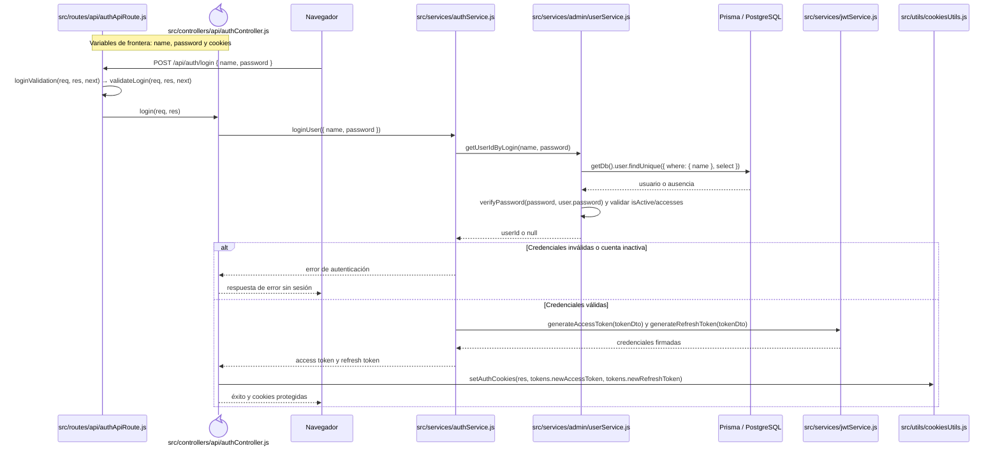

## `CU-AUT-02`

**Patrones:** `BE-P08`.

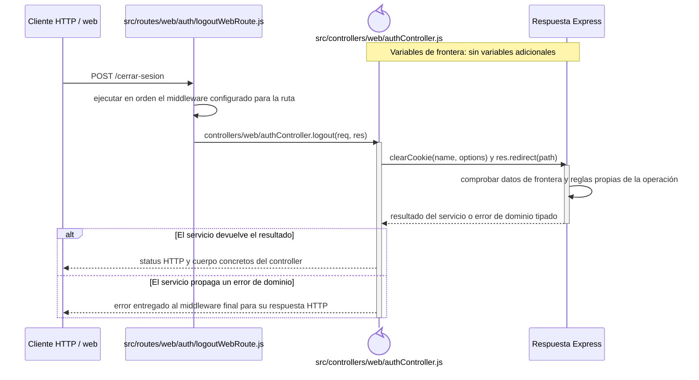

## `CU-IDA-01`

**Patrones:** `BE-P01`.

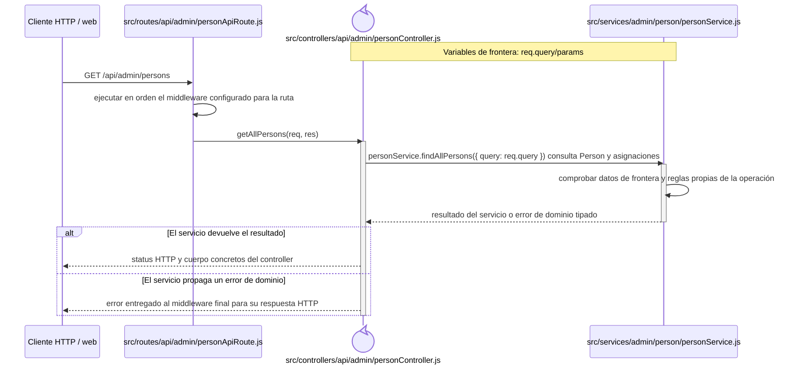

## `CU-IDA-02`

**Patrones:** `BE-P01`, `BE-P03`, `BE-P04`.

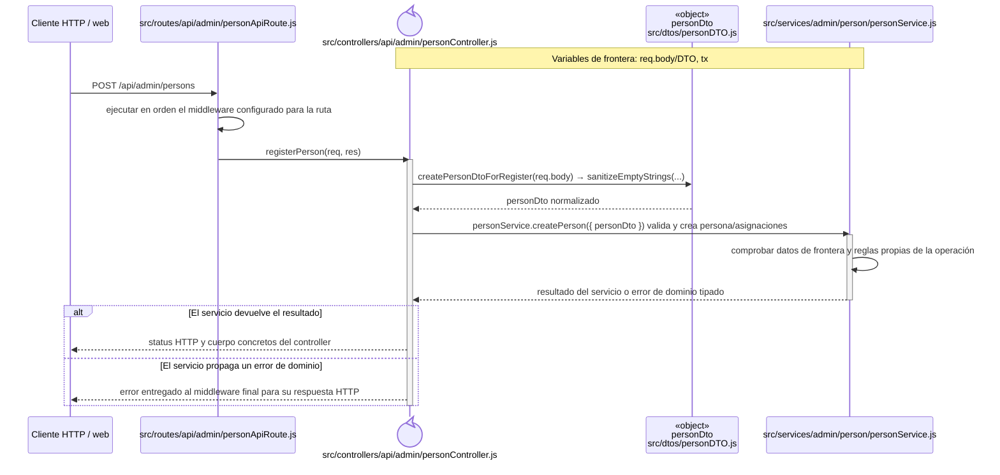

## `CU-IDA-03`

**Patrones:** `BE-P01`, `BE-P03`, `BE-P04`.

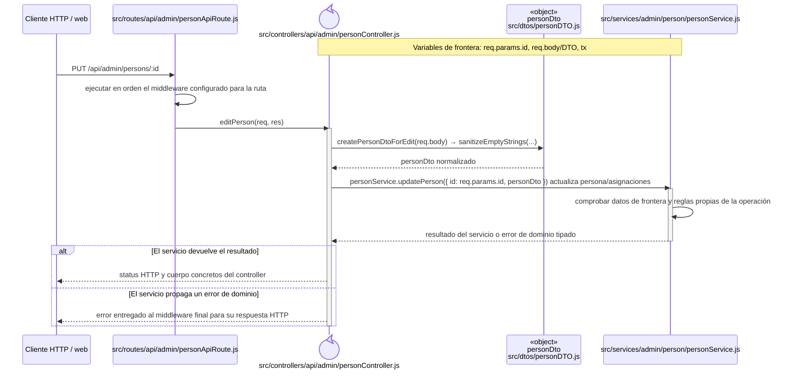

## `CU-IDA-04`

**Patrones:** `BE-P01`.

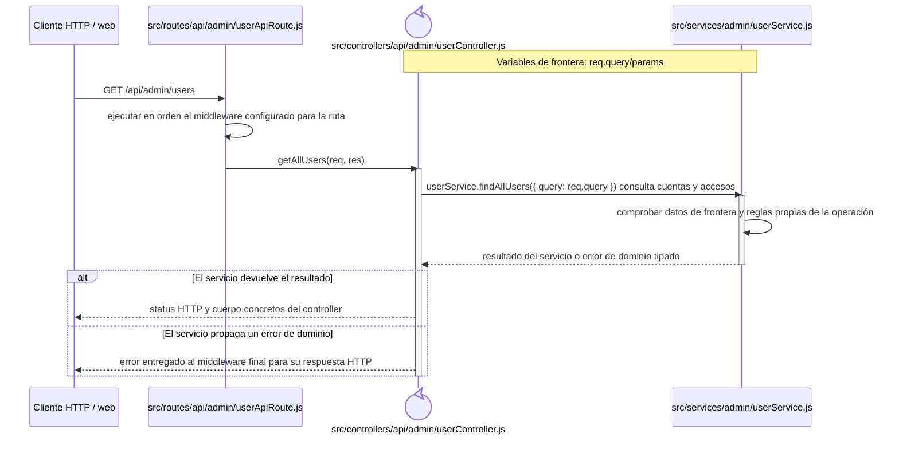

## `CU-IDA-05`

**Patrones:** `BE-P01`, `BE-P03`, `BE-P04`.

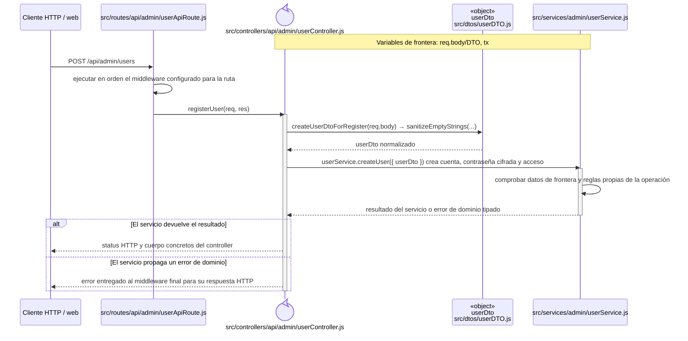

## `CU-IDA-06`

**Patrones:** `BE-P01`, `BE-P03`, `BE-P04`.


## `CU-IDA-07`

**Patrones:** `BE-P01`.

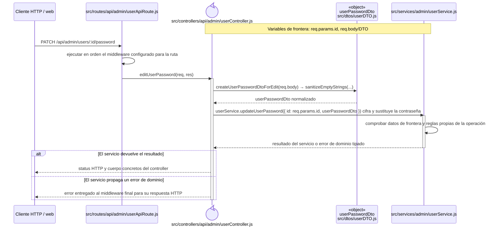

## `CU-IDA-08`

**Patrones:** `BE-P02`.

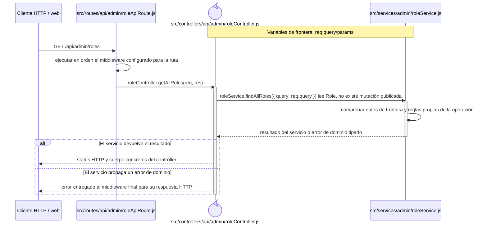

## `CU-IDA-09`

**Patrones:** `BE-P02`.

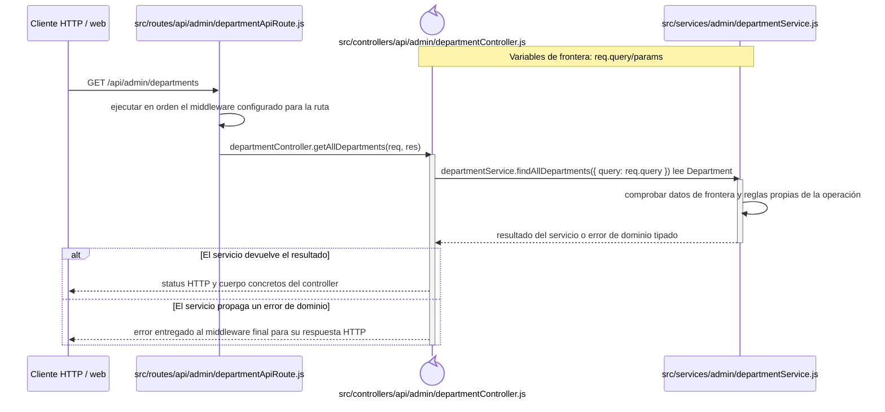

## `CU-CAT-01`

**Patrones:** `BE-P01`.

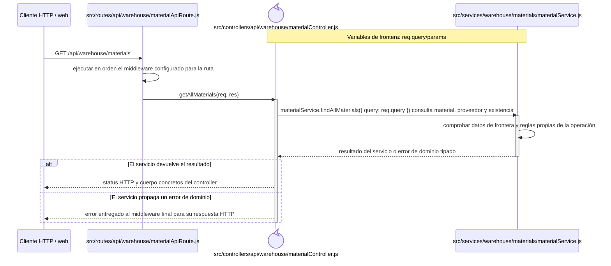

## `CU-CAT-02`

**Patrones:** `BE-P01`, `BE-P03`, `BE-P04`.

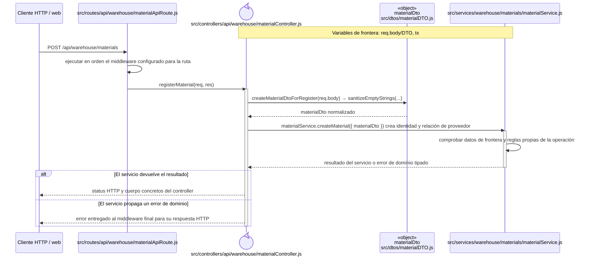

## `CU-CAT-03`

**Patrones:** `BE-P01`, `BE-P03`, `BE-P04`.

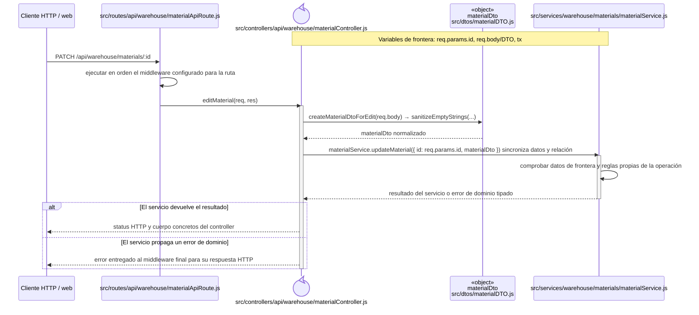

## `CU-CAT-04`

**Patrones:** `BE-P01`, `BE-P03`, `BE-P04`.


## `CU-CAT-05`

**Patrones:** `BE-P01`, `BE-P03`, `BE-P04`, `BE-P05`.

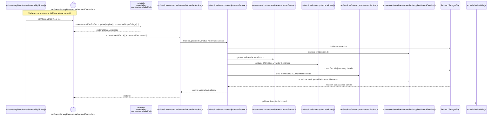

## `CU-CAT-06`

**Patrones:** `BE-P01`.

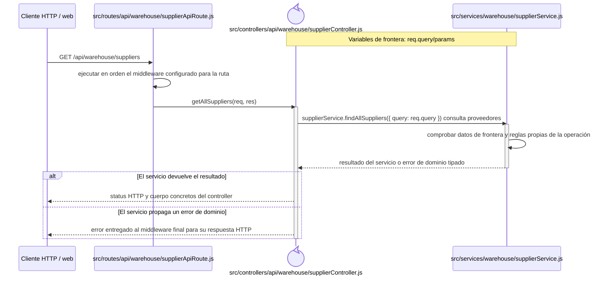

## `CU-CAT-07`

**Patrones:** `BE-P01`.

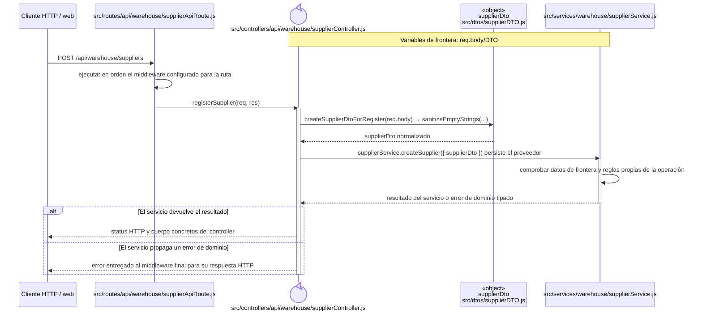

## `CU-CAT-08`

**Patrones:** `BE-P01`.

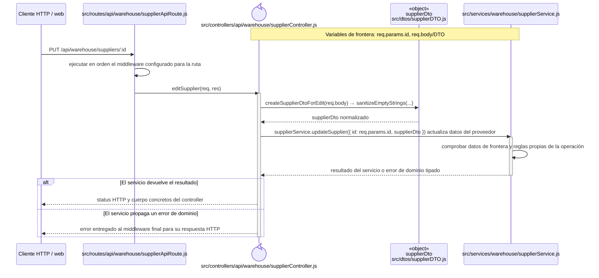

## `CU-CAT-09`

**Patrones:** `BE-P01`.

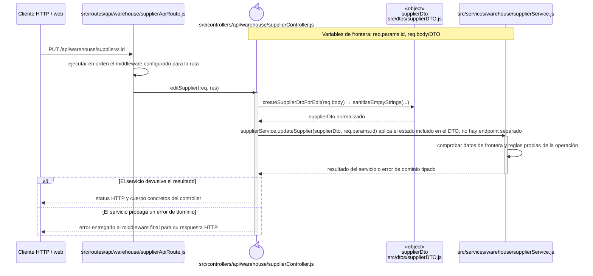

## `CU-CAT-10`

**Patrones:** `BE-P01`.

```mermaid
sequenceDiagram
    participant Client as Cliente HTTP / web
    participant Route as src/routes/api/sales/clientApiRoute.js
    participant Controller@{ "type": "control" } as src/controllers/api/sales/clientController.js
    participant Domain as src/services/sales/clientService.js
    Note over Controller,Domain: Variables de frontera: req.query/params

    Client->>Route: GET /api/sales/clients
    Route->>Route: ejecutar en orden el middleware configurado para la ruta
    Route->>Controller: getAllClients(req, res)
    activate Controller
    Controller->>Domain: clientService.findAllClients({ query: req.query }) consulta Client
    activate Domain
    Domain->>Domain: comprobar datos de frontera y reglas propias de la operación
    Domain-->>Controller: resultado del servicio o error de dominio tipado
    deactivate Domain
    alt El servicio devuelve el resultado
        Controller-->>Client: status HTTP y cuerpo concretos del controller
    else El servicio propaga un error de dominio
        Controller-->>Client: error entregado al middleware final para su respuesta HTTP
    end
    deactivate Controller
```

## `CU-CAT-11`

**Patrones:** `BE-P01`.

```mermaid
sequenceDiagram
    participant Client as Cliente HTTP / web
    participant Route as src/routes/api/sales/clientApiRoute.js
    participant Controller@{ "type": "control" } as src/controllers/api/sales/clientController.js
    participant ClientDto as «object»<br/>clientDto<br/>src/dtos/clientDTO.js
    participant Domain as src/services/sales/clientService.js
    Note over Controller,Domain: Variables de frontera: req.body/DTO

    Client->>Route: POST /api/sales/clients
    Route->>Route: ejecutar en orden el middleware configurado para la ruta
    Route->>Controller: registerClient(req, res)
    activate Controller
    Controller->>ClientDto: createClientDtoForRegister(req.body) → sanitizeEmptyStrings(...)
    ClientDto-->>Controller: clientDto normalizado
    Controller->>Domain: clientService.createClient({ clientDto }) persiste Client
    activate Domain
    Domain->>Domain: comprobar datos de frontera y reglas propias de la operación
    Domain-->>Controller: resultado del servicio o error de dominio tipado
    deactivate Domain
    alt El servicio devuelve el resultado
        Controller-->>Client: status HTTP y cuerpo concretos del controller
    else El servicio propaga un error de dominio
        Controller-->>Client: error entregado al middleware final para su respuesta HTTP
    end
    deactivate Controller
```

## `CU-CAT-12`

**Patrones:** `BE-P01`.

```mermaid
sequenceDiagram
    participant Client as Cliente HTTP / web
    participant Route as src/routes/api/sales/clientApiRoute.js
    participant Controller@{ "type": "control" } as src/controllers/api/sales/clientController.js
    participant ClientDto as «object»<br/>clientDto<br/>src/dtos/clientDTO.js
    participant Domain as src/services/sales/clientService.js
    Note over Controller,Domain: Variables de frontera: req.params.id, req.body/DTO

    Client->>Route: PUT /api/sales/clients/:id
    Route->>Route: ejecutar en orden el middleware configurado para la ruta
    Route->>Controller: editClient(req, res)
    activate Controller
    Controller->>ClientDto: createClientDtoForEdit(req.body) → sanitizeEmptyStrings(...)
    ClientDto-->>Controller: clientDto normalizado
    Controller->>Domain: clientService.updateClient({ id: req.params.id, clientDto }) actualiza Client
    activate Domain
    Domain->>Domain: comprobar datos de frontera y reglas propias de la operación
    Domain-->>Controller: resultado del servicio o error de dominio tipado
    deactivate Domain
    alt El servicio devuelve el resultado
        Controller-->>Client: status HTTP y cuerpo concretos del controller
    else El servicio propaga un error de dominio
        Controller-->>Client: error entregado al middleware final para su respuesta HTTP
    end
    deactivate Controller
```

## `CU-CAT-13`

**Patrones:** `BE-P01`.

```mermaid
sequenceDiagram
    participant Client as Cliente HTTP / web
    participant Route as src/routes/api/warehouse/wasteApiRoute.js
    participant Controller@{ "type": "control" } as src/controllers/api/warehouse/wasteController.js
    participant Domain as src/services/warehouse/wastes/wasteService.js
    Note over Controller,Domain: Variables de frontera: req.query/params

    Client->>Route: GET /api/warehouse/wastes
    Route->>Route: ejecutar en orden el middleware configurado para la ruta
    Route->>Controller: getAllWastes(req, res)
    activate Controller
    Controller->>Domain: wasteService.findAllWastes({ query: req.query }) consulta merma e inventario
    activate Domain
    Domain->>Domain: comprobar datos de frontera y reglas propias de la operación
    Domain-->>Controller: resultado del servicio o error de dominio tipado
    deactivate Domain
    alt El servicio devuelve el resultado
        Controller-->>Client: status HTTP y cuerpo concretos del controller
    else El servicio propaga un error de dominio
        Controller-->>Client: error entregado al middleware final para su respuesta HTTP
    end
    deactivate Controller
```

## `CU-CAT-14`

**Patrones:** `BE-P01`, `BE-P03`, `BE-P04`, `BE-P05`.

```mermaid
sequenceDiagram
    participant Client as Cliente HTTP / web
    participant Route as src/routes/api/warehouse/wasteApiRoute.js
    participant Controller@{ "type": "control" } as src/controllers/api/warehouse/wasteController.js
    participant WasteDto as «object»<br/>wasteDto<br/>src/dtos/wasteDTO.js
    participant Domain as src/services/warehouse/wastes/wasteMaterialService.js<br/>src/services/warehouse/wastes/wasteService.js
    Note over Controller,Domain: Variables de frontera: req.body/DTO, req.query/params, tx

    Client->>Route: GET /api/warehouse/wastes/material-templates y POST /api/warehouse/wastes
    Route->>Route: ejecutar en orden el middleware configurado para la ruta
    Route->>Controller: getWasteMaterialTemplates(req, res)/registerWaste
    activate Controller
    Controller->>WasteDto: createWasteDtoForRegister(req.body) → sanitizeEmptyStrings(...)
    WasteDto-->>Controller: wasteDto normalizado
    Controller->>Domain: findWasteMaterialTemplates({ wasteDto }) alimenta la selección y createWasteWithInitialStockAdjustment crea merma, ajuste y movimiento inicial
    activate Domain
    Domain->>Domain: comprobar datos de frontera y reglas propias de la operación
    Domain-->>Controller: resultado del servicio o error de dominio tipado
    deactivate Domain
    alt El servicio devuelve el resultado
        Controller-->>Client: status HTTP y cuerpo concretos del controller
    else El servicio propaga un error de dominio
        Controller-->>Client: error entregado al middleware final para su respuesta HTTP
    end
    deactivate Controller
```

## `CU-CAT-15`

**Patrones:** `BE-P01`.

```mermaid
sequenceDiagram
    participant Client as Cliente HTTP / web
    participant Route as src/routes/api/warehouse/wasteApiRoute.js
    participant Controller@{ "type": "control" } as src/controllers/api/warehouse/wasteController.js
    participant WasteDto as «object»<br/>wasteDto<br/>src/dtos/wasteDTO.js
    participant Domain as src/services/warehouse/wastes/wasteService.js
    Note over Controller,Domain: Variables de frontera: req.params.id, req.body/DTO

    Client->>Route: PATCH /api/warehouse/wastes/:id
    Route->>Route: ejecutar en orden el middleware configurado para la ruta
    Route->>Controller: editWaste(req, res)
    activate Controller
    Controller->>WasteDto: createWasteDtoForEdit(req.body) → sanitizeEmptyStrings(...)
    WasteDto-->>Controller: wasteDto normalizado
    Controller->>Domain: wasteService.updateWaste({ id: req.params.id, wasteDto }) actualiza datos sin tratar stock como edición
    activate Domain
    Domain->>Domain: comprobar datos de frontera y reglas propias de la operación
    Domain-->>Controller: resultado del servicio o error de dominio tipado
    deactivate Domain
    alt El servicio devuelve el resultado
        Controller-->>Client: status HTTP y cuerpo concretos del controller
    else El servicio propaga un error de dominio
        Controller-->>Client: error entregado al middleware final para su respuesta HTTP
    end
    deactivate Controller
```

## `CU-CAT-16`

**Patrones:** `BE-P01`, `BE-P03`, `BE-P04`, `BE-P05`.

```mermaid
sequenceDiagram
    Note over Router,Controller: Variables de frontera: id, DTO de ajuste y userId
    participant Router as src/routes/api/warehouse/wasteApiRoute.js
    participant Controller@{ "type": "control" } as src/controllers/api/warehouse/wasteController.js
    participant StockDto as «object»<br/>wasteStockDto<br/>src/dtos/wasteDTO.js
    participant Service as src/services/warehouse/wastes/wasteService.js
    participant Adjustment as src/services/warehouse/wastes/wasteStockAdjustmentService.js
    participant Reference as src/services/document/referenceNumberService.js
    participant Stock as src/services/inventory/stockHelpers.js
    participant Movement as src/services/warehouse/wastes/wasteMovementService.js
    participant Prisma as Prisma / PostgreSQL
    participant Socket as src/utils/socketUtils.js

    Router->>Controller: editWasteStock(req, res)
    Controller->>StockDto: createWasteDtoForStockUpdate(req.body) → sanitizeEmptyStrings(...)
    StockDto-->>Controller: wasteStockDto normalizado
    Controller->>Service: updateWasteStock({ id, wasteStockDto, userId })
    Service->>Prisma: iniciar $transaction
    Service->>Prisma: cargar Waste vigente
    Service->>Adjustment: merma, motivo y nueva existencia con tx
    Adjustment->>Stock: calcular diferencias y validar existencia
    Adjustment->>Reference: generar referencia anual con tx
    Adjustment->>Prisma: crear WasteStockAdjustment y detalle
    Adjustment->>Movement: crear WasteMovement ADJUSTMENT con tx
    Adjustment->>Prisma: enlazar movimiento y actualizar Waste
    Prisma-->>Service: merma actualizada y commit
    Service-->>Controller: waste
    Controller->>Socket: publicar después del commit
```

## `CU-CAT-17`

**Patrones:** `BE-P02`.

```mermaid
sequenceDiagram
    participant Client as Cliente HTTP / web
    participant Route as src/routes/api/warehouse/presentationApiRoute.js
    participant Controller@{ "type": "control" } as src/controllers/api/warehouse/presentationController.js
    participant Domain as src/services/warehouse/presentationService.js
    Note over Controller,Domain: Variables de frontera: req.query/params

    Client->>Route: GET /api/warehouse/presentations
    Route->>Route: ejecutar en orden el middleware configurado para la ruta
    Route->>Controller: getAllPresentations(req, res)
    activate Controller
    Controller->>Domain: presentationService.findAllPresentations({ query: req.query }) sirve el catálogo de sólo lectura
    activate Domain
    Domain->>Domain: comprobar datos de frontera y reglas propias de la operación
    Domain-->>Controller: resultado del servicio o error de dominio tipado
    deactivate Domain
    alt El servicio devuelve el resultado
        Controller-->>Client: status HTTP y cuerpo concretos del controller
    else El servicio propaga un error de dominio
        Controller-->>Client: error entregado al middleware final para su respuesta HTTP
    end
    deactivate Controller
```

## `CU-CAT-18`

**Patrones:** `BE-P02`.

```mermaid
sequenceDiagram
    participant Client as Cliente HTTP / web
    participant Route as src/routes/api/warehouse/unitMeasureApiRoute.js
    participant Controller@{ "type": "control" } as src/controllers/api/warehouse/unitMeasureController.js
    participant Domain as src/services/warehouse/unitMeasureService.js
    Note over Controller,Domain: Variables de frontera: req.query/params

    Client->>Route: GET /api/warehouse/unit-measures
    Route->>Route: ejecutar en orden el middleware configurado para la ruta
    Route->>Controller: getAllUnitMeasures(req, res)
    activate Controller
    Controller->>Domain: unitMeasureService.findAllUnitMeasures({ query: req.query }) sirve el catálogo de sólo lectura
    activate Domain
    Domain->>Domain: comprobar datos de frontera y reglas propias de la operación
    Domain-->>Controller: resultado del servicio o error de dominio tipado
    deactivate Domain
    alt El servicio devuelve el resultado
        Controller-->>Client: status HTTP y cuerpo concretos del controller
    else El servicio propaga un error de dominio
        Controller-->>Client: error entregado al middleware final para su respuesta HTTP
    end
    deactivate Controller
```

## `CU-CAT-19`

**Patrones:** `BE-P02`.

```mermaid
sequenceDiagram
    participant Client as Cliente HTTP / web
    participant Route as src/routes/api/warehouse/reasonApiRoute.js
    participant Controller@{ "type": "control" } as src/controllers/api/warehouse/reasonController.js
    participant Domain as src/services/warehouse/reasonService.js
    Note over Controller,Domain: Variables de frontera: req.query/params

    Client->>Route: GET /api/warehouse/reasons
    Route->>Route: ejecutar en orden el middleware configurado para la ruta
    Route->>Controller: getAllReasons(req, res)
    activate Controller
    Controller->>Domain: reasonService.findAllReasons({ query: req.query }) sirve motivos, helpers resuelven motivos internos
    activate Domain
    Domain->>Domain: comprobar datos de frontera y reglas propias de la operación
    Domain-->>Controller: resultado del servicio o error de dominio tipado
    deactivate Domain
    alt El servicio devuelve el resultado
        Controller-->>Client: status HTTP y cuerpo concretos del controller
    else El servicio propaga un error de dominio
        Controller-->>Client: error entregado al middleware final para su respuesta HTTP
    end
    deactivate Controller
```

## `CU-CAT-20`

**Patrones:** `BE-P02`.

```mermaid
sequenceDiagram
    participant Client as Cliente HTTP / web
    participant Route as src/routes/api/warehouse/fulfillmentStatusApiRoute.js
    participant Controller@{ "type": "control" } as src/controllers/api/warehouse/fulfillmentStatusController.js
    participant Domain as src/services/warehouse/fulfillmentStatusService.js
    Note over Controller,Domain: Variables de frontera: req.query/params

    Client->>Route: GET /api/warehouse/fulfillment-statuses
    Route->>Route: ejecutar en orden el middleware configurado para la ruta
    Route->>Controller: getAllFulfillmentStatuses(req, res)
    activate Controller
    Controller->>Domain: fulfillmentStatusService.findAllFulfillmentStatuses({ query: req.query }) sirve estados de sólo lectura
    activate Domain
    Domain->>Domain: comprobar datos de frontera y reglas propias de la operación
    Domain-->>Controller: resultado del servicio o error de dominio tipado
    deactivate Domain
    alt El servicio devuelve el resultado
        Controller-->>Client: status HTTP y cuerpo concretos del controller
    else El servicio propaga un error de dominio
        Controller-->>Client: error entregado al middleware final para su respuesta HTTP
    end
    deactivate Controller
```

## `CU-ENT-01`

**Patrones:** `BE-P01`.

```mermaid
sequenceDiagram
    participant Client as Cliente HTTP / web
    participant Route as src/routes/api/warehouse/goodsReceiptApiRoute.js
    participant Controller@{ "type": "control" } as src/controllers/api/warehouse/goodsReceiptController.js
    participant Domain as src/services/warehouse/goodsReceipts/goodsReceiptService.js
    Note over Controller,Domain: Variables de frontera: req.query/params

    Client->>Route: GET /api/warehouse/goods-receipts
    Route->>Route: ejecutar en orden el middleware configurado para la ruta
    Route->>Controller: getAllGoodsReceipts(req, res)
    activate Controller
    Controller->>Domain: goodsReceiptService.findAllGoodsReceipts({ query: req.query }) consulta entradas y totales
    activate Domain
    Domain->>Domain: comprobar datos de frontera y reglas propias de la operación
    Domain-->>Controller: resultado del servicio o error de dominio tipado
    deactivate Domain
    alt El servicio devuelve el resultado
        Controller-->>Client: status HTTP y cuerpo concretos del controller
    else El servicio propaga un error de dominio
        Controller-->>Client: error entregado al middleware final para su respuesta HTTP
    end
    deactivate Controller
```

## `CU-ENT-02`

**Patrones:** `BE-P01`, `BE-P03`, `BE-P04`, `BE-P05`.

```mermaid
sequenceDiagram
    Note over Router,Controller: Variables de frontera: goodsReceiptDto y tx
    participant Browser as Navegador
    participant Router as src/routes/api/warehouse/goodsReceiptApiRoute.js
    participant Controller@{ "type": "control" } as src/controllers/api/warehouse/goodsReceiptController.js
    participant ReceiptDto as «object»<br/>goodsReceiptDto<br/>src/dtos/goodsReceiptDTO.js
    participant Service as src/services/warehouse/goodsReceipts/goodsReceiptService.js
    participant Reference as src/services/document/referenceNumberService.js
    participant DetailBuilder as src/services/warehouse/goodsReceipts/goodsReceiptHelpers.js
    participant Inventory as src/services/inventory/movementService.js
    participant Prisma as Prisma / PostgreSQL
    participant Socket as src/utils/socketUtils.js

    Browser->>Router: POST /api/warehouse/goods-receipts
    Router->>Router: autenticar, validar y autorizar
    Router->>Controller: req, res
    Controller->>ReceiptDto: createGoodsReceiptDtoForRegister(req.body) → sanitizeEmptyStrings(...)
    ReceiptDto-->>Controller: goodsReceiptDto
    Controller->>Service: { goodsReceiptDto }
    Service->>Prisma: validar proveedor, factura y persona receptora
    Service->>DetailBuilder: construir detalles y calcular totales
    Service->>Prisma: iniciar $transaction
    Service->>Reference: generar referencia anual con tx
    Service->>Prisma: crear encabezado, detalles y totales
    Service->>Inventory: applyInventoryMovement({ tx, ENTRY, details })
    Inventory->>Prisma: incrementar existencias y crear movimiento
    Prisma-->>Service: entrada confirmada y commit
    Service-->>Controller: goodsReceipt
    Controller->>Socket: emitInventoryUpdated(...)
    Controller-->>Browser: 200 { goodsReceipt, code }
```

## `CU-ENT-03`

**Patrones:** `BE-P01`, `BE-P03`, `BE-P04`, `BE-P05`.

```mermaid
sequenceDiagram
    participant Client as Cliente HTTP / web
    participant Route as src/routes/api/warehouse/goodsReceiptApiRoute.js
    participant Controller@{ "type": "control" } as src/controllers/api/warehouse/goodsReceiptController.js
    participant ReceiptDto as «object»<br/>goodsReceiptDto<br/>src/dtos/goodsReceiptDTO.js
    participant Domain as src/services/warehouse/goodsReceipts/goodsReceiptService.js
    Note over Controller,Domain: Variables de frontera: req.params.id, req.body/DTO, tx

    Client->>Route: PATCH /api/warehouse/goods-receipts/:id
    Route->>Route: ejecutar en orden el middleware configurado para la ruta
    Route->>Controller: editGoodsReceiptHeader(req, res)
    activate Controller
    Controller->>ReceiptDto: createGoodsReceiptDtoForEdit(req.body) → sanitizeEmptyStrings(...)
    ReceiptDto-->>Controller: goodsReceiptDto normalizado
    Controller->>Domain: goodsReceiptService.updateGoodsReceipt({ id: req.params.id, goodsReceiptDto }) conserva detalles persistidos y actualiza encabezado permitido
    activate Domain
    Domain->>Domain: comprobar datos de frontera y reglas propias de la operación
    Domain-->>Controller: resultado del servicio o error de dominio tipado
    deactivate Domain
    alt El servicio devuelve el resultado
        Controller-->>Client: status HTTP y cuerpo concretos del controller
    else El servicio propaga un error de dominio
        Controller-->>Client: error entregado al middleware final para su respuesta HTTP
    end
    deactivate Controller
```

## `CU-ENT-04`

**Patrones:** `BE-P01`, `BE-P03`, `BE-P04`, `BE-P05`.

```mermaid
sequenceDiagram
    Note over Router,Controller: Variables de frontera: id, detailId, correctionDto, userId y tx
    participant Router as src/routes/api/warehouse/goodsReceiptApiRoute.js
    participant Controller@{ "type": "control" } as src/controllers/api/warehouse/goodsReceiptController.js
    participant CorrectionDto as «object»<br/>correctionDto<br/>src/dtos/goodsReceiptDTO.js
    participant Service as src/services/warehouse/goodsReceipts/detailChanges/goodsReceiptCorrectionService.js
    participant Change as src/services/warehouse/goodsReceipts/detailChanges/goodsReceiptDetailChangeService.js
    participant Reason as src/services/warehouse/reasonService.js
    participant Inventory as src/services/inventory/movementService.js
    participant Prisma as Prisma / PostgreSQL
    participant Socket as src/utils/socketUtils.js

    Router->>Controller: correctGoodsReceiptDetail(req, res)
    Controller->>CorrectionDto: createGoodsReceiptDtoForCorrection(req.body) → sanitizeEmptyStrings(...)
    CorrectionDto-->>Controller: correctionDto normalizado
    Controller->>Service: correctGoodsReceiptDetailLine({ id, detailId, correctionDto, userId })
    Service->>Prisma: iniciar $transaction
    Service->>Change: localizar detalle activo con tx
    Service->>Reason: obtener motivo de corrección con tx
    Service->>Change: calcular diferencia y actualizar detalle/totales
    Change->>Inventory: crear movimiento y actualizar stock con tx
    Service->>Change: guardar historia anterior/corregida y actor
    Prisma-->>Service: entrada corregida y commit
    Service-->>Controller: goodsReceipt y correction
    Controller->>Socket: publicar después del commit
```

## `CU-ENT-05`

**Patrones:** `BE-P01`, `BE-P03`, `BE-P04`, `BE-P05`.

```mermaid
sequenceDiagram
    participant Client as Cliente HTTP / web
    participant Route as src/routes/api/warehouse/goodsReceiptApiRoute.js
    participant Controller@{ "type": "control" } as src/controllers/api/warehouse/goodsReceiptController.js
    participant Domain as src/services/warehouse/goodsReceipts/detailChanges/goodsReceiptCancellationService.js
    Note over Controller,Domain: Variables de frontera: req.params.id, req.params.detailId, req.user.id y tx

    Client->>Route: PATCH /api/warehouse/goods-receipts/:id/details/:detailId/cancel
    Route->>Route: ejecutar en orden el middleware configurado para la ruta
    Route->>Controller: cancelGoodsReceiptDetail(req, res)
    activate Controller
    Controller->>Domain: cancelGoodsReceiptDetailLine({ id: req.params.id, detailId: req.params.detailId, userId: req.user.id }) revierte stock/movimiento y conserva historial
    activate Domain
    Domain->>Domain: comprobar datos de frontera y reglas propias de la operación
    Domain-->>Controller: resultado del servicio o error de dominio tipado
    deactivate Domain
    alt El servicio devuelve el resultado
        Controller-->>Client: status HTTP y cuerpo concretos del controller
    else El servicio propaga un error de dominio
        Controller-->>Client: error entregado al middleware final para su respuesta HTTP
    end
    deactivate Controller
```

## `CU-SAL-01`

**Patrones:** `BE-P01`.

```mermaid
sequenceDiagram
    participant Client as Cliente HTTP / web
    participant Route as src/routes/api/warehouse/goodsIssueApiRoute.js
    participant Controller@{ "type": "control" } as src/controllers/api/warehouse/goodsIssueController.js
    participant Domain as src/services/warehouse/goodsIssues/goodsIssueService.js
    Note over Controller,Domain: Variables de frontera: req.query/params

    Client->>Route: GET /api/warehouse/goods-issues
    Route->>Route: ejecutar en orden el middleware configurado para la ruta
    Route->>Controller: getAllGoodsIssues(req, res)
    activate Controller
    Controller->>Domain: goodsIssueService.findAllGoodsIssues({ query: req.query }) consulta documentos y estados
    activate Domain
    Domain->>Domain: comprobar datos de frontera y reglas propias de la operación
    Domain-->>Controller: resultado del servicio o error de dominio tipado
    deactivate Domain
    alt El servicio devuelve el resultado
        Controller-->>Client: status HTTP y cuerpo concretos del controller
    else El servicio propaga un error de dominio
        Controller-->>Client: error entregado al middleware final para su respuesta HTTP
    end
    deactivate Controller
```

## `CU-SAL-02`

**Patrones:** `BE-P01`, `BE-P03`, `BE-P04`.

```mermaid
sequenceDiagram
    participant Client as Cliente HTTP / web
    participant Route as src/routes/api/warehouse/goodsIssueApiRoute.js
    participant Controller@{ "type": "control" } as src/controllers/api/warehouse/goodsIssueController.js
    participant IssueDto as «object»<br/>goodsIssueDto<br/>src/dtos/goodsIssueDTO.js
    participant Domain as src/services/warehouse/goodsIssues/goodsIssueService.js
    Note over Controller,Domain: Variables de frontera: req.body/DTO, tx

    Client->>Route: POST /api/warehouse/goods-issues
    Route->>Route: ejecutar en orden el middleware configurado para la ruta
    Route->>Controller: registerGoodsIssue(req, res)
    activate Controller
    Controller->>IssueDto: createGoodsIssueDtoForRegister(req.body) → sanitizeEmptyStrings(...)
    IssueDto-->>Controller: goodsIssueDto normalizado
    Controller->>Domain: goodsIssueService.createGoodsIssue({ goodsIssueDto }) crea encabezado y detalles solicitados
    activate Domain
    Domain->>Domain: comprobar datos de frontera y reglas propias de la operación
    Domain-->>Controller: resultado del servicio o error de dominio tipado
    deactivate Domain
    alt El servicio devuelve el resultado
        Controller-->>Client: status HTTP y cuerpo concretos del controller
    else El servicio propaga un error de dominio
        Controller-->>Client: error entregado al middleware final para su respuesta HTTP
    end
    deactivate Controller
```

## `CU-SAL-03`

**Patrones:** `BE-P01`, `BE-P04`.

```mermaid
sequenceDiagram
    participant Client as Cliente HTTP / web
    participant Route as src/routes/api/warehouse/goodsIssueApiRoute.js
    participant Controller@{ "type": "control" } as src/controllers/api/warehouse/goodsIssueController.js
    participant IssueDto as «object»<br/>goodsIssueDto<br/>src/dtos/goodsIssueDTO.js
    participant Domain as src/services/warehouse/goodsIssues/goodsIssueService.js
    Note over Controller,Domain: Variables de frontera: req.params.id, req.body/DTO

    Client->>Route: PATCH /api/warehouse/goods-issues/:id/header
    Route->>Route: ejecutar en orden el middleware configurado para la ruta
    Route->>Controller: editGoodsIssueHeader(req, res)
    activate Controller
    Controller->>IssueDto: createGoodsIssueHeaderDtoForEdit(req.body) → sanitizeEmptyStrings(...)
    IssueDto-->>Controller: goodsIssueDto normalizado
    Controller->>Domain: goodsIssueService.updateGoodsIssueHeader({ id: req.params.id, goodsIssueDto }) aplica reglas del encabezado
    activate Domain
    Domain->>Domain: comprobar datos de frontera y reglas propias de la operación
    Domain-->>Controller: resultado del servicio o error de dominio tipado
    deactivate Domain
    alt El servicio devuelve el resultado
        Controller-->>Client: status HTTP y cuerpo concretos del controller
    else El servicio propaga un error de dominio
        Controller-->>Client: error entregado al middleware final para su respuesta HTTP
    end
    deactivate Controller
```

## `CU-SAL-04`

**Patrones:** `BE-P01`, `BE-P03`, `BE-P04`, `BE-P05`.

```mermaid
sequenceDiagram
    participant Client as Cliente HTTP / web
    participant Route as src/routes/api/warehouse/goodsIssueApiRoute.js
    participant Controller@{ "type": "control" } as src/controllers/api/warehouse/goodsIssueController.js
    participant IssueDto as «object»<br/>goodsIssueDto<br/>src/dtos/goodsIssueDTO.js
    participant Domain as src/services/warehouse/goodsIssues/goodsIssueService.js
    Note over Controller,Domain: Variables de frontera: req.params.id, req.body/DTO, tx

    Client->>Route: PATCH /api/warehouse/goods-issues/:id/details
    Route->>Route: ejecutar en orden el middleware configurado para la ruta
    Route->>Controller: editGoodsIssueDetails(req, res)
    activate Controller
    Controller->>IssueDto: createGoodsIssueDetailsDtoForEdit(req.body) → sanitizeEmptyStrings(...)
    IssueDto-->>Controller: goodsIssueDto normalizado
    Controller->>Domain: goodsIssueService.updateGoodsIssueDetails({ id: req.params.id, goodsIssueDto }) modifica cantidades todavía editables
    activate Domain
    Domain->>Domain: comprobar datos de frontera y reglas propias de la operación
    Domain-->>Controller: resultado del servicio o error de dominio tipado
    deactivate Domain
    alt El servicio devuelve el resultado
        Controller-->>Client: status HTTP y cuerpo concretos del controller
    else El servicio propaga un error de dominio
        Controller-->>Client: error entregado al middleware final para su respuesta HTTP
    end
    deactivate Controller
```

## `CU-SAL-05`

**Patrones:** `BE-P01`, `BE-P03`, `BE-P04`, `BE-P05`.

```mermaid
sequenceDiagram
    autonumber
    Note over Router,Controller: Variables de frontera: id, details, goodsIssueDto, userId y tx
    participant Browser as Navegador
    participant Router as src/routes/api/warehouse/goodsIssueApiRoute.js
    participant Controller@{ "type": "control" } as src/controllers/api/warehouse/goodsIssueController.js
    participant IssueDto as «object»<br/>goodsIssueDto<br/>src/dtos/goodsIssueDTO.js
    participant Service as src/services/warehouse/goodsIssues/goodsIssueService.js
    participant Inventory as src/services/inventory/movementService.js
    participant Prisma as Prisma / PostgreSQL
    participant Socket as src/utils/socketUtils.js

    Browser->>Router: PATCH /:id/details
    Router->>Router: autenticar, validar y autorizar
    Router->>Controller: req, res
    Controller->>IssueDto: createGoodsIssueDetailsDtoForEdit(req.body) → sanitizeEmptyStrings(...)
    IssueDto-->>Controller: { details }
    Controller->>Service: { id, goodsIssueDto }
    Service->>Prisma: cargar salida y detalles
    Service->>Service: validar estado y calcular pendientes
    Service->>Prisma: iniciar $transaction
    opt Hay detalles por surtir
        Service->>Inventory: applyInventoryMovement({ tx, ISSUE, details })
        Inventory->>Prisma: descontar existencias y registrar movimiento
    end
    Service->>Prisma: actualizar detalles y estado del encabezado
    Prisma-->>Service: salida actualizada y commit
    Service-->>Controller: goodsIssue
    Controller->>Socket: emitInventoryUpdated(...)
    Controller-->>Browser: 200 { goodsIssue, code }
```

## `CU-SAL-06`

**Patrones:** `BE-P01`, `BE-P03`, `BE-P04`, `BE-P05`.

```mermaid
sequenceDiagram
    Note over Router,Controller: Variables de frontera: id, detailId, returnDto, userId y tx
    participant Browser as Navegador
    participant Router as src/routes/api/warehouse/goodsIssueApiRoute.js
    participant Controller@{ "type": "control" } as src/controllers/api/warehouse/goodsIssueController.js
    participant ReturnDto as «object»<br/>returnDto<br/>src/dtos/goodsIssueDTO.js
    participant Service as src/services/warehouse/goodsIssues/detailReturns/goodsIssueReturnService.js
    participant Inventory as src/services/inventory/movementService.js
    participant Status as src/services/warehouse/issues/issueFulfillmentRules.js
    participant Prisma as Prisma / PostgreSQL
    participant Socket as src/utils/socketUtils.js

    Browser->>Router: PATCH /:id/details/:detailId/returns
    Router->>Router: autenticar, validar y autorizar
    Router->>Controller: req, res
    Controller->>ReturnDto: createGoodsIssueDtoForReturn(req.body) → sanitizeEmptyStrings(...)
    ReturnDto-->>Controller: returnDto normalizado
    Controller->>Service: returnGoodsIssueDetail({ id, detailId, returnDto, userId })
    Service->>Prisma: getDb().$transaction(async tx)
    Service->>Prisma: cargar salida y detalle surtido
    Service->>Service: validar estado, cantidad surtida y devoluciones previas
    alt Cantidad no retornable
        Service-->>Service: error de dominio
        Service-->>Controller: rollback y error
    else Cantidad válida
        Service->>Inventory: incrementar existencia y crear movimiento inverso con tx
        Service->>Prisma: crear GoodsIssueReturn
        Service->>Status: resolveIssueFulfillmentStatus(refreshedDetails)
        Prisma-->>Service: salida actualizada y commit
        Service-->>Controller: salida y devolución
        Controller->>Socket: publicar después del commit
        Controller-->>Browser: 200 { goodsIssueReturn, code }
    end
```

## `CU-SAL-07`

**Patrones:** `BE-P01`.

```mermaid
sequenceDiagram
    participant Client as Cliente HTTP / web
    participant Route as src/routes/api/warehouse/wasteIssueApiRoute.js
    participant Controller@{ "type": "control" } as src/controllers/api/warehouse/wasteIssueController.js
    participant Domain as src/services/warehouse/wasteIssues/wasteIssueService.js
    Note over Controller,Domain: Variables de frontera: req.query/params

    Client->>Route: GET /api/warehouse/waste-issues
    Route->>Route: ejecutar en orden el middleware configurado para la ruta
    Route->>Controller: getAllWasteIssues(req, res)
    activate Controller
    Controller->>Domain: wasteIssueService.findAllWasteIssues({ query: req.query }) consulta salidas de merma
    activate Domain
    Domain->>Domain: comprobar datos de frontera y reglas propias de la operación
    Domain-->>Controller: resultado del servicio o error de dominio tipado
    deactivate Domain
    alt El servicio devuelve el resultado
        Controller-->>Client: status HTTP y cuerpo concretos del controller
    else El servicio propaga un error de dominio
        Controller-->>Client: error entregado al middleware final para su respuesta HTTP
    end
    deactivate Controller
```

## `CU-SAL-08`

**Patrones:** `BE-P01`, `BE-P03`, `BE-P04`.

```mermaid
sequenceDiagram
    participant Client as Cliente HTTP / web
    participant Route as src/routes/api/warehouse/wasteIssueApiRoute.js
    participant Controller@{ "type": "control" } as src/controllers/api/warehouse/wasteIssueController.js
    participant IssueDto as «object»<br/>wasteIssueDto<br/>src/dtos/wasteIssueDTO.js
    participant Domain as src/services/warehouse/wasteIssues/wasteIssueService.js
    Note over Controller,Domain: Variables de frontera: req.body/DTO, tx

    Client->>Route: POST /api/warehouse/waste-issues
    Route->>Route: ejecutar en orden el middleware configurado para la ruta
    Route->>Controller: registerWasteIssue(req, res)
    activate Controller
    Controller->>IssueDto: createWasteIssueDtoForRegister(req.body) → sanitizeEmptyStrings(...)
    IssueDto-->>Controller: wasteIssueDto normalizado
    Controller->>Domain: wasteIssueService.createWasteIssue({ wasteIssueDto }) crea encabezado y detalles de merma
    activate Domain
    Domain->>Domain: comprobar datos de frontera y reglas propias de la operación
    Domain-->>Controller: resultado del servicio o error de dominio tipado
    deactivate Domain
    alt El servicio devuelve el resultado
        Controller-->>Client: status HTTP y cuerpo concretos del controller
    else El servicio propaga un error de dominio
        Controller-->>Client: error entregado al middleware final para su respuesta HTTP
    end
    deactivate Controller
```

## `CU-SAL-09`

**Patrones:** `BE-P01`, `BE-P04`.

```mermaid
sequenceDiagram
    participant Client as Cliente HTTP / web
    participant Route as src/routes/api/warehouse/wasteIssueApiRoute.js
    participant Controller@{ "type": "control" } as src/controllers/api/warehouse/wasteIssueController.js
    participant IssueDto as «object»<br/>wasteIssueDto<br/>src/dtos/wasteIssueDTO.js
    participant Domain as src/services/warehouse/wasteIssues/wasteIssueService.js
    Note over Controller,Domain: Variables de frontera: req.params.id, req.body/DTO

    Client->>Route: PATCH /api/warehouse/waste-issues/:id/header
    Route->>Route: ejecutar en orden el middleware configurado para la ruta
    Route->>Controller: editWasteIssueHeader(req, res)
    activate Controller
    Controller->>IssueDto: createWasteIssueHeaderDtoForEdit(req.body) → sanitizeEmptyStrings(...)
    IssueDto-->>Controller: wasteIssueDto normalizado
    Controller->>Domain: wasteIssueService.updateWasteIssueHeader({ id: req.params.id, wasteIssueDto }) aplica reglas del encabezado
    activate Domain
    Domain->>Domain: comprobar datos de frontera y reglas propias de la operación
    Domain-->>Controller: resultado del servicio o error de dominio tipado
    deactivate Domain
    alt El servicio devuelve el resultado
        Controller-->>Client: status HTTP y cuerpo concretos del controller
    else El servicio propaga un error de dominio
        Controller-->>Client: error entregado al middleware final para su respuesta HTTP
    end
    deactivate Controller
```

## `CU-SAL-10`

**Patrones:** `BE-P01`, `BE-P03`, `BE-P04`, `BE-P05`.

```mermaid
sequenceDiagram
    participant Client as Cliente HTTP / web
    participant Route as src/routes/api/warehouse/wasteIssueApiRoute.js
    participant Controller@{ "type": "control" } as src/controllers/api/warehouse/wasteIssueController.js
    participant IssueDto as «object»<br/>wasteIssueDto<br/>src/dtos/wasteIssueDTO.js
    participant Domain as src/services/warehouse/wasteIssues/wasteIssueService.js
    Note over Controller,Domain: Variables de frontera: req.params.id, req.body/DTO, tx

    Client->>Route: PATCH /api/warehouse/waste-issues/:id/details
    Route->>Route: ejecutar en orden el middleware configurado para la ruta
    Route->>Controller: editWasteIssueDetails(req, res)
    activate Controller
    Controller->>IssueDto: createWasteIssueDetailsDtoForEdit(req.body) → sanitizeEmptyStrings(...)
    IssueDto-->>Controller: wasteIssueDto normalizado
    Controller->>Domain: wasteIssueService.updateWasteIssueDetails({ id: req.params.id, wasteIssueDto }) modifica cantidades editables
    activate Domain
    Domain->>Domain: comprobar datos de frontera y reglas propias de la operación
    Domain-->>Controller: resultado del servicio o error de dominio tipado
    deactivate Domain
    alt El servicio devuelve el resultado
        Controller-->>Client: status HTTP y cuerpo concretos del controller
    else El servicio propaga un error de dominio
        Controller-->>Client: error entregado al middleware final para su respuesta HTTP
    end
    deactivate Controller
```

## `CU-SAL-11`

**Patrones:** `BE-P01`, `BE-P03`, `BE-P04`, `BE-P05`.

```mermaid
sequenceDiagram
    Note over Router,Controller: Variables de frontera: id, details, isSupplied y tx
    participant Router as src/routes/api/warehouse/wasteIssueApiRoute.js
    participant Controller@{ "type": "control" } as src/controllers/api/warehouse/wasteIssueController.js
    participant IssueDto as «object»<br/>wasteIssueDto<br/>src/dtos/wasteIssueDTO.js
    participant Service as src/services/warehouse/wasteIssues/wasteIssueService.js
    participant Rules as src/services/warehouse/issues/issueFulfillmentRules.js
    participant Movement as src/services/warehouse/wastes/wasteMovementService.js
    participant Stock as src/services/warehouse/wastes/wasteInventoryService.js
    participant Status as src/services/warehouse/wasteIssues/wasteIssueFulfillmentService.js
    participant Prisma as Prisma / PostgreSQL
    participant Socket as src/utils/socketUtils.js

    Router->>Controller: editWasteIssueDetails(req, res)
    Controller->>IssueDto: createWasteIssueDetailsDtoForEdit(req.body) → sanitizeEmptyStrings(...)
    IssueDto-->>Controller: wasteIssueDto normalizado
    Controller->>Service: updateWasteIssueDetails({ id, details: wasteIssueDto.details })
    Service->>Prisma: iniciar $transaction y cargar salida/detalles
    Service->>Service: validar estado, ids únicos y detalles vigentes
    Service->>Status: resolver ids de cumplimiento con tx
    loop Cada detalle nuevo con isSupplied
        Service->>Rules: derivar estado completo del detalle
        Service->>Prisma: guardar surtido total y cantidades de proyecto
        Service->>Movement: agregar cantidad pendiente al movimiento
        Movement->>Stock: descontar existencia y cantidad convertida con tx
    end
    Movement->>Prisma: crear WasteMovement ISSUE si hubo surtimiento
    Service->>Rules: derivar cumplimiento del encabezado
    Service->>Prisma: actualizar WasteIssue y commit
    Service-->>Controller: wasteIssue actualizado
    Controller->>Socket: publicar después del commit
```

## `CU-SAL-12`

**Patrones:** `BE-P01`, `BE-P03`, `BE-P04`, `BE-P05`.

```mermaid
sequenceDiagram
    Note over Router,Controller: Variables de frontera: id, detailId, returnDto, userId y tx
    participant Router as src/routes/api/warehouse/wasteIssueApiRoute.js
    participant Controller@{ "type": "control" } as src/controllers/api/warehouse/wasteIssueController.js
    participant ReturnDto as «object»<br/>returnDto<br/>src/dtos/wasteIssueDTO.js
    participant Service as src/services/warehouse/wasteIssues/detailReturns/wasteIssueReturnService.js
    participant Status as src/services/warehouse/wasteIssues/wasteIssueFulfillmentService.js
    participant Prisma as Prisma / PostgreSQL
    participant Socket as src/utils/socketUtils.js

    Router->>Controller: registerWasteIssueDetailReturn(req, res)
    Controller->>ReturnDto: createWasteIssueDtoForReturn(req.body) → sanitizeEmptyStrings(...)
    ReturnDto-->>Controller: returnDto normalizado
    Controller->>Service: returnWasteIssueDetail({ id, detailId, returnDto, userId })
    Service->>Prisma: iniciar $transaction
    Service->>Prisma: cargar WasteIssue y WasteIssueDetail surtido
    Service->>Service: validar estado, cantidad surtida y devoluciones previas
    alt Cantidad de merma no retornable
        Service-->>Service: error de dominio
        Service-->>Controller: rollback y error
    else Cantidad válida
        Service->>Service: aplicar devolución de existencia de merma con tx
        Service->>Prisma: crear WasteIssueReturn
        Service->>Status: recalcular detalle y encabezado con tx
        Prisma-->>Service: salida de merma actualizada y commit
        Service-->>Controller: wasteIssueReturn
        Controller->>Socket: publicar después del commit
    end
```

## `CU-REP-01`

**Patrones:** `BE-P06`.

```mermaid
sequenceDiagram
    participant Client as Cliente HTTP / web
    participant Route as src/routes/api/warehouse/materialApiRoute.js
    participant Controller@{ "type": "control" } as src/controllers/api/warehouse/materialController.js
    participant Domain as src/services/warehouse/materials/materialService.js
    Note over Controller,Domain: Variables de frontera: req.query/params

    Client->>Route: GET /api/warehouse/materials
    Route->>Route: ejecutar en orden el middleware configurado para la ruta
    Route->>Controller: getAllMaterials(req, res)
    activate Controller
    Controller->>Domain: findAllMaterials({ query: req.query })
    activate Domain
    Domain->>Domain: comprobar datos de frontera y reglas propias de la operación
    Domain-->>Controller: resultado del servicio o error de dominio tipado
    deactivate Domain
    alt El servicio devuelve el resultado
        Controller-->>Client: status HTTP y cuerpo concretos del controller
    else El servicio propaga un error de dominio
        Controller-->>Client: error entregado al middleware final para su respuesta HTTP
    end
    deactivate Controller
```

## `CU-REP-02`

**Patrones:** `BE-P06`.

```mermaid
sequenceDiagram
    participant Client as Cliente HTTP / web
    participant Route as src/routes/api/admin/movementApiRoute.js
    participant Controller@{ "type": "control" } as src/controllers/api/admin/movementController.js
    participant Domain as src/services/inventory/movementQueryService.js
    Note over Controller,Domain: Variables de frontera: req.query/params

    Client->>Route: GET /api/admin/movements/materials
    Route->>Route: ejecutar en orden el middleware configurado para la ruta
    Route->>Controller: getAllMaterialMovements(req, res)
    activate Controller
    Controller->>Domain: findAllMaterialMovements(getMovementListParams(req))
    activate Domain
    Domain->>Domain: comprobar datos de frontera y reglas propias de la operación
    Domain-->>Controller: resultado del servicio o error de dominio tipado
    deactivate Domain
    alt El servicio devuelve el resultado
        Controller-->>Client: status HTTP y cuerpo concretos del controller
    else El servicio propaga un error de dominio
        Controller-->>Client: error entregado al middleware final para su respuesta HTTP
    end
    deactivate Controller
```

## `CU-REP-03`

**Patrones:** `BE-P07`.

```mermaid
sequenceDiagram
    participant Client as Cliente HTTP / web
    participant Route as src/routes/api/warehouse/reportApiRoute.js
    participant Controller@{ "type": "control" } as src/controllers/api/warehouse/reportController.js
    participant Domain as src/services/warehouse/reportService.js<br/>src/utils/reportExcelUtils.js
    Note over Controller,Domain: Variables de frontera: req.query/params

    Client->>Route: GET /api/warehouse/reports/inventory/excel
    Route->>Route: ejecutar en orden el middleware configurado para la ruta
    Route->>Controller: exportWarehouseReportExcel(req, res)
    activate Controller
    Controller->>Domain: reportService.findWarehouseReportRows({ query: req.query }) y sendExcelReport
    activate Domain
    Domain->>Domain: comprobar datos de frontera y reglas propias de la operación
    Domain-->>Controller: resultado del servicio o error de dominio tipado
    deactivate Domain
    alt El servicio devuelve el resultado
        Controller-->>Client: status HTTP y cuerpo concretos del controller
    else El servicio propaga un error de dominio
        Controller-->>Client: error entregado al middleware final para su respuesta HTTP
    end
    deactivate Controller
```

## `CU-REP-04`

**Patrones:** `BE-P07`.

```mermaid
sequenceDiagram
    participant Client as Cliente HTTP / web
    participant Route as src/routes/api/warehouse/reportApiRoute.js
    participant Controller@{ "type": "control" } as src/controllers/api/warehouse/reportController.js
    participant Domain as src/services/warehouse/reportService.js<br/>src/utils/reportExcelUtils.js
    Note over Controller,Domain: Variables de frontera: req.query/params

    Client->>Route: GET /api/warehouse/reports/goods-issues/excel
    Route->>Route: ejecutar en orden el middleware configurado para la ruta
    Route->>Controller: exportGoodsIssueReportExcel(req, res)
    activate Controller
    Controller->>Domain: reportService.findGoodsIssueReportRows({ query: req.query }) y sendExcelReport
    activate Domain
    Domain->>Domain: comprobar datos de frontera y reglas propias de la operación
    Domain-->>Controller: resultado del servicio o error de dominio tipado
    deactivate Domain
    alt El servicio devuelve el resultado
        Controller-->>Client: status HTTP y cuerpo concretos del controller
    else El servicio propaga un error de dominio
        Controller-->>Client: error entregado al middleware final para su respuesta HTTP
    end
    deactivate Controller
```

## `CU-REP-05`

**Patrones:** `BE-P07`.

```mermaid
sequenceDiagram
    participant Client as Cliente HTTP / web
    participant Route as src/routes/api/admin/reportApiRoute.js
    participant Controller@{ "type": "control" } as src/controllers/api/admin/reportController.js
    participant Domain as src/services/inventory/reportService.js
    Note over Controller,Domain: Variables de frontera: req.query/params

    Client->>Route: GET /api/admin/reports/movements/materials/excel
    Route->>Route: ejecutar en orden el middleware configurado para la ruta
    Route->>Controller: exportMovementReport(req, res)
    activate Controller
    Controller->>Domain: findMovementReportRows({ context: 'materials', ...getMovementReportParams(req.query) })
    activate Domain
    Domain->>Domain: comprobar datos de frontera y reglas propias de la operación
    Domain-->>Controller: resultado del servicio o error de dominio tipado
    deactivate Domain
    alt El servicio devuelve el resultado
        Controller-->>Client: status HTTP y cuerpo concretos del controller
    else El servicio propaga un error de dominio
        Controller-->>Client: error entregado al middleware final para su respuesta HTTP
    end
    deactivate Controller
```

## `CU-REP-06`

**Patrones:** `BE-P06`.

```mermaid
sequenceDiagram
    participant Client as Cliente HTTP / web
    participant Route as src/routes/api/warehouse/wasteApiRoute.js
    participant Controller@{ "type": "control" } as src/controllers/api/warehouse/wasteController.js
    participant Domain as src/services/warehouse/wastes/wasteService.js
    Note over Controller,Domain: Variables de frontera: req.query/params

    Client->>Route: GET /api/warehouse/wastes
    Route->>Route: ejecutar en orden el middleware configurado para la ruta
    Route->>Controller: getAllWastes(req, res)
    activate Controller
    Controller->>Domain: wasteService.findAllWastes({ query: req.query })
    activate Domain
    Domain->>Domain: comprobar datos de frontera y reglas propias de la operación
    Domain-->>Controller: resultado del servicio o error de dominio tipado
    deactivate Domain
    alt El servicio devuelve el resultado
        Controller-->>Client: status HTTP y cuerpo concretos del controller
    else El servicio propaga un error de dominio
        Controller-->>Client: error entregado al middleware final para su respuesta HTTP
    end
    deactivate Controller
```

## `CU-REP-07`

**Patrones:** `BE-P06`.

```mermaid
sequenceDiagram
    participant Client as Cliente HTTP / web
    participant Route as src/routes/api/admin/movementApiRoute.js
    participant Controller@{ "type": "control" } as src/controllers/api/admin/movementController.js
    participant Domain as src/services/inventory/movementQueryService.js
    Note over Controller,Domain: Variables de frontera: req.query/params

    Client->>Route: GET /api/admin/movements/wastes
    Route->>Route: ejecutar en orden el middleware configurado para la ruta
    Route->>Controller: getAllWasteMovements(req, res)
    activate Controller
    Controller->>Domain: findAllWasteMovements(getMovementListParams(req))
    activate Domain
    Domain->>Domain: comprobar datos de frontera y reglas propias de la operación
    Domain-->>Controller: resultado del servicio o error de dominio tipado
    deactivate Domain
    alt El servicio devuelve el resultado
        Controller-->>Client: status HTTP y cuerpo concretos del controller
    else El servicio propaga un error de dominio
        Controller-->>Client: error entregado al middleware final para su respuesta HTTP
    end
    deactivate Controller
```

## `CU-REP-08`

**Patrones:** `BE-P07`.

```mermaid
sequenceDiagram
    participant Client as Cliente HTTP / web
    participant Route as src/routes/api/warehouse/reportApiRoute.js
    participant Controller@{ "type": "control" } as src/controllers/api/warehouse/reportController.js
    participant Domain as src/services/warehouse/reportService.js<br/>src/utils/reportExcelUtils.js
    Note over Controller,Domain: Variables de frontera: req.query/params

    Client->>Route: GET /api/warehouse/reports/waste-issues/excel
    Route->>Route: ejecutar en orden el middleware configurado para la ruta
    Route->>Controller: exportWasteIssueReportExcel(req, res)
    activate Controller
    Controller->>Domain: reportService.findWasteIssueReportRows({ query: req.query }) y sendExcelReport
    activate Domain
    Domain->>Domain: comprobar datos de frontera y reglas propias de la operación
    Domain-->>Controller: resultado del servicio o error de dominio tipado
    deactivate Domain
    alt El servicio devuelve el resultado
        Controller-->>Client: status HTTP y cuerpo concretos del controller
    else El servicio propaga un error de dominio
        Controller-->>Client: error entregado al middleware final para su respuesta HTTP
    end
    deactivate Controller
```

## `CU-REP-09`

**Patrones:** `BE-P07`.

```mermaid
sequenceDiagram
    participant Client as Cliente HTTP / web
    participant Route as src/routes/api/warehouse/reportApiRoute.js
    participant Controller@{ "type": "control" } as src/controllers/api/warehouse/reportController.js
    participant Domain as src/services/warehouse/reportService.js<br/>src/utils/reportExcelUtils.js
    Note over Controller,Domain: Variables de frontera: req.query/params

    Client->>Route: GET /api/warehouse/reports/wastes/excel
    Route->>Route: ejecutar en orden el middleware configurado para la ruta
    Route->>Controller: exportWasteReportExcel(req, res)
    activate Controller
    Controller->>Domain: reportService.findWasteReportRows({ query: req.query }) y sendExcelReport
    activate Domain
    Domain->>Domain: comprobar datos de frontera y reglas propias de la operación
    Domain-->>Controller: resultado del servicio o error de dominio tipado
    deactivate Domain
    alt El servicio devuelve el resultado
        Controller-->>Client: status HTTP y cuerpo concretos del controller
    else El servicio propaga un error de dominio
        Controller-->>Client: error entregado al middleware final para su respuesta HTTP
    end
    deactivate Controller
```

## `CU-REP-10`

**Patrones:** `BE-P07`.

```mermaid
sequenceDiagram
    participant Client as Cliente HTTP / web
    participant Route as src/routes/api/admin/reportApiRoute.js
    participant Controller@{ "type": "control" } as src/controllers/api/admin/reportController.js
    participant Domain as src/services/inventory/reportService.js
    Note over Controller,Domain: Variables de frontera: req.query/params

    Client->>Route: GET /api/admin/reports/movements/wastes/excel
    Route->>Route: ejecutar en orden el middleware configurado para la ruta
    Route->>Controller: exportWasteMovementReport(req, res)
    activate Controller
    Controller->>Domain: findMovementReportRows({ context: 'wastes', ...getMovementReportParams(req.query) })
    activate Domain
    Domain->>Domain: comprobar datos de frontera y reglas propias de la operación
    Domain-->>Controller: resultado del servicio o error de dominio tipado
    deactivate Domain
    alt El servicio devuelve el resultado
        Controller-->>Client: status HTTP y cuerpo concretos del controller
    else El servicio propaga un error de dominio
        Controller-->>Client: error entregado al middleware final para su respuesta HTTP
    end
    deactivate Controller
```

## `CU-REP-11`

**Patrones:** `BE-P07`.

```mermaid
sequenceDiagram
    participant Client as Cliente HTTP / web
    participant Route as src/routes/api/warehouse/reportApiRoute.js
    participant Controller@{ "type": "control" } as src/controllers/api/warehouse/reportController.js
    participant Domain as src/services/warehouse/reportService.js<br/>src/utils/reportExcelUtils.js
    Note over Controller,Domain: Variables de frontera: req.query/params

    Client->>Route: GET /api/warehouse/reports/goods-receipts/excel
    Route->>Route: ejecutar en orden el middleware configurado para la ruta
    Route->>Controller: exportGoodsReceiptReportExcel(req, res)
    activate Controller
    Controller->>Domain: reportService.findGoodsReceiptReportRows({ query: req.query }) y sendExcelReport
    activate Domain
    Domain->>Domain: comprobar datos de frontera y reglas propias de la operación
    Domain-->>Controller: resultado del servicio o error de dominio tipado
    deactivate Domain
    alt El servicio devuelve el resultado
        Controller-->>Client: status HTTP y cuerpo concretos del controller
    else El servicio propaga un error de dominio
        Controller-->>Client: error entregado al middleware final para su respuesta HTTP
    end
    deactivate Controller
```

## `CU-REP-12`

**Patrones:** `BE-P07`.

```mermaid
sequenceDiagram
    participant Client as Cliente HTTP / web
    participant Route as src/routes/api/warehouse/reportApiRoute.js
    participant Controller@{ "type": "control" } as src/controllers/api/warehouse/reportController.js
    participant Domain as src/services/warehouse/reportService.js<br/>src/utils/reportExcelUtils.js
    Note over Controller,Domain: Variables de frontera: req.query/params

    Client->>Route: GET /api/warehouse/reports/suppliers/excel
    Route->>Route: ejecutar en orden el middleware configurado para la ruta
    Route->>Controller: exportSupplierReportExcel(req, res)
    activate Controller
    Controller->>Domain: reportService.findSupplierReportRows({ query: req.query }) y sendExcelReport
    activate Domain
    Domain->>Domain: comprobar datos de frontera y reglas propias de la operación
    Domain-->>Controller: resultado del servicio o error de dominio tipado
    deactivate Domain
    alt El servicio devuelve el resultado
        Controller-->>Client: status HTTP y cuerpo concretos del controller
    else El servicio propaga un error de dominio
        Controller-->>Client: error entregado al middleware final para su respuesta HTTP
    end
    deactivate Controller
```

## `CU-REP-13`

**Patrones:** `BE-P07`.

```mermaid
sequenceDiagram
    participant Client as Cliente HTTP / web
    participant Route as src/routes/api/sales/reportApiRoute.js
    participant Controller@{ "type": "control" } as src/controllers/api/sales/reportController.js
    participant Domain as src/services/sales/clientService.js<br/>src/utils/reportExcelUtils.js
    Note over Controller,Domain: Variables de frontera: req.query/params

    Client->>Route: GET /api/sales/reports/clients/excel
    Route->>Route: ejecutar en orden el middleware configurado para la ruta
    Route->>Controller: exportClientReport(req, res)
    activate Controller
    Controller->>Domain: clientService.findAllClients({ query: req.query }) prepara filas y el controller llama sendExcelReport
    activate Domain
    Domain->>Domain: comprobar datos de frontera y reglas propias de la operación
    Domain-->>Controller: resultado del servicio o error de dominio tipado
    deactivate Domain
    alt El servicio devuelve el resultado
        Controller-->>Client: status HTTP y cuerpo concretos del controller
    else El servicio propaga un error de dominio
        Controller-->>Client: error entregado al middleware final para su respuesta HTTP
    end
    deactivate Controller
```

## `CU-REP-14`

**Patrones:** `BE-P07`.

```mermaid
sequenceDiagram
    participant Client as Cliente HTTP / web
    participant Route as src/routes/api/admin/reportApiRoute.js
    participant Controller@{ "type": "control" } as src/controllers/api/admin/reportController.js
    participant Domain as src/services/admin/person/personService.js<br/>src/utils/reportExcelUtils.js
    Note over Controller,Domain: Variables de frontera: req.query/params

    Client->>Route: GET /api/admin/reports/persons/excel
    Route->>Route: ejecutar en orden el middleware configurado para la ruta
    Route->>Controller: exportPersonReport(req, res)
    activate Controller
    Controller->>Domain: personService.findAllPersons({ query: req.query }) prepara filas y el controller llama sendExcelReport
    activate Domain
    Domain->>Domain: comprobar datos de frontera y reglas propias de la operación
    Domain-->>Controller: resultado del servicio o error de dominio tipado
    deactivate Domain
    alt El servicio devuelve el resultado
        Controller-->>Client: status HTTP y cuerpo concretos del controller
    else El servicio propaga un error de dominio
        Controller-->>Client: error entregado al middleware final para su respuesta HTTP
    end
    deactivate Controller
```

## `CU-REP-15`

**Patrones:** `BE-P07`.

```mermaid
sequenceDiagram
    participant Client as Cliente HTTP / web
    participant Route as src/routes/api/admin/reportApiRoute.js
    participant Controller@{ "type": "control" } as src/controllers/api/admin/reportController.js
    participant Domain as src/services/admin/userService.js<br/>src/utils/reportExcelUtils.js
    Note over Controller,Domain: Variables de frontera: req.query/params

    Client->>Route: GET /api/admin/reports/users/excel
    Route->>Route: ejecutar en orden el middleware configurado para la ruta
    Route->>Controller: exportUserReport(req, res)
    activate Controller
    Controller->>Domain: userService.findAllUsers({ query: req.query }) prepara filas y el controller llama sendExcelReport
    activate Domain
    Domain->>Domain: comprobar datos de frontera y reglas propias de la operación
    Domain-->>Controller: resultado del servicio o error de dominio tipado
    deactivate Domain
    alt El servicio devuelve el resultado
        Controller-->>Client: status HTTP y cuerpo concretos del controller
    else El servicio propaga un error de dominio
        Controller-->>Client: error entregado al middleware final para su respuesta HTTP
    end
    deactivate Controller
```
