# Diagramas de secuencia del código backend

Esta colección **no es un catálogo de diagramas de casos de uso**. Es la lectura técnica
complementaria del catálogo funcional: cada `CU-*` sirve como vínculo de trazabilidad,
pero el bloque Mermaid describe cómo se ejecuta el código mediante endpoint, controller,
servicios, efectos y variables de frontera. Para comprender el objetivo con lenguaje de
negocio se consulta primero el [modelo y los diagramas funcionales de casos de uso](../requirements/domain-and-use-cases.md#casos-de-uso-vigentes).

La [matriz técnica de backend](backend-technical-documentation.md#aplicación-de-todos-los-casos-al-código-backend)
localiza la evidencia concreta. Los participantes identifican ruta de archivo y símbolo,
los mensajes conservan las llamadas en orden y las notas nombran datos que cruzan la
frontera (`req.params`, `req.body`/DTO, parámetros de consulta y `tx`). Las variables
locales mecánicas permanecen en el código para no convertir el diagrama en una
transcripción ilegible. Cada caso mantiene una secuencia específica aunque reutilice un
patrón, porque cambian módulos, firmas, rutas, datos o efectos.

## Índice rápido de patrones por caso

Cada caso conserva una línea **Patrones** con códigos de este índice y enlaza el
[catálogo canónico](design-and-construction-patterns.md#resumen-de-patrones-confirmados).
La referencia identifica las soluciones aplicadas sin repetirlas dentro de Mermaid. La
implementación se reconoce directamente por las rutas `src/...`, símbolos y llamadas
del recorrido concreto.

| Código | Patrón aplicado | Elementos que permiten reconocerlo |
| --- | --- | --- |
| `BE-P01` | Capas, pipeline y DTO funcional | Ruta/middleware → controller/DTO → servicio → Prisma; el DTO sólo aparece cuando hay entrada. |
| `BE-P02` | Factory de catálogo | `createDataTableListController` parametriza consulta, columnas y orden. |
| `BE-P03` | Transaction Script y `tx` explícito | El servicio propietario abre `$transaction` y propaga `tx` a las escrituras relacionadas. |
| `BE-P04` | Composición de servicios | El servicio del caso coordina reglas, referencias, inventario o cumplimiento reutilizados. |
| `BE-P05` | Publicación posterior al commit | El controller llama `emitInventoryUpdated` después del resultado del servicio. |
| `BE-P06` | Query Service | Controller de listado + consulta contextual de sólo lectura. |
| `BE-P07` | Composición de reporte | Consulta de dominio + `sendExcelReport`, sin modificar inventario. |
| `BE-P08` | Sesión web | Autenticación, JWT/cookies, cierre o redirección en la frontera web. |

### Cobertura de casos backend

La comparación con el catálogo y la matriz técnica confirma que cada identificador
aparece una vez, conserva su referencia de patrones y contiene un bloque Mermaid.

| Grupo | Rango cubierto | Diagramas | Estado |
| --- | --- | ---: | --- |
| Autenticación | `CU-AUT-01..02` | 2 | Completo |
| Identidad y acceso | `CU-IDA-01..09` | 9 | Completo |
| Catálogos | `CU-CAT-01..20` | 20 | Completo |
| Entradas | `CU-ENT-01..05` | 5 | Completo |
| Salidas | `CU-SAL-01..12` | 12 | Completo |
| Consultas y reportes | `CU-REP-01..15` | 15 | Completo |
| **Total** | `CU-AUT-01..CU-REP-15` | **63** | **63 de 63** |

## `CU-AUT-01`

**Identificador:** `DIA-BE-CU-AUT-01`. **Fuente:** fila `CU-AUT-01` de la matriz de aplicación al código backend.

**Patrones:** `BE-P01`, `BE-P08`.

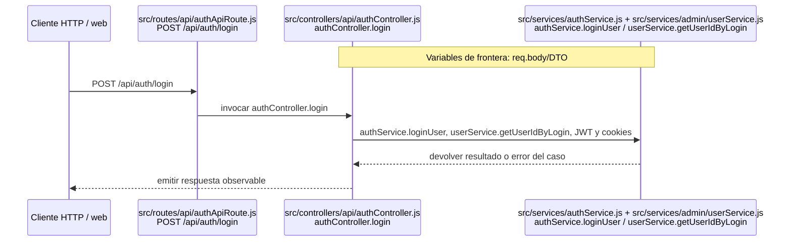

## `CU-AUT-02`

**Identificador:** `DIA-BE-CU-AUT-02`. **Fuente:** fila `CU-AUT-02` de la matriz de aplicación al código backend.

**Patrones:** `BE-P08`.

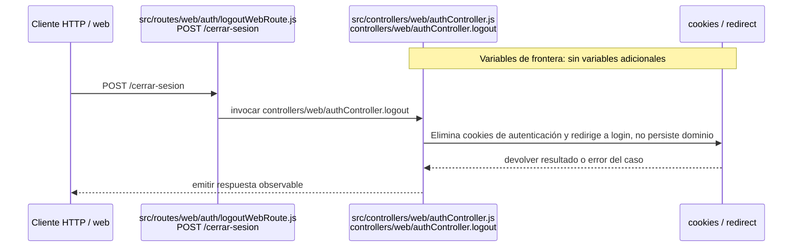

## `CU-IDA-01`

**Identificador:** `DIA-BE-CU-IDA-01`. **Fuente:** fila `CU-IDA-01` de la matriz de aplicación al código backend.

**Patrones:** `BE-P01`.

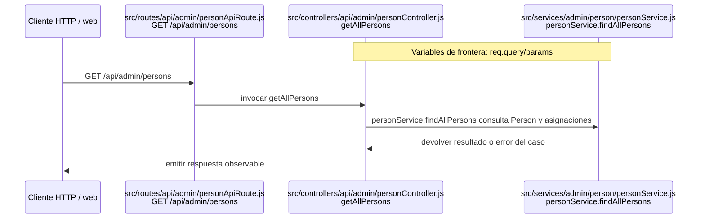

## `CU-IDA-02`

**Identificador:** `DIA-BE-CU-IDA-02`. **Fuente:** fila `CU-IDA-02` de la matriz de aplicación al código backend.

**Patrones:** `BE-P01`, `BE-P03`, `BE-P04`.


## `CU-IDA-03`

**Identificador:** `DIA-BE-CU-IDA-03`. **Fuente:** fila `CU-IDA-03` de la matriz de aplicación al código backend.

**Patrones:** `BE-P01`, `BE-P03`, `BE-P04`.


## `CU-IDA-04`

**Identificador:** `DIA-BE-CU-IDA-04`. **Fuente:** fila `CU-IDA-04` de la matriz de aplicación al código backend.

**Patrones:** `BE-P01`.


## `CU-IDA-05`

**Identificador:** `DIA-BE-CU-IDA-05`. **Fuente:** fila `CU-IDA-05` de la matriz de aplicación al código backend.

**Patrones:** `BE-P01`, `BE-P03`, `BE-P04`.

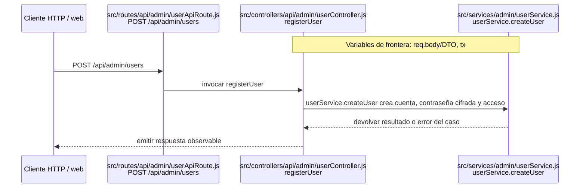

## `CU-IDA-06`

**Identificador:** `DIA-BE-CU-IDA-06`. **Fuente:** fila `CU-IDA-06` de la matriz de aplicación al código backend.

**Patrones:** `BE-P01`, `BE-P03`, `BE-P04`.


## `CU-IDA-07`

**Identificador:** `DIA-BE-CU-IDA-07`. **Fuente:** fila `CU-IDA-07` de la matriz de aplicación al código backend.

**Patrones:** `BE-P01`.

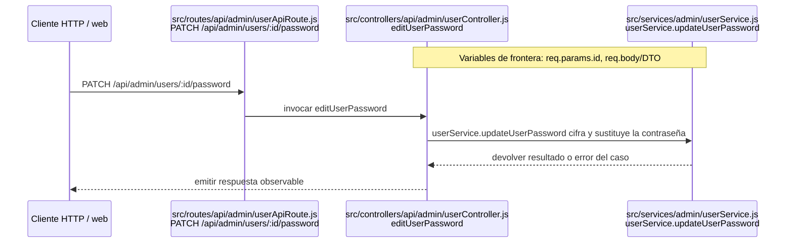

## `CU-IDA-08`

**Identificador:** `DIA-BE-CU-IDA-08`. **Fuente:** fila `CU-IDA-08` de la matriz de aplicación al código backend.

**Patrones:** `BE-P02`.

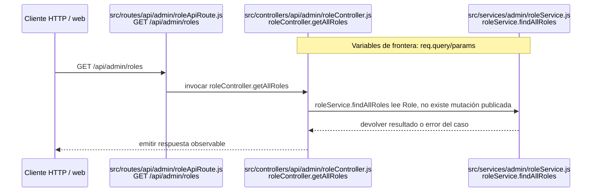

## `CU-IDA-09`

**Identificador:** `DIA-BE-CU-IDA-09`. **Fuente:** fila `CU-IDA-09` de la matriz de aplicación al código backend.

**Patrones:** `BE-P02`.

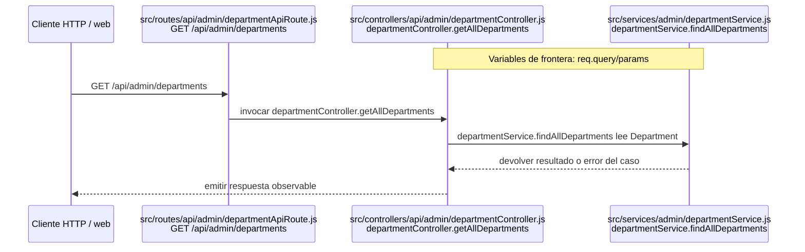

## `CU-CAT-01`

**Identificador:** `DIA-BE-CU-CAT-01`. **Fuente:** fila `CU-CAT-01` de la matriz de aplicación al código backend.

**Patrones:** `BE-P01`.

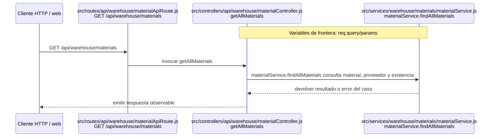

## `CU-CAT-02`

**Identificador:** `DIA-BE-CU-CAT-02`. **Fuente:** fila `CU-CAT-02` de la matriz de aplicación al código backend.

**Patrones:** `BE-P01`, `BE-P03`, `BE-P04`.


## `CU-CAT-03`

**Identificador:** `DIA-BE-CU-CAT-03`. **Fuente:** fila `CU-CAT-03` de la matriz de aplicación al código backend.

**Patrones:** `BE-P01`, `BE-P03`, `BE-P04`.


## `CU-CAT-04`

**Identificador:** `DIA-BE-CU-CAT-04`. **Fuente:** fila `CU-CAT-04` de la matriz de aplicación al código backend.

**Patrones:** `BE-P01`, `BE-P03`, `BE-P04`.

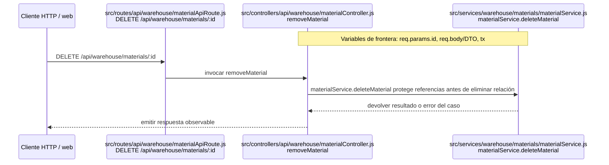

## `CU-CAT-05`

**Identificador:** `DIA-BE-CU-CAT-05`. **Fuente:** fila `CU-CAT-05` de la matriz de aplicación al código backend.

**Patrones:** `BE-P01`, `BE-P03`, `BE-P04`, `BE-P05`.

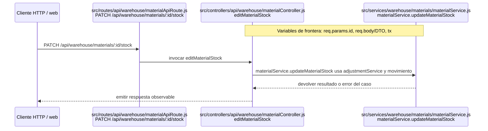

## `CU-CAT-06`

**Identificador:** `DIA-BE-CU-CAT-06`. **Fuente:** fila `CU-CAT-06` de la matriz de aplicación al código backend.

**Patrones:** `BE-P01`.


## `CU-CAT-07`

**Identificador:** `DIA-BE-CU-CAT-07`. **Fuente:** fila `CU-CAT-07` de la matriz de aplicación al código backend.

**Patrones:** `BE-P01`.

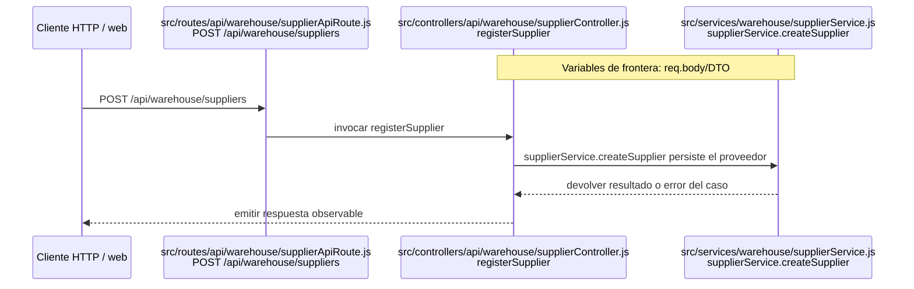

## `CU-CAT-08`

**Identificador:** `DIA-BE-CU-CAT-08`. **Fuente:** fila `CU-CAT-08` de la matriz de aplicación al código backend.

**Patrones:** `BE-P01`.

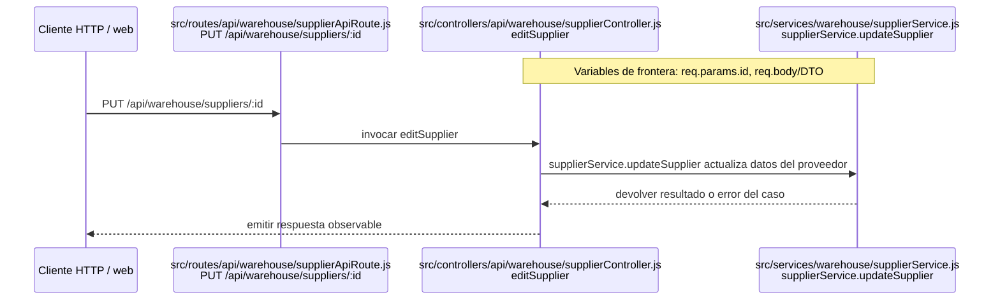

## `CU-CAT-09`

**Identificador:** `DIA-BE-CU-CAT-09`. **Fuente:** fila `CU-CAT-09` de la matriz de aplicación al código backend.

**Patrones:** `BE-P01`.

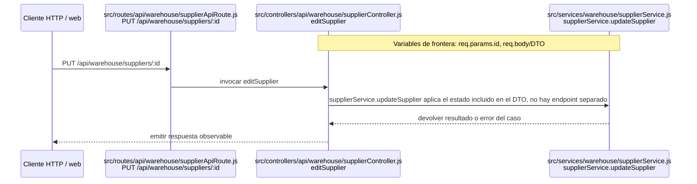

## `CU-CAT-10`

**Identificador:** `DIA-BE-CU-CAT-10`. **Fuente:** fila `CU-CAT-10` de la matriz de aplicación al código backend.

**Patrones:** `BE-P01`.

```mermaid
sequenceDiagram
    participant Client as Cliente HTTP / web
    participant Route as src/routes/api/sales/clientApiRoute.js<br/>GET /api/sales/clients
    participant Controller as src/controllers/api/sales/clientController.js<br/>getAllClients
    participant Domain as src/services/sales/clientService.js<br/>clientService.findAllClients
    Note over Controller,Domain: Variables de frontera: req.query/params

    Client->>Route: GET /api/sales/clients
    Route->>Controller: invocar getAllClients
    Controller->>Domain: clientService.findAllClients consulta Client
    Domain-->>Controller: devolver resultado o error del caso
    Controller-->>Client: emitir respuesta observable
```

## `CU-CAT-11`

**Identificador:** `DIA-BE-CU-CAT-11`. **Fuente:** fila `CU-CAT-11` de la matriz de aplicación al código backend.

**Patrones:** `BE-P01`.

```mermaid
sequenceDiagram
    participant Client as Cliente HTTP / web
    participant Route as src/routes/api/sales/clientApiRoute.js<br/>POST /api/sales/clients
    participant Controller as src/controllers/api/sales/clientController.js<br/>registerClient
    participant Domain as src/services/sales/clientService.js<br/>clientService.createClient
    Note over Controller,Domain: Variables de frontera: req.body/DTO

    Client->>Route: POST /api/sales/clients
    Route->>Controller: invocar registerClient
    Controller->>Domain: clientService.createClient persiste Client
    Domain-->>Controller: devolver resultado o error del caso
    Controller-->>Client: emitir respuesta observable
```

## `CU-CAT-12`

**Identificador:** `DIA-BE-CU-CAT-12`. **Fuente:** fila `CU-CAT-12` de la matriz de aplicación al código backend.

**Patrones:** `BE-P01`.

```mermaid
sequenceDiagram
    participant Client as Cliente HTTP / web
    participant Route as src/routes/api/sales/clientApiRoute.js<br/>PUT /api/sales/clients/:id
    participant Controller as src/controllers/api/sales/clientController.js<br/>editClient
    participant Domain as src/services/sales/clientService.js<br/>clientService.updateClient
    Note over Controller,Domain: Variables de frontera: req.params.id, req.body/DTO

    Client->>Route: PUT /api/sales/clients/:id
    Route->>Controller: invocar editClient
    Controller->>Domain: clientService.updateClient actualiza Client
    Domain-->>Controller: devolver resultado o error del caso
    Controller-->>Client: emitir respuesta observable
```

## `CU-CAT-13`

**Identificador:** `DIA-BE-CU-CAT-13`. **Fuente:** fila `CU-CAT-13` de la matriz de aplicación al código backend.

**Patrones:** `BE-P01`.

```mermaid
sequenceDiagram
    participant Client as Cliente HTTP / web
    participant Route as src/routes/api/warehouse/wasteApiRoute.js<br/>GET /api/warehouse/wastes
    participant Controller as src/controllers/api/warehouse/wasteController.js<br/>getAllWastes
    participant Domain as src/services/warehouse/wastes/wasteService.js<br/>wasteService.findAllWastes
    Note over Controller,Domain: Variables de frontera: req.query/params

    Client->>Route: GET /api/warehouse/wastes
    Route->>Controller: invocar getAllWastes
    Controller->>Domain: wasteService.findAllWastes consulta merma e inventario
    Domain-->>Controller: devolver resultado o error del caso
    Controller-->>Client: emitir respuesta observable
```

## `CU-CAT-14`

**Identificador:** `DIA-BE-CU-CAT-14`. **Fuente:** fila `CU-CAT-14` de la matriz de aplicación al código backend.

**Patrones:** `BE-P01`, `BE-P03`, `BE-P04`, `BE-P05`.

```mermaid
sequenceDiagram
    participant Client as Cliente HTTP / web
    participant Route as src/routes/api/warehouse/wasteApiRoute.js<br/>GET material-templates / POST wastes
    participant Controller as src/controllers/api/warehouse/wasteController.js<br/>getWasteMaterialTemplates / registerWaste
    participant Domain as src/services/warehouse/wastes/wasteMaterialService.js + src/services/warehouse/wastes/wasteService.js<br/>findWasteMaterialTemplates / createWasteWithInitialStockAdjustment
    Note over Controller,Domain: Variables de frontera: req.body/DTO, req.query/params, tx

    Client->>Route: GET /api/warehouse/wastes/material-templates y POST /api/warehouse/wastes
    Route->>Controller: invocar getWasteMaterialTemplates/registerWaste
    Controller->>Domain: findWasteMaterialTemplates alimenta la selección y createWasteWithInitialStockAdjustment crea merma, ajuste y movimiento inicial
    Domain-->>Controller: devolver resultado o error del caso
    Controller-->>Client: emitir respuesta observable
```

## `CU-CAT-15`

**Identificador:** `DIA-BE-CU-CAT-15`. **Fuente:** fila `CU-CAT-15` de la matriz de aplicación al código backend.

**Patrones:** `BE-P01`.

```mermaid
sequenceDiagram
    participant Client as Cliente HTTP / web
    participant Route as src/routes/api/warehouse/wasteApiRoute.js<br/>PATCH /api/warehouse/wastes/:id
    participant Controller as src/controllers/api/warehouse/wasteController.js<br/>editWaste
    participant Domain as src/services/warehouse/wastes/wasteService.js<br/>wasteService.updateWaste
    Note over Controller,Domain: Variables de frontera: req.params.id, req.body/DTO

    Client->>Route: PATCH /api/warehouse/wastes/:id
    Route->>Controller: invocar editWaste
    Controller->>Domain: wasteService.updateWaste actualiza datos sin tratar stock como edición
    Domain-->>Controller: devolver resultado o error del caso
    Controller-->>Client: emitir respuesta observable
```

## `CU-CAT-16`

**Identificador:** `DIA-BE-CU-CAT-16`. **Fuente:** fila `CU-CAT-16` de la matriz de aplicación al código backend.

**Patrones:** `BE-P01`, `BE-P03`, `BE-P04`, `BE-P05`.

```mermaid
sequenceDiagram
    participant Client as Cliente HTTP / web
    participant Route as src/routes/api/warehouse/wasteApiRoute.js<br/>PATCH /api/warehouse/wastes/:id/stock
    participant Controller as src/controllers/api/warehouse/wasteController.js<br/>editWasteStock
    participant Domain as src/services/warehouse/wastes/wasteService.js + src/services/warehouse/wastes/wasteStockAdjustmentService.js<br/>wasteService.updateWasteStock / registerWasteStockAdjustment
    Note over Controller,Domain: Variables de frontera: req.params.id, req.body/DTO, tx

    Client->>Route: PATCH /api/warehouse/wastes/:id/stock
    Route->>Controller: invocar editWasteStock
    Controller->>Domain: wasteService.updateWasteStock y registerWasteStockAdjustment aplican ajuste/movimiento
    Domain-->>Controller: devolver resultado o error del caso
    Controller-->>Client: emitir respuesta observable
```

## `CU-CAT-17`

**Identificador:** `DIA-BE-CU-CAT-17`. **Fuente:** fila `CU-CAT-17` de la matriz de aplicación al código backend.

**Patrones:** `BE-P02`.

```mermaid
sequenceDiagram
    participant Client as Cliente HTTP / web
    participant Route as src/routes/api/warehouse/presentationApiRoute.js<br/>GET /api/warehouse/presentations
    participant Controller as src/controllers/api/warehouse/presentationController.js<br/>getAllPresentations
    participant Domain as src/services/warehouse/presentationService.js<br/>presentationService.findAllPresentations
    Note over Controller,Domain: Variables de frontera: req.query/params

    Client->>Route: GET /api/warehouse/presentations
    Route->>Controller: invocar getAllPresentations
    Controller->>Domain: presentationService.findAllPresentations sirve el catálogo de sólo lectura
    Domain-->>Controller: devolver resultado o error del caso
    Controller-->>Client: emitir respuesta observable
```

## `CU-CAT-18`

**Identificador:** `DIA-BE-CU-CAT-18`. **Fuente:** fila `CU-CAT-18` de la matriz de aplicación al código backend.

**Patrones:** `BE-P02`.

```mermaid
sequenceDiagram
    participant Client as Cliente HTTP / web
    participant Route as src/routes/api/warehouse/unitMeasureApiRoute.js<br/>GET /api/warehouse/unit-measures
    participant Controller as src/controllers/api/warehouse/unitMeasureController.js<br/>getAllUnitMeasures
    participant Domain as src/services/warehouse/unitMeasureService.js<br/>unitMeasureService.findAllUnitMeasures
    Note over Controller,Domain: Variables de frontera: req.query/params

    Client->>Route: GET /api/warehouse/unit-measures
    Route->>Controller: invocar getAllUnitMeasures
    Controller->>Domain: unitMeasureService.findAllUnitMeasures sirve el catálogo de sólo lectura
    Domain-->>Controller: devolver resultado o error del caso
    Controller-->>Client: emitir respuesta observable
```

## `CU-CAT-19`

**Identificador:** `DIA-BE-CU-CAT-19`. **Fuente:** fila `CU-CAT-19` de la matriz de aplicación al código backend.

**Patrones:** `BE-P02`.

```mermaid
sequenceDiagram
    participant Client as Cliente HTTP / web
    participant Route as src/routes/api/warehouse/reasonApiRoute.js<br/>GET /api/warehouse/reasons
    participant Controller as src/controllers/api/warehouse/reasonController.js<br/>getAllReasons
    participant Domain as src/services/warehouse/reasonService.js<br/>reasonService.findAllReasons
    Note over Controller,Domain: Variables de frontera: req.query/params

    Client->>Route: GET /api/warehouse/reasons
    Route->>Controller: invocar getAllReasons
    Controller->>Domain: reasonService.findAllReasons sirve motivos, helpers resuelven motivos internos
    Domain-->>Controller: devolver resultado o error del caso
    Controller-->>Client: emitir respuesta observable
```

## `CU-CAT-20`

**Identificador:** `DIA-BE-CU-CAT-20`. **Fuente:** fila `CU-CAT-20` de la matriz de aplicación al código backend.

**Patrones:** `BE-P02`.

```mermaid
sequenceDiagram
    participant Client as Cliente HTTP / web
    participant Route as src/routes/api/warehouse/fulfillmentStatusApiRoute.js<br/>GET /api/warehouse/fulfillment-statuses
    participant Controller as src/controllers/api/warehouse/fulfillmentStatusController.js<br/>getAllFulfillmentStatuses
    participant Domain as src/services/warehouse/fulfillmentStatusService.js<br/>fulfillmentStatusService.findAllFulfillmentStatuses
    Note over Controller,Domain: Variables de frontera: req.query/params

    Client->>Route: GET /api/warehouse/fulfillment-statuses
    Route->>Controller: invocar getAllFulfillmentStatuses
    Controller->>Domain: fulfillmentStatusService.findAllFulfillmentStatuses sirve estados de sólo lectura
    Domain-->>Controller: devolver resultado o error del caso
    Controller-->>Client: emitir respuesta observable
```

## `CU-ENT-01`

**Identificador:** `DIA-BE-CU-ENT-01`. **Fuente:** fila `CU-ENT-01` de la matriz de aplicación al código backend.

**Patrones:** `BE-P01`.

```mermaid
sequenceDiagram
    participant Client as Cliente HTTP / web
    participant Route as src/routes/api/warehouse/goodsReceiptApiRoute.js<br/>GET /api/warehouse/goods-receipts
    participant Controller as src/controllers/api/warehouse/goodsReceiptController.js<br/>getAllGoodsReceipts
    participant Domain as src/services/warehouse/goodsReceipts/goodsReceiptService.js<br/>goodsReceiptService.findAllGoodsReceipts
    Note over Controller,Domain: Variables de frontera: req.query/params

    Client->>Route: GET /api/warehouse/goods-receipts
    Route->>Controller: invocar getAllGoodsReceipts
    Controller->>Domain: goodsReceiptService.findAllGoodsReceipts consulta entradas y totales
    Domain-->>Controller: devolver resultado o error del caso
    Controller-->>Client: emitir respuesta observable
```

## `CU-ENT-02`

**Identificador:** `DIA-BE-CU-ENT-02`. **Fuente:** fila `CU-ENT-02` de la matriz de aplicación al código backend.

**Patrones:** `BE-P01`, `BE-P03`, `BE-P04`, `BE-P05`.

```mermaid
sequenceDiagram
    participant Client as Cliente HTTP / web
    participant Route as src/routes/api/warehouse/goodsReceiptApiRoute.js<br/>POST /api/warehouse/goods-receipts
    participant Controller as src/controllers/api/warehouse/goodsReceiptController.js<br/>registerGoodsReceipt
    participant Domain as src/services/warehouse/goodsReceipts/goodsReceiptService.js<br/>goodsReceiptService.createGoodsReceipt
    Note over Controller,Domain: Variables de frontera: req.body/DTO, tx

    Client->>Route: POST /api/warehouse/goods-receipts
    Route->>Controller: invocar registerGoodsReceipt
    Controller->>Domain: goodsReceiptService.createGoodsReceipt crea documento, detalles, existencias y movimiento en transacción
    Domain-->>Controller: devolver resultado o error del caso
    Controller-->>Client: emitir respuesta observable
```

## `CU-ENT-03`

**Identificador:** `DIA-BE-CU-ENT-03`. **Fuente:** fila `CU-ENT-03` de la matriz de aplicación al código backend.

**Patrones:** `BE-P01`, `BE-P03`, `BE-P04`, `BE-P05`.

```mermaid
sequenceDiagram
    participant Client as Cliente HTTP / web
    participant Route as src/routes/api/warehouse/goodsReceiptApiRoute.js<br/>PATCH /api/warehouse/goods-receipts/:id
    participant Controller as src/controllers/api/warehouse/goodsReceiptController.js<br/>editGoodsReceiptHeader
    participant Domain as src/services/warehouse/goodsReceipts/goodsReceiptService.js<br/>goodsReceiptService.updateGoodsReceipt
    Note over Controller,Domain: Variables de frontera: req.params.id, req.body/DTO, tx

    Client->>Route: PATCH /api/warehouse/goods-receipts/:id
    Route->>Controller: invocar editGoodsReceiptHeader
    Controller->>Domain: goodsReceiptService.updateGoodsReceipt conserva detalles persistidos y actualiza encabezado permitido
    Domain-->>Controller: devolver resultado o error del caso
    Controller-->>Client: emitir respuesta observable
```

## `CU-ENT-04`

**Identificador:** `DIA-BE-CU-ENT-04`. **Fuente:** fila `CU-ENT-04` de la matriz de aplicación al código backend.

**Patrones:** `BE-P01`, `BE-P03`, `BE-P04`, `BE-P05`.

```mermaid
sequenceDiagram
    participant Client as Cliente HTTP / web
    participant Route as src/routes/api/warehouse/goodsReceiptApiRoute.js<br/>PATCH /api/warehouse/goods-receipts/:id/details/:detailId/corrections
    participant Controller as src/controllers/api/warehouse/goodsReceiptController.js<br/>correctGoodsReceiptDetail
    participant Domain as src/services/warehouse/goodsReceipts/detailChanges/goodsReceiptCorrectionService.js<br/>correctGoodsReceiptDetailLine
    Note over Controller,Domain: Variables de frontera: req.params.id, req.params.detailId, req.body/DTO, tx

    Client->>Route: PATCH /api/warehouse/goods-receipts/:id/details/:detailId/corrections
    Route->>Controller: invocar correctGoodsReceiptDetail
    Controller->>Domain: correctGoodsReceiptDetailLine registra diferencia, movimiento, stock e historial atómicamente
    Domain-->>Controller: devolver resultado o error del caso
    Controller-->>Client: emitir respuesta observable
```

## `CU-ENT-05`

**Identificador:** `DIA-BE-CU-ENT-05`. **Fuente:** fila `CU-ENT-05` de la matriz de aplicación al código backend.

**Patrones:** `BE-P01`, `BE-P03`, `BE-P04`, `BE-P05`.

```mermaid
sequenceDiagram
    participant Client as Cliente HTTP / web
    participant Route as src/routes/api/warehouse/goodsReceiptApiRoute.js<br/>PATCH /api/warehouse/goods-receipts/:id/details/:detailId/cancel
    participant Controller as src/controllers/api/warehouse/goodsReceiptController.js<br/>cancelGoodsReceiptDetail
    participant Domain as src/services/warehouse/goodsReceipts/detailChanges/goodsReceiptCancellationService.js<br/>cancelGoodsReceiptDetailLine
    Note over Controller,Domain: Variables de frontera: req.params.id, req.params.detailId, req.body/DTO, tx

    Client->>Route: PATCH /api/warehouse/goods-receipts/:id/details/:detailId/cancel
    Route->>Controller: invocar cancelGoodsReceiptDetail
    Controller->>Domain: cancelGoodsReceiptDetailLine revierte stock/movimiento y conserva historial
    Domain-->>Controller: devolver resultado o error del caso
    Controller-->>Client: emitir respuesta observable
```

## `CU-SAL-01`

**Identificador:** `DIA-BE-CU-SAL-01`. **Fuente:** fila `CU-SAL-01` de la matriz de aplicación al código backend.

**Patrones:** `BE-P01`.

```mermaid
sequenceDiagram
    participant Client as Cliente HTTP / web
    participant Route as src/routes/api/warehouse/goodsIssueApiRoute.js<br/>GET /api/warehouse/goods-issues
    participant Controller as src/controllers/api/warehouse/goodsIssueController.js<br/>getAllGoodsIssues
    participant Domain as src/services/warehouse/goodsIssues/goodsIssueService.js<br/>goodsIssueService.findAllGoodsIssues
    Note over Controller,Domain: Variables de frontera: req.query/params

    Client->>Route: GET /api/warehouse/goods-issues
    Route->>Controller: invocar getAllGoodsIssues
    Controller->>Domain: goodsIssueService.findAllGoodsIssues consulta documentos y estados
    Domain-->>Controller: devolver resultado o error del caso
    Controller-->>Client: emitir respuesta observable
```

## `CU-SAL-02`

**Identificador:** `DIA-BE-CU-SAL-02`. **Fuente:** fila `CU-SAL-02` de la matriz de aplicación al código backend.

**Patrones:** `BE-P01`, `BE-P03`, `BE-P04`.

```mermaid
sequenceDiagram
    participant Client as Cliente HTTP / web
    participant Route as src/routes/api/warehouse/goodsIssueApiRoute.js<br/>POST /api/warehouse/goods-issues
    participant Controller as src/controllers/api/warehouse/goodsIssueController.js<br/>registerGoodsIssue
    participant Domain as src/services/warehouse/goodsIssues/goodsIssueService.js<br/>goodsIssueService.createGoodsIssue
    Note over Controller,Domain: Variables de frontera: req.body/DTO, tx

    Client->>Route: POST /api/warehouse/goods-issues
    Route->>Controller: invocar registerGoodsIssue
    Controller->>Domain: goodsIssueService.createGoodsIssue crea encabezado y detalles solicitados
    Domain-->>Controller: devolver resultado o error del caso
    Controller-->>Client: emitir respuesta observable
```

## `CU-SAL-03`

**Identificador:** `DIA-BE-CU-SAL-03`. **Fuente:** fila `CU-SAL-03` de la matriz de aplicación al código backend.

**Patrones:** `BE-P01`, `BE-P04`.

```mermaid
sequenceDiagram
    participant Client as Cliente HTTP / web
    participant Route as src/routes/api/warehouse/goodsIssueApiRoute.js<br/>PATCH /api/warehouse/goods-issues/:id/header
    participant Controller as src/controllers/api/warehouse/goodsIssueController.js<br/>editGoodsIssueHeader
    participant Domain as src/services/warehouse/goodsIssues/goodsIssueService.js<br/>goodsIssueService.updateGoodsIssueHeader
    Note over Controller,Domain: Variables de frontera: req.params.id, req.body/DTO

    Client->>Route: PATCH /api/warehouse/goods-issues/:id/header
    Route->>Controller: invocar editGoodsIssueHeader
    Controller->>Domain: goodsIssueService.updateGoodsIssueHeader aplica reglas del encabezado
    Domain-->>Controller: devolver resultado o error del caso
    Controller-->>Client: emitir respuesta observable
```

## `CU-SAL-04`

**Identificador:** `DIA-BE-CU-SAL-04`. **Fuente:** fila `CU-SAL-04` de la matriz de aplicación al código backend.

**Patrones:** `BE-P01`, `BE-P03`, `BE-P04`, `BE-P05`.

```mermaid
sequenceDiagram
    participant Client as Cliente HTTP / web
    participant Route as src/routes/api/warehouse/goodsIssueApiRoute.js<br/>PATCH /api/warehouse/goods-issues/:id/details
    participant Controller as src/controllers/api/warehouse/goodsIssueController.js<br/>editGoodsIssueDetails
    participant Domain as src/services/warehouse/goodsIssues/goodsIssueService.js<br/>goodsIssueService.updateGoodsIssueDetails
    Note over Controller,Domain: Variables de frontera: req.params.id, req.body/DTO, tx

    Client->>Route: PATCH /api/warehouse/goods-issues/:id/details
    Route->>Controller: invocar editGoodsIssueDetails
    Controller->>Domain: goodsIssueService.updateGoodsIssueDetails modifica cantidades todavía editables
    Domain-->>Controller: devolver resultado o error del caso
    Controller-->>Client: emitir respuesta observable
```

## `CU-SAL-05`

**Identificador:** `DIA-BE-CU-SAL-05`. **Fuente:** fila `CU-SAL-05` de la matriz de aplicación al código backend.

**Patrones:** `BE-P01`, `BE-P03`, `BE-P04`, `BE-P05`.

```mermaid
sequenceDiagram
    participant Client as Cliente HTTP / web
    participant Route as src/routes/api/warehouse/goodsIssueApiRoute.js<br/>PATCH /api/warehouse/goods-issues/:id/details
    participant Controller as src/controllers/api/warehouse/goodsIssueController.js<br/>editGoodsIssueDetails
    participant Domain as src/services/warehouse/goodsIssues/goodsIssueService.js + src/services/inventory/movementService.js<br/>updateGoodsIssueDetails / applyInventoryMovement
    Note over Controller,Domain: Variables de frontera: req.params.id, req.body/DTO, tx

    Client->>Route: PATCH /api/warehouse/goods-issues/:id/details
    Route->>Controller: invocar editGoodsIssueDetails
    Controller->>Domain: updateGoodsIssueDetails llama applyInventoryMovement(ISSUE) y recalcula cumplimiento con tx
    Domain-->>Controller: devolver resultado o error del caso
    Controller-->>Client: emitir respuesta observable
```

## `CU-SAL-06`

**Identificador:** `DIA-BE-CU-SAL-06`. **Fuente:** fila `CU-SAL-06` de la matriz de aplicación al código backend.

**Patrones:** `BE-P01`, `BE-P03`, `BE-P04`, `BE-P05`.

```mermaid
sequenceDiagram
    participant Client as Cliente HTTP / web
    participant Route as src/routes/api/warehouse/goodsIssueApiRoute.js<br/>PATCH /api/warehouse/goods-issues/:id/details/:detailId/returns
    participant Controller as src/controllers/api/warehouse/goodsIssueController.js<br/>registerGoodsIssueDetailReturn
    participant Domain as src/services/warehouse/goodsIssues/detailReturns/goodsIssueReturnService.js<br/>returnGoodsIssueDetail
    Note over Controller,Domain: Variables de frontera: req.params.id, req.params.detailId, req.body/DTO, tx

    Client->>Route: PATCH /api/warehouse/goods-issues/:id/details/:detailId/returns
    Route->>Controller: invocar registerGoodsIssueDetailReturn
    Controller->>Domain: returnGoodsIssueDetail crea GoodsIssueReturn, movimiento ENTRY y estados en transacción
    Domain-->>Controller: devolver resultado o error del caso
    Controller-->>Client: emitir respuesta observable
```

## `CU-SAL-07`

**Identificador:** `DIA-BE-CU-SAL-07`. **Fuente:** fila `CU-SAL-07` de la matriz de aplicación al código backend.

**Patrones:** `BE-P01`.

```mermaid
sequenceDiagram
    participant Client as Cliente HTTP / web
    participant Route as src/routes/api/warehouse/wasteIssueApiRoute.js<br/>GET /api/warehouse/waste-issues
    participant Controller as src/controllers/api/warehouse/wasteIssueController.js<br/>getAllWasteIssues
    participant Domain as src/services/warehouse/wasteIssues/wasteIssueService.js<br/>wasteIssueService.findAllWasteIssues
    Note over Controller,Domain: Variables de frontera: req.query/params

    Client->>Route: GET /api/warehouse/waste-issues
    Route->>Controller: invocar getAllWasteIssues
    Controller->>Domain: wasteIssueService.findAllWasteIssues consulta salidas de merma
    Domain-->>Controller: devolver resultado o error del caso
    Controller-->>Client: emitir respuesta observable
```

## `CU-SAL-08`

**Identificador:** `DIA-BE-CU-SAL-08`. **Fuente:** fila `CU-SAL-08` de la matriz de aplicación al código backend.

**Patrones:** `BE-P01`, `BE-P03`, `BE-P04`.

```mermaid
sequenceDiagram
    participant Client as Cliente HTTP / web
    participant Route as src/routes/api/warehouse/wasteIssueApiRoute.js<br/>POST /api/warehouse/waste-issues
    participant Controller as src/controllers/api/warehouse/wasteIssueController.js<br/>registerWasteIssue
    participant Domain as src/services/warehouse/wasteIssues/wasteIssueService.js<br/>wasteIssueService.createWasteIssue
    Note over Controller,Domain: Variables de frontera: req.body/DTO, tx

    Client->>Route: POST /api/warehouse/waste-issues
    Route->>Controller: invocar registerWasteIssue
    Controller->>Domain: wasteIssueService.createWasteIssue crea encabezado y detalles de merma
    Domain-->>Controller: devolver resultado o error del caso
    Controller-->>Client: emitir respuesta observable
```

## `CU-SAL-09`

**Identificador:** `DIA-BE-CU-SAL-09`. **Fuente:** fila `CU-SAL-09` de la matriz de aplicación al código backend.

**Patrones:** `BE-P01`, `BE-P04`.

```mermaid
sequenceDiagram
    participant Client as Cliente HTTP / web
    participant Route as src/routes/api/warehouse/wasteIssueApiRoute.js<br/>PATCH /api/warehouse/waste-issues/:id/header
    participant Controller as src/controllers/api/warehouse/wasteIssueController.js<br/>editWasteIssueHeader
    participant Domain as src/services/warehouse/wasteIssues/wasteIssueService.js<br/>wasteIssueService.updateWasteIssueHeader
    Note over Controller,Domain: Variables de frontera: req.params.id, req.body/DTO

    Client->>Route: PATCH /api/warehouse/waste-issues/:id/header
    Route->>Controller: invocar editWasteIssueHeader
    Controller->>Domain: wasteIssueService.updateWasteIssueHeader aplica reglas del encabezado
    Domain-->>Controller: devolver resultado o error del caso
    Controller-->>Client: emitir respuesta observable
```

## `CU-SAL-10`

**Identificador:** `DIA-BE-CU-SAL-10`. **Fuente:** fila `CU-SAL-10` de la matriz de aplicación al código backend.

**Patrones:** `BE-P01`, `BE-P03`, `BE-P04`, `BE-P05`.

```mermaid
sequenceDiagram
    participant Client as Cliente HTTP / web
    participant Route as src/routes/api/warehouse/wasteIssueApiRoute.js<br/>PATCH /api/warehouse/waste-issues/:id/details
    participant Controller as src/controllers/api/warehouse/wasteIssueController.js<br/>editWasteIssueDetails
    participant Domain as src/services/warehouse/wasteIssues/wasteIssueService.js<br/>wasteIssueService.updateWasteIssueDetails
    Note over Controller,Domain: Variables de frontera: req.params.id, req.body/DTO, tx

    Client->>Route: PATCH /api/warehouse/waste-issues/:id/details
    Route->>Controller: invocar editWasteIssueDetails
    Controller->>Domain: wasteIssueService.updateWasteIssueDetails modifica cantidades editables
    Domain-->>Controller: devolver resultado o error del caso
    Controller-->>Client: emitir respuesta observable
```

## `CU-SAL-11`

**Identificador:** `DIA-BE-CU-SAL-11`. **Fuente:** fila `CU-SAL-11` de la matriz de aplicación al código backend.

**Patrones:** `BE-P01`, `BE-P03`, `BE-P04`, `BE-P05`.

```mermaid
sequenceDiagram
    participant Client as Cliente HTTP / web
    participant Route as src/routes/api/warehouse/wasteIssueApiRoute.js<br/>PATCH /api/warehouse/waste-issues/:id/details
    participant Controller as src/controllers/api/warehouse/wasteIssueController.js<br/>editWasteIssueDetails
    participant Domain as src/services/warehouse/wasteIssues/wasteIssueService.js + src/services/warehouse/wastes/wasteMovementService.js<br/>updateWasteIssueDetails / applyWasteIssueMovement
    Note over Controller,Domain: Variables de frontera: req.params.id, req.body/DTO, tx

    Client->>Route: PATCH /api/warehouse/waste-issues/:id/details
    Route->>Controller: invocar editWasteIssueDetails
    Controller->>Domain: updateWasteIssueDetails llama applyWasteIssueMovement y recalcula cumplimiento con tx
    Domain-->>Controller: devolver resultado o error del caso
    Controller-->>Client: emitir respuesta observable
```

## `CU-SAL-12`

**Identificador:** `DIA-BE-CU-SAL-12`. **Fuente:** fila `CU-SAL-12` de la matriz de aplicación al código backend.

**Patrones:** `BE-P01`, `BE-P03`, `BE-P04`, `BE-P05`.

```mermaid
sequenceDiagram
    participant Client as Cliente HTTP / web
    participant Route as src/routes/api/warehouse/wasteIssueApiRoute.js<br/>PATCH /api/warehouse/waste-issues/:id/details/:detailId/returns
    participant Controller as src/controllers/api/warehouse/wasteIssueController.js<br/>registerWasteIssueDetailReturn
    participant Domain as src/services/warehouse/wasteIssues/detailReturns/wasteIssueReturnService.js<br/>returnWasteIssueDetail
    Note over Controller,Domain: Variables de frontera: req.params.id, req.params.detailId, req.body/DTO, tx

    Client->>Route: PATCH /api/warehouse/waste-issues/:id/details/:detailId/returns
    Route->>Controller: invocar registerWasteIssueDetailReturn
    Controller->>Domain: returnWasteIssueDetail crea WasteIssueReturn, movimiento inverso y estados en transacción
    Domain-->>Controller: devolver resultado o error del caso
    Controller-->>Client: emitir respuesta observable
```

## `CU-REP-01`

**Identificador:** `DIA-BE-CU-REP-01`. **Fuente:** fila `CU-REP-01` de la matriz de aplicación al código backend.

**Patrones:** `BE-P06`.

```mermaid
sequenceDiagram
    participant Client as Cliente HTTP / web
    participant Route as src/routes/api/warehouse/materialApiRoute.js<br/>GET /api/warehouse/materials
    participant Controller as src/controllers/api/warehouse/materialController.js<br/>getAllMaterials
    participant Domain as src/services/warehouse/materials/materialService.js<br/>findAllMaterials
    Note over Controller,Domain: Variables de frontera: req.query/params

    Client->>Route: GET /api/warehouse/materials
    Route->>Controller: invocar getAllMaterials
    Controller->>Domain: Reutiliza findAllMaterials con filtros, sólo lectura
    Domain-->>Controller: devolver resultado o error del caso
    Controller-->>Client: emitir respuesta observable
```

## `CU-REP-02`

**Identificador:** `DIA-BE-CU-REP-02`. **Fuente:** fila `CU-REP-02` de la matriz de aplicación al código backend.

**Patrones:** `BE-P06`.

```mermaid
sequenceDiagram
    participant Client as Cliente HTTP / web
    participant Route as src/routes/api/admin/movementApiRoute.js<br/>GET /api/admin/movements/materials
    participant Controller as src/controllers/api/admin/movementController.js<br/>getAllMaterialMovements
    participant Domain as src/services/inventory/movementQueryService.js<br/>movementQueryService.findAllMaterialMovements
    Note over Controller,Domain: Variables de frontera: req.query/params

    Client->>Route: GET /api/admin/movements/materials
    Route->>Controller: invocar getAllMaterialMovements
    Controller->>Domain: movementQueryService.findAllMaterialMovements, sólo lectura
    Domain-->>Controller: devolver resultado o error del caso
    Controller-->>Client: emitir respuesta observable
```

## `CU-REP-03`

**Identificador:** `DIA-BE-CU-REP-03`. **Fuente:** fila `CU-REP-03` de la matriz de aplicación al código backend.

**Patrones:** `BE-P07`.

```mermaid
sequenceDiagram
    participant Client as Cliente HTTP / web
    participant Route as src/routes/api/warehouse/reportApiRoute.js<br/>GET /api/warehouse/reports/inventory/excel
    participant Controller as src/controllers/api/warehouse/reportController.js<br/>exportWarehouseReportExcel
    participant Domain as src/services/warehouse/reportService.js + src/utils/reportExcelUtils.js<br/>reportService.findWarehouseReportRows / sendExcelReport
    Note over Controller,Domain: Variables de frontera: req.query/params

    Client->>Route: GET /api/warehouse/reports/inventory/excel
    Route->>Controller: invocar exportWarehouseReportExcel
    Controller->>Domain: reportService.findWarehouseReportRows y sendExcelReport
    Domain-->>Controller: devolver resultado o error del caso
    Controller-->>Client: emitir respuesta observable
```

## `CU-REP-04`

**Identificador:** `DIA-BE-CU-REP-04`. **Fuente:** fila `CU-REP-04` de la matriz de aplicación al código backend.

**Patrones:** `BE-P07`.

```mermaid
sequenceDiagram
    participant Client as Cliente HTTP / web
    participant Route as src/routes/api/warehouse/reportApiRoute.js<br/>GET /api/warehouse/reports/goods-issues/excel
    participant Controller as src/controllers/api/warehouse/reportController.js<br/>exportGoodsIssueReportExcel
    participant Domain as src/services/warehouse/reportService.js + src/utils/reportExcelUtils.js<br/>reportService.findGoodsIssueReportRows / sendExcelReport
    Note over Controller,Domain: Variables de frontera: req.query/params

    Client->>Route: GET /api/warehouse/reports/goods-issues/excel
    Route->>Controller: invocar exportGoodsIssueReportExcel
    Controller->>Domain: reportService.findGoodsIssueReportRows y sendExcelReport
    Domain-->>Controller: devolver resultado o error del caso
    Controller-->>Client: emitir respuesta observable
```

## `CU-REP-05`

**Identificador:** `DIA-BE-CU-REP-05`. **Fuente:** fila `CU-REP-05` de la matriz de aplicación al código backend.

**Patrones:** `BE-P07`.

```mermaid
sequenceDiagram
    participant Client as Cliente HTTP / web
    participant Route as src/routes/api/admin/reportApiRoute.js<br/>GET /api/admin/reports/movements/materials/excel
    participant Controller as src/controllers/api/admin/reportController.js<br/>exportMovementReport
    participant Domain as src/services/inventory/reportService.js<br/>inventory/reportService.findMovementReportRows
    Note over Controller,Domain: Variables de frontera: req.query/params

    Client->>Route: GET /api/admin/reports/movements/materials/excel
    Route->>Controller: invocar exportMovementReport
    Controller->>Domain: inventory/reportService.findMovementReportRows y respuesta Excel
    Domain-->>Controller: devolver resultado o error del caso
    Controller-->>Client: emitir respuesta observable
```

## `CU-REP-06`

**Identificador:** `DIA-BE-CU-REP-06`. **Fuente:** fila `CU-REP-06` de la matriz de aplicación al código backend.

**Patrones:** `BE-P06`.

```mermaid
sequenceDiagram
    participant Client as Cliente HTTP / web
    participant Route as src/routes/api/warehouse/wasteApiRoute.js<br/>GET /api/warehouse/wastes
    participant Controller as src/controllers/api/warehouse/wasteController.js<br/>getAllWastes
    participant Domain as src/services/warehouse/wastes/wasteService.js<br/>wasteService.findAllWastes
    Note over Controller,Domain: Variables de frontera: req.query/params

    Client->>Route: GET /api/warehouse/wastes
    Route->>Controller: invocar getAllWastes
    Controller->>Domain: Reutiliza wasteService.findAllWastes con filtros, sólo lectura
    Domain-->>Controller: devolver resultado o error del caso
    Controller-->>Client: emitir respuesta observable
```

## `CU-REP-07`

**Identificador:** `DIA-BE-CU-REP-07`. **Fuente:** fila `CU-REP-07` de la matriz de aplicación al código backend.

**Patrones:** `BE-P06`.

```mermaid
sequenceDiagram
    participant Client as Cliente HTTP / web
    participant Route as src/routes/api/admin/movementApiRoute.js<br/>GET /api/admin/movements/wastes
    participant Controller as src/controllers/api/admin/movementController.js<br/>getAllWasteMovements
    participant Domain as src/services/inventory/movementQueryService.js<br/>movementQueryService.findAllWasteMovements
    Note over Controller,Domain: Variables de frontera: req.query/params

    Client->>Route: GET /api/admin/movements/wastes
    Route->>Controller: invocar getAllWasteMovements
    Controller->>Domain: movementQueryService.findAllWasteMovements, sólo lectura
    Domain-->>Controller: devolver resultado o error del caso
    Controller-->>Client: emitir respuesta observable
```

## `CU-REP-08`

**Identificador:** `DIA-BE-CU-REP-08`. **Fuente:** fila `CU-REP-08` de la matriz de aplicación al código backend.

**Patrones:** `BE-P07`.

```mermaid
sequenceDiagram
    participant Client as Cliente HTTP / web
    participant Route as src/routes/api/warehouse/reportApiRoute.js<br/>GET /api/warehouse/reports/waste-issues/excel
    participant Controller as src/controllers/api/warehouse/reportController.js<br/>exportWasteIssueReportExcel
    participant Domain as src/services/warehouse/reportService.js + src/utils/reportExcelUtils.js<br/>reportService.findWasteIssueReportRows / sendExcelReport
    Note over Controller,Domain: Variables de frontera: req.query/params

    Client->>Route: GET /api/warehouse/reports/waste-issues/excel
    Route->>Controller: invocar exportWasteIssueReportExcel
    Controller->>Domain: reportService.findWasteIssueReportRows y sendExcelReport
    Domain-->>Controller: devolver resultado o error del caso
    Controller-->>Client: emitir respuesta observable
```

## `CU-REP-09`

**Identificador:** `DIA-BE-CU-REP-09`. **Fuente:** fila `CU-REP-09` de la matriz de aplicación al código backend.

**Patrones:** `BE-P07`.

```mermaid
sequenceDiagram
    participant Client as Cliente HTTP / web
    participant Route as src/routes/api/warehouse/reportApiRoute.js<br/>GET /api/warehouse/reports/wastes/excel
    participant Controller as src/controllers/api/warehouse/reportController.js<br/>exportWasteReportExcel
    participant Domain as src/services/warehouse/reportService.js + src/utils/reportExcelUtils.js<br/>reportService.findWasteReportRows / sendExcelReport
    Note over Controller,Domain: Variables de frontera: req.query/params

    Client->>Route: GET /api/warehouse/reports/wastes/excel
    Route->>Controller: invocar exportWasteReportExcel
    Controller->>Domain: reportService.findWasteReportRows y sendExcelReport
    Domain-->>Controller: devolver resultado o error del caso
    Controller-->>Client: emitir respuesta observable
```

## `CU-REP-10`

**Identificador:** `DIA-BE-CU-REP-10`. **Fuente:** fila `CU-REP-10` de la matriz de aplicación al código backend.

**Patrones:** `BE-P07`.

```mermaid
sequenceDiagram
    participant Client as Cliente HTTP / web
    participant Route as src/routes/api/admin/reportApiRoute.js<br/>GET /api/admin/reports/movements/wastes/excel
    participant Controller as src/controllers/api/admin/reportController.js<br/>exportWasteMovementReport
    participant Domain as src/services/inventory/reportService.js<br/>inventory/reportService.findMovementReportRows
    Note over Controller,Domain: Variables de frontera: req.query/params

    Client->>Route: GET /api/admin/reports/movements/wastes/excel
    Route->>Controller: invocar exportWasteMovementReport
    Controller->>Domain: inventory/reportService.findMovementReportRows en contexto merma y respuesta Excel
    Domain-->>Controller: devolver resultado o error del caso
    Controller-->>Client: emitir respuesta observable
```

## `CU-REP-11`

**Identificador:** `DIA-BE-CU-REP-11`. **Fuente:** fila `CU-REP-11` de la matriz de aplicación al código backend.

**Patrones:** `BE-P07`.

```mermaid
sequenceDiagram
    participant Client as Cliente HTTP / web
    participant Route as src/routes/api/warehouse/reportApiRoute.js<br/>GET /api/warehouse/reports/goods-receipts/excel
    participant Controller as src/controllers/api/warehouse/reportController.js<br/>exportGoodsReceiptReportExcel
    participant Domain as src/services/warehouse/reportService.js + src/utils/reportExcelUtils.js<br/>reportService.findGoodsReceiptReportRows / sendExcelReport
    Note over Controller,Domain: Variables de frontera: req.query/params

    Client->>Route: GET /api/warehouse/reports/goods-receipts/excel
    Route->>Controller: invocar exportGoodsReceiptReportExcel
    Controller->>Domain: reportService.findGoodsReceiptReportRows y sendExcelReport
    Domain-->>Controller: devolver resultado o error del caso
    Controller-->>Client: emitir respuesta observable
```

## `CU-REP-12`

**Identificador:** `DIA-BE-CU-REP-12`. **Fuente:** fila `CU-REP-12` de la matriz de aplicación al código backend.

**Patrones:** `BE-P07`.

```mermaid
sequenceDiagram
    participant Client as Cliente HTTP / web
    participant Route as src/routes/api/warehouse/reportApiRoute.js<br/>GET /api/warehouse/reports/suppliers/excel
    participant Controller as src/controllers/api/warehouse/reportController.js<br/>exportSupplierReportExcel
    participant Domain as src/services/warehouse/reportService.js + src/utils/reportExcelUtils.js<br/>reportService.findSupplierReportRows / sendExcelReport
    Note over Controller,Domain: Variables de frontera: req.query/params

    Client->>Route: GET /api/warehouse/reports/suppliers/excel
    Route->>Controller: invocar exportSupplierReportExcel
    Controller->>Domain: reportService.findSupplierReportRows y sendExcelReport
    Domain-->>Controller: devolver resultado o error del caso
    Controller-->>Client: emitir respuesta observable
```

## `CU-REP-13`

**Identificador:** `DIA-BE-CU-REP-13`. **Fuente:** fila `CU-REP-13` de la matriz de aplicación al código backend.

**Patrones:** `BE-P07`.

```mermaid
sequenceDiagram
    participant Client as Cliente HTTP / web
    participant Route as src/routes/api/sales/reportApiRoute.js<br/>GET /api/sales/reports/clients/excel
    participant Controller as src/controllers/api/sales/reportController.js<br/>exportClientReport
    participant Domain as src/services/sales/clientService.js + src/utils/reportExcelUtils.js<br/>clientService.findAllClients / sendExcelReport
    Note over Controller,Domain: Variables de frontera: req.query/params

    Client->>Route: GET /api/sales/reports/clients/excel
    Route->>Controller: invocar exportClientReport
    Controller->>Domain: clientService.findAllClients prepara filas y el controller llama sendExcelReport
    Domain-->>Controller: devolver resultado o error del caso
    Controller-->>Client: emitir respuesta observable
```

## `CU-REP-14`

**Identificador:** `DIA-BE-CU-REP-14`. **Fuente:** fila `CU-REP-14` de la matriz de aplicación al código backend.

**Patrones:** `BE-P07`.

```mermaid
sequenceDiagram
    participant Client as Cliente HTTP / web
    participant Route as src/routes/api/admin/reportApiRoute.js<br/>GET /api/admin/reports/persons/excel
    participant Controller as src/controllers/api/admin/reportController.js<br/>exportPersonReport
    participant Domain as src/services/admin/person/personService.js + src/utils/reportExcelUtils.js<br/>personService.findAllPersons / sendExcelReport
    Note over Controller,Domain: Variables de frontera: req.query/params

    Client->>Route: GET /api/admin/reports/persons/excel
    Route->>Controller: invocar exportPersonReport
    Controller->>Domain: personService.findAllPersons prepara filas y el controller llama sendExcelReport
    Domain-->>Controller: devolver resultado o error del caso
    Controller-->>Client: emitir respuesta observable
```

## `CU-REP-15`

**Identificador:** `DIA-BE-CU-REP-15`. **Fuente:** fila `CU-REP-15` de la matriz de aplicación al código backend.

**Patrones:** `BE-P07`.

```mermaid
sequenceDiagram
    participant Client as Cliente HTTP / web
    participant Route as src/routes/api/admin/reportApiRoute.js<br/>GET /api/admin/reports/users/excel
    participant Controller as src/controllers/api/admin/reportController.js<br/>exportUserReport
    participant Domain as src/services/admin/userService.js + src/utils/reportExcelUtils.js<br/>userService.findAllUsers / sendExcelReport
    Note over Controller,Domain: Variables de frontera: req.query/params

    Client->>Route: GET /api/admin/reports/users/excel
    Route->>Controller: invocar exportUserReport
    Controller->>Domain: userService.findAllUsers prepara filas y el controller llama sendExcelReport
    Domain-->>Controller: devolver resultado o error del caso
    Controller-->>Client: emitir respuesta observable
```
