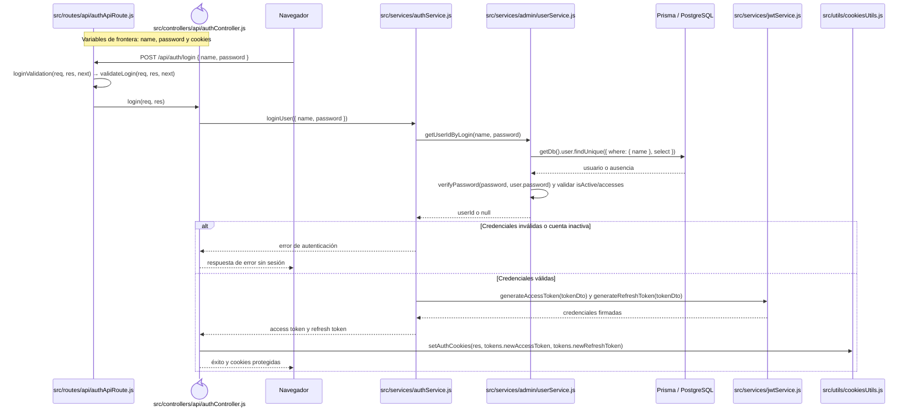
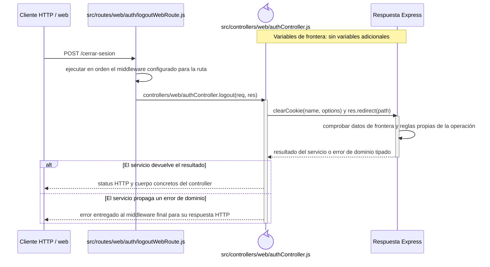

# Secuencias del código backend: Autenticación

Este capítulo forma parte del [catálogo de secuencias del código backend](index.md) y conserva los recorridos aplicados del grupo `AUT`. Las reglas comunes de lectura, trazabilidad y mantenimiento se declaran en el índice de la colección.

## `CU-AUT-01`

**Patrones:** `BE-P01`, `BE-P08`.

## `CU-AUT-02`

**Patrones:** `BE-P08`.

