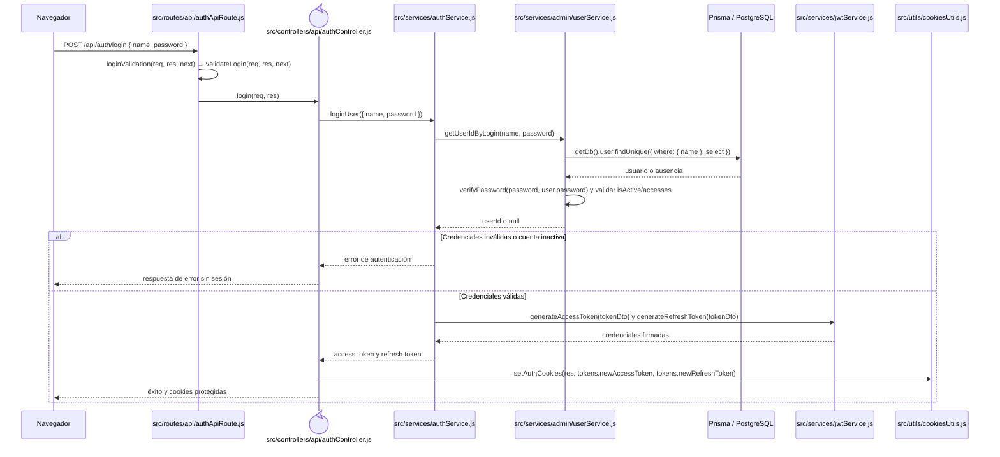

# `CU-AUT-01` — Iniciar sesión

**Patrones:** `BE-P01`, `BE-P08`.

```mermaid
sequenceDiagram
    participant Browser as Navegador
    participant Router as src/routes/api/authApiRoute.js
    participant Controller@{ "type": "control" } as src/controllers/api/authController.js
    participant Service as src/services/authService.js
    participant User as src/services/admin/userService.js
    participant Prisma as Prisma / PostgreSQL
    participant Token as src/services/jwtService.js
    participant Cookies as src/utils/cookiesUtils.js

    Browser->>Router: POST /api/auth/login { name, password }
    Router->>Router: loginValidation(req, res, next) → validateLogin(req, res, next)
    Router->>Controller: login(req, res)
    Controller->>Service: loginUser({ name, password })
    Service->>User: getUserIdByLogin(name, password)
    User->>Prisma: getDb().user.findUnique({ where: { name }, select })
    Prisma-->>User: usuario o ausencia
    User->>User: verifyPassword(password, user.password) y validar isActive/accesses
    User-->>Service: userId o null
    alt Credenciales inválidas o cuenta inactiva
        Service-->>Controller: error de autenticación
        Controller-->>Browser: respuesta de error sin sesión
    else Credenciales válidas
        Service->>Token: generateAccessToken(tokenDto) y generateRefreshToken(tokenDto)
        Token-->>Service: credenciales firmadas
        Service-->>Controller: access token y refresh token
        Controller->>Cookies: setAuthCookies(res, tokens.newAccessToken, tokens.newRefreshToken)
        Controller-->>Browser: éxito y cookies protegidas
    end
```

