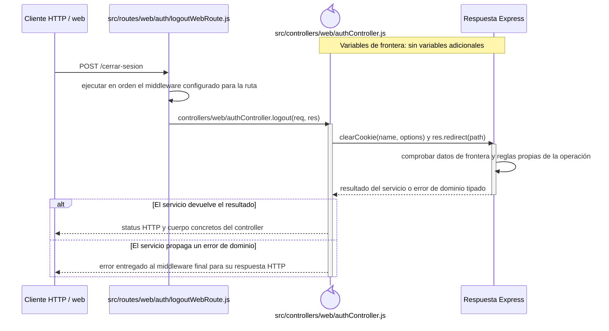

# `CU-AUT-02` — Cerrar sesión

**Patrones:** `BE-P08`.

```mermaid
sequenceDiagram
    participant Client as Cliente HTTP / web
    participant Route as src/routes/web/auth/logoutWebRoute.js
    participant Controller@{ "type": "control" } as src/controllers/web/authController.js
    participant Response as Respuesta Express
    Note over Controller,Response: Variables de frontera: sin variables adicionales

    Client->>Route: POST /cerrar-sesion
    Route->>Route: ejecutar en orden el middleware configurado para la ruta
    Route->>Controller: controllers/web/authController.logout(req, res)
    activate Controller
    Controller->>Response: clearCookie(name, options) y res.redirect(path)
    activate Response
    Response->>Response: comprobar datos de frontera y reglas propias de la operación
    Response-->>Controller: resultado del servicio o error de dominio tipado
    deactivate Response
    alt El servicio devuelve el resultado
        Controller-->>Client: status HTTP y cuerpo concretos del controller
    else El servicio propaga un error de dominio
        Controller-->>Client: error entregado al middleware final para su respuesta HTTP
    end
    deactivate Controller
```
