# Secuencias del código backend: Catálogos e inventario

Este capítulo forma parte del [catálogo de secuencias del código backend](index.md) y conserva los recorridos aplicados del grupo `CAT`. Las reglas comunes de lectura, trazabilidad y mantenimiento se declaran en el índice de la colección.

## `CU-CAT-01`

**Patrones:** `BE-P01`.

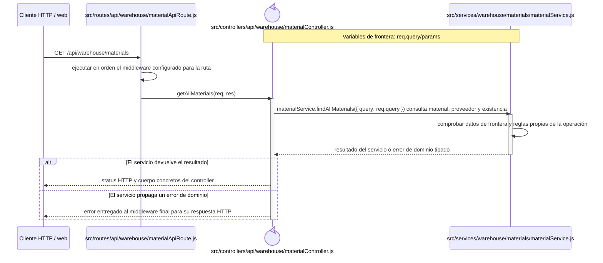

## `CU-CAT-02`

**Patrones:** `BE-P01`, `BE-P03`, `BE-P04`.

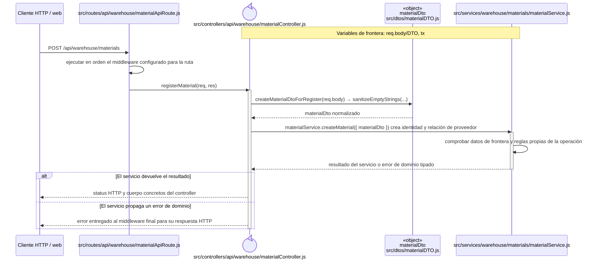

## `CU-CAT-03`

**Patrones:** `BE-P01`, `BE-P03`, `BE-P04`.

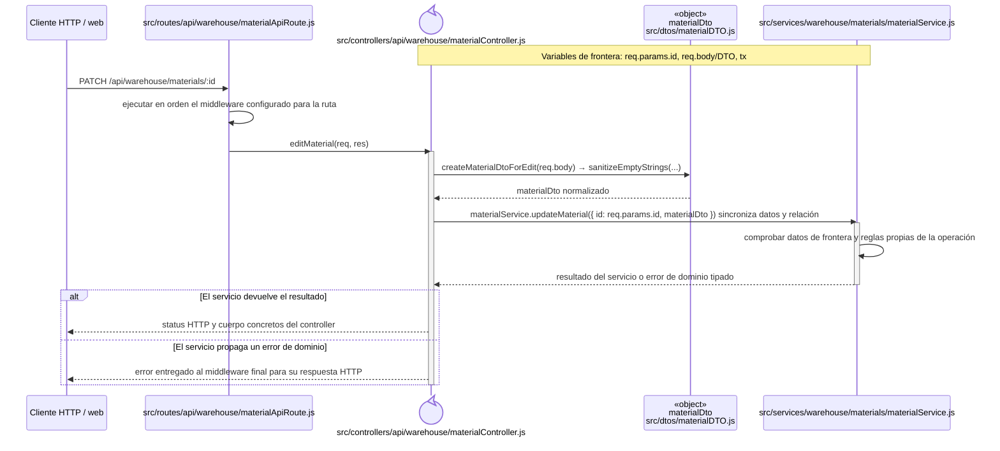

## `CU-CAT-04`

**Patrones:** `BE-P01`, `BE-P03`, `BE-P04`.

## `CU-CAT-05`

**Patrones:** `BE-P01`, `BE-P03`, `BE-P04`, `BE-P05`.

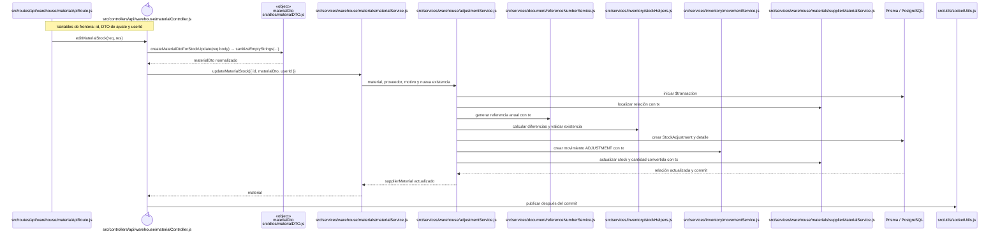

## `CU-CAT-06`

**Patrones:** `BE-P01`.

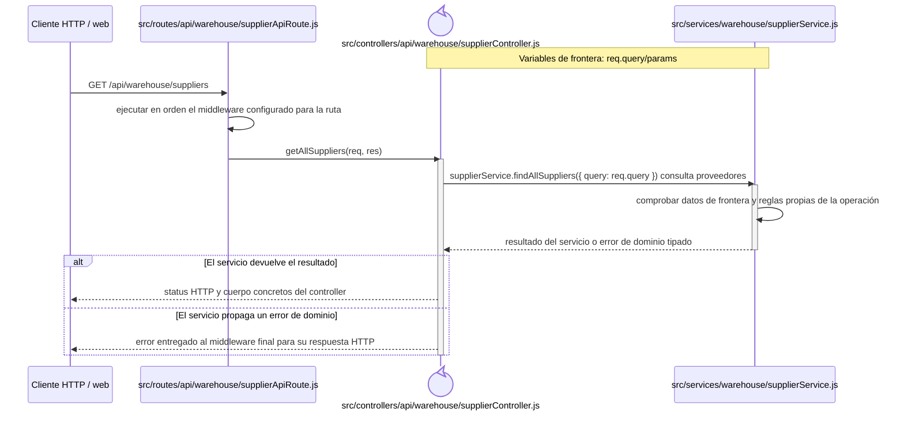

## `CU-CAT-07`

**Patrones:** `BE-P01`.

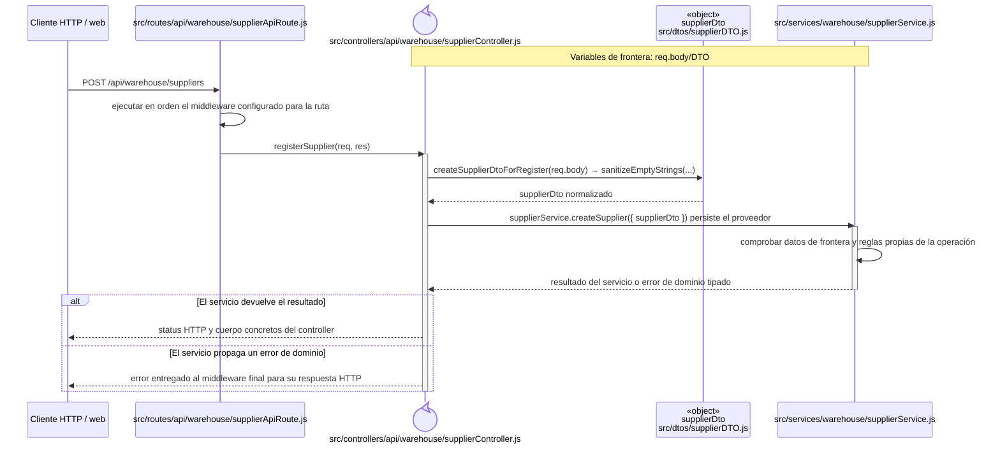

## `CU-CAT-08`

**Patrones:** `BE-P01`.

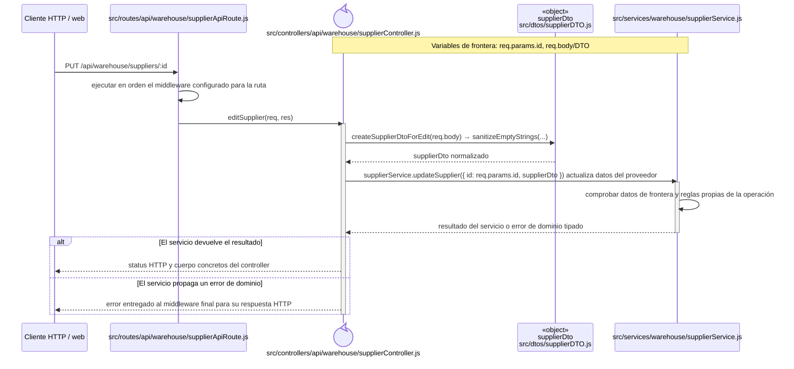

## `CU-CAT-09`

**Patrones:** `BE-P01`.

## `CU-CAT-10`

**Patrones:** `BE-P01`.

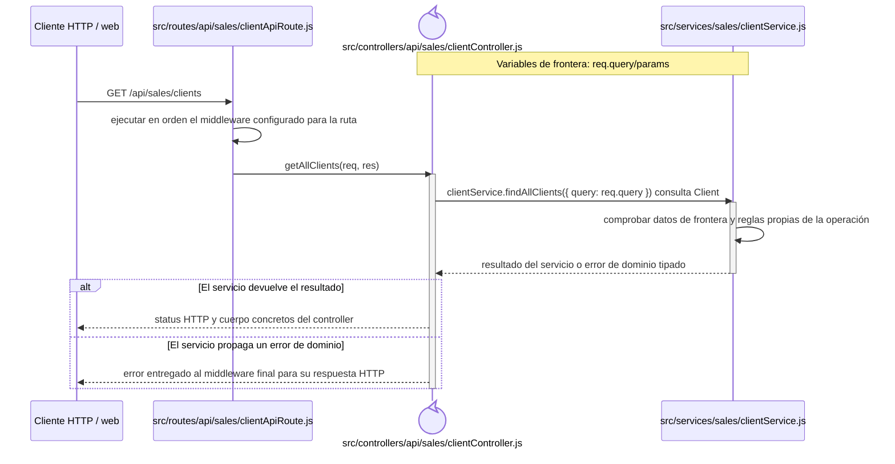

## `CU-CAT-11`

**Patrones:** `BE-P01`.

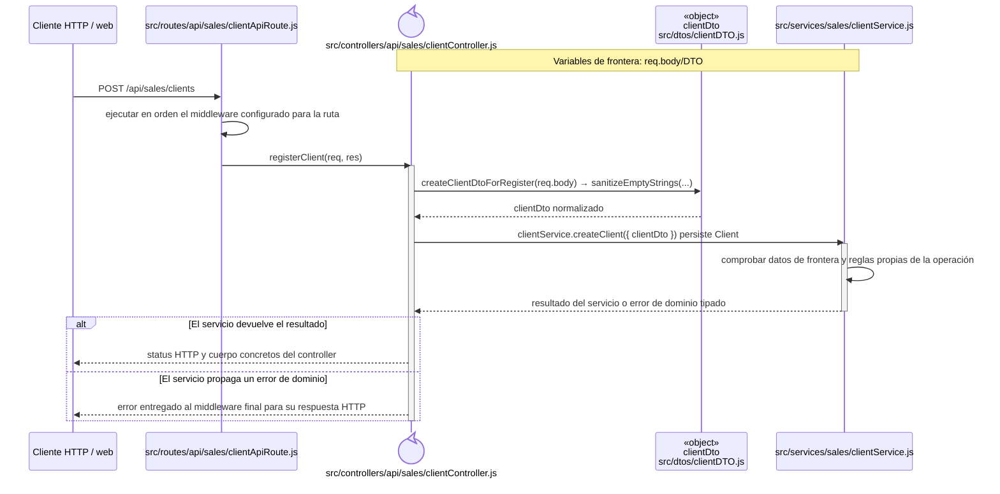

## `CU-CAT-12`

**Patrones:** `BE-P01`.

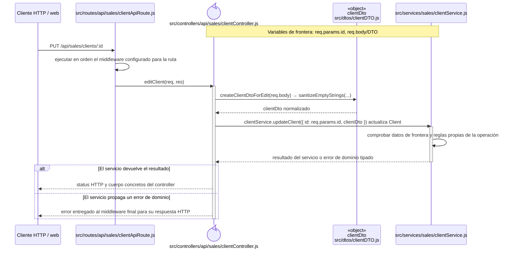

## `CU-CAT-13`

**Patrones:** `BE-P01`.

## `CU-CAT-14`

**Patrones:** `BE-P01`, `BE-P03`, `BE-P04`, `BE-P05`.

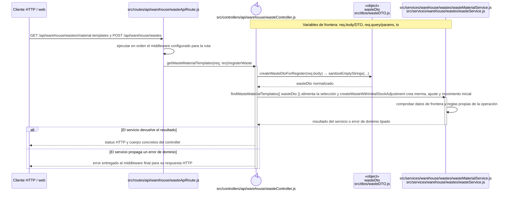

## `CU-CAT-15`

**Patrones:** `BE-P01`.

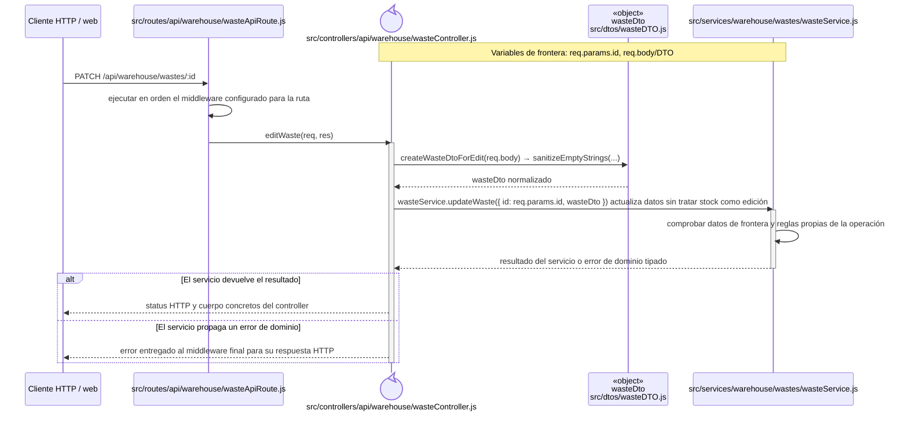

## `CU-CAT-16`

**Patrones:** `BE-P01`, `BE-P03`, `BE-P04`, `BE-P05`.

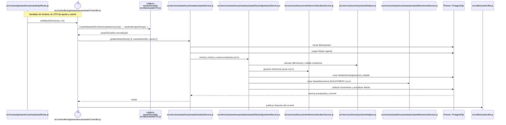

## `CU-CAT-17`

**Patrones:** `BE-P02`.

## `CU-CAT-18`

**Patrones:** `BE-P02`.

## `CU-CAT-19`

**Patrones:** `BE-P02`.

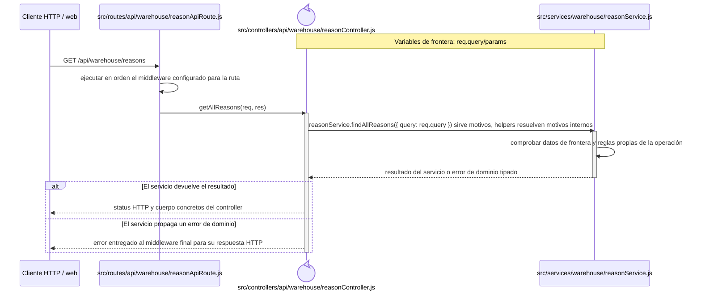

## `CU-CAT-20`

**Patrones:** `BE-P02`.

