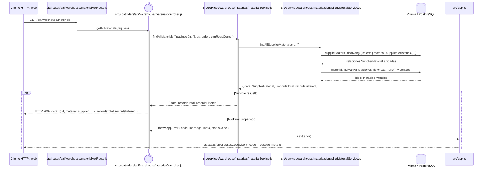

# `CU-ALM-01` — Consultar materiales

**Patrones:** `BE-P01`.

```mermaid
sequenceDiagram
    participant Client as Cliente HTTP / web
    participant Route as src/routes/api/warehouse/materialApiRoute.js
    participant Controller@{ "type": "control" } as src/controllers/api/warehouse/materialController.js
    participant Domain as src/services/warehouse/materials/materialService.js
    participant SupplierMaterial as src/services/warehouse/materials/supplierMaterialService.js
    participant Prisma@{ "type": "database" } as Prisma / PostgreSQL
    participant ErrorHandler as src/app.js

    Client->>Route: GET /api/warehouse/materials
    Route->>Controller: getAllMaterials(req, res)
    activate Controller
    Controller->>Domain: findAllMaterials({ paginación, filtros, orden, canReadCosts })
    activate Domain
    Domain->>SupplierMaterial: findAllSupplierMaterials({ ... })
    SupplierMaterial->>Prisma: supplierMaterial.findMany({ select: { material, supplier, existencia } })
    Prisma-->>SupplierMaterial: relaciones SupplierMaterial anidadas
    SupplierMaterial->>Prisma: material.findMany({ relaciones históricas: none }) y conteos
    Prisma-->>SupplierMaterial: ids eliminables y totales
    SupplierMaterial-->>Domain: { data: SupplierMaterial[], recordsTotal, recordsFiltered }
    alt Servicio resuelto
        Domain-->>Controller: { data, recordsTotal, recordsFiltered }
        Controller-->>Client: HTTP 200 { data: [{ id, material, supplier, ... }], recordsTotal, recordsFiltered }
    else AppError propagado
        Domain-->>Controller: throw AppError { code, message, meta, statusCode }
        Controller->>ErrorHandler: next(error)
        ErrorHandler-->>Client: res.status(error.statusCode).json({ code, message, meta })
    end
    deactivate Domain
    deactivate Controller
```
