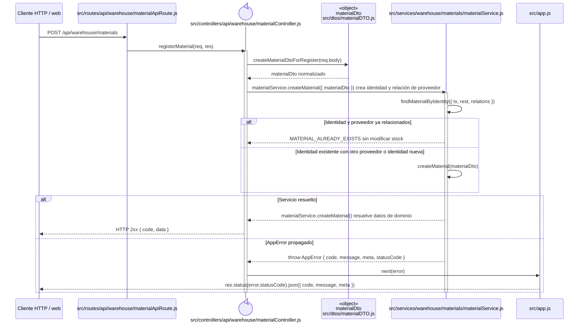

# `CU-ALM-02` — Crear material

**Patrones:** `BE-P01`, `BE-P03`, `BE-P04`.

```mermaid
sequenceDiagram
    participant Client as Cliente HTTP / web
    participant Route as src/routes/api/warehouse/materialApiRoute.js
    participant Controller@{ "type": "control" } as src/controllers/api/warehouse/materialController.js
    participant MaterialDto as «object»<br/>materialDto<br/>src/dtos/materialDTO.js
    participant Domain as src/services/warehouse/materials/materialService.js
    participant ErrorHandler as src/app.js

    Client->>Route: POST /api/warehouse/materials
    Route->>Controller: registerMaterial(req, res)
    activate Controller
    Controller->>MaterialDto: createMaterialDtoForRegister(req.body)
    MaterialDto-->>Controller: materialDto normalizado
    Controller->>Domain: materialService.createMaterial({ materialDto }) crea identidad y relación de proveedor
    activate Domain
    Domain->>Domain: findMaterialByIdentity({ tx, rest, relations })
    alt Identidad y proveedor ya relacionados
        Domain-->>Controller: MATERIAL_ALREADY_EXISTS sin modificar stock
    else Identidad existente con otro proveedor o identidad nueva
        Domain->>Domain: createMaterial(materialDto)
    end
    alt Servicio resuelto
        Domain-->>Controller: materialService.createMaterial() resuelve datos de dominio
        Controller-->>Client: HTTP 2xx { code, data }
    else AppError propagado
        Domain-->>Controller: throw AppError { code, message, meta, statusCode }
        Controller->>ErrorHandler: next(error)
        ErrorHandler-->>Client: res.status(error.statusCode).json({ code, message, meta })
    end
    deactivate Domain
    deactivate Controller
```

