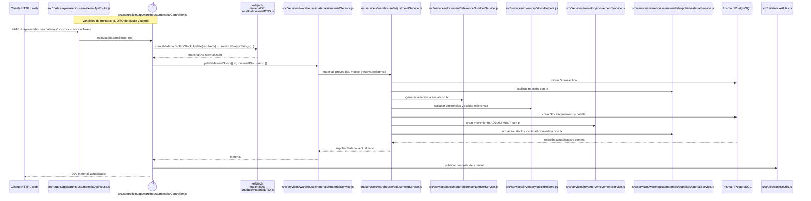

# `CU-ALM-05` — Ajustar existencia de material

**Patrones:** `BE-P01`, `BE-P03`, `BE-P04`, `BE-P05`.

```mermaid
sequenceDiagram
    participant Client as Cliente HTTP / web
    Note over Router,Controller: Variables de frontera: id, DTO de ajuste y userId
    participant Router as src/routes/api/warehouse/materialApiRoute.js
    participant Controller@{ "type": "control" } as src/controllers/api/warehouse/materialController.js
    participant StockDto as «object»<br/>materialDto<br/>src/dtos/materialDTO.js
    participant Service as src/services/warehouse/materials/materialService.js
    participant Adjustment as src/services/warehouse/adjustmentService.js
    participant Reference as src/services/document/referenceNumberService.js
    participant Stock as src/services/inventory/stockHelpers.js
    participant Movement as src/services/inventory/movementService.js
    participant SupplierMaterial as src/services/warehouse/materials/supplierMaterialService.js
    participant Prisma as Prisma / PostgreSQL
    participant Socket as src/utils/socketUtils.js

    Client->>Router: PATCH /api/warehouse/materials/:id/stock + accessToken
    Router->>Controller: editMaterialStock(req, res)
    Controller->>StockDto: createMaterialDtoForStockUpdate(req.body) → sanitizeEmptyStrings(...)
    StockDto-->>Controller: materialDto normalizado
    Controller->>Service: updateMaterialStock({ id, materialDto, userId })
    Service->>Adjustment: material, proveedor, motivo y nueva existencia
    Adjustment->>Prisma: iniciar $transaction
    Adjustment->>SupplierMaterial: localizar relación con tx
    Adjustment->>Reference: generar referencia anual con tx
    Adjustment->>Stock: calcular diferencias y validar existencia
    Adjustment->>Prisma: crear StockAdjustment y detalle
    Adjustment->>Movement: crear movimiento ADJUSTMENT con tx
    Adjustment->>SupplierMaterial: actualizar stock y cantidad convertida con tx
    Prisma-->>Adjustment: relación actualizada y commit
    Adjustment-->>Service: supplierMaterial actualizado
    Service-->>Controller: material
    Controller->>Socket: publicar después del commit
    Controller-->>Client: 200 material actualizado
```

