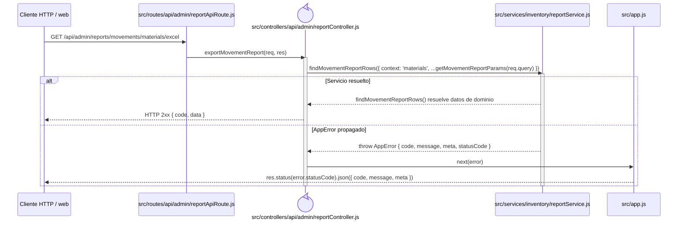

# `CU-ALM-08` — Generar reporte de movimientos de materiales

**Patrones:** `BE-P07`.

```mermaid
sequenceDiagram
    participant Client as Cliente HTTP / web
    participant Route as src/routes/api/admin/reportApiRoute.js
    participant Controller@{ "type": "control" } as src/controllers/api/admin/reportController.js
    participant Domain as src/services/inventory/reportService.js
    participant ErrorHandler as src/app.js

    Client->>Route: GET /api/admin/reports/movements/materials/excel
    Route->>Controller: exportMovementReport(req, res)
    activate Controller
    Controller->>Domain: findMovementReportRows({ context: 'materials', ...getMovementReportParams(req.query) })
    activate Domain
    alt Servicio resuelto
        Domain-->>Controller: findMovementReportRows() resuelve datos de dominio
        Controller-->>Client: HTTP 2xx { code, data }
    else AppError propagado
        Domain-->>Controller: throw AppError { code, message, meta, statusCode }
        Controller->>ErrorHandler: next(error)
        ErrorHandler-->>Client: res.status(error.statusCode).json({ code, message, meta })
    end
    deactivate Domain
    deactivate Controller
```

