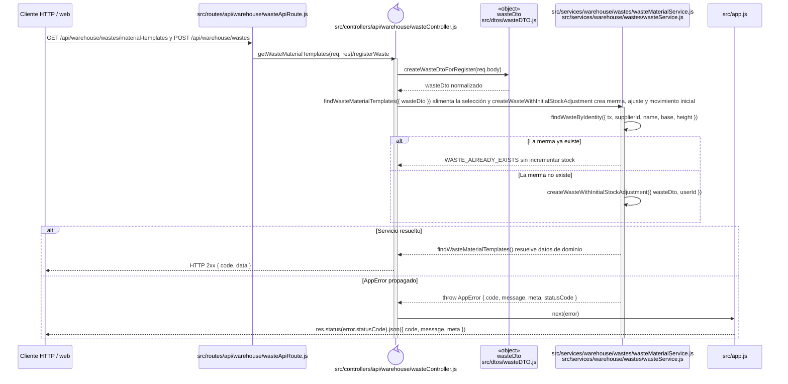

# `CU-ALM-10` — Registrar merma

**Patrones:** `BE-P01`, `BE-P03`, `BE-P04`, `BE-P05`.

```mermaid
sequenceDiagram
    participant Client as Cliente HTTP / web
    participant Route as src/routes/api/warehouse/wasteApiRoute.js
    participant Controller@{ "type": "control" } as src/controllers/api/warehouse/wasteController.js
    participant WasteDto as «object»<br/>wasteDto<br/>src/dtos/wasteDTO.js
    participant Domain as src/services/warehouse/wastes/wasteMaterialService.js<br/>src/services/warehouse/wastes/wasteService.js
    participant ErrorHandler as src/app.js

    Client->>Route: GET /api/warehouse/wastes/material-templates y POST /api/warehouse/wastes
    Route->>Controller: getWasteMaterialTemplates(req, res)/registerWaste
    activate Controller
    Controller->>WasteDto: createWasteDtoForRegister(req.body)
    WasteDto-->>Controller: wasteDto normalizado
    Controller->>Domain: findWasteMaterialTemplates({ wasteDto }) alimenta la selección y createWasteWithInitialStockAdjustment crea merma, ajuste y movimiento inicial
    activate Domain
    Domain->>Domain: findWasteByIdentity({ tx, supplierId, name, base, height })
    alt La merma ya existe
        Domain-->>Controller: WASTE_ALREADY_EXISTS sin incrementar stock
    else La merma no existe
        Domain->>Domain: createWasteWithInitialStockAdjustment({ wasteDto, userId })
    end
    alt Servicio resuelto
        Domain-->>Controller: findWasteMaterialTemplates() resuelve datos de dominio
        Controller-->>Client: HTTP 2xx { code, data }
    else AppError propagado
        Domain-->>Controller: throw AppError { code, message, meta, statusCode }
        Controller->>ErrorHandler: next(error)
        ErrorHandler-->>Client: res.status(error.statusCode).json({ code, message, meta })
    end
    deactivate Domain
    deactivate Controller
```

