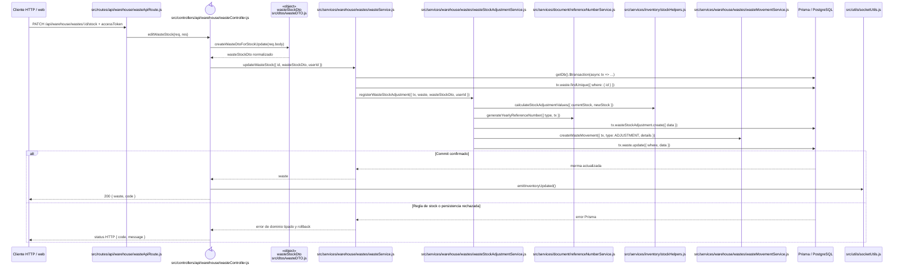

# `CU-ALM-12` — Ajustar existencia de merma

**Patrones:** `BE-P01`, `BE-P03`, `BE-P04`, `BE-P05`.

```mermaid
sequenceDiagram
    participant Client as Cliente HTTP / web
    participant Router as src/routes/api/warehouse/wasteApiRoute.js
    participant Controller@{ "type": "control" } as src/controllers/api/warehouse/wasteController.js
    participant StockDto as «object»<br/>wasteStockDto<br/>src/dtos/wasteDTO.js
    participant Service as src/services/warehouse/wastes/wasteService.js
    participant Adjustment as src/services/warehouse/wastes/wasteStockAdjustmentService.js
    participant Reference as src/services/document/referenceNumberService.js
    participant Stock as src/services/inventory/stockHelpers.js
    participant Movement as src/services/warehouse/wastes/wasteMovementService.js
    participant Prisma as Prisma / PostgreSQL
    participant Socket as src/utils/socketUtils.js

    Client->>Router: PATCH /api/warehouse/wastes/:id/stock + accessToken
    Router->>Controller: editWasteStock(req, res)
    Controller->>StockDto: createWasteDtoForStockUpdate(req.body)
    StockDto-->>Controller: wasteStockDto normalizado
    Controller->>Service: updateWasteStock({ id, wasteStockDto, userId })
    Service->>Prisma: getDb().$transaction(async tx => ...)
    Service->>Prisma: tx.waste.findUnique({ where: { id } })
    Service->>Adjustment: registerWasteStockAdjustment({ tx, waste, wasteStockDto, userId })
    Adjustment->>Stock: calculateStockAdjustmentValues({ currentStock, newStock })
    Adjustment->>Reference: generateYearlyReferenceNumber({ type, tx })
    Adjustment->>Prisma: tx.wasteStockAdjustment.create({ data })
    Adjustment->>Movement: createWasteMovement({ tx, type: ADJUSTMENT, details })
    Adjustment->>Prisma: tx.waste.update({ where, data })
    alt Commit confirmado
        Prisma-->>Service: merma actualizada
        Service-->>Controller: waste
        Controller->>Socket: emitInventoryUpdated()
        Controller-->>Client: 200 { waste, code }
    else Regla de stock o persistencia rechazada
        Prisma-->>Service: error Prisma
        Service-->>Controller: error de dominio tipado y rollback
        Controller-->>Client: status HTTP { code, message }
    end
```
