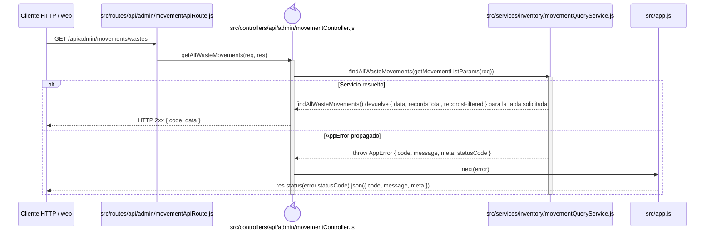

# `CU-ALM-14` — Consultar movimientos de mermas

**Patrones:** `BE-P06`.

```mermaid
sequenceDiagram
    participant Client as Cliente HTTP / web
    participant Route as src/routes/api/admin/movementApiRoute.js
    participant Controller@{ "type": "control" } as src/controllers/api/admin/movementController.js
    participant Domain as src/services/inventory/movementQueryService.js
    participant ErrorHandler as src/app.js

    Client->>Route: GET /api/admin/movements/wastes
    Route->>Controller: getAllWasteMovements(req, res)
    activate Controller
    Controller->>Domain: findAllWasteMovements(getMovementListParams(req))
    activate Domain
    alt Servicio resuelto
        Domain-->>Controller: findAllWasteMovements() devuelve { data, recordsTotal, recordsFiltered } para la tabla solicitada
        Controller-->>Client: HTTP 2xx { code, data }
    else AppError propagado
        Domain-->>Controller: throw AppError { code, message, meta, statusCode }
        Controller->>ErrorHandler: next(error)
        ErrorHandler-->>Client: res.status(error.statusCode).json({ code, message, meta })
    end
    deactivate Domain
    deactivate Controller
```

