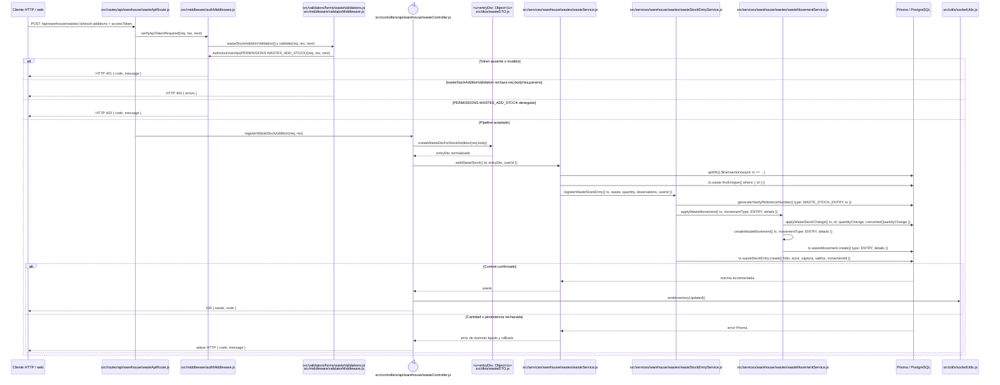

# `CU-ALM-16` — Agregar existencia de merma

**Patrones:** `BE-P01`, `BE-P03`, `BE-P04`, `BE-P05`.

```mermaid
sequenceDiagram
    participant Client as Cliente HTTP / web
    participant Router as src/routes/api/warehouse/wasteApiRoute.js
    participant Auth as src/middleware/authMiddleware.js
    participant Validator as src/validators/forms/wasteValidations.js<br/>src/middleware/validatorMiddleware.js
    participant Controller@{ "type": "control" } as src/controllers/api/warehouse/wasteController.js
    participant StockDto as <u>entryDto: Object</u><br/>src/dtos/wasteDTO.js
    participant Service as src/services/warehouse/wastes/wasteService.js
    participant Entry as src/services/warehouse/wastes/wasteStockEntryService.js
    participant Movement as src/services/warehouse/wastes/wasteMovementService.js
    participant Prisma as Prisma / PostgreSQL
    participant Socket as src/utils/socketUtils.js

    Client->>Router: POST /api/warehouse/wastes/:id/stock-additions + accessToken
    Router->>Auth: verifyApiTokenRequired(req, res, next)
    Auth->>Validator: wasteStockAdditionValidation[] y validate(req, res, next)
    Validator->>Auth: authorizeUserApi(PERMISSIONS.WASTES_ADD_STOCK)(req, res, next)
    alt Token ausente o inválido
        Auth-->>Client: HTTP 401 { code, message }
    else wasteStockAdditionValidation rechaza req.body/req.params
        Validator-->>Client: HTTP 400 { errors }
    else PERMISSIONS.WASTES_ADD_STOCK denegado
        Auth-->>Client: HTTP 403 { code, message }
    else Pipeline aceptado
        Router->>Controller: registerWasteStockAddition(req, res)
        Controller->>StockDto: createWasteDtoForStockAddition(req.body)
        StockDto-->>Controller: entryDto normalizado
        Controller->>Service: addWasteStock({ id, entryDto, userId })
        Service->>Prisma: getDb().$transaction(async tx => ...)
        Service->>Prisma: tx.waste.findUnique({ where: { id } })
        Service->>Entry: registerWasteStockEntry({ tx, waste, quantity, observations, userId })
        Entry->>Prisma: generateYearlyReferenceNumber({ type: WASTE_STOCK_ENTRY, tx })
        Entry->>Movement: applyWasteMovement({ tx, movementType: ENTRY, details })
        Movement->>Prisma: applyWasteStockChange({ tx, id, quantityChange, convertedQuantityChange })
        Movement->>Movement: createWasteMovement({ tx, movementType: ENTRY, details })
        Movement->>Prisma: tx.wasteMovement.create({ type: ENTRY, details })
        Entry->>Prisma: tx.wasteStockEntry.create({ folio, actor, captura, saldos, movementId })
        alt Commit confirmado
            Prisma-->>Service: merma incrementada
            Service-->>Controller: waste
            Controller->>Socket: emitInventoryUpdated()
            Controller-->>Client: 200 { waste, code }
        else Cantidad o persistencia rechazada
            Prisma-->>Service: error Prisma
            Service-->>Controller: error de dominio tipado y rollback
            Controller-->>Client: status HTTP { code, message }
        end
    end
```
