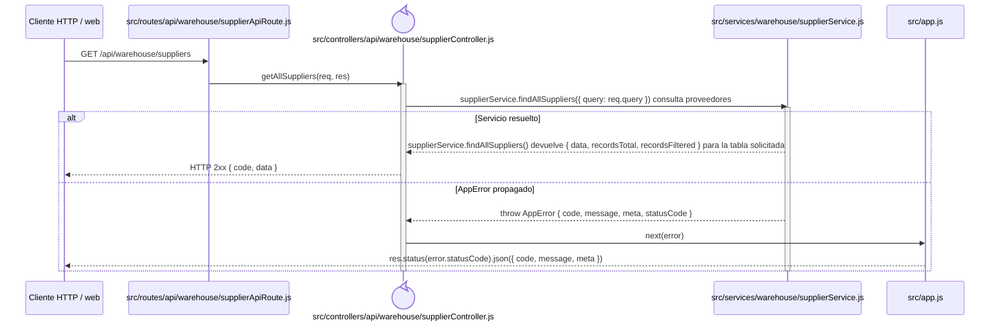

# `CU-CAT-01` — Consultar proveedores

**Patrones:** `BE-P01`.

```mermaid
sequenceDiagram
    participant Client as Cliente HTTP / web
    participant Route as src/routes/api/warehouse/supplierApiRoute.js
    participant Controller@{ "type": "control" } as src/controllers/api/warehouse/supplierController.js
    participant Domain as src/services/warehouse/supplierService.js
    participant ErrorHandler as src/app.js

    Client->>Route: GET /api/warehouse/suppliers
    Route->>Controller: getAllSuppliers(req, res)
    activate Controller
    Controller->>Domain: supplierService.findAllSuppliers({ query: req.query }) consulta proveedores
    activate Domain
    alt Servicio resuelto
        Domain-->>Controller: supplierService.findAllSuppliers() devuelve { data, recordsTotal, recordsFiltered } para la tabla solicitada
        Controller-->>Client: HTTP 2xx { code, data }
    else AppError propagado
        Domain-->>Controller: throw AppError { code, message, meta, statusCode }
        Controller->>ErrorHandler: next(error)
        ErrorHandler-->>Client: res.status(error.statusCode).json({ code, message, meta })
    end
    deactivate Domain
    deactivate Controller
```

