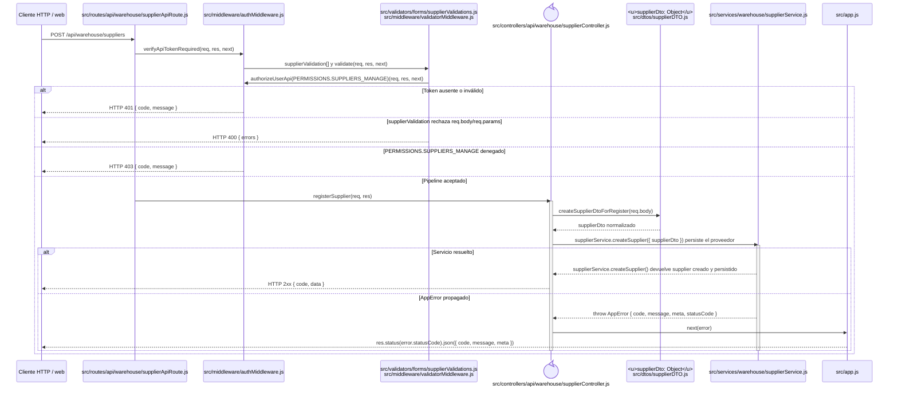

# `CU-CAT-02` — Crear proveedor

**Patrones:** `BE-P01`.

El origen visual no altera el contrato backend: tanto el listado de Sistemas como el selector de una
compra llaman al mismo `POST`. `suppliers:manage` autoriza el alta de Almacén, mientras
`suppliers:page-view` se comprueba únicamente al intentar abrir la vista web `/proveedores`.

