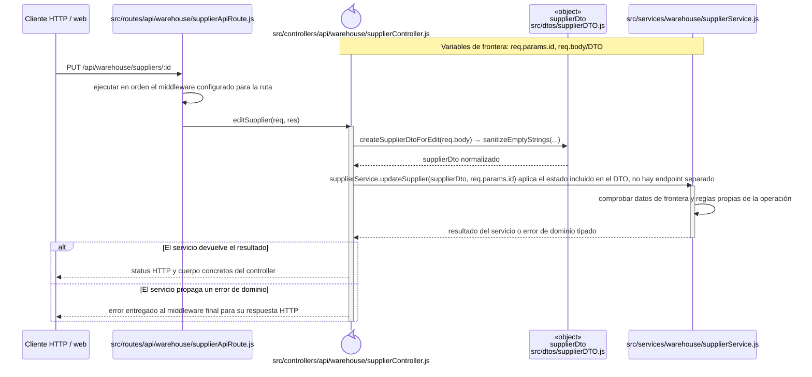

# `CU-CAT-04` — Cambiar estado de proveedor

**Patrones:** `BE-P01`.

```mermaid
sequenceDiagram
    participant Client as Cliente HTTP / web
    participant Route as src/routes/api/warehouse/supplierApiRoute.js
    participant Controller@{ "type": "control" } as src/controllers/api/warehouse/supplierController.js
    participant SupplierDto as «object»<br/>supplierDto<br/>src/dtos/supplierDTO.js
    participant Domain as src/services/warehouse/supplierService.js
    Note over Controller,Domain: Variables de frontera: req.params.id, req.body/DTO

    Client->>Route: PUT /api/warehouse/suppliers/:id
    Route->>Route: ejecutar en orden el middleware configurado para la ruta
    Route->>Controller: editSupplier(req, res)
    activate Controller
    Controller->>SupplierDto: createSupplierDtoForEdit(req.body) → sanitizeEmptyStrings(...)
    SupplierDto-->>Controller: supplierDto normalizado
    Controller->>Domain: supplierService.updateSupplier(supplierDto, req.params.id) aplica el estado incluido en el DTO, no hay endpoint separado
    activate Domain
    Domain->>Domain: comprobar datos de frontera y reglas propias de la operación
    Domain-->>Controller: resultado del servicio o error de dominio tipado
    deactivate Domain
    alt El servicio devuelve el resultado
        Controller-->>Client: status HTTP y cuerpo concretos del controller
    else El servicio propaga un error de dominio
        Controller-->>Client: error entregado al middleware final para su respuesta HTTP
    end
    deactivate Controller
```

