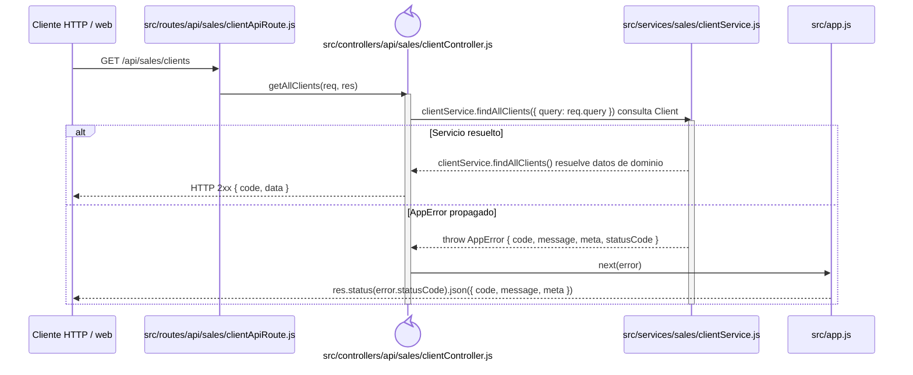

# `CU-CAT-05` — Consultar clientes

**Patrones:** `BE-P01`.

```mermaid
sequenceDiagram
    participant Client as Cliente HTTP / web
    participant Route as src/routes/api/sales/clientApiRoute.js
    participant Controller@{ "type": "control" } as src/controllers/api/sales/clientController.js
    participant Domain as src/services/sales/clientService.js
    participant ErrorHandler as src/app.js

    Client->>Route: GET /api/sales/clients
    Route->>Controller: getAllClients(req, res)
    activate Controller
    Controller->>Domain: clientService.findAllClients({ query: req.query }) consulta Client
    activate Domain
    alt Servicio resuelto
        Domain-->>Controller: clientService.findAllClients() resuelve datos de dominio
        Controller-->>Client: HTTP 2xx { code, data }
    else AppError propagado
        Domain-->>Controller: throw AppError { code, message, meta, statusCode }
        Controller->>ErrorHandler: next(error)
        ErrorHandler-->>Client: res.status(error.statusCode).json({ code, message, meta })
    end
    deactivate Domain
    deactivate Controller
```

