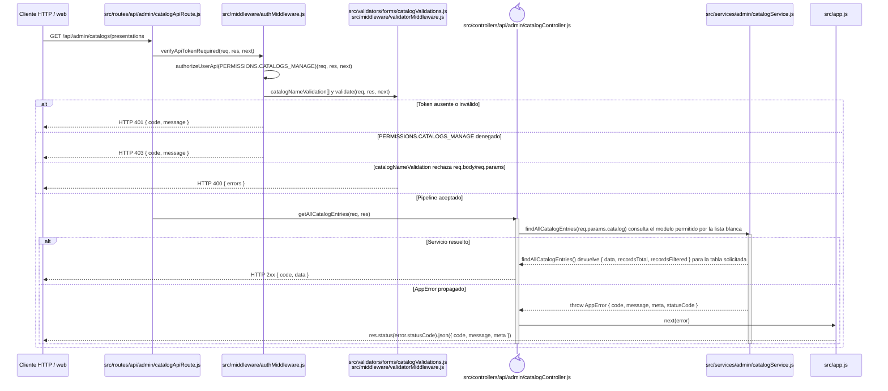

# `CU-CAT-15` — Consultar presentación

**Patrones:** `BE-P02`.

```mermaid
sequenceDiagram
    participant Client as Cliente HTTP / web
    participant Route as src/routes/api/admin/catalogApiRoute.js
    participant Auth as src/middleware/authMiddleware.js
    participant Validator as src/validators/forms/catalogValidations.js<br/>src/middleware/validatorMiddleware.js
    participant Controller@{ "type": "control" } as src/controllers/api/admin/catalogController.js
    participant Domain as src/services/admin/catalogService.js
    participant ErrorHandler as src/app.js

    Client->>Route: GET /api/admin/catalogs/presentations
    Route->>Auth: verifyApiTokenRequired(req, res, next)
    Auth->>Auth: authorizeUserApi(PERMISSIONS.CATALOGS_MANAGE)(req, res, next)
    Auth->>Validator: catalogNameValidation[] y validate(req, res, next)
    alt Token ausente o inválido
        Auth-->>Client: HTTP 401 { code, message }
    else PERMISSIONS.CATALOGS_MANAGE denegado
        Auth-->>Client: HTTP 403 { code, message }
    else catalogNameValidation rechaza req.body/req.params
        Validator-->>Client: HTTP 400 { errors }
    else Pipeline aceptado
        Route->>Controller: getAllCatalogEntries(req, res)
        activate Controller
        Controller->>Domain: findAllCatalogEntries(req.params.catalog) consulta el modelo permitido por la lista blanca
        activate Domain
        alt Servicio resuelto
            Domain-->>Controller: findAllCatalogEntries() devuelve { data, recordsTotal, recordsFiltered } para la tabla solicitada
            Controller-->>Client: HTTP 2xx { code, data }
        else AppError propagado
            Domain-->>Controller: throw AppError { code, message, meta, statusCode }
            Controller->>ErrorHandler: next(error)
            ErrorHandler-->>Client: res.status(error.statusCode).json({ code, message, meta })
        end
        deactivate Domain
        deactivate Controller
    end
```

