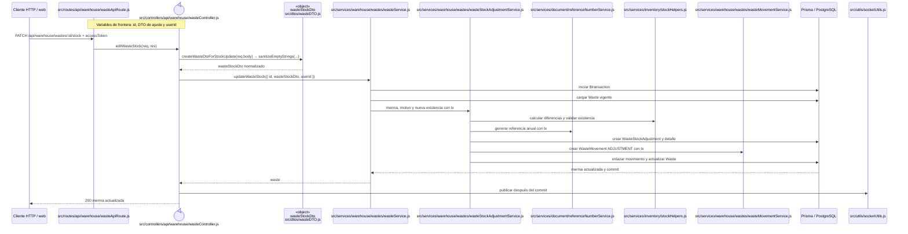

# `CU-CAT-22` — Ajustar existencia de merma

**Patrones:** `BE-P01`, `BE-P03`, `BE-P04`, `BE-P05`.

```mermaid
sequenceDiagram
    participant Client as Cliente HTTP / web
    Note over Router,Controller: Variables de frontera: id, DTO de ajuste y userId
    participant Router as src/routes/api/warehouse/wasteApiRoute.js
    participant Controller@{ "type": "control" } as src/controllers/api/warehouse/wasteController.js
    participant StockDto as «object»<br/>wasteStockDto<br/>src/dtos/wasteDTO.js
    participant Service as src/services/warehouse/wastes/wasteService.js
    participant Adjustment as src/services/warehouse/wastes/wasteStockAdjustmentService.js
    participant Reference as src/services/document/referenceNumberService.js
    participant Stock as src/services/inventory/stockHelpers.js
    participant Movement as src/services/warehouse/wastes/wasteMovementService.js
    participant Prisma as Prisma / PostgreSQL
    participant Socket as src/utils/socketUtils.js

    Client->>Router: PATCH /api/warehouse/wastes/:id/stock + accessToken
    Router->>Controller: editWasteStock(req, res)
    Controller->>StockDto: createWasteDtoForStockUpdate(req.body) → sanitizeEmptyStrings(...)
    StockDto-->>Controller: wasteStockDto normalizado
    Controller->>Service: updateWasteStock({ id, wasteStockDto, userId })
    Service->>Prisma: iniciar $transaction
    Service->>Prisma: cargar Waste vigente
    Service->>Adjustment: merma, motivo y nueva existencia con tx
    Adjustment->>Stock: calcular diferencias y validar existencia
    Adjustment->>Reference: generar referencia anual con tx
    Adjustment->>Prisma: crear WasteStockAdjustment y detalle
    Adjustment->>Movement: crear WasteMovement ADJUSTMENT con tx
    Adjustment->>Prisma: enlazar movimiento y actualizar Waste
    Prisma-->>Service: merma actualizada y commit
    Service-->>Controller: waste
    Controller->>Socket: publicar después del commit
    Controller-->>Client: 200 merma actualizada
```

