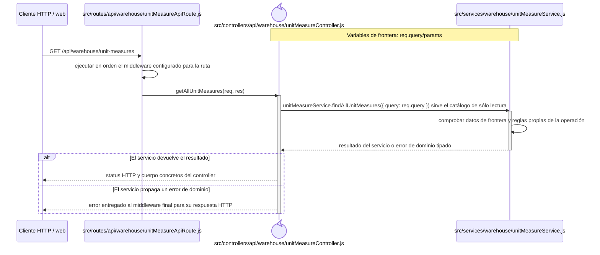

# `CU-CAT-28` — Consultar unidades de medida

**Patrones:** `BE-P02`.

```mermaid
sequenceDiagram
    participant Client as Cliente HTTP / web
    participant Route as src/routes/api/warehouse/unitMeasureApiRoute.js
    participant Controller@{ "type": "control" } as src/controllers/api/warehouse/unitMeasureController.js
    participant Domain as src/services/warehouse/unitMeasureService.js
    Note over Controller,Domain: Variables de frontera: req.query/params

    Client->>Route: GET /api/warehouse/unit-measures
    Route->>Route: ejecutar en orden el middleware configurado para la ruta
    Route->>Controller: getAllUnitMeasures(req, res)
    activate Controller
    Controller->>Domain: unitMeasureService.findAllUnitMeasures({ query: req.query }) sirve el catálogo de sólo lectura
    activate Domain
    Domain->>Domain: comprobar datos de frontera y reglas propias de la operación
    Domain-->>Controller: resultado del servicio o error de dominio tipado
    deactivate Domain
    alt El servicio devuelve el resultado
        Controller-->>Client: status HTTP y cuerpo concretos del controller
    else El servicio propaga un error de dominio
        Controller-->>Client: error entregado al middleware final para su respuesta HTTP
    end
    deactivate Controller
```

