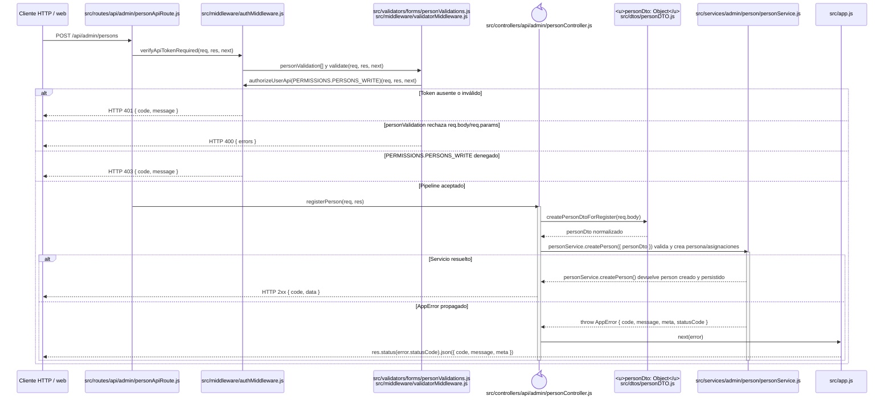

# `CU-IDA-02` — Crear persona

**Patrones:** `BE-P01`, `BE-P03`, `BE-P04`.

```mermaid
sequenceDiagram
    participant Client as Cliente HTTP / web
    participant Route as src/routes/api/admin/personApiRoute.js
    participant Auth as src/middleware/authMiddleware.js
    participant Validator as src/validators/forms/personValidations.js<br/>src/middleware/validatorMiddleware.js
    participant Controller@{ "type": "control" } as src/controllers/api/admin/personController.js
    participant PersonDto as <u>personDto: Object</u><br/>src/dtos/personDTO.js
    participant Domain as src/services/admin/person/personService.js
    participant ErrorHandler as src/app.js

    Client->>Route: POST /api/admin/persons
    Route->>Auth: verifyApiTokenRequired(req, res, next)
    Auth->>Validator: personValidation[] y validate(req, res, next)
    Validator->>Auth: authorizeUserApi(PERMISSIONS.PERSONS_WRITE)(req, res, next)
    alt Token ausente o inválido
        Auth-->>Client: HTTP 401 { code, message }
    else personValidation rechaza req.body/req.params
        Validator-->>Client: HTTP 400 { errors }
    else PERMISSIONS.PERSONS_WRITE denegado
        Auth-->>Client: HTTP 403 { code, message }
    else Pipeline aceptado
        Route->>Controller: registerPerson(req, res)
        activate Controller
        Controller->>PersonDto: createPersonDtoForRegister(req.body)
        PersonDto-->>Controller: personDto normalizado
        Controller->>Domain: personService.createPerson({ personDto }) valida y crea persona/asignaciones
        activate Domain
        alt Servicio resuelto
            Domain-->>Controller: personService.createPerson() devuelve person creado y persistido
            Controller-->>Client: HTTP 2xx { code, data }
        else AppError propagado
            Domain-->>Controller: throw AppError { code, message, meta, statusCode }
            Controller->>ErrorHandler: next(error)
            ErrorHandler-->>Client: res.status(error.statusCode).json({ code, message, meta })
        end
        deactivate Domain
        deactivate Controller
    end
```
