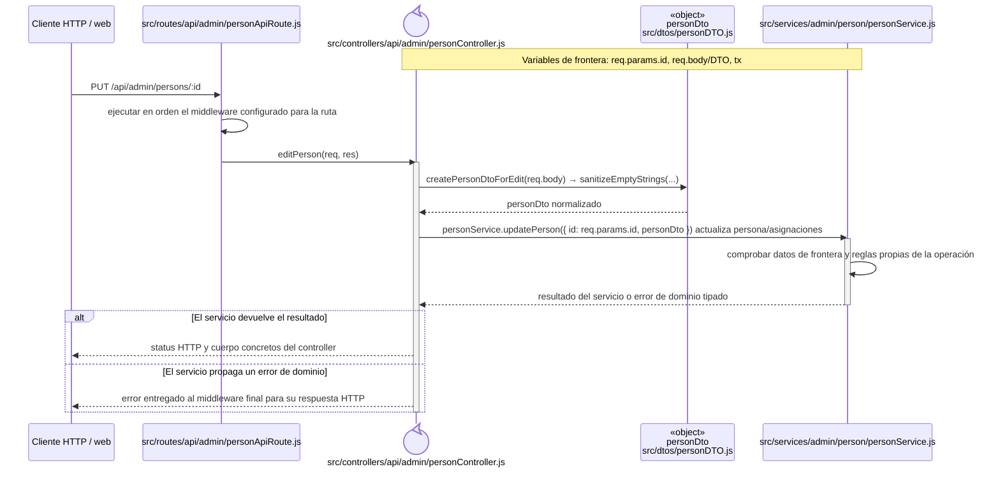

# `CU-IDA-03` — Editar persona

**Patrones:** `BE-P01`, `BE-P03`, `BE-P04`.

```mermaid
sequenceDiagram
    participant Client as Cliente HTTP / web
    participant Route as src/routes/api/admin/personApiRoute.js
    participant Controller@{ "type": "control" } as src/controllers/api/admin/personController.js
    participant PersonDto as «object»<br/>personDto<br/>src/dtos/personDTO.js
    participant Domain as src/services/admin/person/personService.js
    Note over Controller,Domain: Variables de frontera: req.params.id, req.body/DTO, tx

    Client->>Route: PUT /api/admin/persons/:id
    Route->>Route: ejecutar en orden el middleware configurado para la ruta
    Route->>Controller: editPerson(req, res)
    activate Controller
    Controller->>PersonDto: createPersonDtoForEdit(req.body) → sanitizeEmptyStrings(...)
    PersonDto-->>Controller: personDto normalizado
    Controller->>Domain: personService.updatePerson({ id: req.params.id, personDto }) actualiza persona/asignaciones
    activate Domain
    Domain->>Domain: comprobar datos de frontera y reglas propias de la operación
    Domain-->>Controller: resultado del servicio o error de dominio tipado
    deactivate Domain
    alt El servicio devuelve el resultado
        Controller-->>Client: status HTTP y cuerpo concretos del controller
    else El servicio propaga un error de dominio
        Controller-->>Client: error entregado al middleware final para su respuesta HTTP
    end
    deactivate Controller
```

