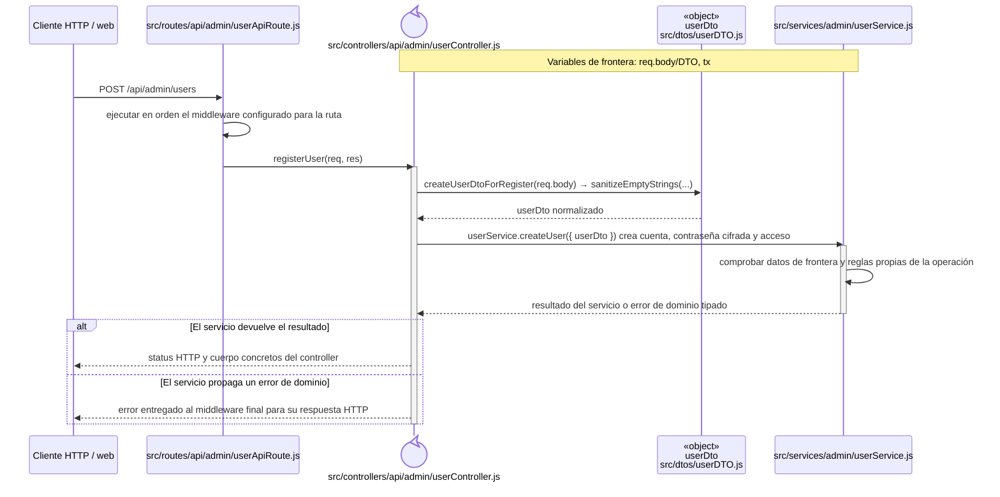

# `CU-IDA-06` — Crear usuario y asignar acceso

**Patrones:** `BE-P01`, `BE-P03`, `BE-P04`.

```mermaid
sequenceDiagram
    participant Client as Cliente HTTP / web
    participant Route as src/routes/api/admin/userApiRoute.js
    participant Controller@{ "type": "control" } as src/controllers/api/admin/userController.js
    participant UserDto as «object»<br/>userDto<br/>src/dtos/userDTO.js
    participant Domain as src/services/admin/userService.js
    Note over Controller,Domain: Variables de frontera: req.body/DTO, tx

    Client->>Route: POST /api/admin/users
    Route->>Route: ejecutar en orden el middleware configurado para la ruta
    Route->>Controller: registerUser(req, res)
    activate Controller
    Controller->>UserDto: createUserDtoForRegister(req.body) → sanitizeEmptyStrings(...)
    UserDto-->>Controller: userDto normalizado
    Controller->>Domain: userService.createUser({ userDto }) crea cuenta, contraseña cifrada y acceso
    activate Domain
    Domain->>Domain: comprobar datos de frontera y reglas propias de la operación
    Domain-->>Controller: resultado del servicio o error de dominio tipado
    deactivate Domain
    alt El servicio devuelve el resultado
        Controller-->>Client: status HTTP y cuerpo concretos del controller
    else El servicio propaga un error de dominio
        Controller-->>Client: error entregado al middleware final para su respuesta HTTP
    end
    deactivate Controller
```

