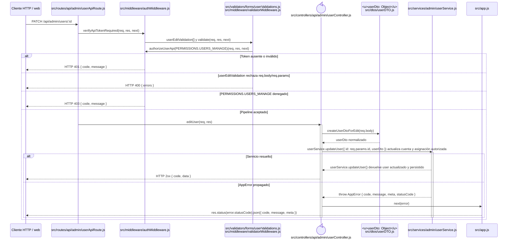

# `CU-IDA-07` — Editar usuario y acceso

**Patrones:** `BE-P01`, `BE-P03`, `BE-P04`.

```mermaid
sequenceDiagram
    participant Client as Cliente HTTP / web
    participant Route as src/routes/api/admin/userApiRoute.js
    participant Auth as src/middleware/authMiddleware.js
    participant Validator as src/validators/forms/userValidations.js<br/>src/middleware/validatorMiddleware.js
    participant Controller@{ "type": "control" } as src/controllers/api/admin/userController.js
    participant UserDto as <u>userDto: Object</u><br/>src/dtos/userDTO.js
    participant Domain as src/services/admin/userService.js
    participant ErrorHandler as src/app.js

    Client->>Route: PATCH /api/admin/users/:id
    Route->>Auth: verifyApiTokenRequired(req, res, next)
    Auth->>Validator: userEditValidation[] y validate(req, res, next)
    Validator->>Auth: authorizeUserApi(PERMISSIONS.USERS_MANAGE)(req, res, next)
    alt Token ausente o inválido
        Auth-->>Client: HTTP 401 { code, message }
    else userEditValidation rechaza req.body/req.params
        Validator-->>Client: HTTP 400 { errors }
    else PERMISSIONS.USERS_MANAGE denegado
        Auth-->>Client: HTTP 403 { code, message }
    else Pipeline aceptado
        Route->>Controller: editUser(req, res)
        activate Controller
        Controller->>UserDto: createUserDtoForEdit(req.body)
        UserDto-->>Controller: userDto normalizado
        Controller->>Domain: userService.updateUser({ id: req.params.id, userDto }) actualiza cuenta y asignación autorizada
        activate Domain
        alt Servicio resuelto
            Domain-->>Controller: userService.updateUser() devuelve user actualizado y persistido
            Controller-->>Client: HTTP 2xx { code, data }
        else AppError propagado
            Domain-->>Controller: throw AppError { code, message, meta, statusCode }
            Controller->>ErrorHandler: next(error)
            ErrorHandler-->>Client: res.status(error.statusCode).json({ code, message, meta })
        end
        deactivate Domain
        deactivate Controller
    end
```

