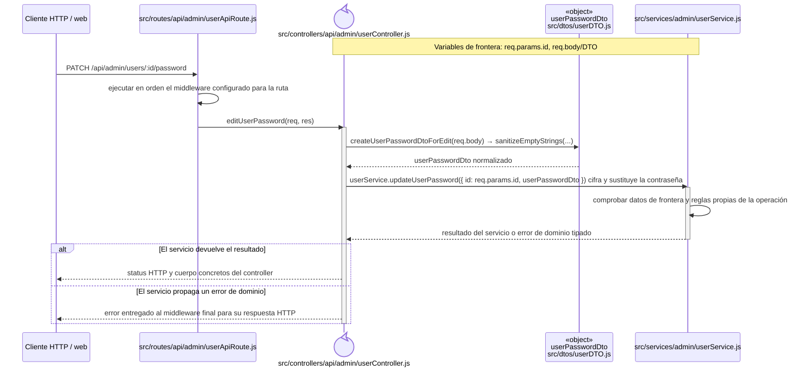

# `CU-IDA-08` — Cambiar contraseña de usuario

**Patrones:** `BE-P01`.

```mermaid
sequenceDiagram
    participant Client as Cliente HTTP / web
    participant Route as src/routes/api/admin/userApiRoute.js
    participant Controller@{ "type": "control" } as src/controllers/api/admin/userController.js
    participant PasswordDto as «object»<br/>userPasswordDto<br/>src/dtos/userDTO.js
    participant Domain as src/services/admin/userService.js
    Note over Controller,Domain: Variables de frontera: req.params.id, req.body/DTO

    Client->>Route: PATCH /api/admin/users/:id/password
    Route->>Route: ejecutar en orden el middleware configurado para la ruta
    Route->>Controller: editUserPassword(req, res)
    activate Controller
    Controller->>PasswordDto: createUserPasswordDtoForEdit(req.body) → sanitizeEmptyStrings(...)
    PasswordDto-->>Controller: userPasswordDto normalizado
    Controller->>Domain: userService.updateUserPassword({ id: req.params.id, userPasswordDto }) cifra y sustituye la contraseña
    activate Domain
    Domain->>Domain: comprobar datos de frontera y reglas propias de la operación
    Domain-->>Controller: resultado del servicio o error de dominio tipado
    deactivate Domain
    alt El servicio devuelve el resultado
        Controller-->>Client: status HTTP y cuerpo concretos del controller
    else El servicio propaga un error de dominio
        Controller-->>Client: error entregado al middleware final para su respuesta HTTP
    end
    deactivate Controller
```
