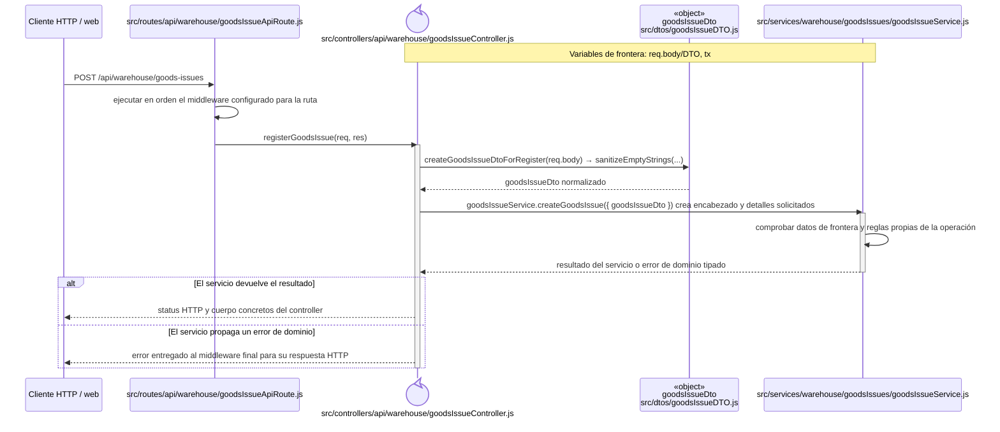
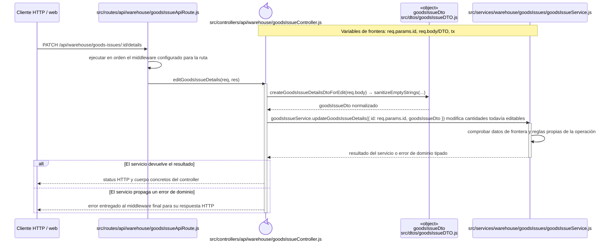
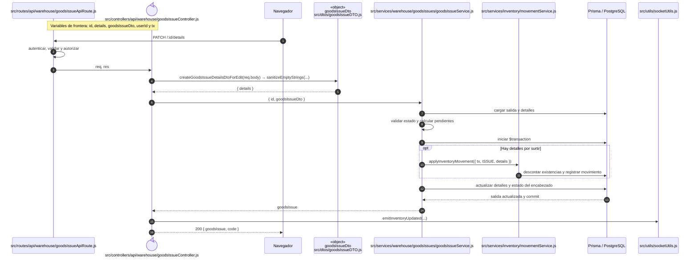
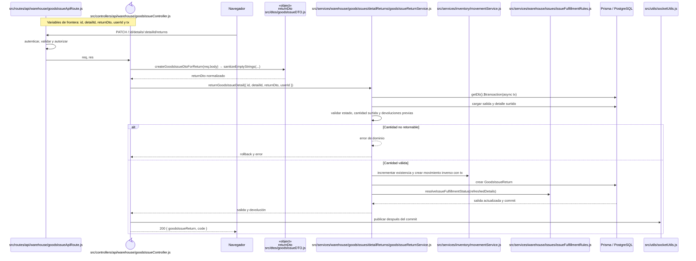
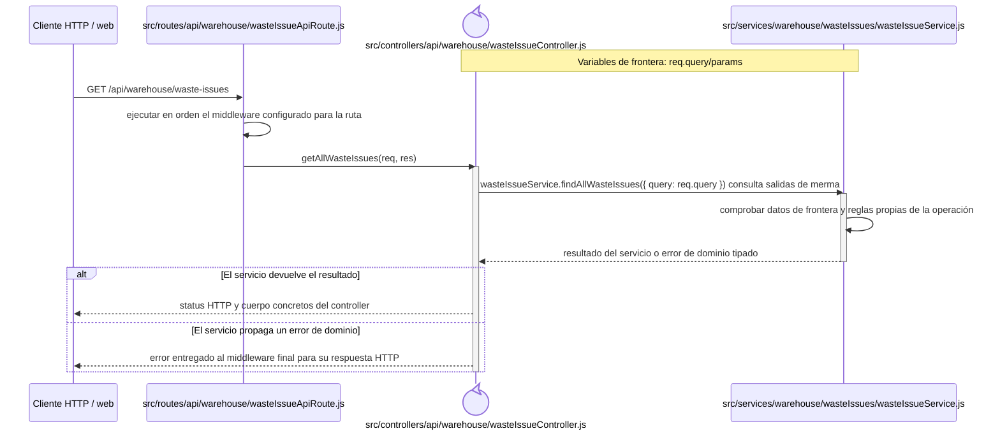
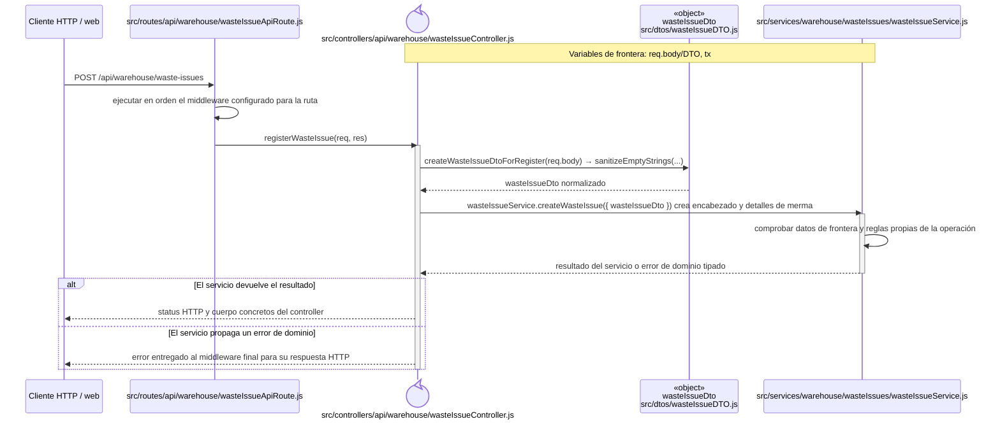
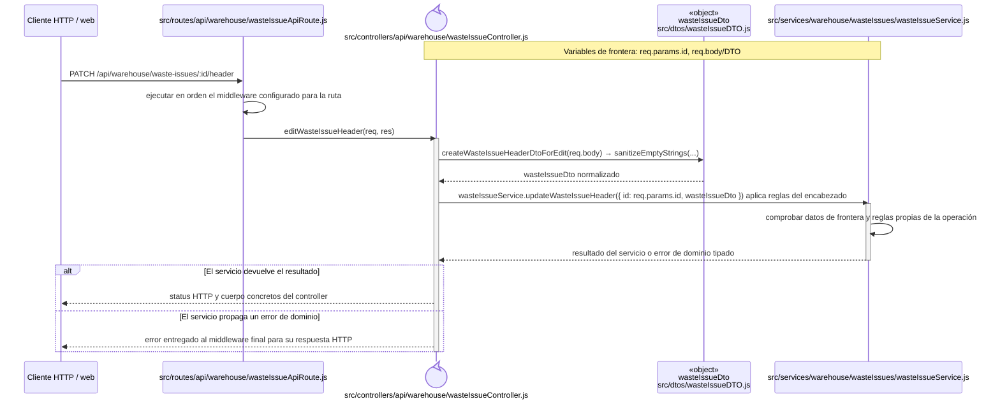
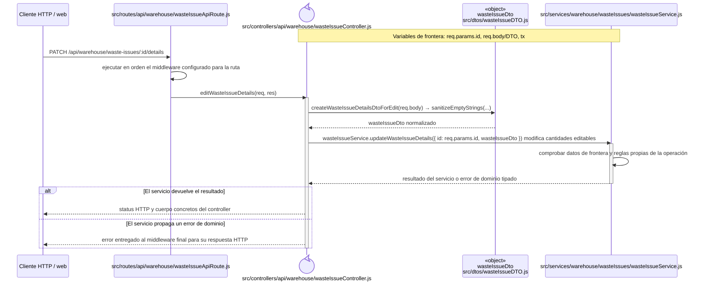
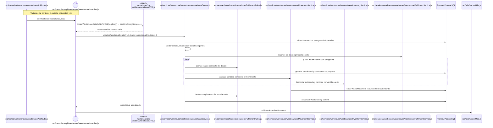
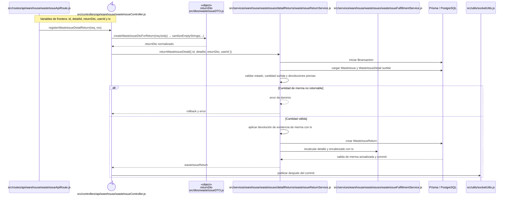

# Secuencias del código backend: Salidas

Este capítulo forma parte del [catálogo de secuencias del código backend](index.md) y conserva los recorridos aplicados del grupo `SAL`. Las reglas comunes de lectura, trazabilidad y mantenimiento se declaran en el índice de la colección.

## `CU-SAL-01`

**Patrones:** `BE-P01`.

## `CU-SAL-02`

**Patrones:** `BE-P01`, `BE-P03`, `BE-P04`.

## `CU-SAL-03`

**Patrones:** `BE-P01`, `BE-P04`.

## `CU-SAL-04`

**Patrones:** `BE-P01`, `BE-P03`, `BE-P04`, `BE-P05`.

## `CU-SAL-05`

**Patrones:** `BE-P01`, `BE-P03`, `BE-P04`, `BE-P05`.

## `CU-SAL-06`

**Patrones:** `BE-P01`, `BE-P03`, `BE-P04`, `BE-P05`.

## `CU-SAL-07`

**Patrones:** `BE-P01`.

## `CU-SAL-08`

**Patrones:** `BE-P01`, `BE-P03`, `BE-P04`.

## `CU-SAL-09`

**Patrones:** `BE-P01`, `BE-P04`.

## `CU-SAL-10`

**Patrones:** `BE-P01`, `BE-P03`, `BE-P04`, `BE-P05`.

## `CU-SAL-11`

**Patrones:** `BE-P01`, `BE-P03`, `BE-P04`, `BE-P05`.

## `CU-SAL-12`

**Patrones:** `BE-P01`, `BE-P03`, `BE-P04`, `BE-P05`.

