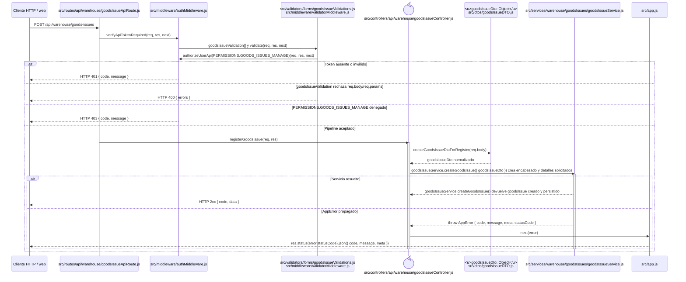

# `CU-SAL-02` — Crear salida de material

**Patrones:** `BE-P01`, `BE-P03`, `BE-P04`.

Si el selector crea un cliente, antes de esta secuencia el navegador completa el `POST
/api/sales/clients` de [`CU-CAT-06`](../catalogs/cu-cat-06.md#cu-cat-06). La salida recibe el
`clientId` resultante; ambas escrituras permanecen separadas y el alta no concede acceso a la ruta
web independiente de clientes.

