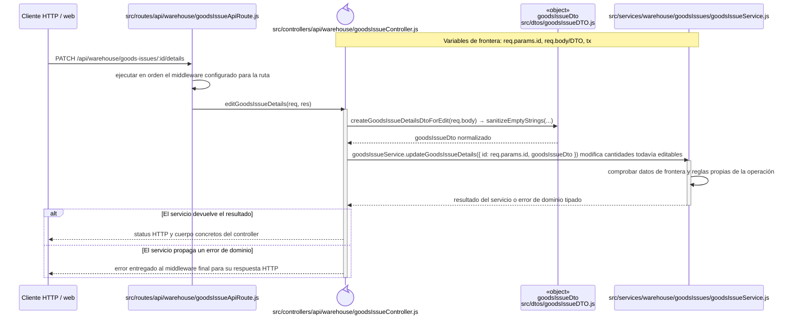

# `CU-SAL-04` — Editar detalles de material de una salida

**Patrones:** `BE-P01`, `BE-P03`, `BE-P04`, `BE-P05`.

```mermaid
sequenceDiagram
    participant Client as Cliente HTTP / web
    participant Route as src/routes/api/warehouse/goodsIssueApiRoute.js
    participant Controller@{ "type": "control" } as src/controllers/api/warehouse/goodsIssueController.js
    participant IssueDto as «object»<br/>goodsIssueDto<br/>src/dtos/goodsIssueDTO.js
    participant Domain as src/services/warehouse/goodsIssues/goodsIssueService.js
    Note over Controller,Domain: Variables de frontera: req.params.id, req.body/DTO, tx

    Client->>Route: PATCH /api/warehouse/goods-issues/:id/details
    Route->>Route: ejecutar en orden el middleware configurado para la ruta
    Route->>Controller: editGoodsIssueDetails(req, res)
    activate Controller
    Controller->>IssueDto: createGoodsIssueDetailsDtoForEdit(req.body) → sanitizeEmptyStrings(...)
    IssueDto-->>Controller: goodsIssueDto normalizado
    Controller->>Domain: goodsIssueService.updateGoodsIssueDetails({ id: req.params.id, goodsIssueDto }) modifica cantidades todavía editables
    activate Domain
    Domain->>Domain: comprobar datos de frontera y reglas propias de la operación
    Domain-->>Controller: resultado del servicio o error de dominio tipado
    deactivate Domain
    alt El servicio devuelve el resultado
        Controller-->>Client: status HTTP y cuerpo concretos del controller
    else El servicio propaga un error de dominio
        Controller-->>Client: error entregado al middleware final para su respuesta HTTP
    end
    deactivate Controller
```

