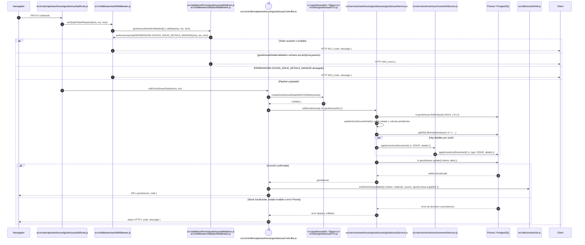

# `CU-SAL-05` — Surtir material

**Patrones:** `BE-P01`, `BE-P03`, `BE-P04`, `BE-P05`.

```mermaid
sequenceDiagram
    autonumber
    participant Browser as Navegador
    participant Router as src/routes/api/warehouse/goodsIssueApiRoute.js
    participant Auth as src/middleware/authMiddleware.js
    participant Validator as src/validators/forms/goodsIssueValidations.js<br/>src/middleware/validatorMiddleware.js
    participant Controller@{ "type": "control" } as src/controllers/api/warehouse/goodsIssueController.js
    participant IssueDto as <u>goodsIssueDto: Object</u><br/>src/dtos/goodsIssueDTO.js
    participant Service as src/services/warehouse/goodsIssues/goodsIssueService.js
    participant Inventory as src/services/inventory/movementService.js
    participant Prisma as Prisma / PostgreSQL
    participant Socket as src/utils/socketUtils.js

    Browser->>Router: PATCH /:id/details
    Router->>Auth: verifyApiTokenRequired(req, res, next)
    Auth->>Validator: goodsIssueDetailsValidation[] y validate(req, res, next)
    Validator->>Auth: authorizeUserApi(PERMISSIONS.GOODS_ISSUE_DETAILS_MANAGE)(req, res, next)
    alt Token ausente o inválido
        Auth-->>Client: HTTP 401 { code, message }
    else goodsIssueDetailsValidation rechaza req.body/req.params
        Validator-->>Client: HTTP 400 { errors }
    else PERMISSIONS.GOODS_ISSUE_DETAILS_MANAGE denegado
        Auth-->>Client: HTTP 403 { code, message }
    else Pipeline aceptado
        Router->>Controller: editGoodsIssueDetails(req, res)
        Controller->>IssueDto: createGoodsIssueDetailsDtoForEdit(req.body)
        IssueDto-->>Controller: { details }
        Controller->>Service: editGoodsIssue({ id, goodsIssueDto })
        Service->>Prisma: tx.goodsIssue.findUnique({ where: { id } })
        Service->>Service: updateGoodsIssueDetails() valida estado y calcula pendientes
        Service->>Prisma: getDb().$transaction(async tx => ...)
        opt Hay detalles por surtir
            Service->>Inventory: applyInventoryMovement({ tx, ISSUE, details })
            Inventory->>Prisma: applyInventoryMovement({ tx, type: ISSUE, details })
        end
        Service->>Prisma: tx.goodsIssue.update({ where, data })
        alt Commit confirmado
            Prisma-->>Service: salida actualizada
            Service-->>Controller: goodsIssue
            Controller->>Socket: emitInventoryUpdated({ context: 'material', source: 'goods-issue-supplied' })
            Controller-->>Browser: 200 { goodsIssue, code }
        else Stock insuficiente, estado inválido o error Prisma
            Prisma-->>Service: error de dominio o persistencia
            Service-->>Controller: error tipado y rollback
            Controller-->>Browser: status HTTP { code, message }
        end
    end
```

