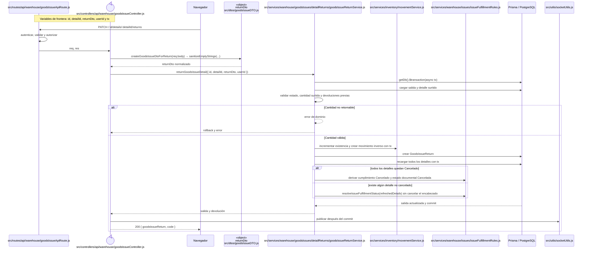

# `CU-SAL-06` — Devolver material surtido

**Patrones:** `BE-P01`, `BE-P03`, `BE-P04`, `BE-P05`.

```mermaid
sequenceDiagram
    Note over Router,Controller: Variables de frontera: id, detailId, returnDto, userId y tx
    participant Browser as Navegador
    participant Router as src/routes/api/warehouse/goodsIssueApiRoute.js
    participant Controller@{ "type": "control" } as src/controllers/api/warehouse/goodsIssueController.js
    participant ReturnDto as «object»<br/>returnDto<br/>src/dtos/goodsIssueDTO.js
    participant Service as src/services/warehouse/goodsIssues/detailReturns/goodsIssueReturnService.js
    participant Inventory as src/services/inventory/movementService.js
    participant Status as src/services/warehouse/issues/issueFulfillmentRules.js
    participant Prisma as Prisma / PostgreSQL
    participant Socket as src/utils/socketUtils.js

    Browser->>Router: PATCH /:id/details/:detailId/returns
    Router->>Router: autenticar, validar y autorizar
    Router->>Controller: req, res
    Controller->>ReturnDto: createGoodsIssueDtoForReturn(req.body) → sanitizeEmptyStrings(...)
    ReturnDto-->>Controller: returnDto normalizado
    Controller->>Service: returnGoodsIssueDetail({ id, detailId, returnDto, userId })
    Service->>Prisma: getDb().$transaction(async tx)
    Service->>Prisma: cargar salida y detalle surtido
    Service->>Service: validar estado, cantidad surtida y devoluciones previas
    alt Cantidad no retornable
        Service-->>Service: error de dominio
        Service-->>Controller: rollback y error
    else Cantidad válida
        Service->>Inventory: incrementar existencia y crear movimiento inverso con tx
        Service->>Prisma: crear GoodsIssueReturn
        Service->>Prisma: recargar todos los detalles con tx
        alt todos los detalles quedan Cancelado
            Service->>Status: derivar cumplimiento Cancelado y estado documental Cancelada
        else existe algún detalle no cancelado
            Service->>Status: resolveIssueFulfillmentStatus(refreshedDetails) sin cancelar el encabezado
        end
        Prisma-->>Service: salida actualizada y commit
        Service-->>Controller: salida y devolución
        Controller->>Socket: publicar después del commit
        Controller-->>Browser: 200 { goodsIssueReturn, code }
    end
```

