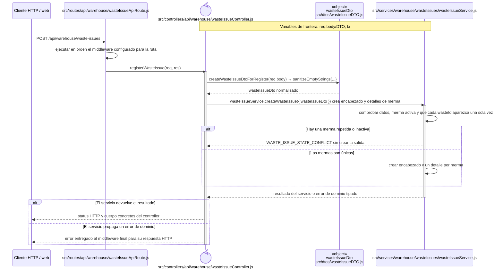

# `CU-SAL-09` — Crear salida de merma

**Patrones:** `BE-P01`, `BE-P03`, `BE-P04`.

```mermaid
sequenceDiagram
    participant Client as Cliente HTTP / web
    participant Route as src/routes/api/warehouse/wasteIssueApiRoute.js
    participant Controller@{ "type": "control" } as src/controllers/api/warehouse/wasteIssueController.js
    participant IssueDto as «object»<br/>wasteIssueDto<br/>src/dtos/wasteIssueDTO.js
    participant Domain as src/services/warehouse/wasteIssues/wasteIssueService.js
    Note over Controller,Domain: Variables de frontera: req.body/DTO, tx

    Client->>Route: POST /api/warehouse/waste-issues
    Route->>Route: ejecutar en orden el middleware configurado para la ruta
    Route->>Controller: registerWasteIssue(req, res)
    activate Controller
    Controller->>IssueDto: createWasteIssueDtoForRegister(req.body) → sanitizeEmptyStrings(...)
    IssueDto-->>Controller: wasteIssueDto normalizado
    Controller->>Domain: wasteIssueService.createWasteIssue({ wasteIssueDto }) crea encabezado y detalles de merma
    activate Domain
    Domain->>Domain: comprobar datos, merma activa y que cada wasteId aparezca una sola vez
    alt Hay una merma repetida o inactiva
        Domain-->>Controller: WASTE_ISSUE_STATE_CONFLICT sin crear la salida
    else Las mermas son únicas
        Domain->>Domain: crear encabezado y un detalle por merma
    end
    Domain-->>Controller: resultado del servicio o error de dominio tipado
    deactivate Domain
    alt El servicio devuelve el resultado
        Controller-->>Client: status HTTP y cuerpo concretos del controller
    else El servicio propaga un error de dominio
        Controller-->>Client: error entregado al middleware final para su respuesta HTTP
    end
    deactivate Controller
```

