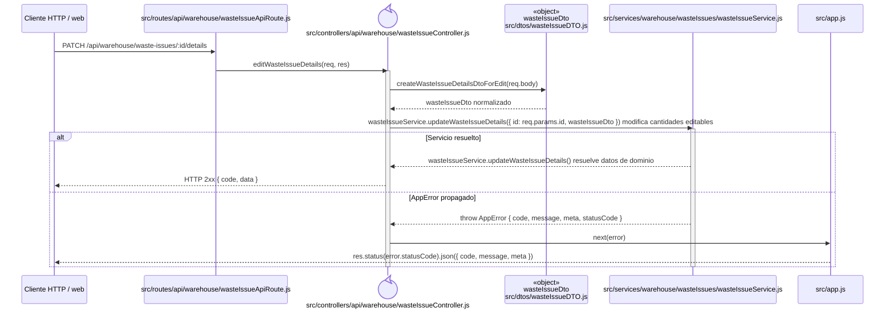

# `CU-SAL-11` — Editar detalles de merma de una salida

**Patrones:** `BE-P01`, `BE-P03`, `BE-P04`, `BE-P05`.

```mermaid
sequenceDiagram
    participant Client as Cliente HTTP / web
    participant Route as src/routes/api/warehouse/wasteIssueApiRoute.js
    participant Controller@{ "type": "control" } as src/controllers/api/warehouse/wasteIssueController.js
    participant IssueDto as «object»<br/>wasteIssueDto<br/>src/dtos/wasteIssueDTO.js
    participant Domain as src/services/warehouse/wasteIssues/wasteIssueService.js
    participant ErrorHandler as src/app.js

    Client->>Route: PATCH /api/warehouse/waste-issues/:id/details
    Route->>Controller: editWasteIssueDetails(req, res)
    activate Controller
    Controller->>IssueDto: createWasteIssueDetailsDtoForEdit(req.body)
    IssueDto-->>Controller: wasteIssueDto normalizado
    Controller->>Domain: wasteIssueService.updateWasteIssueDetails({ id: req.params.id, wasteIssueDto }) modifica cantidades editables
    activate Domain
    alt Servicio resuelto
        Domain-->>Controller: wasteIssueService.updateWasteIssueDetails() resuelve datos de dominio
        Controller-->>Client: HTTP 2xx { code, data }
    else AppError propagado
        Domain-->>Controller: throw AppError { code, message, meta, statusCode }
        Controller->>ErrorHandler: next(error)
        ErrorHandler-->>Client: res.status(error.statusCode).json({ code, message, meta })
    end
    deactivate Domain
    deactivate Controller
```

