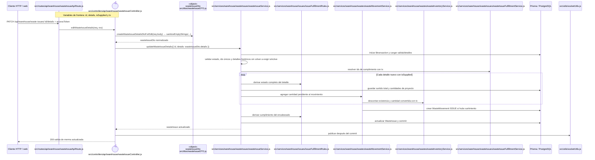

# `CU-SAL-12` — Surtir merma

**Patrones:** `BE-P01`, `BE-P03`, `BE-P04`, `BE-P05`.

```mermaid
sequenceDiagram
    participant Client as Cliente HTTP / web
    Note over Router,Controller: Variables de frontera: id, details, isSupplied y tx
    participant Router as src/routes/api/warehouse/wasteIssueApiRoute.js
    participant Controller@{ "type": "control" } as src/controllers/api/warehouse/wasteIssueController.js
    participant IssueDto as «object»<br/>wasteIssueDto<br/>src/dtos/wasteIssueDTO.js
    participant Service as src/services/warehouse/wasteIssues/wasteIssueService.js
    participant Rules as src/services/warehouse/issues/issueFulfillmentRules.js
    participant Movement as src/services/warehouse/wastes/wasteMovementService.js
    participant Stock as src/services/warehouse/wastes/wasteInventoryService.js
    participant Status as src/services/warehouse/wasteIssues/wasteIssueFulfillmentService.js
    participant Prisma as Prisma / PostgreSQL
    participant Socket as src/utils/socketUtils.js

    Client->>Router: PATCH /api/warehouse/waste-issues/:id/details + accessToken
    Router->>Controller: editWasteIssueDetails(req, res)
    Controller->>IssueDto: createWasteIssueDetailsDtoForEdit(req.body) → sanitizeEmptyStrings(...)
    IssueDto-->>Controller: wasteIssueDto normalizado
    Controller->>Service: updateWasteIssueDetails({ id, details: wasteIssueDto.details })
    Service->>Prisma: iniciar $transaction y cargar salida/detalles
    Service->>Service: validar estado, ids únicos y detalles históricos sin volver a exigir isActive
    Service->>Status: resolver ids de cumplimiento con tx
    loop Cada detalle nuevo con isSupplied
        Service->>Rules: derivar estado completo del detalle
        Service->>Prisma: guardar surtido total y cantidades de proyecto
        Service->>Movement: agregar cantidad pendiente al movimiento
        Movement->>Stock: descontar existencia y cantidad convertida con tx
    end
    Movement->>Prisma: crear WasteMovement ISSUE si hubo surtimiento
    Service->>Rules: derivar cumplimiento del encabezado
    Service->>Prisma: actualizar WasteIssue y commit
    Service-->>Controller: wasteIssue actualizado
    Controller->>Socket: publicar después del commit
    Controller-->>Client: 200 salida de merma actualizada
```

