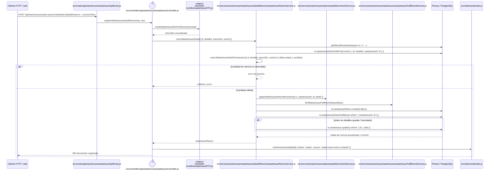

# `CU-SAL-13` — Devolver merma surtida

**Patrones:** `BE-P01`, `BE-P03`, `BE-P04`, `BE-P05`.

```mermaid
sequenceDiagram
    participant Client as Cliente HTTP / web
    participant Router as src/routes/api/warehouse/wasteIssueApiRoute.js
    participant Controller@{ "type": "control" } as src/controllers/api/warehouse/wasteIssueController.js
    participant ReturnDto as «object»<br/>returnDto<br/>src/dtos/wasteIssueDTO.js
    participant Service as src/services/warehouse/wasteIssues/detailReturns/wasteIssueReturnService.js
    participant Movement as src/services/warehouse/wastes/wasteMovementService.js
    participant Status as src/services/warehouse/wasteIssues/wasteIssueFulfillmentService.js
    participant Prisma as Prisma / PostgreSQL
    participant Socket as src/utils/socketUtils.js

    Client->>Router: POST /api/warehouse/waste-issues/:id/details/:detailId/returns + accessToken
    Router->>Controller: registerWasteIssueDetailReturn(req, res)
    Controller->>ReturnDto: createWasteIssueDtoForReturn(req.body)
    ReturnDto-->>Controller: returnDto normalizado
    Controller->>Service: returnWasteIssueDetail({ id, detailId, returnDto, userId })
    Service->>Prisma: getDb().$transaction(async tx => ...)
    Service->>Prisma: tx.wasteIssueDetail.findFirst({ where: { id: detailId, wasteIssueId: id } })
    Service->>Service: returnWasteIssueDetailTransaction({ id, detailId, returnDto, userId }) valida estado y cantidad
    alt Cantidad de merma no retornable
        Service-->>Service: error de dominio
        Service-->>Controller: rollback y error
    else Cantidad válida
        Service->>Movement: applyWasteIssueReturnMovement({ tx, wasteIssueId: id, detail })
        Service->>Status: findWasteIssueFulfillmentStatusIds(tx)
        Service->>Prisma: tx.wasteIssueReturn.create({ data })
        Service->>Prisma: tx.wasteIssueDetail.findMany({ where: { wasteIssueId: id } })
        alt todos los detalles quedan Cancelado
            Service->>Prisma: tx.wasteIssue.update({ where: { id }, data })
        end
        Prisma-->>Service: salida de merma actualizada y commit
        Service-->>Controller: wasteIssueReturn
        Controller->>Socket: emitInventoryUpdated({ context: 'waste', source: 'waste-issue-return-created' })
        Controller-->>Client: 200 devolución registrada
    end
```
