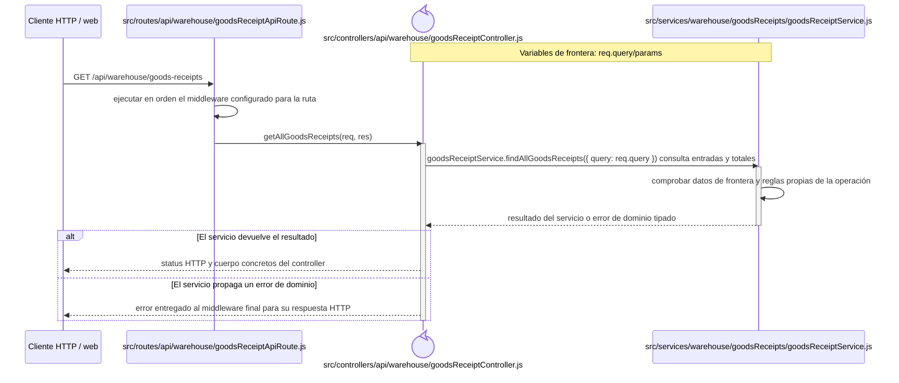
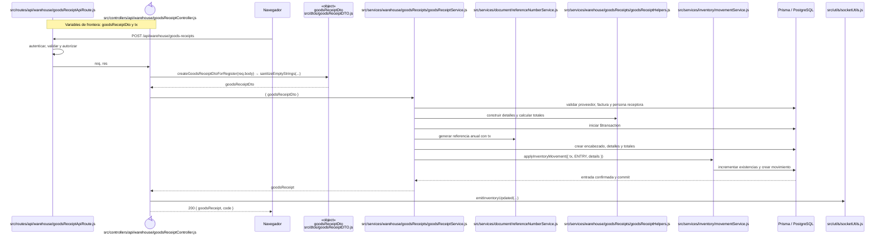
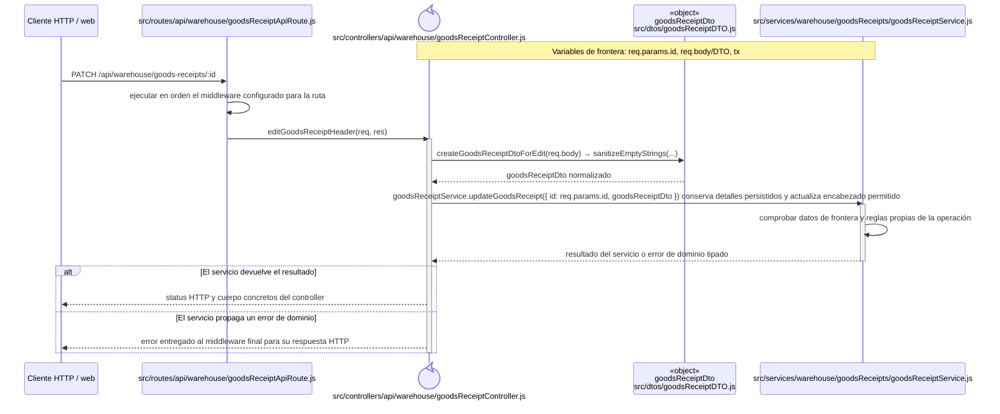
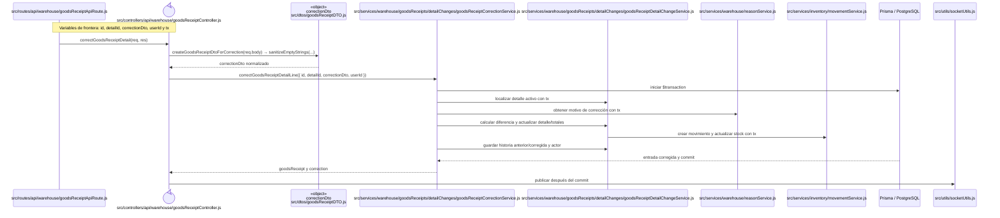
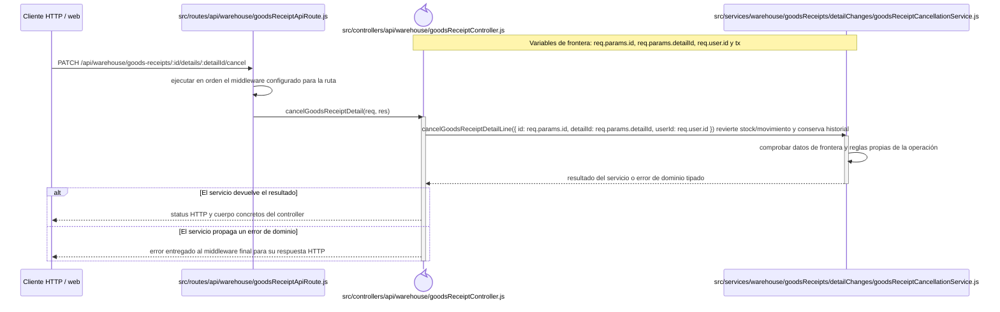

# Secuencias del código backend: Compras y entradas

Este capítulo forma parte del [catálogo de secuencias del código backend](index.md) y conserva los recorridos aplicados del grupo `ENT`. Las reglas comunes de lectura, trazabilidad y mantenimiento se declaran en el índice de la colección.

## `CU-ENT-01`

**Patrones:** `BE-P01`.

## `CU-ENT-02`

**Patrones:** `BE-P01`, `BE-P03`, `BE-P04`, `BE-P05`.

## `CU-ENT-03`

**Patrones:** `BE-P01`, `BE-P03`, `BE-P04`, `BE-P05`.

## `CU-ENT-04`

**Patrones:** `BE-P01`, `BE-P03`, `BE-P04`, `BE-P05`.

## `CU-ENT-05`

**Patrones:** `BE-P01`, `BE-P03`, `BE-P04`, `BE-P05`.

