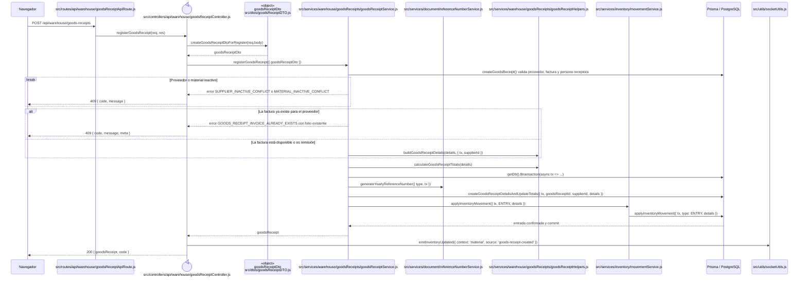

# `CU-ENT-02` — Crear compra de material

**Patrones:** `BE-P01`, `BE-P03`, `BE-P04`, `BE-P05`.

```mermaid
sequenceDiagram
    participant Browser as Navegador
    participant Router as src/routes/api/warehouse/goodsReceiptApiRoute.js
    participant Controller@{ "type": "control" } as src/controllers/api/warehouse/goodsReceiptController.js
    participant ReceiptDto as «object»<br/>goodsReceiptDto<br/>src/dtos/goodsReceiptDTO.js
    participant Service as src/services/warehouse/goodsReceipts/goodsReceiptService.js
    participant Reference as src/services/document/referenceNumberService.js
    participant DetailBuilder as src/services/warehouse/goodsReceipts/goodsReceiptHelpers.js
    participant Inventory as src/services/inventory/movementService.js
    participant Prisma as Prisma / PostgreSQL
    participant Socket as src/utils/socketUtils.js

    Browser->>Router: POST /api/warehouse/goods-receipts
    Router->>Controller: registerGoodsReceipt(req, res)
    Controller->>ReceiptDto: createGoodsReceiptDtoForRegister(req.body)
    ReceiptDto-->>Controller: goodsReceiptDto
    Controller->>Service: registerGoodsReceipt({ goodsReceiptDto })
    Service->>Prisma: createGoodsReceipt() valida proveedor, factura y persona receptora
    break Proveedor o material inactivo
        Service-->>Controller: error SUPPLIER_INACTIVE_CONFLICT o MATERIAL_INACTIVE_CONFLICT
        Controller-->>Browser: 409 { code, message }
    end
    alt La factura ya existe para el proveedor
        Service-->>Controller: error GOODS_RECEIPT_INVOICE_ALREADY_EXISTS con folio existente
        Controller-->>Browser: 409 { code, message, meta }
    else La factura está disponible o es remisión
        Service->>DetailBuilder: buildGoodsReceiptDetails(details, { tx, supplierId })
    end
    Service->>DetailBuilder: calculateGoodsReceiptTotals(details)
    Service->>Prisma: getDb().$transaction(async tx => ...)
    Service->>Reference: generateYearlyReferenceNumber({ type, tx })
    Service->>Prisma: createGoodsReceiptDetailsAndUpdateTotals({ tx, goodsReceiptId, supplierId, details })
    Service->>Inventory: applyInventoryMovement({ tx, ENTRY, details })
    Inventory->>Prisma: applyInventoryMovement({ tx, type: ENTRY, details })
    Prisma-->>Service: entrada confirmada y commit
    Service-->>Controller: goodsReceipt
    Controller->>Socket: emitInventoryUpdated({ context: 'material', source: 'goods-receipt-created' })
    Controller-->>Browser: 200 { goodsReceipt, code }
```
