# `CU-ENT-02` — Crear compra de material

**Patrones:** `BE-P01`, `BE-P03`, `BE-P04`, `BE-P05`.

Si el selector crea un proveedor, antes de esta secuencia el navegador completa el `POST
/api/warehouse/suppliers` de [`CU-CAT-02`](../catalogs/cu-cat-02.md#cu-cat-02). La compra recibe el
`supplierId` resultante; el alta no se integra en la transacción de la compra ni habilita la ruta web
independiente de proveedores.

```mermaid
sequenceDiagram
    participant Browser as Navegador
    participant Router as src/routes/api/warehouse/goodsReceiptApiRoute.js
    participant Auth as src/middleware/authMiddleware.js
    participant Validator as src/validators/forms/goodsReceiptValidations.js<br/>src/middleware/validatorMiddleware.js
    participant Controller@{ "type": "control" } as src/controllers/api/warehouse/goodsReceiptController.js
    participant ReceiptDto as <u>goodsReceiptDto: Object</u><br/>src/dtos/goodsReceiptDTO.js
    participant Service as src/services/warehouse/goodsReceipts/goodsReceiptService.js
    participant Supplier as src/services/warehouse/supplierService.js
    participant Invoice as src/services/warehouse/goodsReceipts/goodsReceiptInvoiceService.js
    participant Person as src/services/admin/person/personService.js
    participant DetailBuilder as src/services/warehouse/goodsReceipts/goodsReceiptHelpers.js
    participant Reference as src/services/document/referenceNumberService.js
    participant Inventory as src/services/inventory/movementService.js
    participant Material as src/services/warehouse/materials/supplierMaterialService.js
    participant Prisma as Prisma / PostgreSQL
    participant Socket as src/utils/socketUtils.js
    participant ErrorHandler as src/app.js

    Browser->>Router: POST /api/warehouse/goods-receipts { req.body }
    Router->>Auth: verifyApiTokenRequired(req, res, next)
    Auth->>Validator: goodsReceiptValidation[] y validate(req, res, next)
    Validator->>Auth: authorizeUserApi(PERMISSIONS.GOODS_RECEIPTS_MANAGE)(req, res, next)
    alt Token ausente o inválido
        Auth-->>Browser: HTTP 401 { code, message }
    else goodsReceiptValidation rechaza req.body
        Validator-->>Browser: HTTP 400 { errors }
    else PERMISSIONS.GOODS_RECEIPTS_MANAGE denegado
        Auth-->>Browser: HTTP 403 { code, message }
    else Pipeline aceptado
        Router->>Controller: registerGoodsReceipt(req, res)
        Controller->>ReceiptDto: createGoodsReceiptDtoForRegister(req.body)
        ReceiptDto-->>Controller: goodsReceiptDto
        Controller->>Controller: sanitizeEmptyStrings(goodsReceiptDto)
        Controller->>Service: createGoodsReceipt({ goodsReceiptDto: sanitizedGoodsReceiptDto })
        activate Service
        Service->>Supplier: findUniqueSupplier({ id: supplierId })
        Service->>Invoice: assertGoodsReceiptInvoiceAvailable({ supplierId, invoice })
        Service->>Person: findPersonById({ id: receivedById })
        Service->>DetailBuilder: buildGoodsReceiptDetails(details, { supplierId })
        DetailBuilder-->>Service: processedDetails
        Service->>DetailBuilder: calculateGoodsReceiptTotals(processedDetails)
        DetailBuilder-->>Service: totals
        Service->>Prisma: getDb().$transaction(async tx => ...)
        Service->>Reference: generateYearlyReferenceNumber({ type: GOODS_RECEIPT, tx })
        Reference-->>Service: referenceNumber
        Service->>Prisma: tx.goodsReceipt.create({ data: encabezado, totals, processedDetails })
        Prisma-->>Service: goodsReceipt con details
        Service->>Inventory: applyInventoryMovement({ tx, reference, details, movementType: ENTRY })
        Inventory->>Prisma: tx.supplierMaterial.update(...) y tx.movement.create(...)
        Prisma-->>Service: commit
        Service->>Material: updateMaterialUnitCostIfHigher({ supplierId, details })
        Material-->>Service: updateMaterialUnitCostIfHigher() resuelve después del commit
        Service-->>Controller: goodsReceipt
        deactivate Service
        Controller->>Socket: emitInventoryUpdated({ context: 'material', source: 'goods-receipt-created' })
        Controller-->>Browser: HTTP 200 { goodsReceipt, code }
    end
    opt AppError o error de persistencia
        Service-->>Controller: throw AppError { code, message, meta, statusCode }
        Controller->>ErrorHandler: next(error)
        ErrorHandler-->>Browser: HTTP error { code, message, meta }
    end
```

