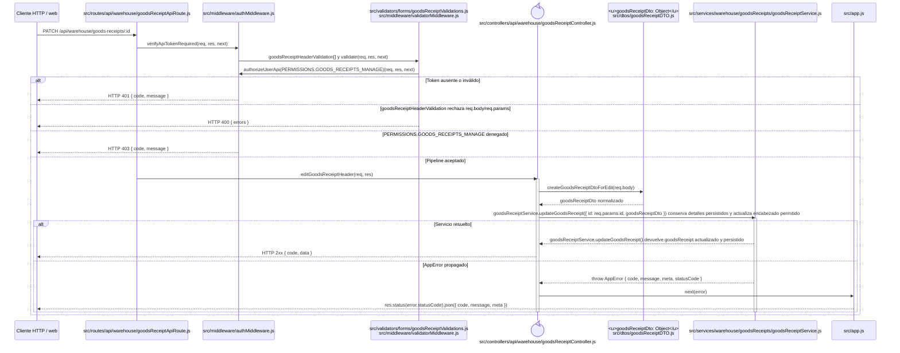

# `CU-ENT-03` — Editar compra de material

**Patrones:** `BE-P01`, `BE-P03`, `BE-P04`, `BE-P05`.

```mermaid
sequenceDiagram
    participant Client as Cliente HTTP / web
    participant Route as src/routes/api/warehouse/goodsReceiptApiRoute.js
    participant Auth as src/middleware/authMiddleware.js
    participant Validator as src/validators/forms/goodsReceiptValidations.js<br/>src/middleware/validatorMiddleware.js
    participant Controller@{ "type": "control" } as src/controllers/api/warehouse/goodsReceiptController.js
    participant ReceiptDto as <u>goodsReceiptDto: Object</u><br/>src/dtos/goodsReceiptDTO.js
    participant Domain as src/services/warehouse/goodsReceipts/goodsReceiptService.js
    participant ErrorHandler as src/app.js

    Client->>Route: PATCH /api/warehouse/goods-receipts/:id
    Route->>Auth: verifyApiTokenRequired(req, res, next)
    Auth->>Validator: goodsReceiptHeaderValidation[] y validate(req, res, next)
    Validator->>Auth: authorizeUserApi(PERMISSIONS.GOODS_RECEIPTS_MANAGE)(req, res, next)
    alt Token ausente o inválido
        Auth-->>Client: HTTP 401 { code, message }
    else goodsReceiptHeaderValidation rechaza req.body/req.params
        Validator-->>Client: HTTP 400 { errors }
    else PERMISSIONS.GOODS_RECEIPTS_MANAGE denegado
        Auth-->>Client: HTTP 403 { code, message }
    else Pipeline aceptado
        Route->>Controller: editGoodsReceiptHeader(req, res)
        activate Controller
        Controller->>ReceiptDto: createGoodsReceiptDtoForEdit(req.body)
        ReceiptDto-->>Controller: goodsReceiptDto normalizado
        Controller->>Domain: goodsReceiptService.updateGoodsReceipt({ id: req.params.id, goodsReceiptDto }) conserva detalles persistidos y actualiza encabezado permitido
        activate Domain
        alt Servicio resuelto
            Domain-->>Controller: goodsReceiptService.updateGoodsReceipt() devuelve goodsReceipt actualizado y persistido
            Controller-->>Client: HTTP 2xx { code, data }
        else AppError propagado
            Domain-->>Controller: throw AppError { code, message, meta, statusCode }
            Controller->>ErrorHandler: next(error)
            ErrorHandler-->>Client: res.status(error.statusCode).json({ code, message, meta })
        end
        deactivate Domain
        deactivate Controller
    end
```

