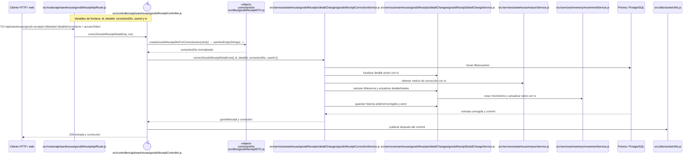

# `CU-ENT-04` — Corregir material de una compra

**Patrones:** `BE-P01`, `BE-P03`, `BE-P04`, `BE-P05`.

```mermaid
sequenceDiagram
    participant Client as Cliente HTTP / web
    Note over Router,Controller: Variables de frontera: id, detailId, correctionDto, userId y tx
    participant Router as src/routes/api/warehouse/goodsReceiptApiRoute.js
    participant Controller@{ "type": "control" } as src/controllers/api/warehouse/goodsReceiptController.js
    participant CorrectionDto as «object»<br/>correctionDto<br/>src/dtos/goodsReceiptDTO.js
    participant Service as src/services/warehouse/goodsReceipts/detailChanges/goodsReceiptCorrectionService.js
    participant Change as src/services/warehouse/goodsReceipts/detailChanges/goodsReceiptDetailChangeService.js
    participant Reason as src/services/warehouse/reasonService.js
    participant Inventory as src/services/inventory/movementService.js
    participant Prisma as Prisma / PostgreSQL
    participant Socket as src/utils/socketUtils.js

    Client->>Router: PATCH /api/warehouse/goods-receipts/:id/details/:detailId/corrections + accessToken
    Router->>Controller: correctGoodsReceiptDetail(req, res)
    Controller->>CorrectionDto: createGoodsReceiptDtoForCorrection(req.body) → sanitizeEmptyStrings(...)
    CorrectionDto-->>Controller: correctionDto normalizado
    Controller->>Service: correctGoodsReceiptDetailLine({ id, detailId, correctionDto, userId })
    Service->>Prisma: iniciar $transaction
    Service->>Change: localizar detalle activo con tx
    Service->>Reason: obtener motivo de corrección con tx
    Service->>Change: calcular diferencia y actualizar detalle/totales
    Change->>Inventory: crear movimiento y actualizar stock con tx
    Service->>Change: guardar historia anterior/corregida y actor
    Prisma-->>Service: entrada corregida y commit
    Service-->>Controller: goodsReceipt y correction
    Controller->>Socket: publicar después del commit
    Controller-->>Client: 200 entrada y corrección
```

