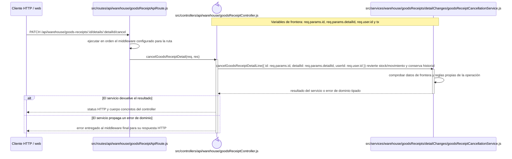

# `CU-ENT-05` — Cancelar material de una compra

**Patrones:** `BE-P01`, `BE-P03`, `BE-P04`, `BE-P05`.

```mermaid
sequenceDiagram
    participant Client as Cliente HTTP / web
    participant Route as src/routes/api/warehouse/goodsReceiptApiRoute.js
    participant Controller@{ "type": "control" } as src/controllers/api/warehouse/goodsReceiptController.js
    participant Domain as src/services/warehouse/goodsReceipts/detailChanges/goodsReceiptCancellationService.js
    Note over Controller,Domain: Variables de frontera: req.params.id, req.params.detailId, req.user.id y tx

    Client->>Route: PATCH /api/warehouse/goods-receipts/:id/details/:detailId/cancel
    Route->>Route: ejecutar en orden el middleware configurado para la ruta
    Route->>Controller: cancelGoodsReceiptDetail(req, res)
    activate Controller
    Controller->>Domain: cancelGoodsReceiptDetailLine({ id: req.params.id, detailId: req.params.detailId, userId: req.user.id }) revierte stock/movimiento y conserva historial
    activate Domain
    Domain->>Domain: comprobar datos de frontera y reglas propias de la operación
    Domain-->>Controller: resultado del servicio o error de dominio tipado
    deactivate Domain
    alt El servicio devuelve el resultado
        Controller-->>Client: status HTTP y cuerpo concretos del controller
    else El servicio propaga un error de dominio
        Controller-->>Client: error entregado al middleware final para su respuesta HTTP
    end
    deactivate Controller
```
