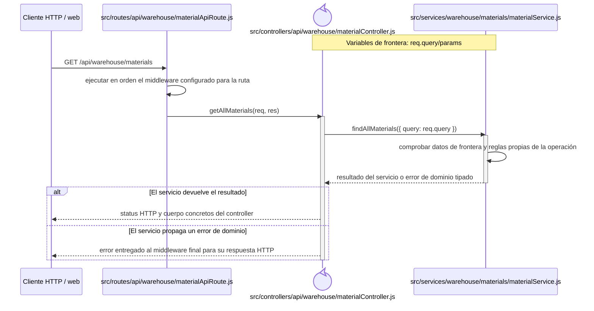
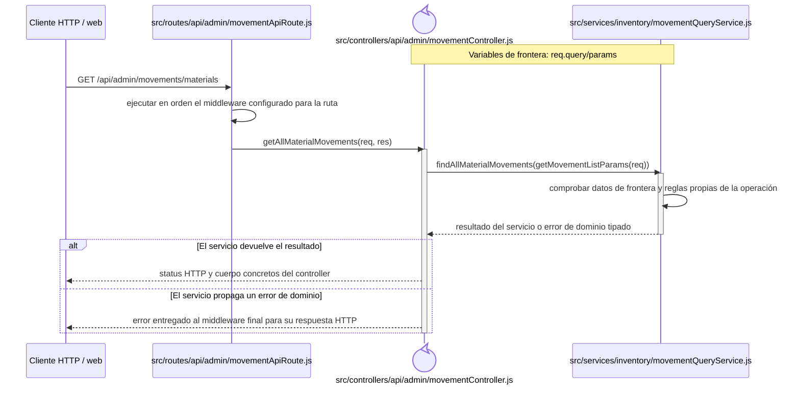
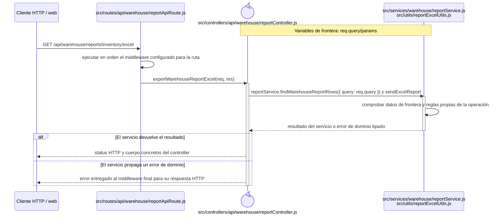
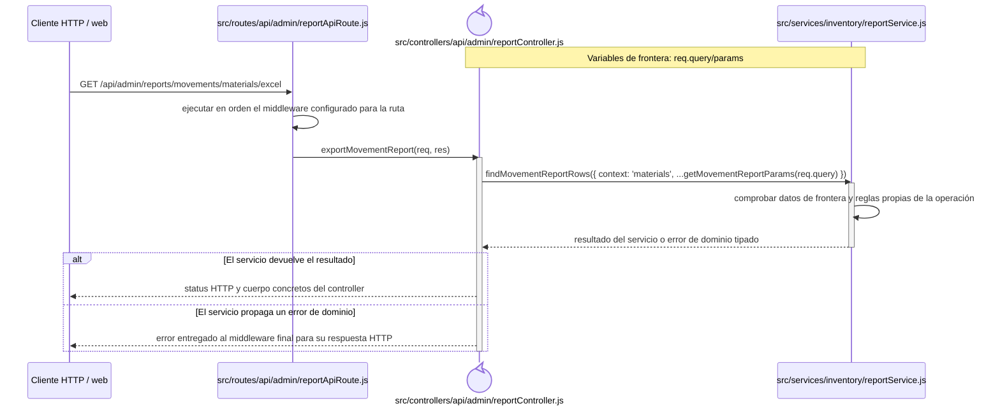
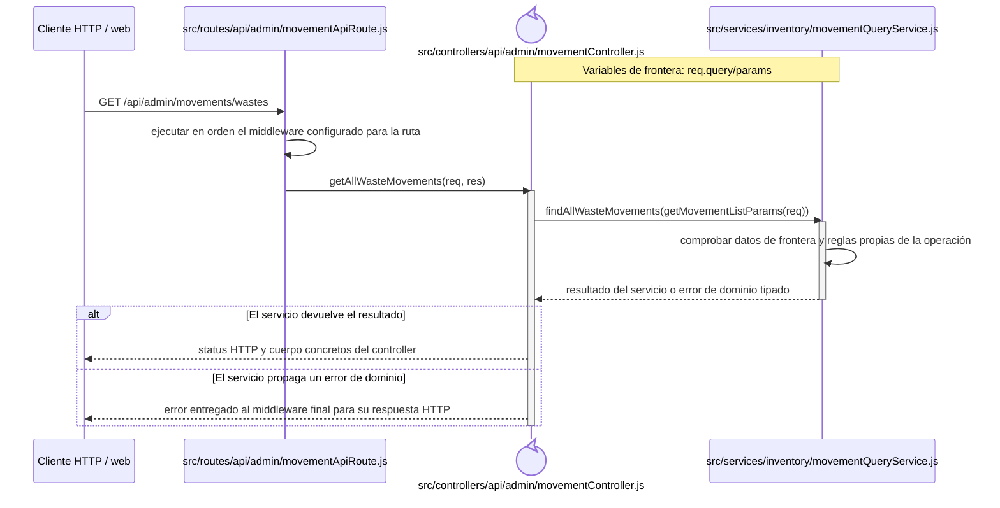
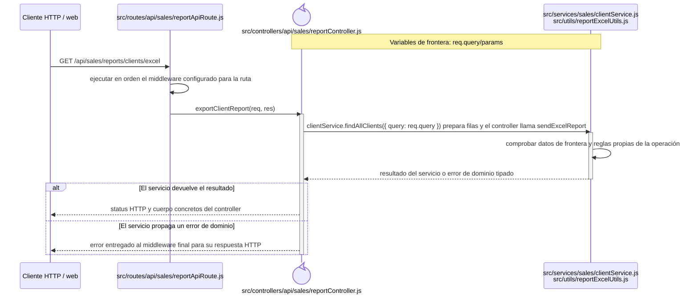
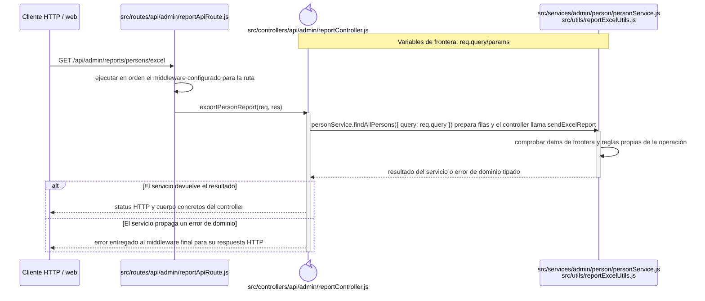

# Secuencias del código backend: Consultas y reportes

Este capítulo forma parte del [catálogo de secuencias del código backend](index.md) y conserva los recorridos aplicados del grupo `REP`. Las reglas comunes de lectura, trazabilidad y mantenimiento se declaran en el índice de la colección.

## `CU-REP-01` — Consultar inventario de materiales

**Patrones:** `BE-P06`.

## `CU-REP-02` — Consultar movimientos de materiales

**Patrones:** `BE-P06`.

## `CU-REP-03` — Generar reporte de inventario de materiales

**Patrones:** `BE-P07`.

## `CU-REP-04` — Generar reporte de salidas de material

**Patrones:** `BE-P07`.

## `CU-REP-05` — Generar reporte de movimientos de materiales

**Patrones:** `BE-P07`.

## `CU-REP-06` — Consultar inventario de mermas

**Patrones:** `BE-P06`.

## `CU-REP-07` — Consultar movimientos de mermas

**Patrones:** `BE-P06`.

## `CU-REP-08` — Generar reporte de salidas de merma

**Patrones:** `BE-P07`.

## `CU-REP-09` — Generar reporte de mermas

**Patrones:** `BE-P07`.

## `CU-REP-10` — Generar reporte de movimientos de mermas

**Patrones:** `BE-P07`.

## `CU-REP-11` — Generar reporte de compras de material

**Patrones:** `BE-P07`.

## `CU-REP-12` — Generar reporte de proveedores

**Patrones:** `BE-P07`.

## `CU-REP-13` — Generar reporte de clientes

**Patrones:** `BE-P07`.

## `CU-REP-14` — Generar reporte de personas

**Patrones:** `BE-P07`.

## `CU-REP-15` — Generar reporte de usuarios

**Patrones:** `BE-P07`.

