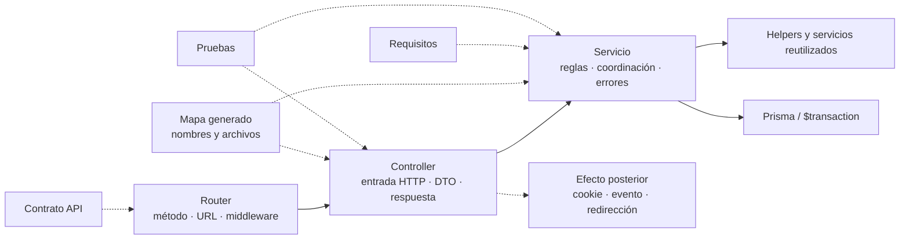
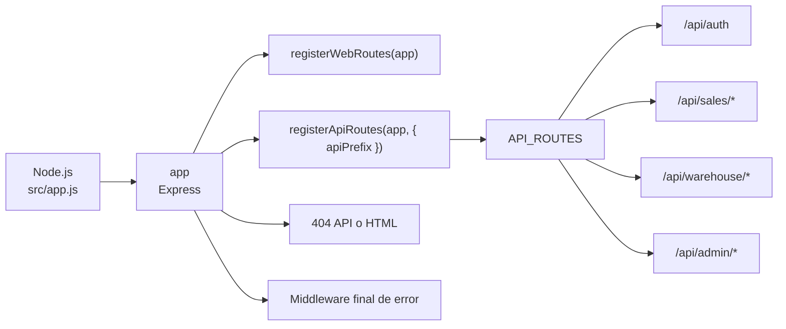
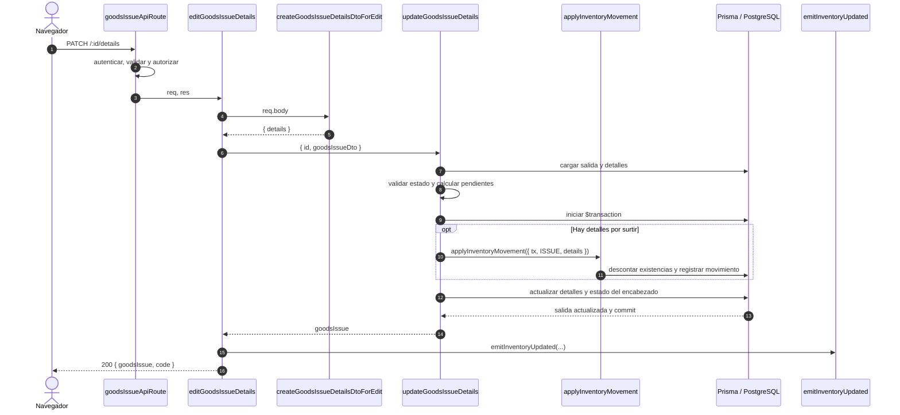
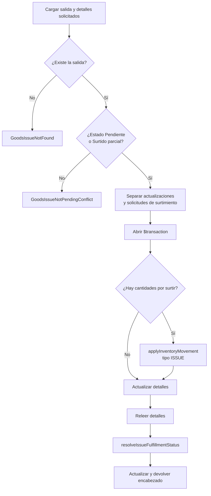

# Documentación técnica del backend

## Propósito y alcance

Este documento aplica la [guía técnica común](technical-code-documentation.md) al código
que se ejecuta en Node.js: `src/routes`, `src/middleware`, `src/controllers`, `src/dtos`,
`src/services`, `src/repository` y Prisma. El contrato consumible de cada endpoint
permanece en el [contrato API](../data/api-contract.md); aquí se explican nombres,
responsabilidades, colaboraciones y límites transaccionales de la implementación.

## Cómo documentar controladores y servicios

El mapa generado mantiene inventarios separados de símbolos exportados por
[controladores](../generated/code-map.md#símbolos-exportados-por-controladores) y
[servicios](../generated/code-map.md#símbolos-exportados-por-servicios). Esos inventarios
responden **qué existe y dónde**; esta guía define cómo explicar **qué contrato cumple y
por qué colabora con otros elementos**. No se crea una página por función ni se copia el
cuerpo completo del módulo.

### Ficha de un controlador

Un controlador se documenta cuando adapta un contrato que no resulta evidente por su
nombre, coordina más de un servicio o produce efectos posteriores. La ficha usa:

| Campo | Qué se registra |
| --- | --- |
| Nombre y archivo | Nombre exportado literal y enlace a `src/controllers/...`. |
| Ruta que lo invoca | Método, URL completa y enlace a la ficha del contrato API. |
| Entrada HTTP | Uso de `req.params`, `req.query`, `req.body`, `req.user` y archivos, sin repetir todo el esquema del validador. |
| Adaptación | DTO, normalización, paginación o transformación aplicada antes del servicio. |
| Servicio delegado | Nombre exportado del servicio y argumentos que construye el controlador. |
| Respuesta | Código HTTP y forma de éxito; los errores permanecen en el mecanismo central. |
| Efectos posteriores | Evento, cookie, redirección o cabecera que ocurre después del servicio. |
| Evidencia | Prueba del controlador o integración HTTP que verifica el contrato. |

El controlador no se presenta como propietario de una regla que vive en el servicio.
Por ejemplo, `editGoodsIssueDetails` adapta la petición, llama a
`updateGoodsIssueDetails` y después publica `inventory-updated`; el cálculo de cantidades
y estados sigue perteneciendo al servicio.

### Ficha de un servicio

Un servicio se documenta cuando contiene una regla de dominio, una transacción, efectos
en varios modelos, errores específicos o un contrato reutilizado por más de un
controlador.

| Campo | Qué se registra |
| --- | --- |
| Nombre, archivo y firma | Export literal y forma de sus argumentos; se aclaran opcionales y valores predeterminados relevantes. |
| Propósito | Resultado de dominio que produce, no una traducción palabra por palabra del nombre. |
| Precondiciones | Entidades, estados, permisos ya resueltos o datos que deben existir antes de escribir. |
| Retorno | Objeto, colección o ausencia de valor que reciben sus consumidores. |
| Errores de dominio | Clases que puede propagar y condición observable que las origina. |
| Persistencia y atomicidad | Modelos afectados, uso de `getDb()` y límite de `$transaction`; se indica qué efecto queda fuera. |
| Colaboradores | Helpers o servicios reutilizados y la razón de la colaboración. |
| Evidencia | Pruebas unitarias o de base de datos y brechas registradas. |
| Mantenimiento | Cambio de estado, firma, colaborador o transacción que obliga a revisar la ficha o diagrama. |

Una firma clara y privada no necesita ficha ni JSDoc. Para un contrato exportado
reutilizable o complejo puede añadirse JSDoc junto al código si parámetros, retorno o
errores no son deducibles por el uso. La explicación de negocio o el diagrama permanece
en Markdown para evitar comentarios extensos que se desactualicen dentro del módulo.

### Relación entre ambas capas

Las flechas continuas muestran responsabilidades de ejecución; las discontinuas enlazan
evidencia documental. El diagrama no afirma que todo controlador tenga un efecto
posterior ni que toda lectura necesite una transacción.

### Cuándo necesita un diagrama específico

Una tabla y un bloque breve son suficientes para un CRUD que sólo adapta y delega. Se
agrega una secuencia o actividad específica si el controlador coordina varios servicios,
si existen bifurcaciones relevantes, si la transacción atraviesa colaboradores o si un
efecto ocurre deliberadamente después del commit. El diagrama usa nombres exportados
reales y declara el evento que obliga a actualizarlo.

No se genera automáticamente esa semántica desde imports: el inventario puede comprobar
que `controller` y `service` existen, pero no puede determinar de forma segura quién es
propietario de una regla, qué error es contractual ni dónde debe ocurrir un efecto.

## Catálogo completo de fichas backend

La ficha se mantiene por **capacidad cohesiva**: agrupa las rutas, controladores y
servicios que implementan el mismo contrato, pero nombra todos los módulos cubiertos.
El inventario literal de cada export permanece en el
[mapa generado](../generated/code-map.md#símbolos-exportados-por-controladores); estas
fichas agregan entrada, salida, reglas, persistencia y criterio de diagrama sin convertir
un ejemplo en la documentación de todo el backend.

### Arranque, transporte web y middleware

| Capacidad | Entrada, adaptación y salida | Colaboradores, efectos y persistencia | Diagrama aplicable |
| --- | --- | --- | --- |
| Arranque Express | `src/app.js` crea `app` y `server`, configura EJS, cuerpo, estáticos, rutas, 404 y error final. `registerWebRoutes` y `registerApiRoutes` montan sus registros. | Logging, auditoría y Socket.IO rodean el transporte; el manejador final traduce `AppError` y registra fallos desconocidos. | **Contenedores/flujo de registro** cuando cambia orden o montaje; **secuencia HTTP común** para una petición. |
| Autenticación y autorización | Rutas web y API pasan por token requerido y permiso; `authController.js` adapta login, usuario actual y renovación. | `authService.js`, `jwtService.js`, cookies y tokens; no persiste dominio salvo la lectura del usuario. | **Secuencia** para login/renovación; **actividad** si cambia una bifurcación de acceso. |
| Validación y errores | Validadores de formularios escriben errores de `express-validator`; `validate` corta la cadena antes del controlador. | `serviceErrorHandler.js` y clases de `src/errors` conservan errores de dominio; no abren transacciones. | Participantes de la **secuencia HTTP común**; no un diagrama por validador. |
| Auditoría | `auditService.js` identifica escrituras y persiste la evidencia producida por middleware. | Usa los datos de solicitud/respuesta definidos por el middleware y Prisma fuera del servicio funcional. | **Secuencia** sólo si cambia el momento de persistencia respecto de la respuesta o transacción. |
| Páginas web | Los controladores bajo `controllers/web` resuelven inicio/login y las páginas de personas, usuarios, clientes, proveedores, materiales, mermas, entradas, salidas y movimientos. | Preparan `res.render`, metadatos y permisos para EJS; no ejecutan CRUD de dominio. | **Navegación/composición**, no secuencia por cada `render`. |

### Fichas de capacidades API y dominio

| Capacidad y módulos propietarios | Entrada y retorno | Reglas, errores y persistencia | Diagrama aplicable |
| --- | --- | --- | --- |
| Catálogos: `departmentController/Service`, `roleController/Service`, `presentationController/Service`, `reasonController/Service`, `unitMeasureController/Service`, `fulfillmentStatusController/Service` | `GET` sin cuerpo; la fábrica `createDataTableListController` adapta paginación cuando corresponde y devuelve colecciones JSON. | Lecturas Prisma; búsquedas por id/nombre son colaboradores de otros servicios y propagan ausencia según su contrato. | **Ninguno específico**; fábrica de listado y recorrido HTTP común. |
| Personas: `personController.js`, `personService.js`, `personRules.js` | Lista recibe consulta de tabla; alta/edición reciben DTO saneado y retornan persona. | Valida tipo y asesor interno, relaciones y unicidad antes de crear/actualizar `Person`; errores se centralizan. | **CRUD compartido**; actividad sólo si cambia la regla de asesor interno. |
| Usuarios: `userController.js`, `userService.js`, `roleService.js` | Lista, alta, edición y cambio de contraseña toman parámetros/cuerpo y retornan usuario sin convertir el controlador en dueño de credenciales. | Resuelve persona, rol y contraseña; escribe `User` y propaga conflictos/no encontrados. | **CRUD** y **secuencia específica** para contraseña únicamente si se agregan pasos o efectos. |
| Clientes: `sales/clientController.js`, `clientService.js` | Lista, alta y edición (`GET`, `POST`, `PUT`) adaptan DTO y retornan cliente. | Lee y escribe `Client` mediante `getDb(tx)` y traduce ausencia o fallos de persistencia a errores del dominio. | **CRUD compartido**; sin diagrama propio. |
| Proveedores: `supplierController.js`, `supplierService.js` | Lista, alta y edición adaptan filtros/DTO y retornan proveedor. | Persiste proveedor y relaciones; sus materiales se sincronizan mediante servicios propietarios de materiales. | **CRUD compartido**; componentes si cambia la colaboración entre dominios. |
| Materiales: `materialController.js`, `materials/materialService.js`, `materialHelpers.js`, `materialRelations.js`, `supplierMaterialService.js`, `adjustmentService.js` | Lista, alta, edición, ajuste y eliminación reciben `id`/DTO y retornan material o confirmación. | Prepara identidad, sincroniza proveedor, protege referencias y usa ajuste/movimiento para cambiar existencias; las escrituras relacionadas comparten `tx`. | **CRUD** para mantenimiento; **secuencia + actividad** para ajuste o eliminación con dependencias. |
| Mermas: `wasteController.js`, `wastes/wasteService.js`, `wasteMaterialService.js`, `wasteInventoryService.js`, `wasteMovementService.js`, `wasteStockAdjustmentService.js` | Lista, plantillas, alta, edición y ajuste reciben identificadores/DTO y retornan merma. | Coordina material origen, cantidades, inventario y movimientos; valida existencia y suficiencia antes de escrituras atómicas. | **Secuencia** para alta desde material y ajuste; **actividad** para decisiones de cantidad. |
| Entradas: `goodsReceiptController.js`, `goodsReceiptService.js`, `goodsReceiptHelpers.js`, `goodsReceiptInvoiceService.js` | Lista, alta y edición de encabezado adaptan DTO; retornan documento con detalles/totales. | Valida factura/referencia, construye detalles, actualiza existencias y totales dentro del límite transaccional. | **Secuencia** para alta por coordinación multmodelo; **actividad** para validaciones alternativas. |
| Corrección/cancelación de entrada: controladores homónimos y `detailChanges/{goodsReceiptCorrectionService,goodsReceiptCancellationService,goodsReceiptDetailChangeService}.js` | `detailId` y cambio solicitado producen entrada actualizada. | Localiza detalle editable, registra cambio, revierte/aplica movimiento y recalcula existencias/totales en una transacción; los conflictos impiden escritura parcial. | **Dos secuencias o actividades diferenciadas**: corrección y cancelación no se fusionan. |
| Salidas de materiales: `goodsIssueController.js`, `goodsIssues/goodsIssueService.js`, helpers, select y reglas de cumplimiento | Lista, alta, edición, encabezado y detalles adaptan `id`/DTO; retornan salida actualizada. | Resuelve encabezado, cantidades y estados; el surtimiento aplica movimiento `ISSUE` y actualiza detalles/encabezado en el mismo `tx`. | **Secuencia + actividad** para surtimiento; **máquina de estados** normativa enlazada desde requisitos. |
| Devolución de material: `goodsIssueController.registerGoodsIssueDetailReturn` y `detailReturns/goodsIssueReturnService.js` | `id`, `detailId` y cantidad de devolución retornan salida/detalle actualizado. | Comprueba cantidades y estado, devuelve inventario, registra movimiento y recalcula cumplimiento atómicamente. | **Secuencia específica** porque invierte inventario y estado después de una salida. |
| Salidas de mermas: `wasteIssueController.js`, `wasteIssues/wasteIssueService.js`, `wasteIssueFulfillmentService.js` y reglas compartidas de `issues` | Lista, alta, edición, encabezado y detalles retornan documento actualizado. | Reutiliza reglas de encabezado/cumplimiento, aplica movimiento de merma y conserva documento, detalle e inventario en un `tx`. | **Secuencia + actividad** para surtimiento; estados desde requisitos. |
| Devolución de merma: `wasteIssueController.registerWasteIssueDetailReturn` y `detailReturns/wasteIssueReturnService.js` | Identificadores y cantidad retornan la salida de merma actualizada. | Valida devolución, revierte inventario de merma y recalcula cumplimiento de manera atómica. | **Secuencia específica**, paralela conceptualmente a material pero con participantes de merma explícitos. |
| Inventario compartido: `inventory/movementService.js`, `movementHelpers.js`, `stockHelpers.js`, `materialIdentity.js` | Recibe referencia, tipo, detalles y `tx`; devuelve movimiento/resumen o valida cantidades. | `applyInventoryMovement` actualiza existencias y crea movimiento; helpers convierten cantidades y rechazan insuficiencia. Participa en la transacción llamadora. | Participante en secuencias de entrada/salida/ajuste; **actividad** para conversión o suficiencia si cambia el algoritmo. |
| Movimientos y reportes: `movementController.js`, `movementQueryService.js`, `inventory/reportService.js`, controladores/servicios `report` de admin, ventas y almacén | Consultas y filtros producen filas paginadas o archivo Excel con cabeceras HTTP. | Sólo lectura; los reportes reutilizan consultas y transforman resultados sin modificar inventario. | **Flujo de datos**; secuencia de descarga sólo si se necesita diagnosticar transporte. |
| Numeración documental: `document/referenceNumberService.js` | Año/ámbito y cliente opcional producen o validan una referencia. | Comprueba duplicados e incrementa contadores usando el `tx` recibido cuando forma parte de creación documental. | Participante de secuencias de alta; **actividad** si cambia la estrategia anual/no anual. |

El [mapa generado de servicios](../generated/code-map.md#símbolos-exportados-por-servicios)
completa, símbolo por símbolo, las constantes y helpers de cada módulo de la tabla. Una
nueva exportación debe pertenecer a una de estas fichas o crear una capacidad nueva; no
puede quedar documentada sólo como “otro ejemplo”.

## Matriz de diagramas por caso backend

| Caso de implementación | Vista que aplica | Actualización obligatoria | Vista que no debe duplicarse |
| --- | --- | --- | --- |
| Adaptación HTTP que delega una sola operación | Recorrido HTTP común. | Ruta, controlador, servicio y contrato API. | Secuencia idéntica por endpoint. |
| CRUD homogéneo | Ciclo CRUD/fábrica de listado. | Ficha de capacidad y mapa generado. | Actividad por verbo CRUD. |
| Controlador coordina varios servicios o efecto post-commit | Secuencia. | Participantes, orden, respuesta y efecto externo. | Diagrama entidad-relación. |
| Servicio contiene decisiones relevantes | Actividad. | Condiciones, errores y salida de cada rama. | Secuencia que oculte las decisiones. |
| Escritura en varios modelos con `tx` | Secuencia con límite transaccional; actividad complementaria si hay ramas. | Inicio/commit/rollback y efectos fuera de la transacción. | Afirmar atomicidad desde imports. |
| Cambio de estados persistentes | Máquina de estados normativa en requisitos y secuencia técnica que la referencia. | Transiciones, reglas y trazabilidad. | Segunda máquina de estados “técnica”. |
| Modelos y relaciones Prisma | Entidad-relación generada. | `prisma/schema.prisma` y `npm run docs:architecture`. | ER manual dentro de la ficha. |
| Dependencias entre capas o dominios | Componentes/dependencias del código. | `code-diagrams.md` y mapa generado. | Grafo por cada función. |
| Consulta, catálogo o reporte de sólo lectura | Flujo de datos o ninguna vista propia. | Entradas, filtros, retorno y evidencia. | Transacción o secuencia trivial. |

## Vistas técnicas aplicadas

### Registro de rutas

Se revisa si cambia el orden de montaje en `src/app.js`, el contrato de
`registerApiRoutes` o las áreas de `API_ROUTES`.

### Secuencia de surtimiento de una salida de material

Esta secuencia se aplica a la ficha de salidas porque muestra coordinación, transacción
y un efecto deliberadamente posterior al commit; no se generaliza a los CRUD simples.

La emisión Socket queda fuera de la atomicidad. Se revisa si cambian estados, cantidades,
el límite transaccional o el orden movimiento → detalles → encabezado.

### Actividad de la misma operación

La actividad complementa la secuencia porque hace visibles errores y bifurcaciones. La
evidencia del adaptador está en
[`goodsIssueControllerTest.js`](../../tests/unit/controllers/api/warehouse/goodsIssueControllerTest.js);
la cobertura y brechas de servicios permanecen en el [plan de pruebas](../testing/test-plan.md).

## Lista de revisión backend

1. Comparar las carpetas de `controllers` y `services` con ambas secciones del mapa
   generado y asignar cada módulo nuevo a una ficha.
2. Comprobar método, URL, middleware, DTO, argumentos, retorno y código HTTP contra la
   ruta y el contrato API.
3. Verificar errores, modelos afectados, propagación de `tx` y efectos posteriores sin
   atribuirlos a la capa incorrecta.
4. Aplicar la matriz: actualizar secuencia, actividad, estados, ER o dependencias sólo
   cuando el caso lo requiere.
5. Revisar imports, exports y referencias después de renombrar o mover símbolos.
6. Localizar pruebas unitarias/de base de datos sin afirmar cobertura no ejecutada.
7. Ejecutar `npm run docs:check`; si cambió código fuente del inventario, ejecutar antes
   `npm run docs:architecture`.
