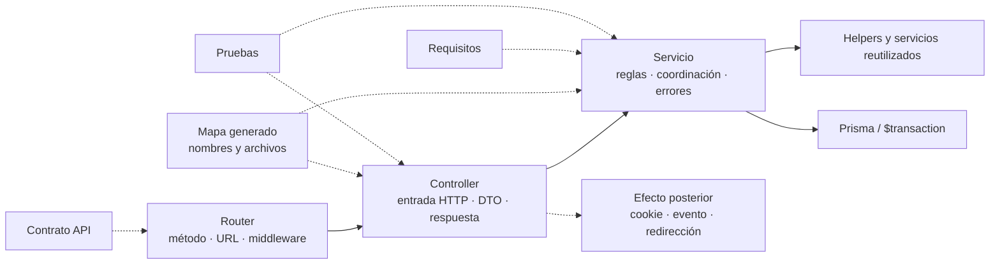
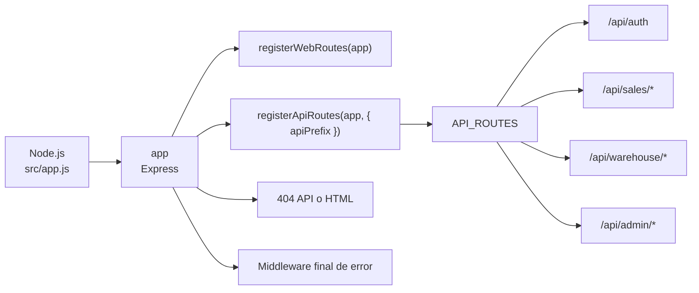
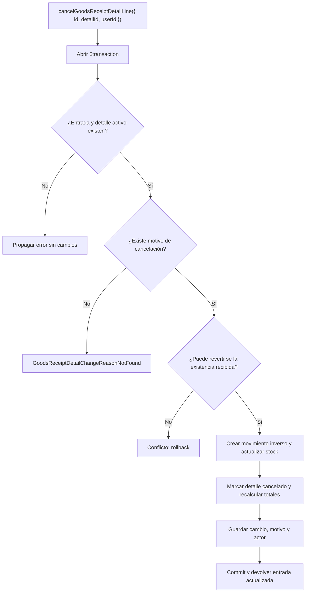
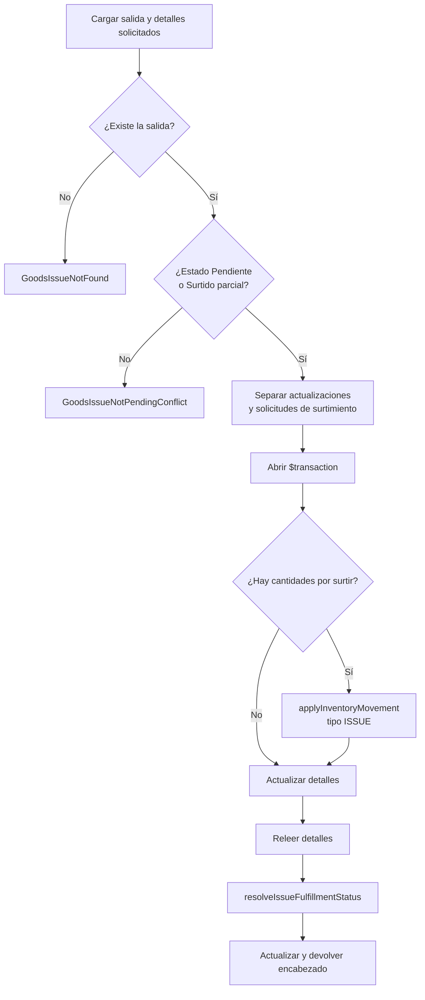
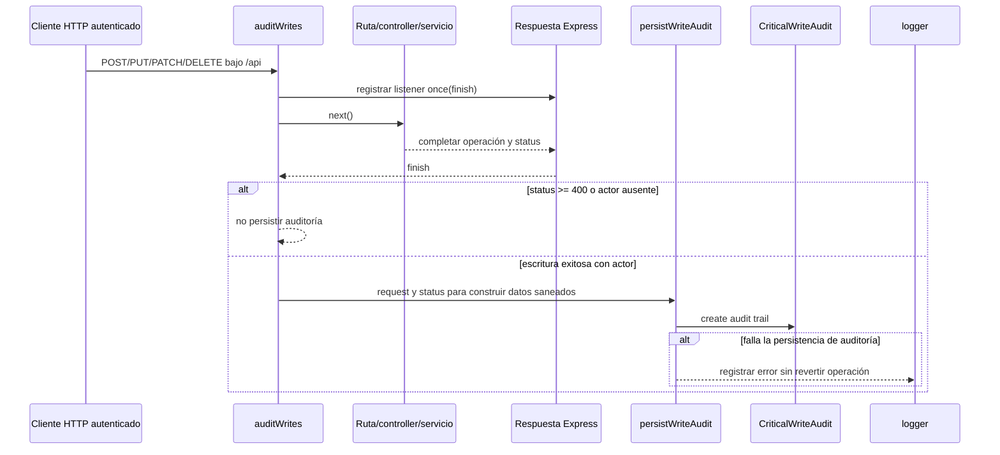
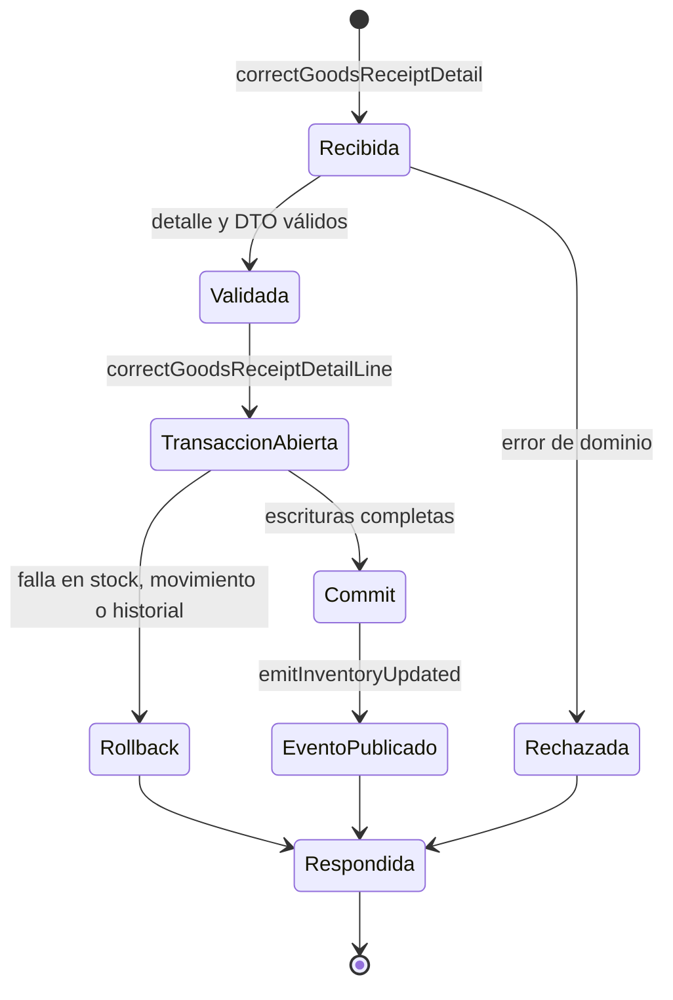

# Documentación técnica del backend

## Propósito y alcance

Este documento aplica la [guía técnica común](technical-code-documentation.md) al código
que se ejecuta en Node.js: `src/routes`, `src/middleware`, `src/controllers`, `src/dtos`,
`src/services`, `src/repository` y Prisma. El contrato consumible de cada endpoint
permanece en el [contrato API](../data/api-contract.md); aquí se explican nombres,
responsabilidades, colaboraciones y límites transaccionales de la implementación.

## Cómo documentar controladores y servicios

El mapa generado mantiene inventarios separados de símbolos exportados por
[controladores](../generated/code-map.md#símbolos-exportados-por-controladores) y
[servicios](../generated/code-map.md#símbolos-exportados-por-servicios). Esos inventarios
responden **qué existe y dónde**; esta guía define cómo explicar **qué contrato cumple y
por qué colabora con otros elementos**. No se crea una página por función ni se copia el
cuerpo completo del módulo.

### Ficha de un controlador

Un controlador se documenta cuando adapta un contrato que no resulta evidente por su
nombre, coordina más de un servicio o produce efectos posteriores. La ficha usa:

| Campo | Qué se registra |
| --- | --- |
| Nombre y archivo | Nombre exportado literal y enlace a `src/controllers/...`. |
| Ruta que lo invoca | Método, URL completa y enlace a la ficha del contrato API. |
| Entrada HTTP | Uso de `req.params`, `req.query`, `req.body`, `req.user` y archivos, sin repetir todo el esquema del validador. |
| Adaptación | DTO, normalización, paginación o transformación aplicada antes del servicio. |
| Servicio delegado | Nombre exportado del servicio y argumentos que construye el controlador. |
| Respuesta | Código HTTP y forma de éxito; los errores permanecen en el mecanismo central. |
| Efectos posteriores | Evento, cookie, redirección o cabecera que ocurre después del servicio. |
| Evidencia | Prueba del controlador o integración HTTP que verifica el contrato. |

El controlador no se presenta como propietario de una regla que vive en el servicio.
Por ejemplo, `editGoodsIssueDetails` adapta la petición, llama a
`updateGoodsIssueDetails` y después publica `inventory-updated`; el cálculo de cantidades
y estados sigue perteneciendo al servicio.

### Ficha de un servicio

Un servicio se documenta cuando contiene una regla de dominio, una transacción, efectos
en varios modelos, errores específicos o un contrato reutilizado por más de un
controlador.

| Campo | Qué se registra |
| --- | --- |
| Nombre, archivo y firma | Export literal y forma de sus argumentos; se aclaran opcionales y valores predeterminados relevantes. |
| Propósito | Resultado de dominio que produce, no una traducción palabra por palabra del nombre. |
| Precondiciones | Entidades, estados, permisos ya resueltos o datos que deben existir antes de escribir. |
| Retorno | Objeto, colección o ausencia de valor que reciben sus consumidores. |
| Errores de dominio | Clases que puede propagar y condición observable que las origina. |
| Persistencia y atomicidad | Modelos afectados, uso de `getDb()` y límite de `$transaction`; se indica qué efecto queda fuera. |
| Colaboradores | Helpers o servicios reutilizados y la razón de la colaboración. |
| Evidencia | Pruebas unitarias o de base de datos y brechas registradas. |
| Mantenimiento | Cambio de estado, firma, colaborador o transacción que obliga a revisar la ficha o diagrama. |

Una firma clara y privada no necesita ficha ni JSDoc. Para un contrato exportado
reutilizable o complejo puede añadirse JSDoc junto al código si parámetros, retorno o
errores no son deducibles por el uso. La explicación de negocio o el diagrama permanece
en Markdown para evitar comentarios extensos que se desactualicen dentro del módulo.

### Relación entre ambas capas

Las flechas continuas muestran responsabilidades de ejecución; las discontinuas enlazan
evidencia documental. El diagrama no afirma que todo controlador tenga un efecto
posterior ni que toda lectura necesite una transacción.

### Cuándo necesita un diagrama específico

Una tabla y un bloque breve son suficientes para un CRUD que sólo adapta y delega. Se
agrega una secuencia o actividad específica si el controlador coordina varios servicios,
si existen bifurcaciones relevantes, si la transacción atraviesa colaboradores o si un
efecto ocurre deliberadamente después del commit. El diagrama usa nombres exportados
reales, se vincula con un solo `CU-*` y declara el evento que obliga a actualizarlo. La
reutilización de helpers o reglas no autoriza a fusionar casos: si dos operaciones
requieren vista técnica, cada una muestra sus participantes, modelos, errores y endpoint.

No se genera automáticamente esa semántica desde imports: el inventario puede comprobar
que `controller` y `service` existen, pero no puede determinar de forma segura quién es
propietario de una regla, qué error es contractual ni dónde debe ocurrir un efecto.

## Catálogo completo de fichas backend

La ficha se mantiene por **capacidad cohesiva**: agrupa las rutas, controladores y
servicios que implementan el mismo contrato, pero nombra todos los módulos cubiertos.
El inventario literal de cada export permanece en el
[mapa generado](../generated/code-map.md#símbolos-exportados-por-controladores); estas
fichas agregan entrada, salida, reglas, persistencia y criterio de diagrama sin convertir
un ejemplo en la documentación de todo el backend.

### Arranque, transporte web y middleware

| Capacidad | Entrada, adaptación y salida | Colaboradores, efectos y persistencia | Diagrama aplicable |
| --- | --- | --- | --- |
| Arranque Express | `src/app.js` crea `app` y `server`, configura EJS, cuerpo, estáticos, rutas, 404 y error final. `registerWebRoutes` y `registerApiRoutes` montan sus registros. | Logging, auditoría y Socket.IO rodean el transporte; el manejador final traduce `AppError` y registra fallos desconocidos. | **Contenedores/flujo de registro** cuando cambia orden o montaje; **secuencia HTTP común** para una petición. |
| Autenticación y autorización | Rutas web y API pasan por token requerido y permiso; `authController.js` adapta login, usuario actual y renovación. | `authService.js`, `jwtService.js`, cookies y tokens; no persiste dominio salvo la lectura del usuario. | **Secuencia** para login/renovación; **actividad** si cambia una bifurcación de acceso. |
| Validación y errores | Validadores de formularios escriben errores de `express-validator`; `validate` corta la cadena antes del controlador. | `serviceErrorHandler.js` y clases de `src/errors` conservan errores de dominio; no abren transacciones. | Participantes de la **secuencia HTTP común**; no un diagrama por validador. |
| Auditoría | `auditService.js` identifica escrituras y persiste la evidencia producida por middleware. | Usa los datos de solicitud/respuesta definidos por el middleware y Prisma fuera del servicio funcional. | **Secuencia** sólo si cambia el momento de persistencia respecto de la respuesta o transacción. |
| Páginas web | Los controladores bajo `controllers/web` resuelven inicio/login y las páginas de personas, usuarios, clientes, proveedores, materiales, mermas, entradas, salidas y movimientos. | Preparan `res.render`, metadatos y permisos para EJS; no ejecutan CRUD de dominio. | **Navegación/composición**, no secuencia por cada `render`. |

### Fichas de capacidades API y dominio

| Capacidad y módulos propietarios | Entrada y retorno | Reglas, errores y persistencia | Diagrama aplicable |
| --- | --- | --- | --- |
| Catálogos: `departmentController/Service`, `roleController/Service`, `presentationController/Service`, `reasonController/Service`, `unitMeasureController/Service`, `fulfillmentStatusController/Service` | `GET` sin cuerpo; la fábrica `createDataTableListController` adapta paginación cuando corresponde y devuelve colecciones JSON. | Lecturas Prisma; búsquedas por id/nombre son colaboradores de otros servicios y propagan ausencia según su contrato. | **Ninguno específico**; fábrica de listado y recorrido HTTP común. |
| Personas: `personController.js`, `personService.js`, `personRules.js` | Lista recibe consulta de tabla; alta/edición reciben DTO saneado y retornan persona. | Valida tipo y asesor interno, relaciones y unicidad antes de crear/actualizar `Person`; errores se centralizan. | **CRUD compartido**; actividad sólo si cambia la regla de asesor interno. |
| Usuarios: `userController.js`, `userService.js`, `roleService.js` | Lista, alta, edición y cambio de contraseña toman parámetros/cuerpo y retornan usuario sin convertir el controlador en dueño de credenciales. | Resuelve persona, rol y contraseña; escribe `User` y propaga conflictos/no encontrados. | **CRUD** y **secuencia específica** para contraseña únicamente si se agregan pasos o efectos. |
| Clientes: `sales/clientController.js`, `clientService.js` | Lista, alta y edición (`GET`, `POST`, `PUT`) adaptan DTO y retornan cliente. | Lee y escribe `Client` mediante `getDb(tx)` y traduce ausencia o fallos de persistencia a errores del dominio. | **CRUD compartido**; cada operación conserva su vista aplicada `DIA-BE-CU-*`, sin añadir una secuencia dinámica repetida. |
| Proveedores: `supplierController.js`, `supplierService.js` | Lista, alta y edición adaptan filtros/DTO y retornan proveedor. | Persiste proveedor y relaciones; sus materiales se sincronizan mediante servicios propietarios de materiales. | **CRUD compartido**; componentes si cambia la colaboración entre dominios. |
| Materiales: `materialController.js`, `materials/materialService.js`, `materialHelpers.js`, `materialRelations.js`, `supplierMaterialService.js`, `adjustmentService.js` | Lista, alta, edición, ajuste y eliminación reciben `id`/DTO y retornan material o confirmación. | Prepara identidad, sincroniza proveedor, protege referencias y usa ajuste/movimiento para cambiar existencias; las escrituras relacionadas comparten `tx`. | **CRUD** para mantenimiento; **secuencia + actividad** para ajuste o eliminación con dependencias. |
| Mermas: `wasteController.js`, `wastes/wasteService.js`, `wasteMaterialService.js`, `wasteInventoryService.js`, `wasteMovementService.js`, `wasteStockAdjustmentService.js` | Lista, plantillas, alta, edición y ajuste reciben identificadores/DTO y retornan merma. | Coordina material origen, cantidades, inventario y movimientos; valida existencia y suficiencia antes de escrituras atómicas. | **Secuencia** para alta desde material y ajuste; **actividad** para decisiones de cantidad. |
| Entradas: `goodsReceiptController.js`, `goodsReceiptService.js`, `goodsReceiptHelpers.js`, `goodsReceiptInvoiceService.js` | Lista, alta y edición de encabezado adaptan DTO; retornan documento con detalles/totales. | Valida factura/referencia, construye detalles, actualiza existencias y totales dentro del límite transaccional. | **Secuencia** para alta por coordinación multmodelo; **actividad** para validaciones alternativas. |
| Corrección/cancelación de entrada: controladores homónimos y `detailChanges/{goodsReceiptCorrectionService,goodsReceiptCancellationService,goodsReceiptDetailChangeService}.js` | `detailId` y cambio solicitado producen entrada actualizada. | Localiza detalle editable, registra cambio, revierte/aplica movimiento y recalcula existencias/totales en una transacción; los conflictos impiden escritura parcial. | **Dos secuencias o actividades diferenciadas**: corrección y cancelación no se fusionan. |
| Salidas de materiales: `goodsIssueController.js`, `goodsIssues/goodsIssueService.js`, helpers, select y reglas de cumplimiento | Lista, alta, edición, encabezado y detalles adaptan `id`/DTO; retornan salida actualizada. | Resuelve encabezado, cantidades y estados; el surtimiento aplica movimiento `ISSUE` y actualiza detalles/encabezado en el mismo `tx`. | **Secuencia + actividad** para surtimiento; **máquina de estados** normativa enlazada desde requisitos. |
| Devolución de material: `goodsIssueController.registerGoodsIssueDetailReturn` y `detailReturns/goodsIssueReturnService.js` | `id`, `detailId` y cantidad de devolución retornan salida/detalle actualizado. | Comprueba cantidades y estado, devuelve inventario, registra movimiento y recalcula cumplimiento atómicamente. | **Secuencia específica** porque invierte inventario y estado después de una salida. |
| Salidas de mermas: `wasteIssueController.js`, `wasteIssues/wasteIssueService.js`, `wasteIssueFulfillmentService.js` y reglas compartidas de `issues` | Lista, alta, edición, encabezado y detalles retornan documento actualizado. | Reutiliza reglas de encabezado/cumplimiento, aplica movimiento de merma y conserva documento, detalle e inventario en un `tx`. | **Secuencia + actividad** para surtimiento; estados desde requisitos. |
| Devolución de merma: `wasteIssueController.registerWasteIssueDetailReturn` y `detailReturns/wasteIssueReturnService.js` | Identificadores y cantidad retornan la salida de merma actualizada. | Valida devolución, revierte inventario de merma y recalcula cumplimiento de manera atómica. | **Secuencia específica**, paralela conceptualmente a material pero con participantes de merma explícitos. |
| Inventario compartido: `inventory/movementService.js`, `movementHelpers.js`, `stockHelpers.js`, `materialIdentity.js` | Recibe referencia, tipo, detalles y `tx`; devuelve movimiento/resumen o valida cantidades. | `applyInventoryMovement` actualiza existencias y crea movimiento; helpers convierten cantidades y rechazan insuficiencia. Participa en la transacción llamadora. | Participante en secuencias de entrada/salida/ajuste; **actividad** para conversión o suficiencia si cambia el algoritmo. |
| Movimientos y exportaciones contextuales: `movementController.js`, `movementQueryService.js`, `inventory/reportService.js`, controladores/servicios `report` de admin, ventas y almacén | La consulta del módulo aporta filtros y produce filas paginadas; su acción de exportar devuelve el Excel correspondiente con cabeceras HTTP. | Sólo lectura; cada reporte reutiliza la consulta de su contexto y transforma resultados sin modificar inventario. No existe un dominio funcional independiente de “reportes”. | **Flujo de datos del caso propietario**; no se crea una secuencia transversal que sustituya las exportaciones específicas. |
| Numeración documental: `document/referenceNumberService.js` | Año/ámbito y cliente opcional producen o validan una referencia. | Comprueba duplicados e incrementa contadores usando el `tx` recibido cuando forma parte de creación documental. | Participante de secuencias de alta; **actividad** si cambia la estrategia anual/no anual. |

El [mapa generado de servicios](../generated/code-map.md#símbolos-exportados-por-servicios)
completa, símbolo por símbolo, las constantes y helpers de cada módulo de la tabla. Una
nueva exportación debe pertenecer a una de estas fichas o crear una capacidad nueva; no
puede quedar documentada sólo como “otro ejemplo”.

## Aplicación de todos los casos al código backend

La siguiente matriz parte de las rutas registradas y baja hasta el controller y servicio
que ejecutan cada caso. No deduce comportamiento desde el nombre del requisito: cuando
un catálogo sólo es consumido por otros formularios se documenta su lectura real, y
cuando una consulta comparte endpoint con un catálogo se declara esa reutilización.
La misma cobertura se representa visualmente, caso por caso, en los
[diagramas backend aplicados al código](backend-code-sequence-diagrams.md). Cada vista por
caso conserva directamente su ruta, servicio y efecto concreto, e identifica los
patrones aplicados mediante los códigos de su índice rápido.
La última columna enlaza la vista `DIA-BE-CU-*` que aplica a cada fila. Para leer cómo
se especializa, la flecha del diagrama toma como origen la entrada HTTP y controller de
la segunda columna y como destino el servicio, persistencia o efecto de la tercera; así
una estructura compartida no oculta los participantes propios del caso.

| Caso | Entrada HTTP y controller | Servicio, persistencia o efecto aplicado | Diagrama aplicado |
| --- | --- | --- | --- |
| `CU-AUT-01` | `POST /api/auth/login` → `authController.login`. | `authService.loginUser`, `userService.getUserIdByLogin`, JWT y cookies. | [`DIA-BE-CU-AUT-01`](backend-code-sequence-diagrams.md#cu-aut-01) |
| `CU-AUT-02` | `POST /cerrar-sesion` → `controllers/web/authController.logout`. | Elimina cookies de autenticación y redirige a login; no persiste dominio. | [`DIA-BE-CU-AUT-02`](backend-code-sequence-diagrams.md#cu-aut-02) |
| `CU-IDA-01` | `GET /api/admin/persons` → `getAllPersons`. | `personService.findAllPersons` consulta `Person` y asignaciones. | [`DIA-BE-CU-IDA-01`](backend-code-sequence-diagrams.md#cu-ida-01) |
| `CU-IDA-02` | `POST /api/admin/persons` → `registerPerson`. | `personService.createPerson` valida y crea persona/asignaciones. | [`DIA-BE-CU-IDA-02`](backend-code-sequence-diagrams.md#cu-ida-02) |
| `CU-IDA-03` | `PUT /api/admin/persons/:id` → `editPerson`. | `personService.updatePerson` actualiza persona/asignaciones. | [`DIA-BE-CU-IDA-03`](backend-code-sequence-diagrams.md#cu-ida-03) |
| `CU-IDA-04` | `GET /api/admin/users` → `getAllUsers`. | `userService.findAllUsers` consulta cuentas y accesos. | [`DIA-BE-CU-IDA-04`](backend-code-sequence-diagrams.md#cu-ida-04) |
| `CU-IDA-05` | `POST /api/admin/users` → `registerUser`. | `userService.createUser` crea cuenta, contraseña cifrada y acceso. | [`DIA-BE-CU-IDA-05`](backend-code-sequence-diagrams.md#cu-ida-05) |
| `CU-IDA-06` | `PATCH /api/admin/users/:id` → `editUser`. | `userService.updateUser` actualiza cuenta y asignación autorizada. | [`DIA-BE-CU-IDA-06`](backend-code-sequence-diagrams.md#cu-ida-06) |
| `CU-IDA-07` | `PATCH /api/admin/users/:id/password` → `editUserPassword`. | `userService.updateUserPassword` cifra y sustituye la contraseña. | [`DIA-BE-CU-IDA-07`](backend-code-sequence-diagrams.md#cu-ida-07) |
| `CU-IDA-08` | `GET /api/admin/roles` → `roleController.getAllRoles`. | `roleService.findAllRoles` lee `Role`; no existe mutación publicada. | [`DIA-BE-CU-IDA-08`](backend-code-sequence-diagrams.md#cu-ida-08) |
| `CU-IDA-09` | `GET /api/admin/departments` → `departmentController.getAllDepartments`. | `departmentService.findAllDepartments` lee `Department`. | [`DIA-BE-CU-IDA-09`](backend-code-sequence-diagrams.md#cu-ida-09) |
| `CU-CAT-01` | `GET /api/warehouse/materials` → `getAllMaterials`. | `materialService.findAllMaterials` consulta material, proveedor y existencia. | [`DIA-BE-CU-CAT-01`](backend-code-sequence-diagrams.md#cu-cat-01) |
| `CU-CAT-02` | `POST /api/warehouse/materials` → `registerMaterial`. | `materialService.createMaterial` crea identidad y relación de proveedor. | [`DIA-BE-CU-CAT-02`](backend-code-sequence-diagrams.md#cu-cat-02) |
| `CU-CAT-03` | `PATCH /api/warehouse/materials/:id` → `editMaterial`. | `materialService.updateMaterial` sincroniza datos y relación. | [`DIA-BE-CU-CAT-03`](backend-code-sequence-diagrams.md#cu-cat-03) |
| `CU-CAT-04` | `DELETE /api/warehouse/materials/:id` → `removeMaterial`. | `materialService.deleteMaterial` protege referencias antes de eliminar relación. | [`DIA-BE-CU-CAT-04`](backend-code-sequence-diagrams.md#cu-cat-04) |
| `CU-CAT-05` | `PATCH /api/warehouse/materials/:id/stock` → `editMaterialStock`. | `materialService.updateMaterialStock` usa `adjustmentService` y movimiento. | [`DIA-BE-CU-CAT-05`](backend-code-sequence-diagrams.md#cu-cat-05) |
| `CU-CAT-06` | `GET /api/warehouse/suppliers` → `getAllSuppliers`. | `supplierService.findAllSuppliers` consulta proveedores. | [`DIA-BE-CU-CAT-06`](backend-code-sequence-diagrams.md#cu-cat-06) |
| `CU-CAT-07` | `POST /api/warehouse/suppliers` → `registerSupplier`. | `supplierService.createSupplier` persiste el proveedor. | [`DIA-BE-CU-CAT-07`](backend-code-sequence-diagrams.md#cu-cat-07) |
| `CU-CAT-08` | `PUT /api/warehouse/suppliers/:id` → `editSupplier`. | `supplierService.updateSupplier` actualiza datos del proveedor. | [`DIA-BE-CU-CAT-08`](backend-code-sequence-diagrams.md#cu-cat-08) |
| `CU-CAT-09` | `PUT /api/warehouse/suppliers/:id` → `editSupplier`. | `supplierService.updateSupplier` aplica el estado incluido en el DTO; no hay endpoint separado. | [`DIA-BE-CU-CAT-09`](backend-code-sequence-diagrams.md#cu-cat-09) |
| `CU-CAT-10` | `GET /api/sales/clients` → `getAllClients`. | `clientService.findAllClients` consulta `Client`. | [`DIA-BE-CU-CAT-10`](backend-code-sequence-diagrams.md#cu-cat-10) |
| `CU-CAT-11` | `POST /api/sales/clients` → `registerClient`. | `clientService.createClient` persiste `Client`. | [`DIA-BE-CU-CAT-11`](backend-code-sequence-diagrams.md#cu-cat-11) |
| `CU-CAT-12` | `PUT /api/sales/clients/:id` → `editClient`. | `clientService.updateClient` actualiza `Client`. | [`DIA-BE-CU-CAT-12`](backend-code-sequence-diagrams.md#cu-cat-12) |
| `CU-CAT-13` | `GET /api/warehouse/wastes` → `getAllWastes`. | `wasteService.findAllWastes` consulta merma e inventario. | [`DIA-BE-CU-CAT-13`](backend-code-sequence-diagrams.md#cu-cat-13) |
| `CU-CAT-14` | `GET /api/warehouse/wastes/material-templates` y `POST /api/warehouse/wastes` → `getWasteMaterialTemplates`/`registerWaste`. | `findWasteMaterialTemplates` alimenta la selección y `createWasteWithInitialStockAdjustment` crea merma, ajuste y movimiento inicial. | [`DIA-BE-CU-CAT-14`](backend-code-sequence-diagrams.md#cu-cat-14) |
| `CU-CAT-15` | `PATCH /api/warehouse/wastes/:id` → `editWaste`. | `wasteService.updateWaste` actualiza datos sin tratar stock como edición. | [`DIA-BE-CU-CAT-15`](backend-code-sequence-diagrams.md#cu-cat-15) |
| `CU-CAT-16` | `PATCH /api/warehouse/wastes/:id/stock` → `editWasteStock`. | `wasteService.updateWasteStock` y `registerWasteStockAdjustment` aplican ajuste/movimiento. | [`DIA-BE-CU-CAT-16`](backend-code-sequence-diagrams.md#cu-cat-16) |
| `CU-CAT-17` | `GET /api/warehouse/presentations` → `getAllPresentations`. | `presentationService.findAllPresentations` sirve el catálogo de sólo lectura. | [`DIA-BE-CU-CAT-17`](backend-code-sequence-diagrams.md#cu-cat-17) |
| `CU-CAT-18` | `GET /api/warehouse/unit-measures` → `getAllUnitMeasures`. | `unitMeasureService.findAllUnitMeasures` sirve el catálogo de sólo lectura. | [`DIA-BE-CU-CAT-18`](backend-code-sequence-diagrams.md#cu-cat-18) |
| `CU-CAT-19` | `GET /api/warehouse/reasons` → `getAllReasons`. | `reasonService.findAllReasons` sirve motivos; helpers resuelven motivos internos. | [`DIA-BE-CU-CAT-19`](backend-code-sequence-diagrams.md#cu-cat-19) |
| `CU-CAT-20` | `GET /api/warehouse/fulfillment-statuses` → `getAllFulfillmentStatuses`. | `fulfillmentStatusService.findAllFulfillmentStatuses` sirve estados de sólo lectura. | [`DIA-BE-CU-CAT-20`](backend-code-sequence-diagrams.md#cu-cat-20) |
| `CU-ENT-01` | `GET /api/warehouse/goods-receipts` → `getAllGoodsReceipts`. | `goodsReceiptService.findAllGoodsReceipts` consulta entradas y totales. | [`DIA-BE-CU-ENT-01`](backend-code-sequence-diagrams.md#cu-ent-01) |
| `CU-ENT-02` | `POST /api/warehouse/goods-receipts` → `registerGoodsReceipt`. | `goodsReceiptService.createGoodsReceipt` crea documento, detalles, existencias y movimiento en transacción. | [`DIA-BE-CU-ENT-02`](backend-code-sequence-diagrams.md#cu-ent-02) |
| `CU-ENT-03` | `PATCH /api/warehouse/goods-receipts/:id` → `editGoodsReceiptHeader`. | `goodsReceiptService.updateGoodsReceipt` conserva detalles persistidos y actualiza encabezado permitido. | [`DIA-BE-CU-ENT-03`](backend-code-sequence-diagrams.md#cu-ent-03) |
| `CU-ENT-04` | `PATCH /api/warehouse/goods-receipts/:id/details/:detailId/corrections` → `correctGoodsReceiptDetail`. | `correctGoodsReceiptDetailLine` registra diferencia, movimiento, stock e historial atómicamente. | [`DIA-BE-CU-ENT-04`](backend-code-sequence-diagrams.md#cu-ent-04) |
| `CU-ENT-05` | `PATCH /api/warehouse/goods-receipts/:id/details/:detailId/cancel` → `cancelGoodsReceiptDetail`. | `cancelGoodsReceiptDetailLine` revierte stock/movimiento y conserva historial. | [`DIA-BE-CU-ENT-05`](backend-code-sequence-diagrams.md#cu-ent-05) |
| `CU-SAL-01` | `GET /api/warehouse/goods-issues` → `getAllGoodsIssues`. | `goodsIssueService.findAllGoodsIssues` consulta documentos y estados. | [`DIA-BE-CU-SAL-01`](backend-code-sequence-diagrams.md#cu-sal-01) |
| `CU-SAL-02` | `POST /api/warehouse/goods-issues` → `registerGoodsIssue`. | `goodsIssueService.createGoodsIssue` crea encabezado y detalles solicitados. | [`DIA-BE-CU-SAL-02`](backend-code-sequence-diagrams.md#cu-sal-02) |
| `CU-SAL-03` | `PATCH /api/warehouse/goods-issues/:id/header` → `editGoodsIssueHeader`. | `goodsIssueService.updateGoodsIssueHeader` aplica reglas del encabezado. | [`DIA-BE-CU-SAL-03`](backend-code-sequence-diagrams.md#cu-sal-03) |
| `CU-SAL-04` | `PATCH /api/warehouse/goods-issues/:id/details` → `editGoodsIssueDetails`. | `goodsIssueService.updateGoodsIssueDetails` modifica cantidades todavía editables. | [`DIA-BE-CU-SAL-04`](backend-code-sequence-diagrams.md#cu-sal-04) |
| `CU-SAL-05` | `PATCH /api/warehouse/goods-issues/:id/details` → `editGoodsIssueDetails`. | `updateGoodsIssueDetails` llama `applyInventoryMovement(ISSUE)` y recalcula cumplimiento con `tx`. | [`DIA-BE-CU-SAL-05`](backend-code-sequence-diagrams.md#cu-sal-05) |
| `CU-SAL-06` | `PATCH /api/warehouse/goods-issues/:id/details/:detailId/returns` → `registerGoodsIssueDetailReturn`. | `returnGoodsIssueDetail` crea `GoodsIssueReturn`, movimiento `ENTRY` y estados en transacción. | [`DIA-BE-CU-SAL-06`](backend-code-sequence-diagrams.md#cu-sal-06) |
| `CU-SAL-07` | `GET /api/warehouse/waste-issues` → `getAllWasteIssues`. | `wasteIssueService.findAllWasteIssues` consulta salidas de merma. | [`DIA-BE-CU-SAL-07`](backend-code-sequence-diagrams.md#cu-sal-07) |
| `CU-SAL-08` | `POST /api/warehouse/waste-issues` → `registerWasteIssue`. | `wasteIssueService.createWasteIssue` crea encabezado y detalles de merma. | [`DIA-BE-CU-SAL-08`](backend-code-sequence-diagrams.md#cu-sal-08) |
| `CU-SAL-09` | `PATCH /api/warehouse/waste-issues/:id/header` → `editWasteIssueHeader`. | `wasteIssueService.updateWasteIssueHeader` aplica reglas del encabezado. | [`DIA-BE-CU-SAL-09`](backend-code-sequence-diagrams.md#cu-sal-09) |
| `CU-SAL-10` | `PATCH /api/warehouse/waste-issues/:id/details` → `editWasteIssueDetails`. | `wasteIssueService.updateWasteIssueDetails` modifica cantidades editables. | [`DIA-BE-CU-SAL-10`](backend-code-sequence-diagrams.md#cu-sal-10) |
| `CU-SAL-11` | `PATCH /api/warehouse/waste-issues/:id/details` → `editWasteIssueDetails`. | `updateWasteIssueDetails` llama `applyWasteIssueMovement` y recalcula cumplimiento con `tx`. | [`DIA-BE-CU-SAL-11`](backend-code-sequence-diagrams.md#cu-sal-11) |
| `CU-SAL-12` | `PATCH /api/warehouse/waste-issues/:id/details/:detailId/returns` → `registerWasteIssueDetailReturn`. | `returnWasteIssueDetail` crea `WasteIssueReturn`, movimiento inverso y estados en transacción. | [`DIA-BE-CU-SAL-12`](backend-code-sequence-diagrams.md#cu-sal-12) |
| `CU-REP-01` | `GET /api/warehouse/materials` → `getAllMaterials`. | Reutiliza `findAllMaterials` con filtros; sólo lectura. | [`DIA-BE-CU-REP-01`](backend-code-sequence-diagrams.md#cu-rep-01) |
| `CU-REP-02` | `GET /api/admin/movements/materials` → `getAllMaterialMovements`. | `movementQueryService.findAllMaterialMovements`; sólo lectura. | [`DIA-BE-CU-REP-02`](backend-code-sequence-diagrams.md#cu-rep-02) |
| `CU-REP-03` | `GET /api/warehouse/reports/inventory/excel` → `exportWarehouseReportExcel`. | `reportService.findWarehouseReportRows` y `sendExcelReport`. | [`DIA-BE-CU-REP-03`](backend-code-sequence-diagrams.md#cu-rep-03) |
| `CU-REP-04` | `GET /api/warehouse/reports/goods-issues/excel` → `exportGoodsIssueReportExcel`. | `reportService.findGoodsIssueReportRows` y `sendExcelReport`. | [`DIA-BE-CU-REP-04`](backend-code-sequence-diagrams.md#cu-rep-04) |
| `CU-REP-05` | `GET /api/admin/reports/movements/materials/excel` → `exportMovementReport`. | `inventory/reportService.findMovementReportRows` y respuesta Excel. | [`DIA-BE-CU-REP-05`](backend-code-sequence-diagrams.md#cu-rep-05) |
| `CU-REP-06` | `GET /api/warehouse/wastes` → `getAllWastes`. | Reutiliza `wasteService.findAllWastes` con filtros; sólo lectura. | [`DIA-BE-CU-REP-06`](backend-code-sequence-diagrams.md#cu-rep-06) |
| `CU-REP-07` | `GET /api/admin/movements/wastes` → `getAllWasteMovements`. | `movementQueryService.findAllWasteMovements`; sólo lectura. | [`DIA-BE-CU-REP-07`](backend-code-sequence-diagrams.md#cu-rep-07) |
| `CU-REP-08` | `GET /api/warehouse/reports/waste-issues/excel` → `exportWasteIssueReportExcel`. | `reportService.findWasteIssueReportRows` y `sendExcelReport`. | [`DIA-BE-CU-REP-08`](backend-code-sequence-diagrams.md#cu-rep-08) |
| `CU-REP-09` | `GET /api/warehouse/reports/wastes/excel` → `exportWasteReportExcel`. | `reportService.findWasteReportRows` y `sendExcelReport`. | [`DIA-BE-CU-REP-09`](backend-code-sequence-diagrams.md#cu-rep-09) |
| `CU-REP-10` | `GET /api/admin/reports/movements/wastes/excel` → `exportWasteMovementReport`. | `inventory/reportService.findMovementReportRows` en contexto merma y respuesta Excel. | [`DIA-BE-CU-REP-10`](backend-code-sequence-diagrams.md#cu-rep-10) |
| `CU-REP-11` | `GET /api/warehouse/reports/goods-receipts/excel` → `exportGoodsReceiptReportExcel`. | `reportService.findGoodsReceiptReportRows` y `sendExcelReport`. | [`DIA-BE-CU-REP-11`](backend-code-sequence-diagrams.md#cu-rep-11) |
| `CU-REP-12` | `GET /api/warehouse/reports/suppliers/excel` → `exportSupplierReportExcel`. | `reportService.findSupplierReportRows` y `sendExcelReport`. | [`DIA-BE-CU-REP-12`](backend-code-sequence-diagrams.md#cu-rep-12) |
| `CU-REP-13` | `GET /api/sales/reports/clients/excel` → `exportClientReport`. | `clientService.findAllClients` prepara filas y el controller llama `sendExcelReport`. | [`DIA-BE-CU-REP-13`](backend-code-sequence-diagrams.md#cu-rep-13) |
| `CU-REP-14` | `GET /api/admin/reports/persons/excel` → `exportPersonReport`. | `personService.findAllPersons` prepara filas y el controller llama `sendExcelReport`. | [`DIA-BE-CU-REP-14`](backend-code-sequence-diagrams.md#cu-rep-14) |
| `CU-REP-15` | `GET /api/admin/reports/users/excel` → `exportUserReport`. | `userService.findAllUsers` prepara filas y el controller llama `sendExcelReport`. | [`DIA-BE-CU-REP-15`](backend-code-sequence-diagrams.md#cu-rep-15) |

## Matriz de diagramas por caso backend

| Caso de implementación | Vista que aplica | Actualización obligatoria | Vista que no debe duplicarse |
| --- | --- | --- | --- |
| Adaptación HTTP que delega una sola operación | Recorrido HTTP común. | Ruta, controlador, servicio y contrato API. | Secuencia idéntica por endpoint. |
| CRUD homogéneo | Vista aplicada `DIA-BE-CU-*` para el recorrido concreto; secuencia dinámica sólo si existe coordinación propia. | Ficha de capacidad, mapa generado y vista por caso. | Diagrama general que sustituya los casos. |
| Controlador coordina varios servicios o efecto post-commit | Secuencia. | Participantes, orden, respuesta y efecto externo. | Diagrama entidad-relación. |
| Servicio contiene decisiones relevantes | Actividad. | Condiciones, errores y salida de cada rama. | Secuencia que oculte las decisiones. |
| Escritura en varios modelos con `tx` | Secuencia con límite transaccional; actividad complementaria si hay ramas. | Inicio/commit/rollback y efectos fuera de la transacción. | Afirmar atomicidad desde imports. |
| Cambio de estados persistentes | Máquina de estados normativa en requisitos y secuencia técnica que la referencia. | Transiciones, reglas y trazabilidad. | Segunda máquina de estados “técnica”. |
| Modelos y relaciones Prisma | Entidad-relación generada. | `prisma/schema.prisma` y `npm run docs:architecture`. | ER manual dentro de la ficha. |
| Dependencias entre capas o dominios | Componentes/dependencias del código. | `code-diagrams.md` y mapa generado. | Grafo por cada función. |
| Consulta, catálogo o reporte de sólo lectura | Vista aplicada `DIA-BE-CU-*`; flujo de datos adicional sólo cuando aporta decisiones. | Entradas, filtros, retorno y evidencia. | Transacción o secuencia trivial. |

## Vistas técnicas aplicadas

### Relación entre la colección canónica y las vistas adicionales

La columna **Diagrama aplicado** de la matriz anterior enlaza los 63 recorridos
`DIA-BE-CU-*` de `backend-code-sequence-diagrams.md`. Esa colección es propietaria del
orden ruta → controller → servicio → persistencia o efecto. Este documento es propietario
de las fichas, los criterios de documentación y las vistas que contestan una pregunta
adicional. Una vista adicional complementa la secuencia enlazada; no la reemplaza, no
amplía su cobertura y no obliga a copiarla.

La revisión de las vistas existentes produjo esta decisión:

| Vista conservada aquí | Pregunta adicional y razón | Conexión e impacto |
| --- | --- | --- |
| Registro de rutas | ¿Cómo se monta la superficie Express completa? Es transversal y estructural, no el recorrido de un `CU-*`. | Se conecta con `src/app.js`, `API_ROUTES`, el mapa generado y la vista de superficie de `code-diagrams.md`. Si cambia el montaje se revisan las entradas de los `DIA-BE-CU-*` afectados, no sus reglas de dominio. |
| `DIA-BE-ACT-002` · `CU-ENT-05` | ¿Qué decisiones provocan rechazo, rollback o cancelación? La actividad prioriza ramas y errores que una secuencia lineal hace menos visibles. | Complementa `DIA-BE-CU-ENT-05`; comparte servicio y transacción, pero no altera el orden canónico. Un cambio de condición exige revisar ambas vistas y la máquina normativa si cambia un estado de negocio. |
| `DIA-BE-ACT-001` · `CU-SAL-05` | ¿Cómo se clasifican actualizaciones y surtimientos y qué errores impiden continuar? | Complementa `DIA-BE-CU-SAL-05` y referencia la máquina de estados de requisitos. Cambios de participantes actualizan la secuencia; cambios de ramas actualizan la actividad; cambios de estados también actualizan requisitos. |
| `DIA-BE-SEQ-006` · `RN-008` | ¿Cuándo se ejecuta la auditoría transversal y puede revertir la operación? Se conserva porque cruza todas las escrituras y establece la garantía *best effort*, no porque detalle otro caso. | Se conecta con el middleware de auditoría y con todo `DIA-BE-CU-*` de escritura mediante el evento `finish`. Un cambio en auditoría no modifica la transacción de cada caso, salvo que deje de ser posterior o pase a ser obligatoria. |
| `DIA-BE-TEC-EST-CU-ENT-04` | ¿Cuál es el ciclo técnico de la corrección entre recepción, commit/rollback, evento y respuesta? | Complementa `DIA-BE-CU-ENT-04`. No sustituye los estados funcionales de requisitos; sólo obliga a revisar la secuencia si cambia el límite transaccional o la publicación posterior. |

Las antiguas secuencias selectivas de autenticación, ajustes, entrada, corrección,
surtimientos y devoluciones no se mantienen aquí: respondían la misma pregunta que sus
`DIA-BE-CU-*`. Su detalle quedó consolidado en la colección canónica. Así, una operación
compleja puede tener más de una **vista**, pero nunca dos fuentes para el mismo recorrido.

### Registro de rutas

Se revisa si cambia el orden de montaje en `src/app.js`, el contrato de
`registerApiRoutes` o las áreas de `API_ROUTES`.

### Actividad de cancelación de un detalle de entrada

**Identificador:** `DIA-BE-ACT-002`. **Caso:** `CU-ENT-05`. Esta vista enfatiza las
decisiones exclusivas de cancelación y la ausencia de una segunda identidad corregida.

### Actividad de decisión y surtimiento de materiales

**Identificador:** `DIA-BE-ACT-001`. **Caso:** `CU-SAL-05`. Esta actividad complementa
`DIA-BE-CU-SAL-05` exclusivamente para `GoodsIssue`: hace visibles sus errores y sus
decisiones de estado sin presentarlas como equivalentes a las de `WasteIssue`.

La actividad complementa la secuencia porque hace visibles errores y bifurcaciones. La
evidencia del adaptador está en
[`goodsIssueControllerTest.js`](../../tests/unit/controllers/api/warehouse/goodsIssueControllerTest.js);
la cobertura y brechas de servicios permanecen en el [plan de pruebas](../testing/test-plan.md).
La aplicación por caso y su evidencia se consulta en la
[matriz de trazabilidad técnica](traceability-matrix.md), y todos los identificadores
gráficos están en el [inventario de diagramas](diagram-inventory.md).

### Secuencia transversal de auditoría de escrituras

**Identificador:** `DIA-BE-SEQ-006`. **Requisito:** `RN-008`. La auditoría observa la
respuesta HTTP y no forma parte de la transacción funcional actual; este diagrama hace
explícita esa garantía *best effort*.

### Estados técnicos complementarios

Estas vistas permanecen aquí porque añaden ciclos técnicos que no repite la colección
de secuencias por caso.

**Estado técnico complementario:** `DIA-BE-TEC-EST-CU-ENT-04`. Muestra el ciclo de la
transacción de corrección; los estados funcionales permanecen en requisitos.

## Lista de revisión backend

1. Comparar las carpetas de `controllers` y `services` con ambas secciones del mapa
   generado y asignar cada módulo nuevo a una ficha.
2. Comprobar método, URL, middleware, DTO, argumentos, retorno y código HTTP contra la
   ruta y el contrato API.
3. Verificar errores, modelos afectados, propagación de `tx` y efectos posteriores sin
   atribuirlos a la capa incorrecta.
4. Aplicar la matriz: actualizar la secuencia canónica enlazada en
   `backend-code-sequence-diagrams.md`; mantener aquí sólo actividades, estados u otras vistas
   que respondan una pregunta técnica adicional.
5. Revisar imports, exports y referencias después de renombrar o mover símbolos.
6. Localizar pruebas unitarias/de base de datos sin afirmar cobertura no ejecutada.
7. Ejecutar `npm run docs:check`; si cambió código fuente del inventario, ejecutar antes
   `npm run docs:architecture`.
